# 音视频入门

## 音频基础知识

### 音频处理流程

录制得到是原始数据PCM格式 需要进行封装为mp3

### 声音是如何被听到的？

- 声音是由物体振动产生的
- 它可以通过空气、固体、液体等进行传输
- 振动耳膜
- 人类听觉范围
  - 20Hz~20kHz
  - 小于20Hz 次声波
  - 大于20kHz超声波
  - 单位Hz 就是1s内振动的次数

### 声音的三要素

- 音调: 音频的快慢  
- 音量: 振动的幅度
- 音色: 谐波

### 模数转换

- 自然界的声音是模拟信号 在计算机表达这些模拟信号必须是数字信号 需要转换
- 如何转换
  - 对声音进行量化 一个一个采样 无限的采样就是一个模拟信号
  - 一般我们采样率 48000次/s 每秒采样48000次
  - 十进制转二进制
  - 二进制方波图

### PCM与WAV

- 音频原始数据 
  - 位深:在模数转换的时候有一个采样大小 最大范围值是多少 8位 16位 就是音量的最大值和最小值的范围
  - 音频原始数据格式
    - PCM 原始数据
    - WAV 原始数据或者压缩数据 本质上在PCM的数据之上加了一个头信息
  - 量化的基本概念
    - 采样大小(位深):一个采样用了多少bit存放。常用的是8bit 16bit 
    - 采样率: 采样频率 8k 16k 32k 44.1k 48k(48000次采样/s)
    - 声道数：单声道 双声道(左耳和右耳) 多声道(多个方向放一个喇叭)
    - 码率计算： 采样大小x采样率x声道数  44.1k x 16 x 2= 1411.2Kb/s (每秒存的数据大小)
    - WAV Header
      - RIFF  音频媒体格式类型 是wav还是fllv
      - fmt 存的信息是 采样大小 采样率 通道数
      - data 一个个采样

## [实战]音频采集

### 通过命令方式采集音频数据

ffmpeg -f avfoundation -i :0 out.wav （mac下）

ffmpeg -f alsa -i hw:1 out.wav 参考 https://www.pianshen.com/article/30021126318/

ffplay out.wav

### 通过api方式来采集音频数据

- 打开音频设备
  - 注册设备
  - 设置采集方式 avfoundation/dshow/alsa
  - 打开音频设备
- 从音频设备中读取音频数据
- 录制音频数据
- ffplay -ar48000 -ac 2 -f s16le audio.pcm

## 音频编码原理

- 消除冗余信息 有损压缩

  - 次声波和超声波剔除调 也就是有损压缩
  - 遮蔽掉的音频信息
    - 信号的遮蔽分为频域遮蔽和时域遮蔽
    - 说话的时候还有杂音

- 无损压缩  类似于zip 7zip

  - 熵编码
    - 哈夫曼编码
    - 算术编码
    - 香农编码

- 音频编码过程

  先有损压缩 再无损压缩

### 几种常见编解码器的比较

- OPUS、AAC、 Ogg、 Speex、 iLBC、 ARM、 G.711等常见的编码器
- AAC在直播中常用，WebRTC默认使用OPUS，固话一般用G.711
- OPUS>AAC>Ogg

### AAC编码器介绍

- 目的是取代mp3

- 常用的规格 AAC LC、AAC HE V1 、AAC HE V2

- AAC LC + SBR = AAC HE V1;  AAC HE V1 + PS = AAC HE V2;

  - AAC LC: 码流是128k,音质好

  - AAC HE V1: 码流64k左右

  - AAC HE V2: 花很少的字节用参数描述另一个声道和它不同的地方

- AAC 格式

  - ADIF 只能从头开始解码 不能在音频中间开始
  - ADTS 每一个帧都有一个头，可以在任意位置解码
    - ADTS由7/9个字节组成
    - 头中包含了 采样大小 采样率 声道数等很多信息

### 通过ffmpeg生成AAC数据

- ffmpeg -i xxx.mp4 -vn -c:a libfdk_aac -ar 44100 -channels 2 -profile:a aac_he_v2  out.aac  48kb/s
- ffmpeg -i xxx.mp4 -vn -c:a libfdk_aac -ar 44100 -channels 2 -profile:a aac_he  out.aac   码流 66 kb/s
- libfdk参数 参考地址  https://ffmpeg.org/ffmpeg-codecs.html#libfdk_005faac
- ffmpeg -i xxx.mp4 -vn -c:a libfdk_aac -ar 44100 -channels 2 -profile:a aac_low  out.aac   132 kb/s
- ffmpeg -i xxx.mp4 -vn -c:a libopus  out.opus   132 kb/s

## [实战]音频编码

### 什么是音频重采样

将音频三元组(采样率,采样大小和通道数)的值转为另外一组值

例如 44100/16/2 转成 48000/16/2

- 从设备采集的音频数据与编码器要求的数据不一致
- 扬声器要求的音频数据与要播放的音频数据不一致
- 更方便计算

如何知道是否需要进行重采样？

- 要了解音频设备参数
- 查看ffmpeg源码

重采样步骤

- 上下文
- 设置参数 swr_alloc_set_opts
- 初始化重采样 swr_init
- 进行重采样 swr_convert 
- 释放资源 swr_free

### 实战音频重采样

- 创建AAC编码器 
  - avcode_find_encoder
  - avcodec_alloc_context3
  -  avcodec_open2

- 编码使用的输入输出数据
  - avcodec_send_frame
  - avcodec_receive_packet
  - 准备好 AVFrame 保存了未编码的数据
  - 准备好 AVPacket 保存了编码的数据
  - 从设备采集的数据，此时的AVFrame和AVPacket是等效的

- AAC编码器编码

- 代码优化
  - 每个函数尽量保证在50行代码以内
  - 函数功能单一
  - 符合C语言风格
    - linux风格

## 视频基础知识

### 图像的基本概念

- 视频
  - 由一组图像组成
  - 为了传输/占用更小的空间而被压缩的
  - 最终在显示设备上展示(未被压缩)
- 图像
  - 像素
  - RGB
  - 分辨率 
    - 横向有多少个像素 宽
    - 纵向有多少个像素 高
  - 每个像素的都是有位深的：用多少位表示一个像素
    - RGB888(24位)
    - RGBA(32位)

### 屏幕显示器

- 图像与显示器的关系
  - 图像是数据
  - 屏幕是显示设备
  - 图像数据经过驱动程序让屏幕显示图像

- RGB的色彩问题
  - RGB与BGR
  - BMP图像使用的是BGR格式,需要进行转换
- 屏幕指标
  - PPI(pixels per inch)
  - DPI(Dots pen inch)
  - PPI > 300就属于视网膜级别

### 码流的计算

- 分辨率

  - X轴的像素个数 x Y轴的像素个数
  - 常见的宽度高比 16:9 / 4:3
  - 360P/720P/1K/2K

- 帧率

  - 每秒钟采集/播放图像的个数
  - 动画的帧率是25帧/s
  - 常见的帧率： 15帧/s, 30帧/s, 60帧/s

- 未编码视频的RGB码流

  RGB码流 = 分辨率(宽x高)x3(Byte)x帧率(25帧/s)

### 图像的显示

- 图像大小等于显示区域大小
- 图像小于显示区域(拉伸/留白)
- 图像大于显示区域(缩小/截取)

### 什么是YUV

- YUV(也称YCbCr): Y表示明亮度, UV的作用是描述影像色彩及饱和度
- 主要的采样格式有YUV4:2:0、YUV4:2:2、YUV4:4:4
- RGB与YUV的关系
  - RGB 用于屏幕图像的显示
  - YUV 用于采集与编码
  - RGB转YUV
    - Y = 0.299 * R + 0.587 * G + 0.114 * B
    - U = -0.147 * R - 0.289 * G + 0.436 * B = 0.492 * (B - Y)
    - V = 0.615 * R - 0.515 * G - 0.100 * B = 0.877 * (R - Y)
  - YUV转RGB
    - R = Y + 1.140 * V
    - G = Y - 0.394 * U - 0.581 * V
    - B = Y + 2.032 * U

### YUV的常见格式

- YUV4:4:4 

  - 一个Y对应一个U对应一个V  这个和 RGB8:8:8类似
  -  一副图片如果他是1280 x 720 那么它的数据量为 1280 x 720 x 3
  - 每个像素里面都是三个YUV
  - YUV  YUV   YUV .....

- YUV4:2:2 

  - 隔一个有一个UV，隔一个有一个UV 

  - 一副图片如果他是1280 x 720 那么它的数据量为  1280 x 720 x 2
  - YUV  Y  YUV Y  YUV Y ....

- YUV4:2:0 

  - 非常标准的格式 大部分使用这个 重点
  - 第一行Y 分量 + U 分量    4:2:0
  - 第二行Y 分量 + V 分量    4:0:2
  - 隔一行有U或者V             4:2:0
  - 以此类推下去 
  - YU Y YU Y YU Y ...
  - YV Y  YV Y YV Y...
  - YU Y YU Y YU Y 
  - YV Y  YV Y YV Y...
  - 数据量的计算
    - YUV = Y  x 1.5
    - YUV = RGB / 2
  - 一副图片如果他是1280 x 720 那么它的数据量为  1280 x 720 x 1.5

### YUV的存储格式

- YUV4:2:0的存储
- 分层存储 存Y 存U 最后V
- 每四个纵向正方形的Y格子对应 下面 纵向2个长方形的UV格子
- 常见的存储格式
  - planar(平面)
    - I420： YYYYYYYY UU VV => YUV420P
    - YV12:   YYYYYYYY VV UU => YUV420P  (ios)
  - packed(打包)
    - NV12: YYYYYYYY UVUV => YUV420SP 
    - NV21: YYYYYYYY VUVU => YUV420SP (android)
- 未编码视频的YUV码流
  - RGB码流 = 分辨率(宽x高)x3(Byte)x帧率(25帧/s)
    - 按位存储再 x 8
  - YUV码流 = 分辨率(宽x高)x1.5(Byte)x帧率(25帧/s)
    - Y宽高都是不变的
    - U 的 宽度/2 高度/2
    - V 的 宽度/2 高度/2 
  - 参考资料 https://en.wikipedia.org/wiki/YUV
  - YUV formats格式参考网站 https://www.fourcc.org/yuv.php

### YUV实战

- 生成YUV

  - 采集 ffmpeg -i input.mp4  -an  -c:v rawvideo -pix_fmt yuv420p out.yuv

  - 播放 ffplay -pix_fmt yuv420p -s 1080x606 hazei.yuv

  - 播放Y分量 ffplay -pix_fmt yuv420p -s 1080x606  -vf extractplanes='y'  hazei.yuv

  - 提取各分量

    ffmpeg -i input.mp4 -filter_complex 'extractplanes=y+u+v [y] [u] [v]' 

    ​					-map '[y]' y.yuv

    ​					-map '[u]' u.yuv

    ​					-map '[v]' v.yuv

    - 播放 ffplay  -s 1080x606 -pix_fmt gray  y.yuv
    - 播放 ffplay  -s 540x303 -pix_fmt gray  u.yuv
    - 播放 ffplay  -s 540x303 -pix_fmt gray  v.yuv

- 实战从视频设备上采集数据

  - 命令方式
    - ffmpeg -f video4linux2 -s 640x480 -pixel_format yuyv422 -i /dev/video0 video.mp4 -loglevel debug 采集摄像头
    -  ffmpeg -f x11grab -framerate 25 -video_size 1280*720 -i :0.0 out.mp4 采集桌面
      - 需要使能: --enable-libxcb
    - ffmpeg -f x11grab -s 1280x720 -i :0.0 -f alsa -i hw:0,0 -f flv out.mp4
  - 代码方式

## H264编码原理

### H264压缩码率与GOP

- H264压缩比
  - 假设：1.YUV格式为YUV420  2. 分辨率为640x480 3.帧率为15/s
  - 未压缩的码流计算 640x480x1.5x15x8(bit位) = 55296000 bit
  - 对于H264压缩后的建议的码流是 500kpbs
  - 结果约为 1/100 
  - 也就是100M的大小压缩为1M
  - 码流参考值 https://docs.agora.io/cn
- GOP
  - 强相关的一组帧
  - GOP中的帧与帧之间的差别小
  - 就是这一组帧有很多相同的部分，不同的部分记录下来 + 相同的部分 这样压缩的数据就很小

### H264中的I帧P帧和B帧

- I帧(intraframe frame), 关键帧,采用帧内压缩技术。IDR帧属于I帧

  - GOP强相关帧中的第一帧

- P帧(forward Predicted frame),向前参考帧。压缩时，只参考前面已经处理的帧,采用帧间压缩技术。它占I帧的一半大小 1/2

  - 也就是说前面的帧要先解码 P帧才能解码
  - P帧只参考前面不参考后面的帧

- B帧(Bidirectionally predictedn Frame),双向参考帧。压缩时,既参考前面已经处理的帧，也参考后面的帧，帧间压缩技术。它占I帧1/4大小

- 解码不是按照顺序,但是播放时已经解码了是按照顺序的

- IDR帧与I帧的关系

  - IDR(Instantaneous Decoder Refresh)解码器看到IDR帧立即刷新
  - 每当遇到IDR阵时，解码器就会清空解码器参考buffer中的内容
  - 每个GOP中的第一帧就是IDR帧
  - IDR帧是一种特殊的I帧
  - IDR帧在解码当中起到错误错误传播的作用

- 帧与分组的关系

  - IBBBPBBBPBBBP IBBBPBBBPBBBP IBBBPBBBPBBBP...
    - 先解码I帧和P帧 才能解码B帧 B帧与B帧之间是不做参考的
    - 解码后的帧就是一张张图片播放器播放还是按照顺序的

- SPR与PPS

  - SPR和PPS属于IDR的一部分 在每个IDR帧的前面会有SPR与PPS 同时出现不会单独出现 

  - SPS(Sequence Parameter Set)

    序列参数集，作用于一串连续的视频图像。也就是修饰和约束GOP

    seq_parameter_set_id 、帧数及POC(picture order count)的约束、参考帧数目、解码图像尺寸和帧场编码模式选择标示等

  - PPS(Picture Parameter Set)

    图像参数集，作用与视频序列中的图像 对于GOP每一个图像进行约束的参数

    pic_paramter_set_id、熵编码模式选择 标识、片组数目、初始量化参数和去方块滤波系数调整标识等

    

### H264中的宏块

- H264压缩技术是一系列技术的组合
- 帧内压缩，解决的是空域冗余问题
  - 其实就是解决这张图片内的数据压缩问题 比如背景
  - 就是将不必要数据过滤掉
  - 属于有损压缩
-  帧间压缩，解决的是时域数据冗余问题
  - 帧与帧之间的压缩 看帧与帧的差值 参考帧与帧的差值来压缩
  - 属于有损压缩
- 整数离散余旋(cos)变换(DTC),将空间上的相关性变为频域上无关的数据然后进行量化
  - 帧内压缩和帧间压缩后，H264觉得还不够小 再进行整数离散余旋(cos)变换(DTC）
  - 之后的数据更有利于进行无损压缩 
  - 属于无损压缩 
- CABAC压缩
  - 根据上下文进行数据压缩
  - 属于无损压缩
- 宏块
  - 宏块是视频压缩操作的基本单元
  - 无论是帧内压缩还是帧间压缩，它们都是以宏块为单位
  - 比如 一张图背景划分n多个 一个8x8的像素块
  - 宏块的又可以进行划分多个子块
  - 宏块的划分尺寸
    - 16x16
    - 8x16
    - 16x8
    - 8x8
    - 4x4
    - 4x8
    - 8x4

### 帧内压缩技术

- 帧内压缩的理论
  - 相邻像素的差别不大,所以可以进行宏块预测
  - 人对亮度的敏感度超过了色度 
  - YUV很容易将亮度和色度分开
  - 所以Y数据和UV数据分开处理
- 帧内预测
  - 9种模式帧内预测进行估算
  - 也是分Y数据和UV数据进行分别预测
  - 通过预测数据量就会大大的减少
  - 所有的数据都预测出来过后会和原来的图片进行差值计算 得到残差值图片
  - 预测的数据压缩和残差值压缩都记录下 加在一起就是最后的数据
  - 传到对方后进行解码的时候根据  预测的数据 和 残差值数据 就会很方便的解码会原来的图片
  - 帧内压缩的帧类型
    - I帧
    - IDR帧

### 帧间压缩技术

- 帧间压缩的理论

  - GOP 一定是在一个GOP内相邻的帧内压缩

  - 参考帧 后面的帧参考前面的帧

  - 运动估计(宏块匹配 + 运动矢量)

    宏块查找 记录坐标和运动轨迹

    - 三步搜索
    - 二维对数搜索
    - 四步搜索
    - 钻石搜素

  - 运动补偿(解码) 就是解码的时候将残差值补上去

    - 运动矢量 与补偿压缩(残差值)

  - 帧间压缩的帧类型

    - P帧
    - B帧

- 视频花屏原因

  - 如果GOP分组中有帧的丢失,会造成解码端的图像会发生错误，会出现马赛克(花屏)
  - I帧没有了，后面就没法解码出来
  - 花屏主要丢的是P帧和B帧

- 视频卡顿原因

  - 为了避免花屏的发生,当发现有帧丢失的时候,就丢弃GOP内的所有帧,直到下一个IDR帧重新刷新图像
  - I帧是按照帧周期来的,需要一个比较长的时间周期,如果在下一个I帧来之前不显示后来的图像,那么视频就静止不动了，这就出现了所谓的卡顿 
  - 花屏和卡顿两者不能兼得 看需求

### H264无损压缩及编解码处理流程

- 无损压缩
  - H264觉得有损压缩后数据还不够小还要进行无损压缩
  - 进过无损压缩数据就会更小
  - DCT变换
    -  有损压缩后的数据很分散 进行DCT变换之后 数据集中在一块
    - 数据集中在一块的时候再进行无损压缩就会很方便
    - 变换后所有的数据集中在一个角 其他的数据都变成0了
  - VLC压缩
    - 属于MPEG2
  - CABAC压缩
    - 属于H264
- H264参考资料
  - H.264_MPEG-4-Part-10-White-Paper
  - https://en.wikipedia.org/wiki/Advanced_Video_Coding

### H264码流结构

- H264码流

  - H264经过编码后最终形成了码流

  - H264码流分层

    - NAL层

      Network Abstarbtion Layer,视频数据网络抽象层

      能够区分出数据包在网络中到底有没有丢失 是否乱序

    - VCL层

      Video Coding Layer，视频数据编码层

      VCL结构关系

      有n个视频帧序列 每个帧就是图像 由slice片组成 每个slice由宏块组成 每个宏块由子块组成

- 码流的基本概念

  - SODB(String of Data Bits)
    - 二进制数据串 
    - 原始数据比特流,长度不一定是8的倍数,故需要补齐。
    - 它是由VCL层产生的
    - 就是帧内编码 帧间编码 熵编码后的数据  
    - 按位来的 更好的压缩 不浪费空间
  - RBSP(Raw Byte Sequence Payload)
    - 按字节存储的原始数据
    - SODB + trailing bits
    - 算法是如果SODB最后一个字节不对齐,则补1和多个0
  - NALU
    - NAL Header(1B) + RBSP
    - NALU Header + NALU Body (RBSP(SODB(Slice Header + Slice Data(宏块+宏块))+trailing))
    - 宏块(MB) =宏块的类型mb_type + 宏块的预测值mb_pred + 残差值coded residual
  - StartCode+NALU 一般保存文件会在每个NALU单元的前面加上StartCode叫 Annexb格式
  - NALU在网络传输不需要加StartCode 

## [实战]视频编码/解码

### H264中的profile和level 

- H264 profile
  - 对视频压缩特性的描述，Profile越高,就说明采用了越高级的压缩特性
- H264 level
  - level是对视频的描述,level越高,视频的码率、分辨率、fps越高
- 这两个重要参数在I帧的SPS帧里面

### H264 SPS中的重要参数

- 分辨率

  | pic_width_in_mbs_minus1  | 图像宽度包含的宏块个数-1                  |
  | ------------------------ | ----------------------------------------- |
  | pic_height_in_mbs_minus1 | 图像高度包含的宏块个数-1                  |
  | frame_mbs_only_flag      | 帧编码还是场编码(场是隔行扫描,产生两张图) |
  | frame_cropping_flag      | 图像是否需要裁剪                          |
  | frame_crop_left_offset   | 减去左侧的偏移量                          |
  | frame_crop_right_offset  | 减去右侧的偏移量                          |
  | frame_crop_top_offset    | 减去顶部的偏移量                          |
  | frame_crop_bottom_offset | 减去底部的偏移量                          |

- 帧相关

  - 帧数 log2_max_frame_num_minus4
  - 参考帧数 max_num_ref_frames
  - 显示帧序列号 pic_order_cnt_type

- 帧率的计算

  - framerate = (float)(sps->vui.vui_time_scale) / (float)(sps->vui.vui_num_units_in_tick) / 2

### H264 PPS与Slice-Header

- pps

| entropy_coding_mode_flag                | 熵编码,1表示使用CABAC  0表示CAVLC                            |
| --------------------------------------- | ------------------------------------------------------------ |
| num_slice_groups_minus1                 | 分片数量                                                     |
| weighted_pred_flag                      | 在P/SP Slice中是否开启权重预测                               |
| weighted_bipred_idc                     | 在B Slice中加权预测的方法                                    |
| pic_init_qp_minus26/pic_init_qs_minus26 | 初始化量化参数,实际参数在Slice Header                        |
| chroma_qp_index_offset                  | 用于计算色度分量的量化参数                                   |
| deblocking_filter_control_present_flag  | 表示Slice header中是否存在用于去块滤波器控制信息             |
| constrained_intra_pred_flag             | 若该表示为1,表示I宏块在进行帧内预测时只能使用来自I和SI类型宏块的信息 |
| rerundant_pic_cnt_present_flag          | 用于表示Slice header中是否存在redundant_pic_cnt语法元素      |

- Slice-Header
  - 桢类型 是I帧 B帧 还是P帧
  - GOP中解码帧序号
    - B帧按照前后的I帧和P帧进行解码
    - P帧参考前面已经处理的帧
    - 所以解码顺序不一样 帧序号不一样
  - 预测权重
    - 1 开 就需要预测
  - 滤波
    - 1 开 就需要滤波

### H264分析工具

- Elecard Stream Eye
- CodecVisa
- 雷神开发的工具
- 参考地址
  - https://www.elecard.com/products/video-analysis

###  实战打开视频编码器

- 打开编码器
- 转换NV12转到YUV420P
- 准备编码数据AVFrame
- H264编码

实战准备要编码的数据

实战NV12转YUV420P

实战H264编码

###  x264参数详解

- 预设值
  - preset very fast/ fast/slow/very slow
    - 设置fast就是编码的时候编码要块一点 质量要求可以低一点 用于直播系统
    - 设置slow就是编码的时候编码可以慢一点 清晰度很高 用于点播系统
  - tune 质量的设置
  - 它们俩是互斥的，设置一个就可以了
- 帧相关参数  比如参考帧的数量 B帧的数量
  - keyint
    - GOP size 默认是250 
    - 如果你怕丢包或者卡顿，可以设置小一点 
  - min-keyint
    - 就是最小多少帧后插入一个I帧
  - scenecut 达到多少算场景切换
    -  有人认为60%的场景不同就切换
    - 有人认为80%的场景不同就切换
  - bframes 连续B帧的数量
    - 如果帧的相关性高的话，我们可以多设置B帧 一般设置为3帧
  - ref 参考帧的数量
    - 解码器存放参考帧的数量 3帧 5帧
  - no-deblock/deblock 
    - no-deblock 解码的时候不使用滤波器
    - deblock 解码的时候使用滤波器
  - no-cabac
    - 不使用熵编码
- 码流的控制 静态码流 还是动态码流 码流的大小
  -  Qp 设置量化器，比crf码流大且与bitrate/crf互斥
    - Qmin默认值是10
    - Qmax默认是51
    - QPstep 两帧之间量化器的最大变化，默认是4
  - Bitrate,设置码流，无法控制质量
  - crf 关注的是质量，默认是23，数越低超
- 编码分析 宏块的划分
  - Partitions p8x8,b8x8,i8x8,i4x4  这里的p b i指的是P帧 I帧 B帧
  - Me运动评估算法，钻石、六边形...
- 输出
  - SAR 设置宽高比
  - fps 帧率  比如 每秒25帧 每秒30帧
  - leve 输出的规格 420p的还是640x480
- 例子
  - ffmpeg -vsync 1 -async 1 -i xxx.flv
    - -b:v 200k -maxrate 250k -bufsize 400k
    - -pix_fmt yuv420p
    - -vcodec libx264 -coder 1
    - -refs 3 -bf 5
    - -flags +loop -deblock -1:-1
    - partitions i4x4+i8x8+p8x8+b8x8 -me_method umh
    - -g 60 -keyint_min 30
    - -qmin 0 -qmax 69 -qdiff 2
    - out.mp4
- 参考资料
  - https://www.chaneru.con/Roku/HLS/X264_Settings.htm
  - https://sites.google.com/site/linuxencoding/x264-ffmpeg-mapping  x264的参数对应ffmpeg参数是什么

## [实战]RTMP传输

### RTMP连接的建立

- RTMP协议
  - 这个协议tcp之上
  - 传输按流来的
  - 三次握手
  - RTMP Connection
  - 连接之后会有很多的流stream在socket传输
- RTMP建立流程
  - socket建立tcp连接
  - RTMP握手
  - 建立RTMP连接
  - 创建RTMP流
- 真实的连接的过程
  - client  connect server
  - server 发送滑动窗口的大小到 client
  - server 发送set peer bindwidth | set chunk size 到 client
  - server result connect
  - client set chunk size 到server

### 创建RTMP流

- 真实的创建rtmp流
  - client  发送releaseStream到     server
  - client  发送FCPublishStream到 server
  - client  发送CreateStream到  server
  - server 发送 Status到 client
- 推RTMP流
  - client  发送publish到     server
  - server 发送 onStatus到 client
  - client  发送metaData到 server
  - client  发送Audio/Video data到 server
- 播RTMP流
  - client  发送play到 server
  - client  发送set butfer size到  server
  - server  发送streame begin到  client
  - server  发送onStatus到 client
  - server  发送Audio/Video data到 client  

### RTMP消息

- RTMP消息格式

  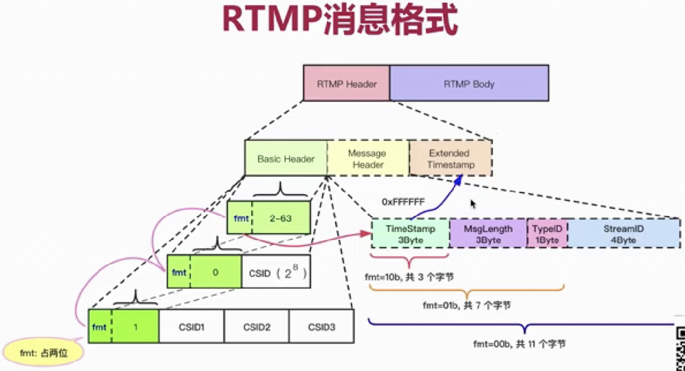

- RTMP消息类型

  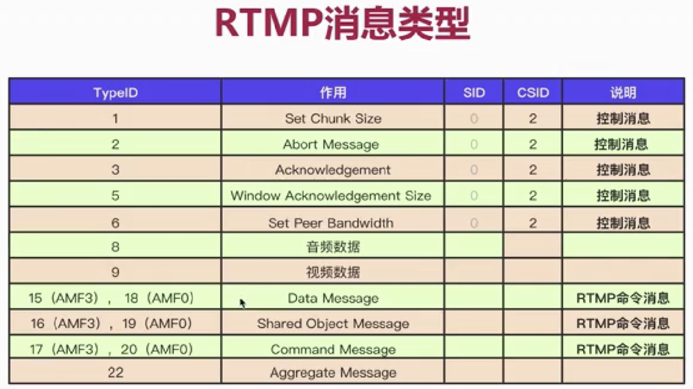

### RTMP抓包分析

### FLV协议

### FLV协议分析器

### 推流程序的骨架

### 打开FLV文件

### 连接RTMP流媒体服务器

### 向流媒体服务器推流

### 从FLV文件中读取tag数据

### 调试与优化

## 【实战】CDN 实现商业娱乐直播

泛娱乐化直播系统架构介绍

本机搭建RTMP服务

SRS流媒体服务器简介

SRS单机布署

RTMP中的URL与VHOST

SRS实现集群布署

CDN网络

阿里云视频直播

真实的直播架构是怎样的

# 音视频提高

## FFMPEG下载编译与安装

```shell
git clone https://git.ffmpeg.org/ffmpeg.git
config --help
make && make install 
```

网络慢 手动下载

```shell
scp ffmpeg-snapshot.tar.bz2 zler@172.16.150.7:/home/zler/ffmpeg
tar jxvf ffmpeg-snapshot.tar.bz2
```

解压后对每个模块进行介绍

```
libavformat： 对多媒体格式进行解析和封装
libavutil：常用的工具
libavcodec：所有音频的编解码 它不对具体进行编解码 主要是将其他的模块插入进来
libavdevice： 对机器的设备进行处理的 对音频视频的采集 桌面的采集
libavresample：对音频进行重采样 这个用的比较少
libavfilter：对音频视频的后期处理 对视频进行过滤镜
libswresample：对音频的操作
libswscale：对视频的操作
```

 ./configure --help 查看都有哪些模块

```shell
./configure --help  | more ## 分页模块
./configure  --list-filters
./configure  --list-encoders
./configure  --list-decoders
```

安装

```shell
./configure --prefix=/usr/local/ffmpeg \
	--enable-gpl \
	--enable-nonfree \
	--enable-libfdk-aac \
	--enable-libx264 \
	--enable-libx265 \
	--enable-filter=delogo \ ##可以生成视频中水印
	--enable-debug \ ##打开调试 正式线上不用安装
	--enable-optimizations \ ##关闭了优化
	--enable-libspeex \
	--enable-videotoolbox \
	--enable-shared \ ##生成共享库
	--enable-pthreads \
	--enable-version3 \
	--enable-hardcoded-tables \
	--cc=clang \
	--host-cflags= --host-ldflags=
```

去除注释

```
./configure --prefix=/Users/zler/ffmpeg \
	--enable-gpl \
	--enable-nonfree \
	--enable-libass \
	--enable-indev=avfoundation \
	--enable-libfdk-aac \
	--enable-libx264 \
	--enable-libx265 \
	--enable-filter=delogo \
	--enable-debug \
	--enable-optimizations \
	--enable-libspeex \
	--enable-shared \
	--enable-pthreads \
	--enable-version3 \
	--enable-hardcoded-tables \
	--cc=clang --host-cflags= --host-ldflags=
```

当然也可以使用系统安装方式 brew apt yum等等 搞到最后还是使用 sudo apt install ffmpeg.  Mac 下使用 brew install ffmpeg

## ffmpeg常用命令分类

```
比如可以将mp4转成flv
可以将一段音频和视频进行合并
裁剪 录制

基础信息查询命令
录制命令
分解/复用命令 （其实就是类似于将mp4转成flv）
处理原始数据命令 （通过音频设备视频设备进行采集 并且可以加工）

剪切与合并命令 （可以将一段音频和视频进行合并 可以裁剪一个视频和音频的一部分）
图片/视频互转命令 （有一个视频可以按秒转成一张张图片 也可以将一张张图片再圆成一个视频）
直播相关命令 （我可以推流 远端的客户端可以拉流）
各种滤镜命令 （可以给一个视频加一个logo 也可以删除logo 也可以对视频进行反转滤镜）
```

## ffmpeg的处理流程

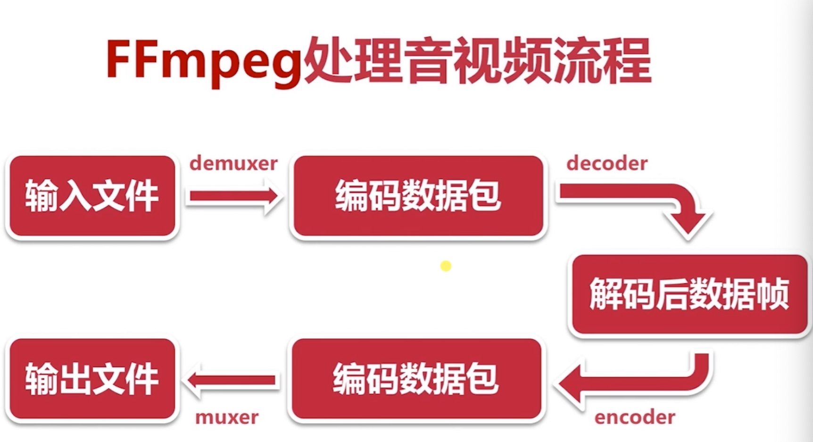


```reStructuredText
输入文件：比如 mp4 flv等这些文件我们称之为封装格式的文件，这个封装格式的文件可以想象为一个盒子，在这个盒子里面我们可以装各种内容包括音频数据、视频数据、字幕数据等等

打开这个盒子我们称之为 demuxer 打开这个盒子后暴露给我们的是音频数据 视频数据 字幕数据等 把这些数据称之为编码数据 因为这些数据是压缩后的数据 不是原始的数据 

把这些压缩后的数据进行解码decoder，解码过后我们就拿到了原始数据

拿到原始数据我们可以进行修改 比如720px 我们可以缩小为480px，然后对这个数据进行编码encoder

然后我们要将编码过后的数据进行封装muxer，封装成一种流行的格式 这种格式交给播放器 播放器又认识 播放器就知道怎么解码 播放 

```

## ffmpeg基本信息查询命令

| -version  | 显示版本           | -formats     | 显示可用的格式     |
| --------- | ------------------ | ------------ | ------------------ |
| -demuxers | 显示可用的demuxers | -protocols   | 显示可用的协议     |
| -muxers   | 显示可用的muxers   | -filters     | 显示可用的过滤器   |
| -devices  | 显示可用的设备     | -pix_fmts    | 显示可用的像素格式 |
| -codecs   | 显示所有的编解码器 | -sample_fmts | 显示可用的采样格式 |
| -decoders | 显示可用的解码器   | -layouts     | 显示channel名称    |
| -encoders | 显示所有的编码器   | -colors      | 显示识别的颜色名称 |
| -bsfs     | 显示比特流filter   |              |                    |

## ffmpeg录屏命令

```shell
#录制
ffmpeg -f avfoundation -i 1 -r 30 out.yuv
-f: 指定使用mac 下 avfoundation库 采集数据
-i: 指定从哪儿采集数据，它是一个文件索引号
	0:代表摄像头的索引值
	1:代表屏幕的索引值
-r: 指定帧数

#播放
ffplay -s 2880x1800 -pix_fmt uyvy422 out.yuv
ffplay -s 2880x1800 out.yuv

#avfoundation这个库所支持设备列表
ffmpeg -f avfoundation -list_devices true -i ""
```

## fmpeg录屏声音命令

```shell
ffmpeg -f avfoundation -i :0 out.wav
:0 代表音频设备

# 播放
ffplay out.wav
```

## fmpeg分解/复用命令


```shell
## demuxer:分解过程
## muxer: 复用
ffmpeg -i out.mp4 -vcodec copy -acodec copy out.flv # 不考虑分解码
-i: 输入文件
-vcodec copy: 视频编码处理方式
-acodec copy: 音频编码处理方式

ffmpeg -i f35.mov -vcodec copy -acodec copy f35.mp4
ffmpeg -i aa.mov -vcodec copy -acodec copy aa.mp4 #视频转化到其他格式
ffmpeg -i aa.mov -an -vcodec copy aa.h264 # 只抽取视频
ffmpeg -i aa.mov -acodec copy -vn aa.aac # 只抽取音频
```

## fmpeg处理原始数据命令

原始数据:ffmpeg解码后的数据 对于音频就是pcm数据，对于视频就是yuv数据

原始数据播放器是播发不了的

```shell
## fmpeg提取yuv数据
ffmpeg -i input.mp4 -an -c:v rawvideo -pix_fmt yuv420p out.yuv
-an：a 代表音频 n 代表not 意思就是不要音频
-c:v rawvideo: 指定编码方式rawvideo

ffmpeg -i aa.mp4 -an -c:v rawvideo -pix_fmt yuv420p aa.yuv

ffplay aa.mp4  #报错 Picture size 0x0 is invalid
#因为原始数据是没有宽和高的

ffplay -s 1280x720 aa.yuv  # 指定分辨率来播放

## fmpeg提取pcm数据
ffmpeg -i aa.mp4 -vn -ar 44100 -ac 2 -f s16le aa.pcm
-vn:不要视频
-ar: a 音频 r 采样率  音频的采样率是多少
-ac: a 音频 c(chanel) 声道  音频是 单声道 还是 双声道 还是 立体声
-f: 音频存储格式是什么 s有符号16进制le小头 

ffplay aa.pcm #报错或者无效的数据 不知道什么样的采样率 也不知道是单身道还是多声道
ffplay -ar 44100 -ac 2 -f s16e aa.pcm

## 我们提取出这些原始数据可以验证我们基于ffmpeg的二次开发时候这些命令非常重要
```

## ffmpeg 各种滤镜命令

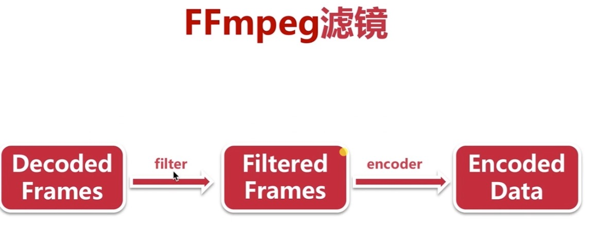

```shell
 #加水印 去水印 画中画 视频裁剪 音频倍速等等
 #滤镜都是对解码后的数据进行处理
 ffmpeg -i aa.mp4 -vf crop=in_w-600:in_h-200 -c:v libx264 -c:a copy bb.mp4
 -vf: v视频 f 滤镜
 crop 视频具体的哪个滤镜 滤镜的名字 每个滤镜的方式不一样的
 				in_w-200:in_h-200 宽度-400 高度-200
 
 -c:v libx264: 指定视频编码方式
 -c:a copy: 指定音频编码方式 copy 就是不指定拷贝原油的编码方式
 

```

## ffmpeg剪切与合并命令 

```shell
## 对音视频进行裁剪
ffmpeg -i xxmm.mp4 -ss 00:00:05	 -t 5 xxmm.ts
## 对音视频进行合并
ffmpeg -f concat -i a.txt hb.mp4
	a.txt 内容为 'file filename' 格式
    file 'aa.ts'
    file 'xxmm.ts'
```

## ffmpeg图片/视频互转命令

```shell
# 视频转图片
ffmpeg -i xxmm.mp4 -r 1 -f image2 image-%3d.jpeg
  -r 转化为图片的帧率是多少 1代表 每秒钟转换成1张图片
  -f 转成什么格式的
  image-%3d.jpeg 代表 输出的文件名

# 图片转视频 将一堆图片合并成一个视频
ffmpeg -i image-%3d.jpeg tupian.mp4

# ffmpeg还可以转播 移动端音视频入门
```

## ffmpeg直播相关命令

```shell
#直播推流
ffmpeg -re -i xxmm.mp4 -c copy -f flv rtmp://server/live/streamName
-re 减慢帧率速度
-c 是音视频  -avcodec 音频 -vcodec 视频 的总和
-f 格式的

#直播拉流
ffmpeg -i rtmp://server/live/streamName -c copy dump.flv
-c 拉到的流是否进行重新编码

ffplay rtmp://58.200.131.2:1935/livetv/hunantv # 播放湖南卫视
ffplay http://ivi.bupt.edu.cn/hls/cctv1hd.m3u8 # 播放cctv1
 
ffmpeg -i rtmp://58.200.131.2:1935/livetv/hunantv -c copy laliu.flv
ffmpeg -i http://ivi.bupt.edu.cn/hls/cctv1hd.m3u8 -c copy laliu.m3u8
```

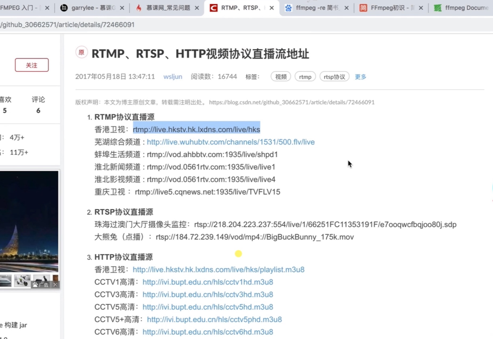

## ffmpeg初级开发

Ffmpeg日志的使用及目录操作

介绍ffmpeg的基本概念及常见结构体

对复用/解服用及流的操作的各种实战

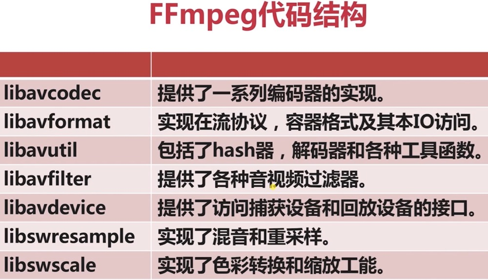

## ffmpeg日志的系统

```c
#include <libavutil/log.h>
av_log_set_level(AV_LOG_DEBUG)
av_log(NULL, AV_LOG_INFO,"...%S\n", op)
  
# 编译 gcc ffmpeg_log.c -o ffmpeg_log -g -lavutil
```

常用日志级别

```
AV_LOG_ERROR 最高
AV_LOG_WARNING 依次
AV_LOG_INFO 依次
AV_LOG_DEBUG 依次
设置日志级别那么级别一下不会打印 以上的会打印
```

文件的删除与重命名

```
avpriv_io_delete() //删除文件
avpriv_io_move() //重命名 移动

```

编译

```shell
## /usr/local/Cellar/ffmpeg/4.3_3/lib/

## /usr/local/Cellar/ffmpeg/4.3_3/include/  

gcc ffmpeg_file.c -o ffmpeg_file -g -I /usr/local/Cellar/ffmpeg/4.3_3/include/ -L /usr/local/Cellar/ffmpeg/4.3_3/lib/ -l avformat 
```

代码

```c
#include <libavformat/avformat.h>

int main(int argc, char const *argv[])
{
    int ret;
    ret = avpriv_io_move("111.txt", "222.txt");
    if(ret < 0){
        av_log(NULL, AV_LOG_ERROR, "fail to rename file %s \n", "111.txt");
        return -1;  
    }
    av_log(NULL,AV_LOG_INFO, "success rename \n");  
    //url
    ret = avpriv_io_delete("./my.txt");
    if(ret < 0){
        av_log(NULL, AV_LOG_ERROR, "fail to delete file %s \n", "ny.txt");
        return -1;
    }
    av_log(NULL, AV_LOG_INFO, "success to delete my.txt \n");
    return 0;
}
```

## ffmpeg对目录进行操作

```
avio_open_dir()
avio_read_dir()
avio_close_dir()
#结构体
AVIODirContext 操作目录的上下文	
AVIODirEntry 目录项 用于存放文件名 文件大小信息
```

代码

```c
#include <libavutil/log.h>
#include <libavformat/avformat.h>

int main(int argc, char const *argv[])
{
    int ret;
    AVIODirContext *ctx = NULL;
    AVIODirEntry *entry = NULL; 
    
    av_log_set_level(AV_LOG_INFO);
    
    ret = avio_open_dir(&ctx, "./", NULL);
    if(ret < 0){
        av_log(NULL, AV_LOG_ERROR, "can't open dir:%s\n", av_err2str(ret));
        return -1;
    }

    while (1){
        ret = avio_read_dir(ctx, &entry);
        if(ret < 0){
            av_log(NULL, AV_LOG_ERROR, "can't read dir:%s\n", av_err2str(ret));
            goto END;
        }

        if(!entry){
            break;
        }

        av_log(NULL, AV_LOG_INFO, "%12"PRId64" %s \n", entry->size, entry->name);

        avio_free_directory_entry(&entry);//释放
    }

END:   
    avio_close_dir(&ctx); //错误时释放

    return 0;
}

```

## 多媒体文件基本概念

```
多媒体文件其实是一个容器

在容器里有很多流(Stream/Track)
	轨道：轨道永远不相交的 不同的流是不相交的 即使是多个音频和多个视频都是不相交的

每种流是由不同的编码器编码的

从流中读取的数据称为包
	在一个包中包含着一个或者多个桢
```

## 几个重要的结构体

```c
AVFormatContext 格式上下文 各个api的桥梁
AVStream 流 多个视频流 多个音频流 多个字母流
AVPacket 包 一个个包获得桢 桢就可以获得原始数据
```


容器盒子打开就是解复用 -> 获取容器许多的流  ->读取流的数据包 -> 对数据包（包里拿到数据帧）进行解码拿到原始数据  -> 变声 倍速播放 录播 -》释放相关资源

## [实战] 打印音视频信息

我们工作生活中经常想知道这个多媒体的音频是什么格式 视频是什么格式 音频采样率是多少 视频的帧数是多少

```
av_register_all() 将ffmpeg所定义的编解码库 一些格式 格式库 格式协议 网络协议 全部注册到程序里面
avformat_open_input() 打开一个多媒体文件 识别多媒体格式是什么 输出结构体AVFormatContext
avformat_close_input() 关闭
av_dump_format() 将多媒体的mete信息打印出来
```

代码

```c
#include <libavutil/log.h>
#include <libavformat/avformat.h>

int main(int argc, char const *argv[])
{
    AVFormatContext * fmt_ctx = NULL;
    int ret;

    av_log_set_level(AV_LOG_INFO);

    av_register_all();

    //参数一 输出AVFormatContext结构体指针 参数二 文件名 参数三 指定输入的格式  参数四 使用命令行传入的参数
    ret = avformat_open_input(&fmt_ctx, "./aa.mp4", NULL, NULL);
    if(ret < 0){
        av_log(NULL, AV_LOG_ERROR, "Can't open file:%s\n", av_err2str(ret));
        return -1;
    }

    //参数2 流的索引值 自定义 参数3 文件名  参数4 0是输入流 1是输出流
    av_dump_format(fmt_ctx, 0, "./aa.mp4", 0);

    avformat_close_input(&fmt_ctx);

    return 0;
}
```

## [实战] 抽取音频数据

```
av_init_packet() 初始化数据包
av_find_best_stream() 在多媒体文件中找到最好的一路流
av_read_frame() 将流中的一个个数据包读取到
av_packet_unref() 释放数据包
```

代码

```c
#include <libavutil/log.h>
#include <libavformat/avformat.h>
#include <stdio.h>

#define ADTS_HEADER_LEN  7;

void adts_header(char *szAdtsHeader, int dataLen){

    int audio_object_type = 2;
    int sampling_frequency_index = 7;
    int channel_config = 2;

    int adtsLen = dataLen + 7;

    szAdtsHeader[0] = 0xff;         //syncword:0xfff                          高8bits
    szAdtsHeader[1] = 0xf0;         //syncword:0xfff                          低4bits
    szAdtsHeader[1] |= (0 << 3);    //MPEG Version:0 for MPEG-4,1 for MPEG-2  1bit
    szAdtsHeader[1] |= (0 << 1);    //Layer:0                                 2bits 
    szAdtsHeader[1] |= 1;           //protection absent:1                     1bit

    szAdtsHeader[2] = (audio_object_type - 1)<<6;            //profile:audio_object_type - 1                      2bits
    szAdtsHeader[2] |= (sampling_frequency_index & 0x0f)<<2; //sampling frequency index:sampling_frequency_index  4bits 
    szAdtsHeader[2] |= (0 << 1);                             //private bit:0                                      1bit
    szAdtsHeader[2] |= (channel_config & 0x04)>>2;           //channel configuration:channel_config               高1bit

    szAdtsHeader[3] = (channel_config & 0x03)<<6;     //channel configuration:channel_config      低2bits
    szAdtsHeader[3] |= (0 << 5);                      //original：0                               1bit
    szAdtsHeader[3] |= (0 << 4);                      //home：0                                   1bit
    szAdtsHeader[3] |= (0 << 3);                      //copyright id bit：0                       1bit  
    szAdtsHeader[3] |= (0 << 2);                      //copyright id start：0                     1bit
    szAdtsHeader[3] |= ((adtsLen & 0x1800) >> 11);           //frame length：value   高2bits

    szAdtsHeader[4] = (uint8_t)((adtsLen & 0x7f8) >> 3);     //frame length:value    中间8bits
    szAdtsHeader[5] = (uint8_t)((adtsLen & 0x7) << 5);       //frame length:value    低3bits
    szAdtsHeader[5] |= 0x1f;                                 //buffer fullness:0x7ff 高5bits
    szAdtsHeader[6] = 0xfc;
}

int main(int argc, char const *argv[])
{ 
    int ret;
    int auido_index;
    int len; 
    const char * src = NULL;
    const char * dst = NULL;
    AVPacket pkt;
    AVFormatContext * fmt_ctx = NULL;

    av_log_set_level(AV_LOG_INFO);

    if(argc < 3){
        av_log(NULL, AV_LOG_ERROR, "参数少于三个\n");
        return -1;
    }

    src = argv[1];
    dst = argv[2];
    if(src == NULL || dst == NULL){
        av_log(NULL, AV_LOG_ERROR, "src 和 dst不能为NULL\n");
        return -1;
    }

    av_register_all();

    //参数一 输出AVFormatContext结构体指针 参数二 文件名 参数三 指定输入的格式  参数四 使用命令行传入的参数
    ret = avformat_open_input(&fmt_ctx, src, NULL, NULL);
    if(ret < 0){
        av_log(NULL, AV_LOG_ERROR, "Can't open file:%s\n", av_err2str(ret));
        avformat_close_input(&fmt_ctx);
        return -1;
    }
    
    FILE * dst_fd = fopen(dst, "wb");
    if(dst_fd == NULL){
        av_log(NULL, AV_LOG_ERROR, "不能打开输出文件\n");
        avformat_close_input(&fmt_ctx);
        return -1;
    }

    //参数2 流的索引值 自定义 参数3 文件名  参数4 0是输入流 1是输出流
    av_dump_format(fmt_ctx, 0, src, 0);

    //参数二 指定获取音频流 视频流 文字流... 参数三 要处理流的索引号 不知道就填写-1 参数四 相关的流的索引号 不知道就填写-1
    //参数五 要处理流的编解码器 不知道就填写NULL 参数五 标志 不知道就填写0
    ret = av_find_best_stream(fmt_ctx, AVMEDIA_TYPE_AUDIO, -1, -1, NULL, 0);
    if(ret < 0){
        av_log(NULL, AV_LOG_ERROR, "不能找到最好的流\n");
        avformat_close_input(&fmt_ctx);
        fclose(dst_fd);
        return -1;
    }
    auido_index = ret;

    av_init_packet(&pkt);
    while(av_read_frame(fmt_ctx, &pkt) > 0){
        if(pkt.stream_index == auido_index){
            //增加adts的头
            char adts_header_buf[7];
            adts_header(adts_header_buf, pkt.size);
            fwrite(adts_header_buf, 1, 7, dst_fd);

            len = fwrite(pkt.data, 1, pkt.size, dst_fd);
            if(len != pkt.size){
                av_log(NULL,AV_LOG_ERROR,"警告 数据长度不等于包的大小\n");
            }
        }

        av_packet_unref(&pkt);
    }
 
    avformat_close_input(&fmt_ctx);
    if(dst_fd){
        fclose(dst_fd);
    }

    return 0;
}
```

[实战] 抽取视频数据

```
Start code 通过特征码 来区分每一桢
SPS/PPS 去解码的参数 分辨率...
codec->extradata
```

代码

```c
#include <stdio.h>
#include <libavutil/log.h>
#include <libavformat/avio.h>
#include <libavformat/avformat.h>

#ifndef AV_WB32
#   define AV_WB32(p, val) do {                 \
        uint32_t d = (val);                     \
        ((uint8_t*)(p))[3] = (d);               \
        ((uint8_t*)(p))[2] = (d)>>8;            \
        ((uint8_t*)(p))[1] = (d)>>16;           \
        ((uint8_t*)(p))[0] = (d)>>24;           \
    } while(0)
#endif

#ifndef AV_RB16
#   define AV_RB16(x)                           \
    ((((const uint8_t*)(x))[0] << 8) |          \
      ((const uint8_t*)(x))[1])
#endif

static int alloc_and_copy(AVPacket *out,
                          const uint8_t *sps_pps, uint32_t sps_pps_size,
                          const uint8_t *in, uint32_t in_size)
{
    uint32_t offset         = out->size;
    uint8_t nal_header_size = offset ? 3 : 4;
    int err;

    err = av_grow_packet(out, sps_pps_size + in_size + nal_header_size);
    if (err < 0)
        return err;

    if (sps_pps)
        memcpy(out->data + offset, sps_pps, sps_pps_size);
    memcpy(out->data + sps_pps_size + nal_header_size + offset, in, in_size);
    if (!offset) {
        AV_WB32(out->data + sps_pps_size, 1);
    } else {
        (out->data + offset + sps_pps_size)[0] =
        (out->data + offset + sps_pps_size)[1] = 0;
        (out->data + offset + sps_pps_size)[2] = 1;
    }

    return 0;
}

int h264_extradata_to_annexb(const uint8_t *codec_extradata, const int codec_extradata_size, AVPacket *out_extradata, int padding)
{
    uint16_t unit_size;
    uint64_t total_size                 = 0;
    uint8_t *out                        = NULL, unit_nb, sps_done = 0,
             sps_seen                   = 0, pps_seen = 0, sps_offset = 0, pps_offset = 0;
    const uint8_t *extradata            = codec_extradata + 4;
    static const uint8_t nalu_header[4] = { 0, 0, 0, 1 };
    int length_size = (*extradata++ & 0x3) + 1; // retrieve length coded size, 用于指示表示编码数据长度所需字节数

    sps_offset = pps_offset = -1;

    /* retrieve sps and pps unit(s) */
    unit_nb = *extradata++ & 0x1f; /* number of sps unit(s) */
    if (!unit_nb) {
        goto pps;
    }else {
        sps_offset = 0;
        sps_seen = 1;
    }

    while (unit_nb--) {
        int err;

        unit_size   = AV_RB16(extradata);
        total_size += unit_size + 4;
        if (total_size > INT_MAX - padding) {
            av_log(NULL, AV_LOG_ERROR,
                   "Too big extradata size, corrupted stream or invalid MP4/AVCC bitstream\n");
            av_free(out);
            return AVERROR(EINVAL);
        }
        if (extradata + 2 + unit_size > codec_extradata + codec_extradata_size) {
            av_log(NULL, AV_LOG_ERROR, "Packet header is not contained in global extradata, "
                   "corrupted stream or invalid MP4/AVCC bitstream\n");
            av_free(out);
            return AVERROR(EINVAL);
        }
        if ((err = av_reallocp(&out, total_size + padding)) < 0)
            return err;
        memcpy(out + total_size - unit_size - 4, nalu_header, 4);
        memcpy(out + total_size - unit_size, extradata + 2, unit_size);
        extradata += 2 + unit_size;
pps:
        if (!unit_nb && !sps_done++) {
            unit_nb = *extradata++; /* number of pps unit(s) */
            if (unit_nb) {
                pps_offset = total_size;
                pps_seen = 1;
            }
        }
    }

    if (out)
        memset(out + total_size, 0, padding);

    if (!sps_seen)
        av_log(NULL, AV_LOG_WARNING,
               "Warning: SPS NALU missing or invalid. "
               "The resulting stream may not play.\n");

    if (!pps_seen)
        av_log(NULL, AV_LOG_WARNING,
               "Warning: PPS NALU missing or invalid. "
               "The resulting stream may not play.\n");

    out_extradata->data      = out;
    out_extradata->size      = total_size;

    return length_size;
}

int h264_mp4toannexb(AVFormatContext *fmt_ctx, AVPacket *in, FILE *dst_fd)
{

    AVPacket *out = NULL;
    AVPacket spspps_pkt;

    int len;
    uint8_t unit_type;
    int32_t nal_size;
    uint32_t cumul_size    = 0;
    const uint8_t *buf;
    const uint8_t *buf_end;
    int            buf_size;
    int ret = 0, i;

    out = av_packet_alloc();

    buf      = in->data;
    buf_size = in->size;
    buf_end  = in->data + in->size;

    do {
        ret= AVERROR(EINVAL);
        if (buf + 4 /*s->length_size*/ > buf_end)
            goto fail;

        for (nal_size = 0, i = 0; i<4/*s->length_size*/; i++)
            nal_size = (nal_size << 8) | buf[i];

        buf += 4; /*s->length_size;*/
        unit_type = *buf & 0x1f;

        if (nal_size > buf_end - buf || nal_size < 0)
            goto fail;

        /*
        if (unit_type == 7)
            s->idr_sps_seen = s->new_idr = 1;
        else if (unit_type == 8) {
            s->idr_pps_seen = s->new_idr = 1;
            */
            /* if SPS has not been seen yet, prepend the AVCC one to PPS */
            /*
            if (!s->idr_sps_seen) {
                if (s->sps_offset == -1)
                    av_log(ctx, AV_LOG_WARNING, "SPS not present in the stream, nor in AVCC, stream may be unreadable\n");
                else {
                    if ((ret = alloc_and_copy(out,
                                         ctx->par_out->extradata + s->sps_offset,
                                         s->pps_offset != -1 ? s->pps_offset : ctx->par_out->extradata_size - s->sps_offset,
                                         buf, nal_size)) < 0)
                        goto fail;
                    s->idr_sps_seen = 1;
                    goto next_nal;
                }
            }
        }
        */

        /* if this is a new IDR picture following an IDR picture, reset the idr flag.
         * Just check first_mb_in_slice to be 0 as this is the simplest solution.
         * This could be checking idr_pic_id instead, but would complexify the parsing. */
        /*
        if (!s->new_idr && unit_type == 5 && (buf[1] & 0x80))
            s->new_idr = 1;

        */
        /* prepend only to the first type 5 NAL unit of an IDR picture, if no sps/pps are already present */
        if (/*s->new_idr && */unit_type == 5 /*&& !s->idr_sps_seen && !s->idr_pps_seen*/) {

            h264_extradata_to_annexb( fmt_ctx->streams[in->stream_index]->codec->extradata,
                                      fmt_ctx->streams[in->stream_index]->codec->extradata_size,
                                      &spspps_pkt,
                                      AV_INPUT_BUFFER_PADDING_SIZE);

            if ((ret=alloc_and_copy(out,
                               spspps_pkt.data, spspps_pkt.size,
                               buf, nal_size)) < 0)
                goto fail;
            /*s->new_idr = 0;*/
        /* if only SPS has been seen, also insert PPS */
        }
        /*else if (s->new_idr && unit_type == 5 && s->idr_sps_seen && !s->idr_pps_seen) {
            if (s->pps_offset == -1) {
                av_log(ctx, AV_LOG_WARNING, "PPS not present in the stream, nor in AVCC, stream may be unreadable\n");
                if ((ret = alloc_and_copy(out, NULL, 0, buf, nal_size)) < 0)
                    goto fail;
            } else if ((ret = alloc_and_copy(out,
                                        ctx->par_out->extradata + s->pps_offset, ctx->par_out->extradata_size - s->pps_offset,
                                        buf, nal_size)) < 0)
                goto fail;
        }*/ else {
            if ((ret=alloc_and_copy(out, NULL, 0, buf, nal_size)) < 0)
                goto fail;
            /*
            if (!s->new_idr && unit_type == 1) {
                s->new_idr = 1;
                s->idr_sps_seen = 0;
                s->idr_pps_seen = 0;
            }
            */
        }


        len = fwrite( out->data, 1, out->size, dst_fd);
        if(len != out->size){
            av_log(NULL, AV_LOG_DEBUG, "warning, length of writed data isn't equal pkt.size(%d, %d)\n",
                    len,
                    out->size);
        }
        fflush(dst_fd);

next_nal:
        buf        += nal_size;
        cumul_size += nal_size + 4;//s->length_size;
    } while (cumul_size < buf_size);

    /*
    ret = av_packet_copy_props(out, in);
    if (ret < 0)
        goto fail;

    */
fail:
    av_packet_free(&out);

    return ret;
}

int main(int argc, char *argv[])
{
    int err_code;
    char errors[1024];

    char *src_filename = NULL;
    char *dst_filename = NULL;

    FILE *dst_fd = NULL;

    int video_stream_index = -1;

    //AVFormatContext *ofmt_ctx = NULL;
    //AVOutputFormat *output_fmt = NULL;
    //AVStream *out_stream = NULL;

    AVFormatContext *fmt_ctx = NULL;
    AVPacket pkt;

    //AVFrame *frame = NULL;

    av_log_set_level(AV_LOG_DEBUG);

    if(argc < 3){
        av_log(NULL, AV_LOG_DEBUG, "the count of parameters should be more than three!\n");
        return -1;
    }

    src_filename = argv[1];
    dst_filename = argv[2];

    if(src_filename == NULL || dst_filename == NULL){
        av_log(NULL, AV_LOG_ERROR, "src or dts file is null, plz check them!\n");
        return -1;
    }

    /*register all formats and codec*/
    av_register_all();

    dst_fd = fopen(dst_filename, "wb");
    if (!dst_fd) {
        av_log(NULL, AV_LOG_DEBUG, "Could not open destination file %s\n", dst_filename);
        return -1;
    }

    /*open input media file, and allocate format context*/
    if((err_code = avformat_open_input(&fmt_ctx, src_filename, NULL, NULL)) < 0){
        av_strerror(err_code, errors, 1024);
        av_log(NULL, AV_LOG_DEBUG, "Could not open source file: %s, %d(%s)\n",
               src_filename,
               err_code,
               errors);
        return -1;
    }

    /*dump input information*/
    av_dump_format(fmt_ctx, 0, src_filename, 0);

    /*initialize packet*/
    av_init_packet(&pkt);
    pkt.data = NULL;
    pkt.size = 0;

    /*find best video stream*/
    video_stream_index = av_find_best_stream(fmt_ctx, AVMEDIA_TYPE_VIDEO, -1, -1, NULL, 0);
    if(video_stream_index < 0){
        av_log(NULL, AV_LOG_DEBUG, "Could not find %s stream in input file %s\n",
               av_get_media_type_string(AVMEDIA_TYPE_VIDEO),
               src_filename);
        return AVERROR(EINVAL);
    }

    /*
    if (avformat_write_header(ofmt_ctx, NULL) < 0) {
        av_log(NULL, AV_LOG_DEBUG, "Error occurred when opening output file");
        exit(1);
    }
    */

    /*read frames from media file*/
    while(av_read_frame(fmt_ctx, &pkt) >=0 ){
        if(pkt.stream_index == video_stream_index){
            /*
            pkt.stream_index = 0;
            av_write_frame(ofmt_ctx, &pkt);
            av_free_packet(&pkt);
            */

            h264_mp4toannexb(fmt_ctx, &pkt, dst_fd);

        }

        //release pkt->data
        av_packet_unref(&pkt);
    }

    //av_write_trailer(ofmt_ctx);

    /*close input media file*/
    avformat_close_input(&fmt_ctx);
    if(dst_fd) {
        fclose(dst_fd);
    }

    //avio_close(ofmt_ctx->pb);

    return 0;
}
```

## [实战] 将MP4转成FLV格式

```
avformat_alloc_output_context2() 创建输出上下文 
avformat_free_context()//释放上下文
avformat_new_stream()//创建新的流
avcodec_parameters_copy() //拷贝编解码的参数

avformat_write_header() //写入到输出文件的header 
av_write_frame()/av_interleaved_write_frame() 写数据

av_write_trailer() 将写入的缓冲区最终写入到输出文件
```

代码

```c

```

## [实战] 从MP4截取一段视频

```
av_seek_frame() 跳一段时间
```

## [实战] 实现一个简单的小咖秀

```
将两个媒体文件中分别抽取音频与视频轨
将音频与视频轨合成一个新的文件
对音频与视频轨进行裁剪
```


## ffmpeg中级开发

```
H264解码
H264编码
AAC解码
AAC编码

常见的结构体
  添加头文件 libavcodec/avcodec.h
  AVCodec 编码器结构体
  AVCodecContext 编码器上下文
  AVFrame 解码后的帧 帧的格式yuv   frame是帧的意思
结构体的内存分配和释放
	av_frame_alloc/av_frame_free
	avcodec_alloc_context3 编解码器的上下文
	avcodec_free_context 释放编解码器的上下文

解码步骤
	查找解码器 avcodec_find_decoder 就是在一个流(流的id)中找到解码器
	打开解码器 avcodec_open2
	解码 avcodec_decode_video2
	最终解码为未压缩的数据yuv rgb 然后比如通过openGL渲染
编码步骤
	查找编码器 avcodec_find_encoder_by_name 通过名字找到编码器
	设置编码参数，打开编码器 avcodec_open2
	编码 avcodec_encode_video2

avcodec_register_all() //只注册编解码器
```


# 第二部分 ffmpeg开发播放器

## 音视频基础知识

- 封装、解码、重采样、像素格式

## MPEG-4

- MPEG-4是一套标准用于音频、视频信息的压缩编码标准
- MPEG-4 Part14 MPEG-4文件格式 Part15 AVC文件格式
- H264(AVC Part10)

## 常用的封装格式

- AVI 压缩标准可任意选择
- FLV ts 流媒体格式 可以用来直播
- ASF 可以用来点播
- mp4

## 常用编码格式

- 视频H264(AVC Part10), wmv, XviD(Part2),mjpeg
- 音频 acc MP3 ape flac

## 封装格式和编码格式

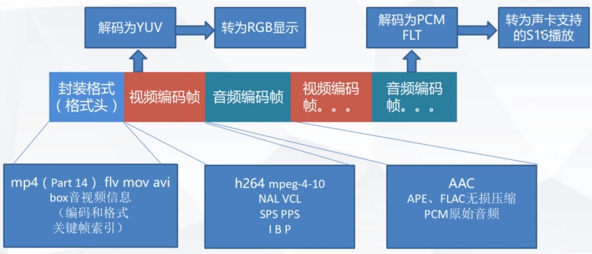


## 像素格式

- BGRA RGBA ARGB32 RGB32 YUV420
- R = Y + 1.4075 * (V-128);
- G = Y - 0.3455 * (U-128) - 0.7169 * (V-128)
- B = Y + 1.779 * (U-128);

### 3x3RGB图像在内存存放方式(连续)

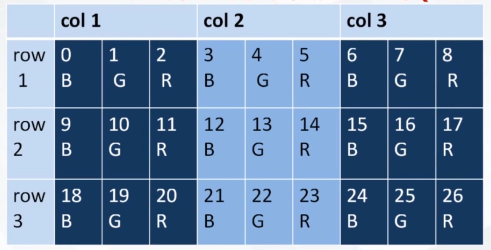

### YUV

- Y 表示明亮度,也就是灰度值
- U 和 V 表示的则是色度

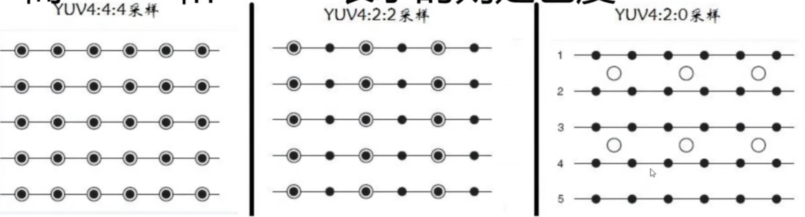

记住有些什么420P,这个P是平面存储

## PCM音频参数

- 采样率 sample_rate 44100 (CD)    (1秒钟采了多少次声音  在内存中就有44100个数值)
- 通道channels (左右声道)
- 样本大小(格式) sample_size    (就是多少位来存储1次采样声音的数据)
  - AV_SAMPLE_FMT_S16     (16位)
  - AV_SAMPLE_FMT_FLTP   (32位)

## 样本类型planar

- AV_SAMPLE_FMT_S16在内存的格式就为:

  c1, c2, c1, c2, c1, c2,...   (交错格式)

- AV_SAMPLE_FMT_S16P在内存的格式就为:

  c1,c2,c1,...c2,c2,c2,...  

## 开发环境搭建

- http://download.qt.io/archive/qt/
- 安装 g++ make 
- sudo apt-get install libgl1-mesa-dev
- 安装qt
- 安装ffmpeg
- ./configure --enable-shared --prefix=/usr/local/ffmpeg
- make -j16 多进程编译
- make install
- sudo apt-get install git

- 拷贝 cp -r /usr/local/Cellar/ffmpeg/4.3_3/include  到你项目的上层目录
- 拷贝 cp -r /usr/local/Cellar/ffmpeg/4.3_3/lib  到你项目的上层目录
- 在qt项目中的 xxx.pro 加入下面内容

```c
#引入ffmpeg的头文件
INCLUDEPATH += ../include
#引入ffmpeg的动态库
LIBS += -L ../lib -lavcodec -lavdevice -lavfilter -lavformat -lavutil -lpostproc -lswscale
```

- 在main.ccp中或者其他的c++文件里面引入c的头文件

  ```cpp
  //引入c语言函数
  extern "C"{
      #include <libavformat/avformat.h>
  }
  ```

## ffmpeg sdk 软硬解码基础

- 解封装

  - av_register_all()

  - avformat_network_init()

  - avformat_open_input() //打开一个文件解析出来格式、视频流、音频流、视频流的参数、音频流的参数 视频帧的索引 

    - 确保av_register_all() 和 avformat_network_init()已经调用

    -  AVFormatContext **ps     传入一个NULL让动态库帮我们分配内存 也可以自己分配要自己清理
    - Const char * url     支持本地文件和网络地址 打开之后会存在AVFormatContext **ps 里面
    - AVInputFormat * fmt      指定输入的封装格式 一般不用 传NULL
    - AVDictionary **options  字典数组 key和value 可以直接传NULL 有哪些参数可以设置可以查看源代码 打开本地文件是用不到 但是打开rtsp网络地址是要用到 比如最大延迟时间

  - avformat_find_stream_info()

  - av_find_best_stream()//找到音频流和视频流

  - AVFormatContext(解封装和加封装文件格式)  AVStream(视频流和音频流参数信息)  AVPacket(具体解封装之后的一个一个数据包)

    - AVFormatContext结构体详解

    ​	AVIOContext *pb; 用来写入的流

    ​	char filename[1024]; 文件名称 用来断开重连接

    ​	AVStream **stream; 流数组 0是视频 1音频 但是不能保证还是要遍历判断或者用函数判断

    ​	int64_t duration //AV_TIME_BASE 获取整个媒体文件时间总长度 以时间AV_TIME_BASE基数为单位的 微妙 		这个值不一定能获取到，(要看文件有没有包含这个时间) 这时要自己算 根据有多少帧来算

    ​	int64_t bit_rate 比特率 一秒中文件的大小

    ​	void av_format_close_input(AVFormatContext **s) 关闭输入上下文

    - AVStream

      //音频和视频都共用这个结构体那么这个结构体一定是即包含了音频的信息参数和视频的信息参数

      AVCodecContext * codec//过时了

      AVRational time_base //时间基数 分数表示(存的是分子分母,能通过分数表示的是有理数)

      int64_t duration //时常(不一定能获取到) 如何获取毫秒？duration((double)time_base.num/(double)time_base.den)\*1000要判读分母是否是0

      AVRational avg_frame_rate; 帧率(分数表示的)

      AVCodecParameters *codecpar;(音视频参数)

      ​		enum AVMediaType codec_type;  音频还是视频

      ​		enum AVCodecID codec_id;  编码格式 根据这id好找到

      ​		uint32_t codec_tag;  //用不到

      ​		int format //视频像素格式或者音频采样格式(16位)

      ​		int width;int height //视频宽高

      ​		uint64_t channel_layout;//音频解码后是什么声道

      ​		int channels;//音频声道数

      ​		int sample_rate; //音频样本率

      ​		int frame_size //一帧音频的大小

    - AVPacket

      AVBufferRef *buf; //用来存储引用技术的 有可能多个指向同一个空间

      int64_t pts;  //显示的时间 pts*(num/den)

      int64_t dts; //解码的时间 dts*(num/den)

      unit8_t *data; int size; //数据

      - AVPacket *av_packet_alloc(void) 创建并初始化
      - AVPacket *av_packet_clone(const AVPacket *src) 复制(其实就是引用技术增加)
      - int av_packet_ref(AVPacket *dst, const AVPacket *src); //等同于av_packet_clone
      - av_packet_unref(AVPacket *pkt);
      - void av_packet_free(AVPacket **pkt);//清空对象并减引用计数
      - void av_init_packet(AVPacket *pkt);默认值 这个是手动申请的内存 就需要这个
      - int av_packet_from_data(AVPacket *pkt, uint8_t * data, int size);
      - Int av_copy_packet(AVPacket *dst, const AVPacket *src) 已经抛弃了

  - av_read_frame()读取到每个包的 pts dts stream_index(流的索引) 是否是关键帧 

    AVFormatContext *s

    AVPacket *pkt 不能传NULL 输出参数

    返回值 0 表示成功 <0表示错误或者到文件结尾

  - av_seek_frame()滑动条移动到一个地方播放

    AVFormatContext *s;

    int stream_index; //移动哪一个视频流

    int64_t timestramp;//AVStream.time_base

    int flags//移动的方式  出了解决关键帧 时间问题

    一个多媒体文件有视频和音频，选择哪一个作为移动 一般用视频。因为视频有关键帧，你移动的位置不是关键帧，解码解不出来。必须移动到关键帧位置才可以 

    - #define AVSEEK_FLAG_BACKWARD 1 //往时间后找
    - #define AVSEEK_FLAG_BYTE 2
    - #define AVSEEK_FLAG_ANY 4   //往时间后找找任意帧 
    - #define AVSEEK_FLAG_FRAME 8 //往时间后找找到关键帧 一般用这个

- 软硬件解码

  - avcodec_register_all() // 注册解码器

  - AVCodec *avcodec_find_decoder(enum AVCodecID id) //获取解码器

  - AVCodec *avcodec_find_decoder_by_name(const char *name)//获取解码器

  - AVCodec结构体 存放解码器的信息

  - AVCodecContext结构体 存放本次解码后的信息

  - AVCodecContext *avcodec_alloc_context3(const AVCodec *codec)//申请开辟解码器上下文内存

  - void avcodec_free_context(AVCodecContextn **avctx)//释放解码器上下文内存

  - int avcodec_open2(AVCodecContext *avctx, const AVCodec *codec, AVDictionary **options)打开解码器options 定义在 /libavcodec/options_table.h

  - AVCodecContext结构体成员

    int thread_count 多线程解码

    time_base 时间基数

  - avcodec_parameters_to_context(Codec p) 复制解码器的参数

  - 获取解码器和打开解码器之后 就要一帧一帧的解码了

  - AVFrame结构体 存放我们解码后的数据

  - AVFrame *frame = av_frame_alloc()

  - void av_frame_free(AVFrame *frame)

  - int av_frame_ref(AVFrame *dst, const AVFrame *src) 引用技术加1

  - AVFrame *av_frame_clone(const AVFrame *src) 引用技术加1

  - void *av_frame_unref( AVFrame *frame) 引用技术减1

  - AVFrame结构体成员 

    uint8_t * data[AV_NUM_DATA_POINTERS]; 是一个数组 

    int linesize[AV_NUM_DATA_POINTERS] 如果是视频就是一行数据(宽度)的大小 如果是音频是一个通道的数据大小

    - 对于图像来说

      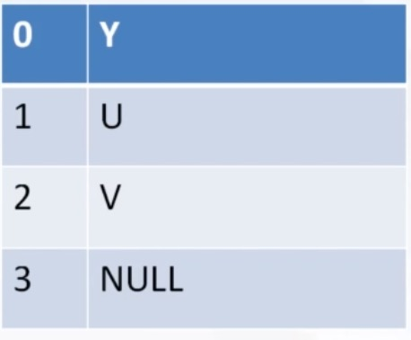

      

      

    - 对于音频来说

      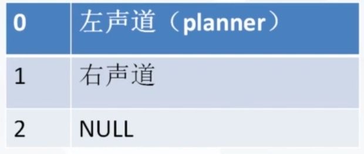

      

    int width ,height, 视频的宽和高

    int nb_samples; 音频 单通道样本数量

    Int64_t pts; 收到的显示时间

    Int64_t dts;

    int sample_rate 音频样本率

    unit64_t channel_layout 音频解码后是什么声道

    int channels; 音频声道数

    int format //视频像素格式AVPixelFromat  音频样本格式AVSampleFormat

  - 具体的解码函数

  - int avcodec_send_packet(AVCodecContext *avctx, const AVPacket *avpkt) 多线程解码需要写到后台的解码缓存队列里面  为了确保全部发出 最好在最后发一个NULL

  - int avcodec_receive_frame(AVCodecContext *avctx, AVFrame *frame) 数据从已解码成功的缓冲队列当中取出一个frame 有可能收到多个帧 有可能发1个收到10个帧

    

- 像素格式转换    YUV转为RGB 主要是视频

  - 视频像素和尺寸转换

    1.基于ffmpeg的转换 更加简单 性能开销大

    2.基于硬解码gpu显卡转换 复杂 性能开销小 手机上可以用这个

    3.实际项目还是用ffmpeg

    - sws_getContext 同时有多个图片 多线程的时候用这个 创建一个新的上下文

    - struct SwsContext *sws_getCachedContext(struct SwsContext *context,

      int srcW,int srcH, enum AVPixelFromat srcFormat,

      int dstW,int dstH, enum AVPixelFromat dstFormat,

      int flags,

       SwsFilter *srcFilter,SwsFilter *dstFilter, const double *param) ;像素格式转换的上下文创建好

      flags参数 算法

      ​	#define SWS_FAST_BILINEAR 1   快速线性差值算法 针对尺寸的变换

      ​	#define SWS__BILINEAR 2

      ​	#define SWS_BICUBIC 4

      ​	#define SWS_X 8

      ​	#define SWS_POINT 0x10

      ​	#define SWS_AREA 0x20

      ​	#define SWS_BICUBLIN 0x40

    - int sws_scale(

      struct SwsContext *c,

      const uint8_t *const srcSlice[],//指针数组 具体数据的数组 

      ​	如果原数据带P 那么数组里面元素就有三个 主要看原数据的格式

      ​	rgba 如果没有平面格式 是交错存储的 数组大小只有一个

      const int srcStride[], 一行对应的数据大小 就是之前的linesize

       int srcSliceY, 用不到 传 0

      int srcSliceH, 对应图像的高度 

      uint8_t *const dst[],  目标的地址

      const int dstStride[] 输出的一行对应的数据大小 linesize

      ); //一帧一帧的转换

      函数返回值是高度
    
    - void sws_freeContext(struct SwsContext *swsContext); 释放完后需要手动将指针置为NULL

- 重采样   主要是音频

  - SwrContext *swr_alloc(void) 创建分配重采样的上下文

  - SwrContext *swr_alloc_set_opts(

    ​	struct SwrContext *s,

    ​	int64_t out_ch_layout, //输出什么样的声道

    ​	AWSampleFormat out_sample_fmt, //输出的样本格式

    ​	int out_sample_rate, //输出样本率

    ​	int64_t in_ch_layout, //输入什么样的声道

    ​	AWSampleFormat in_sample_fmt, //输入的样本格式

    ​	int in_sample_rate, //输入样本率 针对音频的播放速度可以根据样本率的大小的改变来进行改变 会失真

    ​	int log_offset, void *log_ctx //日志 可以不用管

    )

  - int swr_init(struct SwrContext *s); 初始化上下文

  - void swr_free(struct SwrContext *s); 释放

  - int swr_convert(struct SwrContext *s,

    ​	uint8_t **out, //输出的数组

    ​	int out_count, //输出的单通道样本的数量

    ​	const uint8_t **in, //输入的数组

    ​	int in_count,//输入的单通道样本的数量

    ) //转化 把一帧一帧音频进行重采样 

    返回值是每一个输出通道的样本数量

- pts/dts

  pts是显示的时间 dts是解码的时间  I帧是关键帧(所有数据都放在这里) B帧是前一帧和后一帧差异帧 P帧 

  有了B帧 pts和dts时间有可能差异的 没有B帧pts和dts是一样的

- 同步策略

- seek操作 我们播放的进度要控制 而h246播放到关键帧才可以  所以你必须拖拽到关键帧才可以播放

## QT的一些类

- QAudioFormat 记录音频的格式

  - setSampleRate 样本率
  - setSampleSize 样本大小 样本格式 以多少位 正常的是8和16位 bit数
  - setChannelCount 通道数量
  - setCodec("audio/pcm") 编码格式
  - setByteOrder(QAudioFormat::LittleEndian) 字节序 小端字节序 比如x86时小端对齐 在网络传输上是大端字节序
  - setSampleType(QAudioFormat::UnSignedInt) 和setSampleSize对应起来

- QAudioOutput 打开播放设备

  - QIODevice* start() 开始播放
  - suspend()
  - resume()
  - buffSize() 缓冲大小
  - bytesFree() 缓冲里面有没有数据 大于一帧的数据我们就写进去 buffsize-bytesFree就可以推算出还有多长时间没有播放
  - periodSize() 时期所需要到size 我们用不到    一次读取多大进行播放

- QIODevice

  - qint64 write(const char * data, qint64 len); 从ffmpeg解码之后重采样写给qt的大小 返回值是写入的大小

- Qt opengl编程

  - OpenGLWidget(与界面交互)

    - 为什么用Qt的opengl？ 按钮和图片的现实会同步刷新 因为是一个控件
    - void paintGL()  具体的绘制
    - void initializeGL() 材质初始化等
    - void resizeGL(int width, int length)  窗口发生变化直接调用
    - QOpenGLFunctions 

  - Program GLSL 顶点和片元(如何与显卡交互)

    - QGLShaderProgram

    - 编译运行shader

    - addShaderFormSourceCode 把Shader代码加进来

    - bindAttritbuteLocation设置传入的变量   比如材质坐标的属性传入进去

    - uniformLocation 获取变量  说白了就是获取显卡变了里面的地址

    - 着色器的语言 GLSL

      - 显卡语言
      - 顶点着色器是针对每个顶点执行一次，用于确定顶点的位置；
      - 片元着色器是针对每个片元(可以理解为每个像素)执行一次,用于确定每个片元(像素)的颜色
      - GLSL基本语法与C语法基本相同
      - 它完美的支持向量和矩阵的操作
      - GLSL提供了大量的内置函数来提供丰富的扩展功能
      - 它是通过限定符操作来管理输入输出类型的

      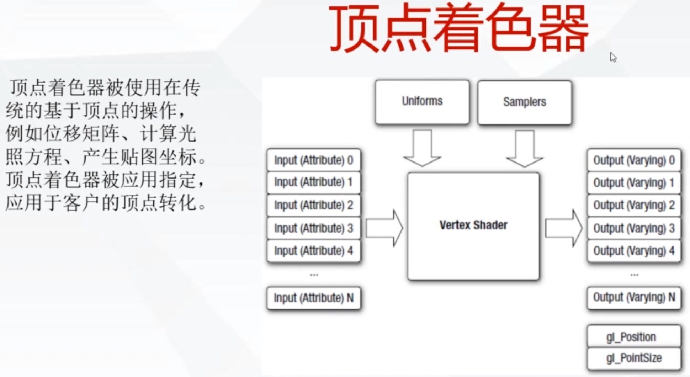

      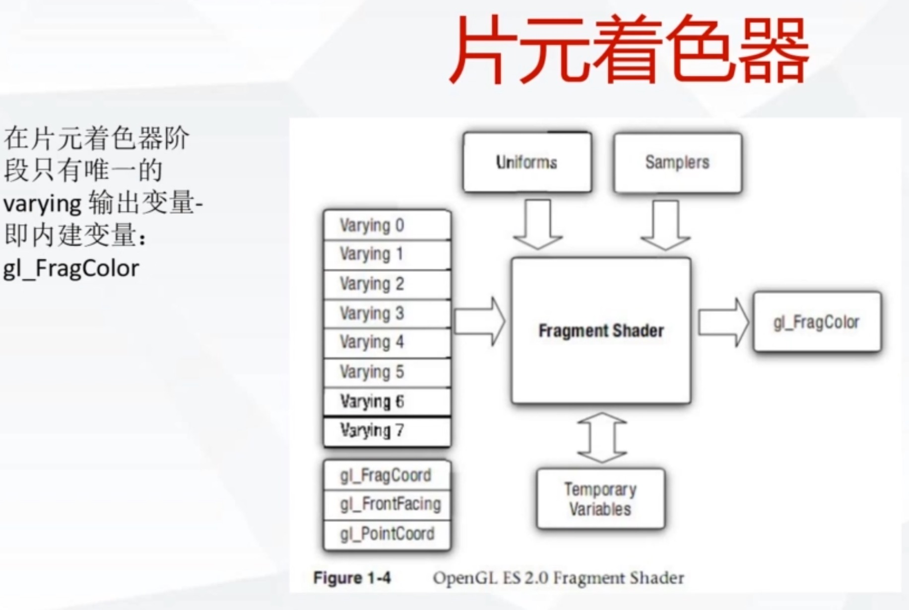

      只能画三角形 用来个三角形就可以拼成矩形

      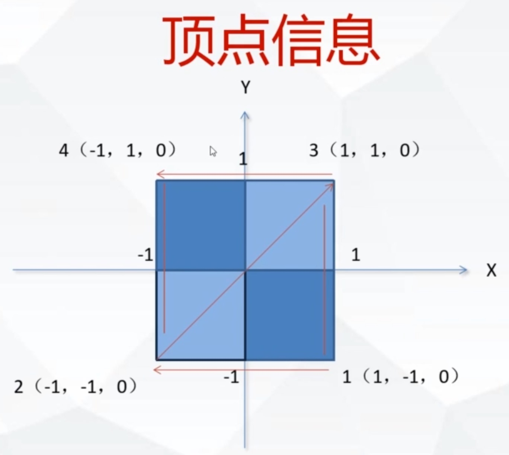

      float *vertexData = new float[12]{

      ​		1.01f, -1.0f, 0.0f, 

      ​		1.0f, -1.0f, 0.0f, 

      ​		1.01f, 1.0f, 0.0f, 

      ​		1.0f, -1.0f, 0.0f, 

      }

      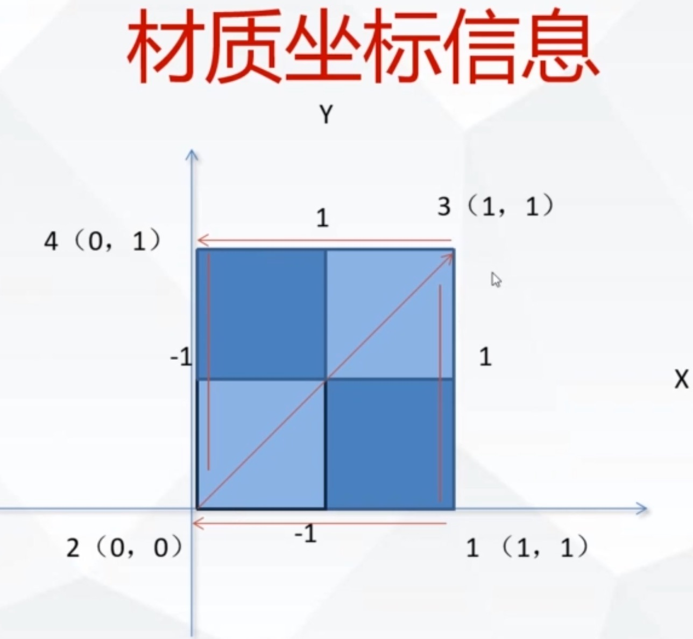

      float *textureVertexData = new float[8]{

      ​		1.0f, 0.0f, //右下

      ​		0.0f, 0.0f, //左下

      ​		1.0f, 1.0f, //右上

      ​		0.0f, -1.0f, //左上

      }

      传入顶点和材质坐标

      - gIVertextAttribPointer(ATTRIB_VERTEX定点坐标, 2 这个坐标有多大 有几个数,GL_FLOAT每个数是什么样的单位,0,是否有法线 没有3d所以不用到 , 0 ,vertexVertices)；//设置顶点坐标
      - glEnableVertexAttribArray(ATTRIB_VERTEX) //使得坐标生效
      - glVertextAttribPointer(ATTRIB_VERTEX,2,GL_FLOAT,0,0,textureVertices)//设置材质坐标
      - glEnableVertexAttribArray(ATTRIB_VERTEX) //使得坐标生效

      三种GLSL变量类型

      - varying   顶点与片元共享

      - attribute 顶点使用, 由bindAttritbuteLocation传入

      - uniform 程序传入uniformLocation获取地址

        glUniform1i(textureUniformY, 0); 设置

      顶点shader

      ​	attribute vec4 vertexIn;

      ​	attribute vec2 textureIn;

      ​	attribute vec2 textexIn;

      ​	void main(void){

      ​			gl_Position = vertexIn;

      ​			textureOut = textureIn;

      ​	}

      片元shader

      ​	varying vec2 textureOut;

      ​	uniform sampler2D tex_y;

      ​	uniform sampler2D tex_u;

      ​	uniform sampler2D tex_v;

      ​	void main(void){

      ​		vec3 yuv;

      ​		vec3 rgb;

      ​		yuv.x = texture2D(tex_y, textureOut).r;

      ​		yuv.y = texture2D(tex_u, textureOut).r - 0.5;

      ​		yuv.z = texture2D(tex_v, textureOut).r - 0.5;

      ​		rgb = mat3(1,1,1

      ​			0, -0.39465, 2.03211,

      ​			1.13983, -0.58060, 0

      ​		) * yuv;

      ​		gl_FragColor = vec3(Rob,1);

      ​	}

      创建材质

      ​	glGenTextures(1, t); //创建几个 指针地址

      ​	glBindTexture(GL_TEXTURE_2D, *t);//绑定位二维的图像

      ​	glTextParameteri(GL_TEXTURE_2D, GL_TEXTURE_MAG_FILTER,GL_LINEAR) 什么策略来缩放

      ​	glTextParameteri(GL_TEXTURE_2D, GL_TEXTURE_MIN_FILTER,GL_LINEAR)

      ​			GL_TEXTURE_2D//操作2D纹理

      ​			GL_TEXTURE_MAG_FILTER //缩小过滤

      ​			GL_TEXTURE_MAG_FILTER //放大过滤

      ​			GL_LINEAR: 线性过滤,使用距离当前渲染像素中心最近的4个纹路加权平均值

      写入和绘制材质

      ​	glActiveTexture(GL_TEXTURE0); 激活材质 材质编号

      ​	glBindTexture(GL_TEXTURE_2D,id_y); 绑定到我们创建好的材质上去

      ​	glTexImage2D(

      ​		GL_TEXTURE_2D,创建纹,0细节显示,GL_LUMINANCE gpu内部格式,pixel_w宽, pixel_h高,

      ​		GL_LUMINANCE 数据格式,GL_UNSIGNED_BYTE像素的数据类型,plane[0] 数据);  opengl显卡当中的材质 传到 内存中  显存到内存的过程 

      ​	glTextSubImage2D 修改纹理

      ​	glUniform1i(textureUniformY, 0); 设置完成后再与shader关联起来 0层是Y 1层是U

      ​	glDrawArrays(GL_TRIANGLE_STRIP,0,4) 绘制四个顶点

  - 材质Textture(如何写入ffmpeg数据)

## 代码部分

### 解封装部分代码

```c++
#include <QCoreApplication>
#include <QDebug>
#include <QString>

//引入c语言函数
extern "C"{
    #include <libavformat/avformat.h>
    #include <libavutil/avutil.h>
    #include <libavcodec/avcodec.h>
}

double r2d(AVRational r){
    return r.den == 0 ? (double)0 : (double)(r.num)/(double)(r.den);
}

int main(int argc, char *argv[])
{
    QCoreApplication a(argc, argv);

    const char * inputFile= "test.mp4";
    //av_register_all();
    avformat_network_init();


    AVFormatContext *inputContext;
    int ret = 0;
    //参数三为0表示自动选择解封器 参数
    ret = avformat_open_input(&inputContext, inputFile, NULL, NULL);
    if(ret != 0){
        char buf[1024] = {0};
        av_strerror(ret,buf, sizeof(buf)-1);
        qDebug()<<"open"<<inputFile<<"failed!"<<buf<<endl;
        return a.exec();
    }

    //获取流的信息
    ret = avformat_find_stream_info(inputContext, NULL);
    //总时长
    long long totalMs = inputContext->duration/(AV_TIME_BASE/1000);
    qDebug()<<"总的时长"<<totalMs<<endl;

    //打印视频流详细信息
    //参数四 是否是输出  0表示不是 1表示是
    av_dump_format(inputContext, 0, inputFile, 0);//用来调试

    int videoStreamIndex = 0;
    int audioStreamIndex = 1;

/*
    //获取音视频流信息(遍历获取)
    for(unsigned int i = 0; i < inputContext->nb_streams; ++i){
        AVStream *stream = inputContext->streams[i];
        //音频
        if(stream->codecpar->codec_type == AVMEDIA_TYPE_AUDIO){
            audioStreamIndex = (int)i;
            qDebug()<<i<<"音频信息"<< endl;
            qDebug()<<"样本率:"<<stream->codecpar->sample_rate<<endl;
            //AVSampleFormat
            qDebug()<<"音频样本格式(大小):"<<stream->codecpar->format<<endl;
            qDebug()<<"音频通道格式:"<<stream->codecpar->channels<<endl;
            qDebug()<<"音频编码格式:"<<stream->codecpar->codec_id<<endl;
            qDebug()<<"音频的帧率(fps):"<<r2d(stream->avg_frame_rate)<<endl;
            //对于音频一帧的数据是多少呢? 一帧单通道的样本数
            qDebug()<<"音频一帧的单通道的样本数是:"<<stream->codecpar->frame_size<<endl;
            //一帧数据 1024(一帧的单通道的样本数) * 2(通道数) * 2(样本格式 16位2个字节) = 4096
            //fps = sample_rate(44100)/frame_size(1024) = 43.6(大约)
        }

        //视频
        if(stream->codecpar->codec_type == AVMEDIA_TYPE_VIDEO){
            videoStreamIndex = (int)i;
            qDebug()<<i<<"视频信息"<< endl;
            qDebug()<<"宽度:"<<stream->codecpar->width<<endl;
            qDebug()<<"高度:"<<stream->codecpar->height<<endl;
            qDebug()<<"视频像素格式(大小):"<<stream->codecpar->format<<endl;
            qDebug()<<"视频编码格式:"<<stream->codecpar->codec_id<<endl;
            //视频的帧率(fps)分数转换
            qDebug()<<"视频的帧率(fps):"<<r2d(stream->avg_frame_rate)<<endl;
            //对于视频一帧就是一副图片
            qDebug()<<"视频一帧的数据是:"<<stream->codecpar->frame_size<<endl;
        }

        //字幕

    }
*/

    //获取音视频流信息(函数获取)
    videoStreamIndex = av_find_best_stream(inputContext, AVMEDIA_TYPE_VIDEO, -1, -1, NULL, 0);
    audioStreamIndex = av_find_best_stream(inputContext, AVMEDIA_TYPE_AUDIO, -1, -1, NULL, 0);

    //下面的操作是针对一帧的操作
    AVPacket *pkt = av_packet_alloc();
    for(;;){
        ret = av_read_frame(inputContext, pkt); //这个地方成功会把pkt结构体的内部成员的申请内存块并初始化

        AVRational timebase = inputContext->streams[pkt->stream_index]->time_base;

        if(ret != 0){
            //循环播放
            qDebug()<<"============end============"<<endl;
            int ms = 3000; //3秒 根据时间基数(分数)转换
            long long pos = (double)ms / (double) (1000 * r2d(timebase));
            av_seek_frame(inputContext, videoStreamIndex, pos, AVSEEK_FLAG_BACKWARD|AVSEEK_FLAG_FRAME);
            //break;
            continue;
        }

        if(pkt->stream_index == videoStreamIndex){
            qDebug()<<"一帧 图像 本次读取包的大小:"<<pkt->size
                   <<"pts显示的时间:"<<pkt->pts * (r2d(timebase)*1000)<<"毫秒"
                   <<"dts解码的时间:"<<pkt->dts * (r2d(timebase)*1000)<<"毫秒"
                   <<endl;
        }

        if(pkt->stream_index == audioStreamIndex){
            qDebug()<<"一帧 声音 本次读取包的大小:"<<pkt->size
                    <<"pts显示的时间:"<<pkt->pts * (r2d(timebase)*1000)<<"毫秒"
                    <<"dts解码的时间:"<<pkt->dts * (r2d(timebase)*1000)<<"毫秒"
                    <<endl;
        }
        //释放，引用计数-1 为0释放空间
        av_packet_unref(pkt);
    }

    av_packet_free(&pkt);

    if(inputContext){
        avformat_close_input(&inputContext);
    }

    return a.exec();
}
```

### 解码

```c++
#include <QCoreApplication>
#include <QDebug>
#include <QString>

//引入c语言函数
extern "C"{
    #include <libavformat/avformat.h>
    #include <libavutil/avutil.h>
    #include <libavcodec/avcodec.h>
}

double r2d(AVRational r){
    return r.den == 0 ? (double)0 : (double)(r.num)/(double)(r.den);
}


int main(int argc, char *argv[])
{
    QCoreApplication a(argc, argv);

    const char * inputFile= "test.mp4";
    //av_register_all();
    //avformat_network_init();
    //注册解码器
    //avcodec_register_all();


    AVFormatContext *inputContext;
    int ret = 0;
    //参数三为0表示自动选择解封器 参数
    ret = avformat_open_input(&inputContext, inputFile, NULL, NULL);
    if(ret != 0){
        char buf[1024] = {0};
        av_strerror(ret,buf, sizeof(buf)-1);
        qDebug()<<"open"<<inputFile<<"failed!"<<buf<<endl;
        return a.exec();
    }

    //获取流的信息
    ret = avformat_find_stream_info(inputContext, NULL);
    //总时长
    long long totalMs = inputContext->duration/(AV_TIME_BASE/1000);
    qDebug()<<"总的时长"<<totalMs<<endl;

    //打印视频流详细信息
    //参数四 是否是输出  0表示不是 1表示是
    av_dump_format(inputContext, 0, inputFile, 0);//用来调试

    int videoStreamIndex = 0;
    int audioStreamIndex;

/*
    //获取音视频流信息(遍历获取)
    for(unsigned int i = 0; i < inputContext->nb_streams; ++i){
        AVStream *stream = inputContext->streams[i];
        //音频
        if(stream->codecpar->codec_type == AVMEDIA_TYPE_AUDIO){
            audioStreamIndex = (int)i;
            qDebug()<<i<<"音频信息"<< endl;
            qDebug()<<"样本率:"<<stream->codecpar->sample_rate<<endl;
            //AVSampleFormat
            qDebug()<<"音频样本格式(大小):"<<stream->codecpar->format<<endl;
            qDebug()<<"音频通道格式:"<<stream->codecpar->channels<<endl;
            qDebug()<<"音频编码格式:"<<stream->codecpar->codec_id<<endl;
            qDebug()<<"音频的帧率(fps):"<<r2d(stream->avg_frame_rate)<<endl;
            //对于音频一帧的数据是多少呢? 一帧单通道的样本数
            qDebug()<<"音频一帧的单通道的样本数是:"<<stream->codecpar->frame_size<<endl;
            //一帧数据 1024(一帧的单通道的样本数) * 2(通道数) * 2(样本格式 16位2个字节) = 4096
            //fps = sample_rate(44100)/frame_size(1024) = 43.6(大约)
        }

        //视频
        if(stream->codecpar->codec_type == AVMEDIA_TYPE_VIDEO){
            videoStreamIndex = (int)i;
            qDebug()<<i<<"视频信息"<< endl;
            qDebug()<<"宽度:"<<stream->codecpar->width<<endl;
            qDebug()<<"高度:"<<stream->codecpar->height<<endl;
            qDebug()<<"视频像素格式(大小):"<<stream->codecpar->format<<endl;
            qDebug()<<"视频编码格式:"<<stream->codecpar->codec_id<<endl;
            //视频的帧率(fps)分数转换
            qDebug()<<"视频的帧率(fps):"<<r2d(stream->avg_frame_rate)<<endl;
            //对于视频一帧就是一副图片
            qDebug()<<"视频一帧的数据是:"<<stream->codecpar->frame_size<<endl;
        }

        //字幕

    }
*/

    //获取音视频流信息(函数获取)
    videoStreamIndex = av_find_best_stream(inputContext, AVMEDIA_TYPE_VIDEO, -1, -1, NULL, 0);
    audioStreamIndex = av_find_best_stream(inputContext, AVMEDIA_TYPE_AUDIO, -1, -1, NULL, 0);

    //找到视频解码器
    AVCodec *videoCodec = avcodec_find_decoder(inputContext->streams[videoStreamIndex]->codecpar->codec_id);
    if(!videoCodec){
        qDebug()<<"没有找到视频解码器 "<<inputContext->streams[videoStreamIndex]->codecpar->codec_id<<endl;
        return a.exec();
    }

    qDebug()<<"找到视频解码器 "<<inputContext->streams[videoStreamIndex]->codecpar->codec_id<<endl;

    //创建解码器上下文
    AVCodecContext *videoCodecContext = avcodec_alloc_context3(videoCodec);
    //配置解码器上下文参数 直接复制
    avcodec_parameters_to_context(videoCodecContext, inputContext->streams[videoStreamIndex]->codecpar);
    //8个线程解码
    //videoCodecContext->thread_count = 4;
    //打开解码器上下文
    ret = avcodec_open2(videoCodecContext, NULL, NULL);
    if(ret != 0){
        char buf1[1024] = {0};
        av_strerror(ret,buf1, sizeof(buf1)-1);
        qDebug()<<"打开解码器上下文失败："<<buf1<<endl;
        return a.exec();
    }
    qDebug()<<"打开视频解码器上下成功"<<endl;


    //找到音频解码器
    AVCodec *audioCodec = avcodec_find_decoder(inputContext->streams[audioStreamIndex]->codecpar->codec_id);
    if(!audioCodec){
        qDebug()<<"没有找到音频解码器 "<<inputContext->streams[audioStreamIndex]->codecpar->codec_id<<endl;
        return a.exec();
    }
    qDebug()<<"找到音频解码器 "<<inputContext->streams[audioStreamIndex]->codecpar->codec_id<<endl;
    //创建解码器上下文
    AVCodecContext *audioCodecContext = avcodec_alloc_context3(audioCodec);
    //配置解码器上下文参数 直接复制
    avcodec_parameters_to_context(audioCodecContext, inputContext->streams[audioStreamIndex]->codecpar);
//    //8个线程解码
    audioCodecContext->thread_count = 4;
//    //打开解码器上下文
    ret = avcodec_open2(audioCodecContext, NULL, NULL);
//    if(ret != 0){
//        char buf2[1024] = {0};
//        av_strerror(ret,buf2, sizeof(buf2)-1);
//        qDebug()<<"打开音频解码器上下文失败："<<buf2<<endl;
//        return a.exec();
//    }
    qDebug()<<"打开音频解码器上下成功"<<endl;


    //下面的操作是针对一帧的操作
    AVPacket *pkt = av_packet_alloc();
    AVFrame *frame = av_frame_alloc();
    for(;;){
        ret = av_read_frame(inputContext, pkt); //这个地方成功会把pkt结构体的内部成员的申请内存块并初始化

        AVRational timebase = inputContext->streams[pkt->stream_index]->time_base;

        if(ret != 0){
            //循环播放
            //qDebug()<<"============end============"<<endl;
            //int ms = 3000; //3秒 根据时间基数(分数)转换
            //long long pos = (double)ms / (double) (1000 * r2d(timebase));
            //av_seek_frame(inputContext, videoStreamIndex, pos, AVSEEK_FLAG_BACKWARD|AVSEEK_FLAG_FRAME);
            break;
            //continue;
        }


        AVCodecContext *cc = NULL;
        if(pkt->stream_index == videoStreamIndex){
            cc = videoCodecContext;
            qDebug()<<"一帧 图像 本次读取包的大小:"<<pkt->size
                   <<"pts显示的时间:"<<pkt->pts * (r2d(timebase)*1000)<<"毫秒"
                   <<"dts解码的时间:"<<pkt->dts * (r2d(timebase)*1000)<<"毫秒"
                   <<endl;
        }

        if(pkt->stream_index == audioStreamIndex){
            //cc = audioCodecContext;
            qDebug()<<"一帧 声音 本次读取包的大小:"<<pkt->size
                    <<"pts显示的时间:"<<pkt->pts * (r2d(timebase)*1000)<<"毫秒"
                    <<"dts解码的时间:"<<pkt->dts * (r2d(timebase)*1000)<<"毫秒"
                    <<endl;
        }

        //解码视频
        //发送packet包到我们的解码线程 不占用cpu 这个是交给线程 send传NULL后调用多次receive取出所有缓冲帧
        ret = avcodec_send_packet(cc, pkt);

        //释放，引用计数-1 为0释放空间
        av_packet_unref(pkt);

//        if(ret != 0){
//            char buf3[1024] = {0};
//            av_strerror(ret,buf3, sizeof(buf3)-1);
//            qDebug()<<"发送packet包到我们的解码线程失败："<<buf3<<endl;
//            continue;
//        }

        for(;;){
            //不占用cpu 从线程获取解码接口 一次send可能对应多次receive
            ret = avcodec_receive_frame(cc, frame);
            if(ret != 0)
                break;
            qDebug()<<"receive frame" <<frame->format<<" "<<frame->linesize[0]<<endl;
        }
    }

    av_frame_free(&frame);
    av_packet_free(&pkt);

    if(inputContext){
        avformat_close_input(&inputContext);
    }

    return a.exec();
}
```

### 音视频的转化

```c++
#include <QCoreApplication>
#include <QDebug>
#include <QString>

//引入c语言函数
extern "C"{
    #include <libavformat/avformat.h>
    #include <libavutil/avutil.h>
    #include <libavcodec/avcodec.h>
    #include <libswscale/swscale.h>
    #include <libswresample/swresample.h>
}

double r2d(AVRational r){
    return r.den == 0 ? (double)0 : (double)(r.num)/(double)(r.den);
}


int main(int argc, char *argv[])
{
    QCoreApplication a(argc, argv);

    const char * inputFile= "test.mp4";
    //av_register_all();
    //avformat_network_init();
    //注册解码器
    //avcodec_register_all();


    AVFormatContext *inputContext;
    int ret = 0;
    //参数三为0表示自动选择解封器 参数
    ret = avformat_open_input(&inputContext, inputFile, NULL, NULL);
    if(ret != 0){
        char buf[1024] = {0};
        av_strerror(ret,buf, sizeof(buf)-1);
        qDebug()<<"open"<<inputFile<<"failed!"<<buf<<endl;
        return a.exec();
    }

    //获取流的信息
    ret = avformat_find_stream_info(inputContext, NULL);
    //总时长
    long long totalMs = inputContext->duration/(AV_TIME_BASE/1000);
    qDebug()<<"总的时长"<<totalMs<<endl;

    //打印视频流详细信息
    //参数四 是否是输出  0表示不是 1表示是
    av_dump_format(inputContext, 0, inputFile, 0);//用来调试

    int videoStreamIndex = 0;
    int audioStreamIndex;

/*
    //获取音视频流信息(遍历获取)
    for(unsigned int i = 0; i < inputContext->nb_streams; ++i){
        AVStream *stream = inputContext->streams[i];
        //音频
        if(stream->codecpar->codec_type == AVMEDIA_TYPE_AUDIO){
            audioStreamIndex = (int)i;
            qDebug()<<i<<"音频信息"<< endl;
            qDebug()<<"样本率:"<<stream->codecpar->sample_rate<<endl;
            //AVSampleFormat
            qDebug()<<"音频样本格式(大小):"<<stream->codecpar->format<<endl;
            qDebug()<<"音频通道格式:"<<stream->codecpar->channels<<endl;
            qDebug()<<"音频编码格式:"<<stream->codecpar->codec_id<<endl;
            qDebug()<<"音频的帧率(fps):"<<r2d(stream->avg_frame_rate)<<endl;
            //对于音频一帧的数据是多少呢? 一帧单通道的样本数
            qDebug()<<"音频一帧的单通道的样本数是:"<<stream->codecpar->frame_size<<endl;
            //一帧数据 1024(一帧的单通道的样本数) * 2(通道数) * 2(样本格式 16位2个字节) = 4096
            //fps = sample_rate(44100)/frame_size(1024) = 43.6(大约)
        }

        //视频
        if(stream->codecpar->codec_type == AVMEDIA_TYPE_VIDEO){
            videoStreamIndex = (int)i;
            qDebug()<<i<<"视频信息"<< endl;
            qDebug()<<"宽度:"<<stream->codecpar->width<<endl;
            qDebug()<<"高度:"<<stream->codecpar->height<<endl;
            qDebug()<<"视频像素格式(大小):"<<stream->codecpar->format<<endl;
            qDebug()<<"视频编码格式:"<<stream->codecpar->codec_id<<endl;
            //视频的帧率(fps)分数转换
            qDebug()<<"视频的帧率(fps):"<<r2d(stream->avg_frame_rate)<<endl;
            //对于视频一帧就是一副图片
            qDebug()<<"视频一帧的数据是:"<<stream->codecpar->frame_size<<endl;
        }

        //字幕

    }
*/

    //获取音视频流信息(函数获取)
    videoStreamIndex = av_find_best_stream(inputContext, AVMEDIA_TYPE_VIDEO, -1, -1, NULL, 0);
    audioStreamIndex = av_find_best_stream(inputContext, AVMEDIA_TYPE_AUDIO, -1, -1, NULL, 0);

    //找到视频解码器
    AVCodec *videoCodec = avcodec_find_decoder(inputContext->streams[videoStreamIndex]->codecpar->codec_id);
    if(!videoCodec){
        qDebug()<<"没有找到视频解码器 "<<inputContext->streams[videoStreamIndex]->codecpar->codec_id<<endl;
        return a.exec();
    }

    qDebug()<<"找到视频解码器 "<<inputContext->streams[videoStreamIndex]->codecpar->codec_id<<endl;

    //创建解码器上下文
    AVCodecContext *videoCodecContext = avcodec_alloc_context3(videoCodec);
    //配置解码器上下文参数 直接复制
    avcodec_parameters_to_context(videoCodecContext, inputContext->streams[videoStreamIndex]->codecpar);
    //8个线程解码
    //videoCodecContext->thread_count = 4;
    //打开解码器上下文
    ret = avcodec_open2(videoCodecContext, NULL, NULL);
    if(ret != 0){
        char buf1[1024] = {0};
        av_strerror(ret,buf1, sizeof(buf1)-1);
        qDebug()<<"打开解码器上下文失败："<<buf1<<endl;
        return a.exec();
    }
    qDebug()<<"打开视频解码器上下成功"<<endl;


    //找到音频解码器
    AVCodec *audioCodec = avcodec_find_decoder(inputContext->streams[audioStreamIndex]->codecpar->codec_id);
    if(!audioCodec){
        qDebug()<<"没有找到音频解码器 "<<inputContext->streams[audioStreamIndex]->codecpar->codec_id<<endl;
        return a.exec();
    }
    qDebug()<<"找到音频解码器 "<<inputContext->streams[audioStreamIndex]->codecpar->codec_id<<endl;
    //创建解码器上下文
    AVCodecContext *audioCodecContext = avcodec_alloc_context3(audioCodec);
    //配置解码器上下文参数 直接复制
    avcodec_parameters_to_context(audioCodecContext, inputContext->streams[audioStreamIndex]->codecpar);
//    //8个线程解码
    audioCodecContext->thread_count = 4;
//    //打开解码器上下文
    ret = avcodec_open2(audioCodecContext, NULL, NULL);
//    if(ret != 0){
//        char buf2[1024] = {0};
//        av_strerror(ret,buf2, sizeof(buf2)-1);
//        qDebug()<<"打开音频解码器上下文失败："<<buf2<<endl;
//        return a.exec();
//    }
    qDebug()<<"打开音频解码器上下成功"<<endl;


    //下面的操作是针对一帧的操作
    AVPacket *pkt = av_packet_alloc();
    AVFrame *frame = av_frame_alloc();

    //像素格式和尺寸转化的上下文
    SwsContext *videoSwsContext = NULL;
    //输出的rgb
    unsigned char *outRgb = NULL;

    //音频重采样
    SwrContext *audioSwrContext = swr_alloc();
    audioSwrContext = swr_alloc_set_opts(audioSwrContext,
                                         av_get_default_channel_layout(2),//输出音频的声道格式布局
                                         AV_SAMPLE_FMT_S16, //输出音频的样本格式
                                         audioCodecContext->sample_rate, //输出采样率 1s的采样
                                         av_get_default_channel_layout(audioCodecContext->channels),//输入格式
                                         audioCodecContext->sample_fmt, //输入的样本格式
                                         audioCodecContext->sample_rate, //输入的采样率
                                         0, NULL //日志 用不到
                                         );
    ret = swr_init(audioSwrContext);
    //输出的pcm
    unsigned char *pcm = NULL;

    for(;;){
        ret = av_read_frame(inputContext, pkt); //这个地方成功会把pkt结构体的内部成员的申请内存块并初始化

        AVRational timebase = inputContext->streams[pkt->stream_index]->time_base;

        if(ret != 0){
            //循环播放
            //qDebug()<<"============end============"<<endl;
            //int ms = 3000; //3秒 根据时间基数(分数)转换
            //long long pos = (double)ms / (double) (1000 * r2d(timebase));
            //av_seek_frame(inputContext, videoStreamIndex, pos, AVSEEK_FLAG_BACKWARD|AVSEEK_FLAG_FRAME);
            break;
            //continue;
        }


        AVCodecContext *cc = NULL;
        if(pkt->stream_index == videoStreamIndex){
            cc = videoCodecContext;
            qDebug()<<"一帧 图像 本次读取包的大小:"<<pkt->size
                   <<"pts显示的时间:"<<pkt->pts * (r2d(timebase)*1000)<<"毫秒"
                   <<"dts解码的时间:"<<pkt->dts * (r2d(timebase)*1000)<<"毫秒"
                   <<endl;
        }

        if(pkt->stream_index == audioStreamIndex){
            cc = audioCodecContext;
            qDebug()<<"一帧 声音 本次读取包的大小:"<<pkt->size
                    <<"pts显示的时间:"<<pkt->pts * (r2d(timebase)*1000)<<"毫秒"
                    <<"dts解码的时间:"<<pkt->dts * (r2d(timebase)*1000)<<"毫秒"
                    <<endl;
        }

        //解码视频
        //发送packet包到我们的解码线程 不占用cpu 这个是交给线程 send传NULL后调用多次receive取出所有缓冲帧
        ret = avcodec_send_packet(cc, pkt);

        //释放，引用计数-1 为0释放空间
        av_packet_unref(pkt);

//        if(ret != 0){
//            char buf3[1024] = {0};
//            av_strerror(ret,buf3, sizeof(buf3)-1);
//            qDebug()<<"发送packet包到我们的解码线程失败："<<buf3<<endl;
//            continue;
//        }

        for(;;){
            //不占用cpu 从线程获取解码接口 一次send可能对应多次receive
            ret = avcodec_receive_frame(cc, frame);
            if(ret != 0)
                break;
            qDebug()<<"receive frame" <<frame->format<<" "<<frame->linesize[0]<<endl;

            //如果是视频
            if(cc == videoCodecContext){
                videoSwsContext = sws_getCachedContext(
                                videoSwsContext, //传NULL会新创建
                                frame->width, frame->height, (AVPixelFormat)frame->format, //输入的宽 高 格式 比如YUV420
                                frame->width, frame->height, AV_PIX_FMT_RGBA, //输出的宽 高 格式 比如RGBA
                                SWS_BILINEAR, //尺寸变化的算法 每种算法效率不一样 临近差值的算法
                                0,0,0 //没有过滤
                            );
                if(videoSwsContext){
                    qDebug()<<"像素格式尺寸上下文创建获取成功"<<endl;
                }else{
                    qDebug()<<"像素格式尺寸上下文创建获取失败"<<endl;
                }

                //转换
                if(videoSwsContext){
                    if(!outRgb){
                        outRgb = new unsigned char[frame->width*frame->height*4];
                    }
                    uint8_t *data[2] = {0};
                    data[0] = outRgb;
                    int lines[2] = {0};
                    lines[0] = frame->width*4;
                    ret = sws_scale(videoSwsContext,
                              frame->data, frame->linesize, 0, frame->height,//输入数据 输入行大小 切片的开始位置0 输入高度
                               data, lines);
                    qDebug()<<"转化的高度"<<ret<<endl;
                }
            }

            //如果是音频
            if(cc == audioCodecContext){
                uint8_t *data[2] = {0};
                if(!pcm) pcm = new uint8_t[frame->nb_samples*2*2];
                data[0] = pcm;
                int len = swr_convert(audioSwrContext,
                            data, frame->nb_samples,  //输出
                            (const uint8_t **)frame->data, frame->nb_samples //输入
                            );

                qDebug()<<"转化后的样本数量: "<<len<<endl;
            }

        }
    }

    av_frame_free(&frame);
    av_packet_free(&pkt);

    if(inputContext){
        avformat_close_input(&inputContext);
    }

    return a.exec();
}
```

### QT音频类测试

```c++
#include <QCoreApplication>
#include <QAudioFormat>
#include <QAudioOutput>
#include <QThread>
#include <QFile>
#include <QIODevice>

//准备好pcm数据
//ffmpeg -i test.mp4 -f s16le out.pcm

int main(int argc, char *argv[])
{
    QCoreApplication a(argc, argv);
  
    QAudioFormat fmt;
    fmt.setSampleRate(44100);
    fmt.setSampleSize(16);
    fmt.setChannelCount(2);
    fmt.setCodec("audio/pcm");
    fmt.setByteOrder(QAudioFormat::LittleEndian);
    fmt.setSampleType(QAudioFormat::UnSignedInt);

    QAudioOutput *out = new QAudioOutput(fmt);
    QIODevice *io = out->start();//开始播放

    int size = out->periodSize();
    char *buf = new char[size];

    FILE *fp = fopen("out.pcm", "rb");
    rewind(fp);

    while (!feof(fp)) {
        if(out->bytesFree() < size){
            QThread::sleep(1);
            continue;
        }

        int len = fread(buf, 1, size, fp);
        if(len <= 0){
            break;
        }

        io->write(buf, len);
    }

    fclose(fp);
    delete[] buf;
    buf = 0;

    return a.exec();
}
```


# 第三部分 基于ffmpeg直播

## 推流流程

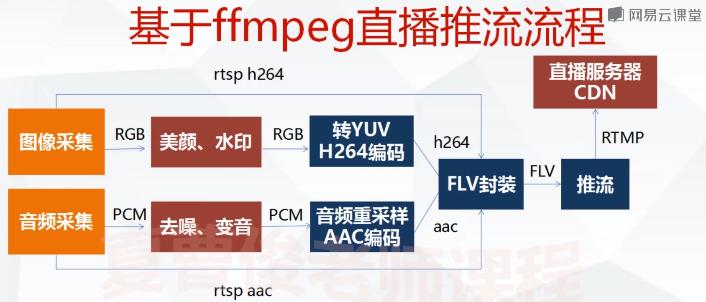

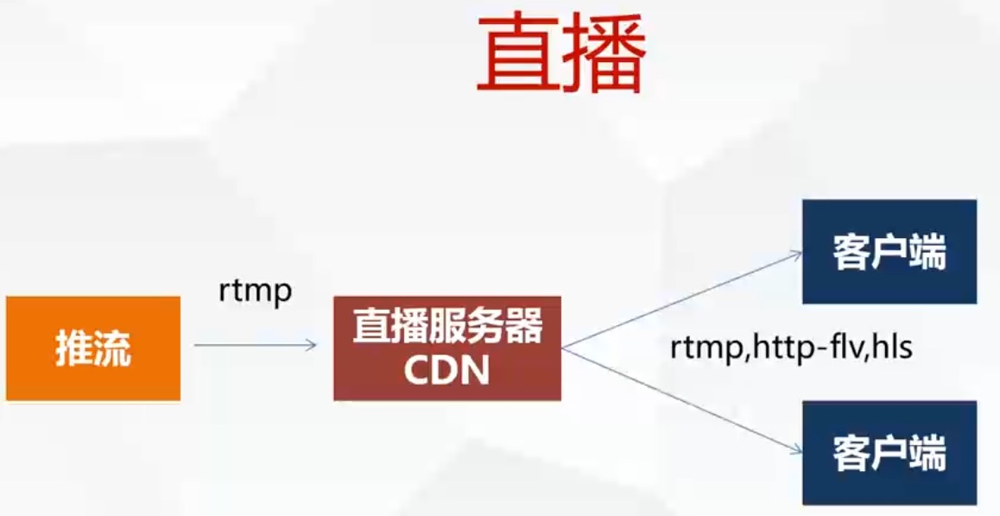

协议: rtmp(长链接)，http-flv(adobe)实时性比较高(长链接)  苹果的hls(短链接)

​	推流基本上用rtmp来做 默认端口为1935

​	拉流播放的时候使用 http-flv来做

​	电视实时性要求不高的用hls

服务器：nginx-rtmp   crtmpserver

直播播放器： vls  ffplay 网页端基于flash的播放器插件(adobe)

采集设备：电脑自带的摄像机 usb摄像机 嵌入式的摄像机设备这种设备采集的数据是rgb原始数据 要进行转换

## 直播服务器配置

流媒体服务器：

​	第三方大厂： 七牛  腾讯  网易

​    局域网： red5(java) 和FMS商用

​	crtmpserver(开源)

​	nginx+rtmp插件(开源)

```shell
docker run -ti  --name=zler-crtmpserver -p 1935:1935 -p 80:80 -p 8080:8080 -p 443:443 -d ubuntu:16.04 /bin/bash
```

安装crtmpserver

```shell
apt-get -y update
apt-get install -y cmake --fix-missing
apt-get install -y libssl-dev
apt-get install -y wget
apt-get install -y unzip
apt-get install -y build-essential
wget https://codeload.github.com/j0sh/crtmpserver/zip/centosinit
unzip centosinit
cd crtmpserver-centosinit/builders/cmake
cmake .
make
./crtmpserver/crtmpserver ./crtmpserver/crtmpserver.lua
```

ffmpeg -re -i laliu.flv -c copy -f flv rtmp://172.16.150.7/live/test1


安装nginx和rtmp模块

```shell
# 前提是安装gcc g++ libssl-dev
wget http://nginx.org/download/nginx-1.12.1.tar.gz
tar -zxvf nginx-1.12.1.tar.gz 
apt-get install libpcre3-dev
apt-get install zlib1g-dev
git clone https://github.com/arut/nginx-rtmp-module.git
./configure --add-module=/root/nginx-rtmp-module-master ##看看有没有库没安装
make
make install
#默认是安装在/usr/local/nginx
cd /usr/local/nginx/conf
vim nginx.conf 添加如下配置：
		# 和http同级别
    rtmp 
    {
      server
      {
        listen 1935;
        chunk_size 4096;
        application live
        {
          live on;	
        }	
      }
    }
    #在http下server同级别
        server {
          listen 8080;
          location /stat {
            rtmp_stat all;
            rtmp_stat_stylesheet stat.xsl;
          }
          location /stat.xsl {
            root /root/nginx-rtmp-module-master/stat.xsl;
          }
        }
cd /usr/local/nginx
./sbin/nginx -tc ./conf/nginx.conf
./sbin/nginx 
```

ffmpeg -re -i laliu.flv -c copy -f flv rtmp://172.16.150.7/live

vlc 播放器 配置 rtmp://172.16.150.7/live

使用ffplay播放

ffplay rtmp://172.16.150.7/live --fflags nobuffer

## web播放器

## 海康大华相机

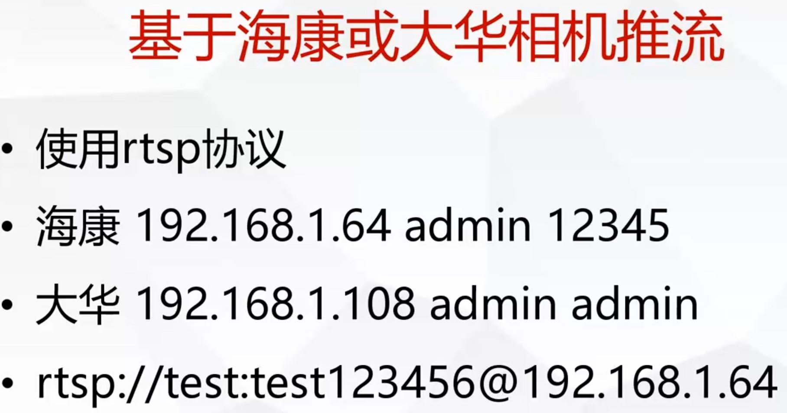


## Opencv安装编译

- ffmpeg.club网站 下载 mac 使用 brew安装

  ```shell
  #安装cmake
  brew install cmake
  #安装opencv 当前的版本是3.4.1
  brew install opencv
  #如果需要安装2.X通过这个命令
  brew install opencv@2
  #查看已经安装的软件。确保opencv已经安装成功
  brew lis
  ```

- 显示图片

  ```c
  //刷新图像频率单位为ms
  //返回值为当前键盘按键值
  //如果传值只要一有按键就返回
  //超时返回-1
  //实际项目控制速度不要直接用sleep
  waitKey()
  export PATH=$PATH:/usr/local/opt/opencv@2/bin
export PKG_CONFIG_PATH=$PKG_CONFIG_PATH:/usr/local/opt/opencv@2/lib/pkgconfig/
  export PKG_CONFIG_PATH=$PKG_CONFIG_PATH:/usr/local/opt/openblas/lib/pkgconfig/
  zler@192 ~ % cd /usr/local/opt/opencv@2/lib/pkgconfig/
  ```
  
  