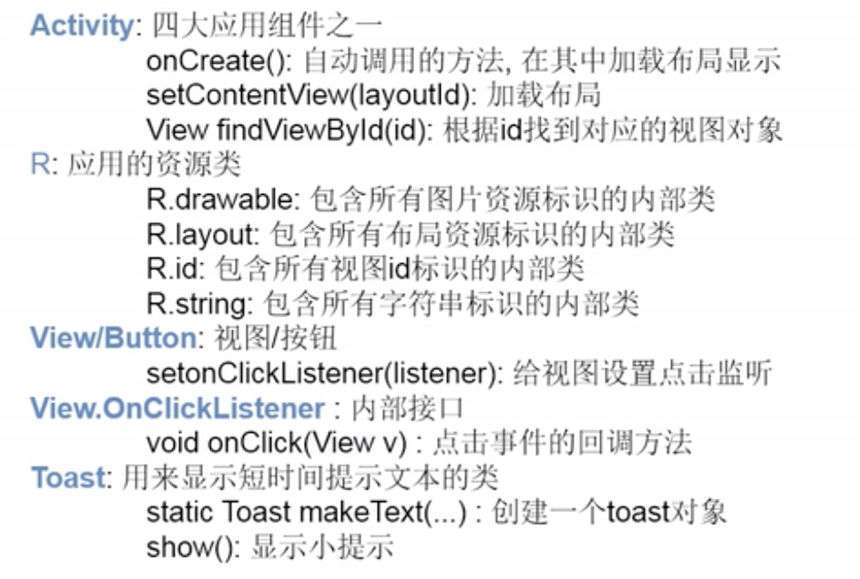
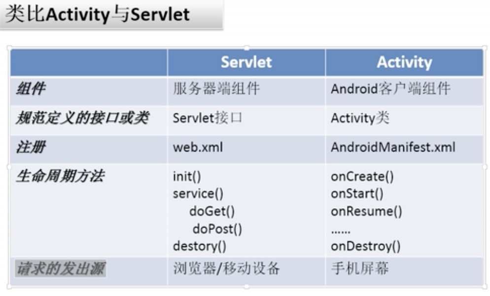
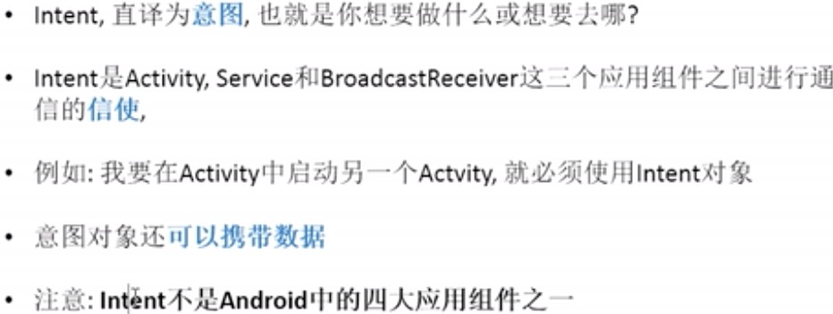
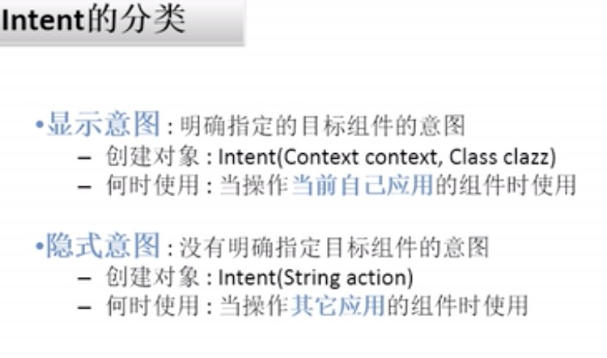
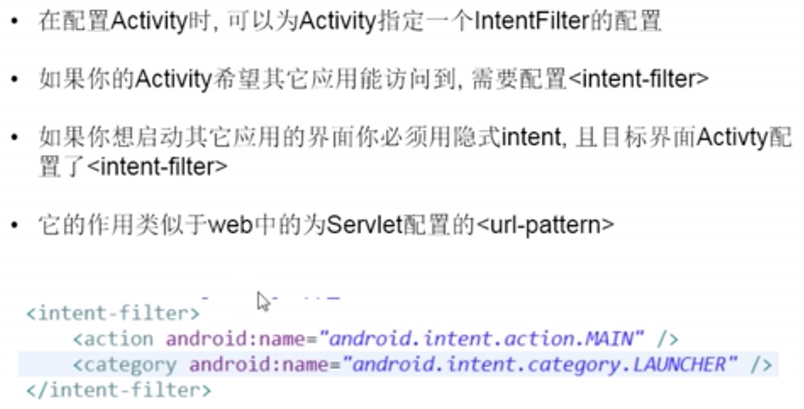
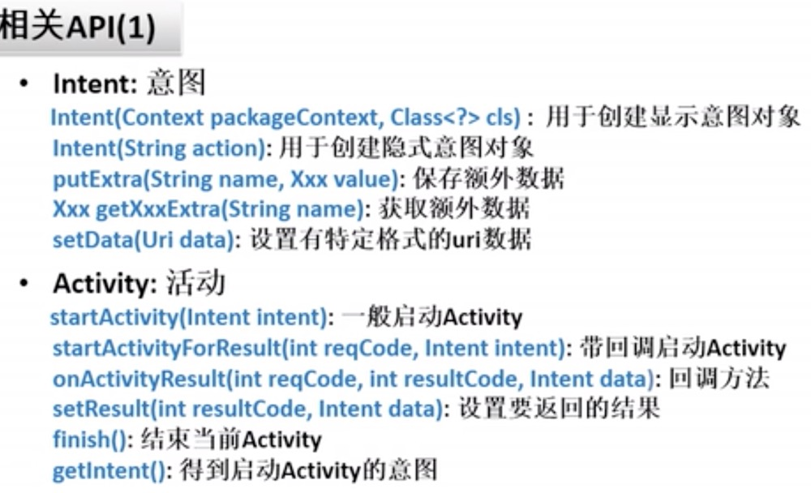
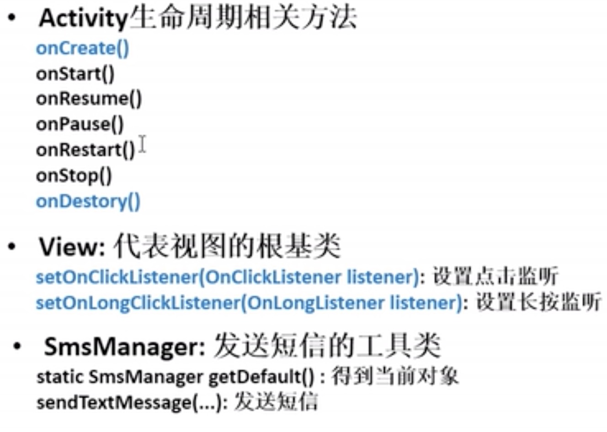
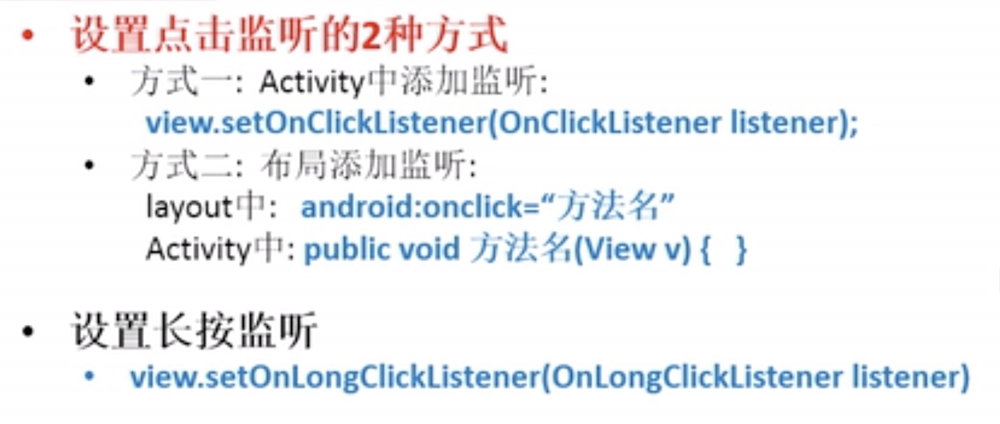
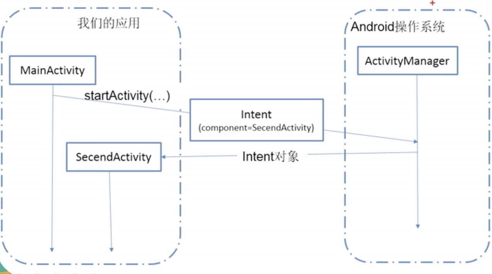
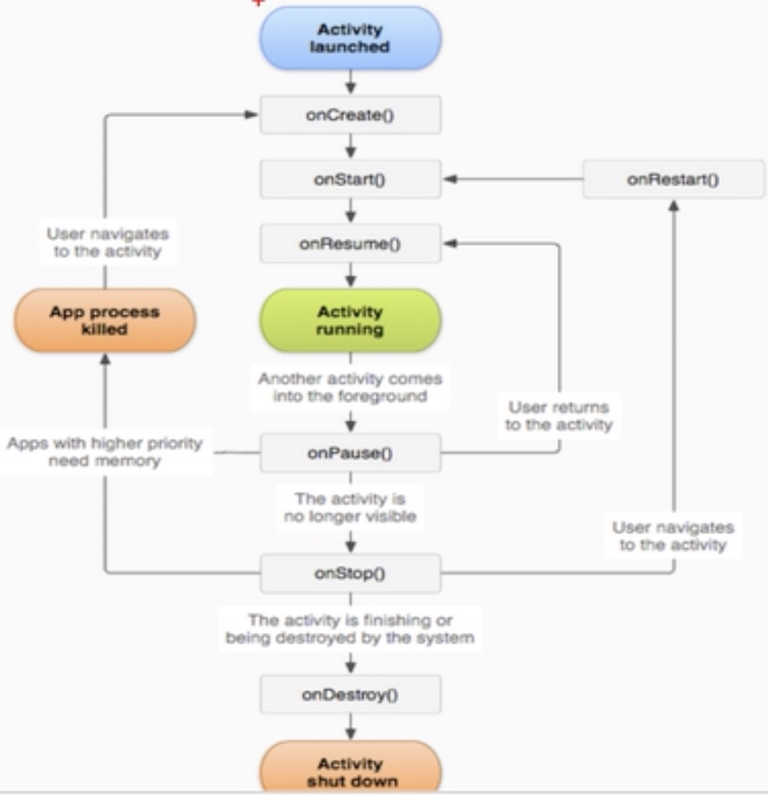

# 学习地址

https://www.bilibili.com/video/BV12J411876t?from=search&seid=3437281578862326829

​	P65

# 介绍android

- android基础相关知识

  - android是什么?
    - android是一种机遇linux的开源的操作系统
    - 主要用于智能设备，如智能手机、平板
    - android与iOS区别 一个是开源 一个闭源

- android系统架构

  - linux内核层 包含了很多驱动

    - 显示驱动 蓝牙驱动 相机驱动 闪存驱动 进程间通信 usb驱动 键盘驱动 wifi驱动 音频驱动 电源驱动

  - 类库层和安卓运行时

    - 类库层

      - c和c++语言写的
      - surface manager 显示管理器
      - media framework多媒体框架
      - Sqlite 数据库
      - OpenGL|ES 3d图库
      - FreeType 字体
      - WebKit 浏览器内核
      - SGL
      - SSL 安全通信协议
      - libc c语言核心库

    - 安卓运行时

      - core libraries 核心jar包

      - dvm 安卓的jvm虚拟机

        - dvm基于寄存器，编译和运行都会更快

        - jam基于内存中的栈 编译和运行都会慢些

        - dvm:执行.dev格式的字节码 是对.class文件进行压缩产生的
        -  jvm执行.class字节码
        - dvm：一个应用启动一个虚拟机
        - jvm:  一个设备就开启一个虚拟机

  - 应用框架层

    - java语言写的
    - activity manager 界面 
    - window manager 窗口   相当于js的window
    - content providers 内容提供者
    - view system 相当于js的标签div
    - notification manager 通知栏
    - package manager  apk包管理
    - telephony manager 电话管理器
    - resource manager 资源管理 图标 图片
    - location manager 定位管理器
    - xmpp service 即使通讯协议

  - 应用层

    - home 主页
    - contacts 联系人
    - phone 电话
    - browser 浏览器 
    - 日历等等

# 三个开发调试工具

- adb
- dams
- log
- ads
- adms
- view 打开 Logcat ， Device File Explode
- 

# 尺寸单位

- 在布局文件视图的宽高尽量用match_parent/wrap_content
- 如果必须指定特定值,使用dp/dip做单位
- 文本大小使用sp做单位

# Activity

- 提供一个能让用户操作并与之交互的界面 相当于html 

- 一个应用有多个界面

- 

- intent

  

  

- intentFilter

  

- api

  

  

  

- 启动Activity的流程图

  

- Activity生命周期 四种状态

  - 运行状态：可见也可操作

  - 暂停状态：可见但不可操作

    - 比如弹出一个对话框 下面被遮照的界面就是暂停状态

  - 停止状态：不可见，但对象存在

    - A界面打开了另外B界面 此时A界面是存在的 只不过不可见
    - 还比如按了home键

  - 死亡状态：对象不存在

    - 比如退出 返回键 已经finish调了

  - Activity生命周期 回调方法

    - 

    - 测试

      - 界面从“死亡”-->"运行"

        创建对象 MainActivity()->onCreate()->onStart()->onResume()

      - 界面从“运行”-->"死亡"

        onPause()->onStop()->onDestroy()

      - 界面从“运行”-->"停止"

        onPause()->onStop()

      - 界面从“停止”-->"运行"

        onRestart()->onStart()->onResume()

      - 界面从“运行”-->"暂停"

         onPause()

      - 界面从“暂停”-->"运行"

        onResume()
      
    - Activity Task Stack(Back Stack) 栈的结构存储
    
      只有最上面的任务栈的栈顶的Activity才能显示在窗口中
    
    - launchMode
    
      - standard
        - 每次调用startActivity()方法就会产生一个新的实例
      - singleTop
        - 如果已经有一个实例位于Activity栈的顶部时，就不产生新的实例
        - 如果不位于栈顶，会产生一个新的实例
      - singleInstance
        - 只有一个实例，创建时会新建一个栈，且此栈中不能有其他对象
      - singleTask
        - 只有一个实例，创建在当前Task中

# UI

- 理解UI
  - user interface 用户界面
  - 由View和ViewGroup组成
  - View类是所有视图的基类
  - View在屏幕上占据一片矩型区域,并会在上面进行内容绘制
  - ViewGroup包含一些View和ViewGroup,用于控制子View的布局
  - UI组成
    - 界面的整体布局(layout)
    - 组成可视界面的各个UI组件
  
- UI事件
  - 当用户手指触控UI时,系统会自动创建对应的Event对象
  - andorid中提供了多种方式拦截处理不同类型的事件
  - 视图本身就可以处理发生在该视图上的事件
  - View.OnClickListener: onClick()
  - View.OnLongClickListener: onLongClick()
  - View.OnTouchListener: onTouch()
  - view.setOn...Listener(listener) ->new this 成员方法 布局指定
  
- 常见UI组件
  - ImageView
    - public void setImageResource(int resId) //设置前景图片
    - public void setBackgroundResource(int resId) //设置背景图片
    
  - CheckBox
    - boolean isChecked() //判断当前是否打勾
    - void setChecked(boolean checked) //设置CheckBox是否勾选
    - void setOnCheckedChangeListener(OnCheckedChangeListener listener) //设置选中状态改变监听
    
  - Menu 右上角有一个菜单
    - OptionMenu在点击手机的menu键触发
    - Activity: onCreateOptionsMenu(Menu menu) 
      - 显示OptionsMenu的回调方法,在此方法中向Menu中添加MenuItem
    - 添加menuItem的两种方法:
      - 纯编码方式: menu.add(...)
      - 加载menu文件的方式:
        - Menulnflater menulnflater = getMenuInflater();
        - menulnflater.inflate(R.menu.main_option, menu);
    - Activity: onOptionsItemSelected(MenuItem item)
      - 当选择某个菜单项的回调方法
    
  - ContextMenu上下文菜单 长按弹出一个菜单
    - View: setOnCreateContextMenuListener(listener)
      - 为某个视图添加创建ContextMeun的监听(需要长按触发)
    - Activity: onCreateContextMenu(menu, view, menuInfo)
      - 显示菜单的回调函数
    - Activity: onContextItemSelected(MenuItem item)
    
  - ProgressBar
    - void setProgress(int Progress): 设置当前进度
    - int getProgress(): 得到当前进度
    - void setMax(int max): 得到最大进度
    - int getMax(): 设置或得到最大进度
    
  - View
    - void setVisibility(int visibility): 设置视图的可见性
    - View.VISIBLE: 标示可见
    - View.INVISIBLE: 标示不可见,但占屏幕空间
    - View.GONE: 标示不可见,也不占屏幕空间
    
  - SeekBar: 可手动滑动的进度条
    - setOnSeekBarChangeListener(OnSeekBarChangeListener I): 设置改变的监听
    - OnSeekBarChangeListener：
      - onProgressChanged(SeekBar seekBar, int progress, boolean fromUser): 进度改变
      - onStartTrackingTouch(SeekBar seekBar): 按下滑杆
      - onStopTrackingTouch(SeekBar seekBar): 从滑杆离开
    
  - AlertDialog:警告对话框
    - show(): 显示警告框
    - 没有公开的构造方法,只能通过其内部类Builder来创建
    - AlertDialog.Builder:
      - create(): 创建AlertDialog对象
      - show(): 创建AlertDialog对象，同时将期显示出来
      - setTitle(CharSequence title): 设置标题
      - setMessage(CharSequence message): 设置内容
      - setPositiveButton(String text, OnClickListener listener): 设置正面按钮
      - setNegativeButton(String text, OnClickListener listener): 设置负面按钮
      - dismiss(): 移除dialog
      - setSingleChoiceItems(...)设置单选项列表
    - DialogBuilder:
      - setView(View view): 设置Dialog中的视图	
      - View inflate(Context context, int resource, ViewGroup root); 动态加载布局得到View
    
  - ProgressDialog
  
    - static show(Context context, CharSequence title, CharSequence message): 显示dialog
    - ProgressDialog(Context context): 构造方法
    - setProgressStyle(int style) 设置样式
    - ProgressDialog.STYLE_HORIZONTAL : 水平进度条样式
  
  - DateDialog:日期Dialog
  
    - public DatePickerDialog(Context context, 
  
      OnDateSetListener callback,//点击确定的回调监听
  
      int year,//显示年份
  
      int monthOfYear,//显示月份
  
      int dayOfMonth)//显示日
  
- 常见UI布局

  - LinearLayout 线性布局
    - 用来控制子View以水平或者垂直方式展开显示
    - 重要属性
      - orientation(方向)
      - layout_weight(权重)
        - =0(默认值)：指定多大空间
  - RelativeLayout 相对布局
  - FrameLayout

- 常见视图标签属性

- ListView

- Style和theme

