#  css字体样式属性

## font-size:字体号大小

font-size属性用于设置字号,该属性的值可以使用相对长度,也可以使用绝对长度单位。其中,相对长度单位比较常用,推荐使用像素单位px,绝对长度单位使用较少。具体如下:

| 相对长度单位 |              说明              |
| :----------: | :----------------------------: |
|      em      | 相当于当前对象内文本的字体尺寸 |
|      px      |     像素，最常用，推荐使用     |
| 绝对长度单位 |              说明              |
|      in      |              英寸              |
|      cm      |              厘米              |
|      mm      |              毫米              |
|      pt      |               点               |


## font-family:字体

font-family属性用于设置字体。网页中常用的字体由宋体、微软雅黑、黑体等,假如将网页中所有段落文本的字体设置为微软雅黑，可以使用如下CSS样式代码:

p{font-family:"微软亚黑";}

可以同时指定多个字体,中间以逗号隔开,表示浏览器不支持第一个字体,则会尝试下一个,直到找到合适的字体

> :+1: 常用技巧:

```text
1.现在网页中普遍使用14px+
2.尽量使用偶数的数字字号。ie6等老式浏览器支持奇数会有BUG
3.各种字体之间必须使用英文状态下的逗号隔开
4.中文字体需要加英文状态下的引号,英文字体一般不需要加引号。当需要设置英文字体时,英文字体名必须位于中文字体名之前
5.如果字体名中包括空格、#、$等符号,则该字体必须加英文状态下的单引号或双引号,例如font-family:"Times New Roman";。
6.尽量使用系统默认字体,保证在任何用户的浏览器都正确显示。
```


## CSS Unicode字体

在CSS中设置字体名称,直接写中文是可以的。但是在文件编码(GB2312、UTF-8等)不匹配时会产生乱码的错误。xp系统不支持类似微软雅黑的中文。

方案一: 你可以使用英文来代替。比如font-family:"Microsoft Yahei"。

方案二: 在CSS直接使用Unicode编码来写字体名称可以避免这些错误。使用Unicode写中文字体名称,浏览器是可以正确的解析的font-family:"\\5FAE\\8F6F\\9ED1"，表示设置字体为"微软雅黑"

可以通过escape()来测试属于什么字体

| 字体名称    | 英文名称        | Unicode编码                |
| ----------- | --------------- | -------------------------- |
| 宋体        | SimSun          | \5B8B\4F53                 |
| 新宋体      | NSimSun         | \65B0\5B8B\4F53            |
| 黑体        | SimHei          | \9ED1\4F53                 |
| 微软雅黑    | Microsoft YaHei | \5FAE\x8F6F\6B63\9ED1\4F53 |
| 楷体_GB2312 | KaiTi_GB2312    | \6977\4F53_GB2312          |
| 隶书        | LiSu            | \96B6\4E66                 |
| 幼园        | YouYuan         | \5E7C\5706                 |
| 华文细黑    | STXihei         | \534E\6587\7EC6\9ED1       |
| 细明体      | MingLiU         | \7EC6\660E\4F53            |
| 新细明体    | PMingLiU        | \65B0\7EC6\660E\4F53       |

我们以后尽量只写unicode字体,写宋体和微软雅黑  "\5FAE\x8F6F\6B63\9ED1\4F53", "\5B8B\4F53"

## font-weight:字体粗细

字体加粗了用b和strong标签之外,可以使用CSS来实现,但是CSS是没有语义的。

```reStructuredText
font-weight属性用于定义字体的粗细,其可用属性值:normal(不加粗)、bold、bolder、lighter、100～900(100的整数倍)  
```

:+1:小技巧:

```reStructuredText
数字400等价normal,而700等价于bold。但是我们更喜欢用数字表示
```


## font-style:字体风格

字体倾斜除了用i和em标签之外,可以使用css来实现,但是CSS是没有语义的

font-style属性用于定义字体风格,如设置斜体、倾斜或正常字体，其可用属性值如下:

normal:默认值,浏览器会显示标准的字体样式

italic:浏览器会显示斜体的字体样式

oblique:浏览器会显示倾斜的字体样式

:+1:小技巧:

```reStructuredText
平时我们很少给文字加斜体,发而喜欢给斜体标签(em, i)改为普通模式
```


## font:综合设置字体样式(重点)

font属性用于对字体样式进行综合设置,其基本语法格式如下:

```reStructuredText
选择器{font:  font-style font-weight  font-size/line-height  font-family}
```


```reStructuredText
使用font属性时,必须按上面语法格式中的顺序书写,不能更换顺序,各个属性以空格隔开。
注意:其中不需要设置的属性可以省略(取默认值),但必须保留font-size和font-family属性,否则font属性将不起作用
```


# css注释

```reStructuredText
css规则是使用	/*  需要注释的内容   */ 进行注释的
```

例如:

```css
p {
    font-size:  14px;
}
```

# 选择器(重点)

## 标签选择器

标签选择器是指用HTML标签名作为选择器,按标签名称分类,为页面中某一类标签指定统一的CSS样式。基本语法格式如下:

```reStructuredText
标签名{属性1:属性值1;属性2:属性值2;属性3:属性值3;}  或者
元素名{属性1:属性值1;属性2:属性值2;属性3:属性值3;}
```

标签选择器最大优点是能快速为页面中同类型的标签统一样式,同时这也是它的缺点,不能设计差异化样式。

## 类选择器

类选择器使用"."(英文点号)进行标识,后面紧跟类名,其基本语法格式如下:

```reStructuredText
.类名{ 属性1:属性值1;属性2:属性值2;属性3:属性值3; }
```

```reStructuredText
标签调用的时候用  class="类名" 即可
```

类选择器最大的优势是可以为元素对象定义单独或相同的样式

:+1:小技巧:

```reStructuredText
1.长名称或词组可以使用中横线来为选择器命名。
2.不建议使用"_"下划线来命名css选择器。
```

输入的时候少按一个shift键;

浏览器兼容问题(比如使用_tips的选择器命名,在IE6是无效的)

能良好区分JavaScript变量命名(JS变量命名是用"_")

```reStructuredText
3.不能纯数字、中文等命名,尽量使用英文字母来表示
```


## 多类名选择器

```html
<style>
    .font20 {
        font-size: 20px;
    }
    .font14 {
        font-size: 14px;
    }
    .pink {
        color: pink;
    }
    .fontWeight {
        font-weight: bold;
    }
</style>
<body>
    <div class="font20 pink fontWeight" >亚瑟</div>
</body>
```

注意:

```reStructuredText
1.样式显示效果跟HTML元素中的类名先后顺序没有关系,受CSS样式书写的上下顺序有关
2.各个类名中间用空格隔开
```

多类名选择器在后期布局中比较复杂的情况下,还是较多使用的

## id选择器

id选择器使用"#"进行标识，后面紧跟id名,其基本语法格式如下:

```reStructuredText
#id名{ 属性1:属性值1;属性2:属性值2;属性3:属性值3; }
```

该语法中,id名即为HTML元素的id属性值,大多数HTML元素都可以定义id属性,元素的id值是唯一的,只能对应文档中某一个具体的元素。

用法基本和类选择器相同

## id选择器和类选择器区别

w3c标准规定,在同一个页面内,不允许有相同名字的id对象出现,但是允许相同的class。

类选择器(class)好比人的名字,是可以多次重复使用的,比如 张位 王位 李位 李娜

id选择器 好比人的身份证号码, 全中国是唯一的,不得重复。只能使用一次。

总结: 类选择器和id选择器的区别就是在使用次数上

## 通配符选择器

通配符选择器用"*"号表示,他是所有选择器中作用范围最广的,能匹配页面中所有的元素。基本语法格式如下:

```reStructuredText
* { 属性1:属性值1;属性2:属性值2;属性3:属性值3; }
```

例如下面的代码,使用通配符选择器定义CSS样式,清除所有HTML标记的默认边距。

```css
* {
    margin: 0; /*定义外边距*/
    padding: 0; /*定义内边距*/
}
```

注意:

​	这个通配符选择器,就像我们的电影明星中的梦中情人,想想它就好了,但是它不会和你过日子

## 伪类选择器

首先,这也是一个选择器,伪类选择器用于向某些选择器添加特殊的效果。比如给链接添加特殊效果,比如可以选择第1个,第n个元素。

```reStructuredText
为了和我们刚才学的类选择器相区别,类选择器是一个点 比如 .demo {}  而我们的伪类用2个点就是冒号 比如  :link {}
```

### 链接伪类选择器

- :link /\*未访问的链接\*/
- :visited /\*已访问的链接  我们已经点击过一次的状态\*/
- :hover /\*鼠标移动到链接上\*/
- :active /\* 选定的链接 当我们点击别松开鼠标显示的状态 \*/

注意写的时候,他们的顺序尽量不要颠倒 按照 lvha的顺序。 love hate 记忆法 或者  lv包包 非常 hao

实际工作,我们简单写链接伪元素选择器就好了

```css
a {
    	font-weight: 700;
    	font-size: 16px;
    	color: gray;
}
a:hover {
    	color: red;
}
```


### 结构(位置)伪类选择器(CSS3)

- :first-child: 选取属于其父元素的首个子元素的指定选择器
- :last-child: 选取属于其父元素的最后一个子元素的指定选择器
- :nth-child(n):  匹配属于其父元素的第N个子元素,不论元素的类型 even 偶数 odd奇数 n从0开始 2n,2n+1
- :nth-last-child(n): 选择器匹配属于其元素的第N个子元素的每个元素,不论元素的类型,从最后一个子元素开始计数 。从下往上来数
- n可以是数字、关键字或公式


### 目标伪类选择器

:target目标伪类选择器 :选择器可用于选择当前活动的目标元素

# CSS外观属性

## color:文本颜色

color属于用于定义文本的颜色,其取值方式有如下3种:

1. 预定义的颜色值,如red, green, blue等
2. 十六进制,如 #FF0000,#FF6600,#29D794等。实际工作中,十六进制是最常用的定义颜色的方式。
3. RGB代码,如红色可以表示rgb(255,0,0)或rgb(100%,0%,0%)

需要注意的是,如果使用RGB代码的百分比颜色，取值为0时也不能省略百分号,必须写为0%。

## line-height:行间距

line-height属性用于设置行间距,就是行与行之间的距离,即字符的垂直间距,一般称为行高。line-height常用的属性值单位有三种,分别为像素px，相对值em和百分比%，实际工作中使用最多的是像素px。

一般情况下，行距比字号大7.8像素左右就可以了

## text-align:水平对齐方式

```reStructuredText
text-align属性用于设置文本内容的水平对齐,相当于html中align对齐属性。其可用属性值如下:
```

left: 左对齐(默认值)

right: 右对齐

center: 居中对齐

## text-index:首行缩进

text-index属性用于设置首行文本的缩进,其属性值可为不同单位的数值、em字符宽度的倍数、或相对于浏览器窗口宽度的百分比%,允许使用负值,建议使用em作为设置单位

1em就是一个字的宽度 如果是汉字的段落, 1em 就是一个汉字的宽度

## letter-spacing:字间距

letter-spacing属性用于定义字间距,所谓字间距就是字符与字符之间的空白。其属性值可为不同单位的数值,允许使用负值,默认为normal。

## word-spacing:单词间距

word-spacing属性用于定义英文单词之间的间距,对中文字符无效。和letter-spacing一样,其属性值可为不同单位的数值,允许使用负值，默认为normal.

word-spacing和letter-spacing均可对英文进行设置。不同的是letter-spacing定义的为字母之间的距离,而word-spacing定义的为英文单词之间的间距。

## 颜色半透明(css3)

文字颜色到了CSS3我们可以采取半透明的格式了语法格式如下:

```css
color: rgba(r,g,b,a) a是alpha 透明的意思 取值范围 0～1之间  color: rgba(0,0,0,0.3)
```


## 文字阴影(CSS3)

以后我们可以给我们的文字添加阴影效果了shadow影子

```css
text-shadow: 水平垂直 垂直位置 模糊距离 阴影颜色;
```

| 值       | 描述                                |
| -------- | ----------------------------------- |
| h-shadow | 必须。水平阴影的位置。允许负值      |
| v-shadow | 必须。垂直阴影的位置。允许负值      |
| blur     | 可选。模糊距离。                    |
| color    | 可选。阴影的颜色。参阅[CSS颜色值]() |


## word-break:自动换行

normal 使用浏览器默认的换行规则

break-all 允许在单词内换行

keep-all 只能在半角空格或连字符处换行

## text-overflow:文字溢出

# sublime快捷方式

sublime可以快速提高我们代码的书写方式

1. 生成标签直接输入标签名 按tab键即可 比如 div 然后tab键, 就可以生成
2. 如果想要生成多个相同标签 加上*就可以了 比如 div\*3就可以快速生成3个div
3. 如果有父子级关系的标签,可以用>比如 ul > li 就可以了
4. 如果有兄弟关系的标签, 用 + 就可以了 比如 ul > li 就可以了
5. 如果生成带有类名或者id名字的，直接写.demo 或者 #two tab就可以了

# 引入css样式表(书写位置)

CSS可以写到哪个位置?是不是一定写在html文件里面

## 内部样式表

内嵌式是将CSS代码集中写在HTML文档的head头部标签中,并且用style标签定义,其基本语法格式如下:

## 行内式(内联样式)

内联样式,又有人称行内样式、行间样式、内嵌样式。是通过标签的style属性来设置元素的样式,其基本语法格式如下:

```css
<标签名 style="属性1:属性值1;属性2:属性值2;属性3:属性值3;">内容</标签名>
```

语法中,style是标签的属性,实际上任何HTML标签都拥有style属性,用来设置行内式。其中属性和值的书写规范与css样式规则相同,行内式只对其所在的标签及嵌套在其中的子标签起作用


## 外部样式表(外链式)

嵌入式是将所有的样式放在一个或多个以.css为扩展名的外部样式表文件中,通过link标签将外部样式表文件链接到HTML文档中，其基本语法格式如下:

```css
<head>
	<link href="css文件的路径" type="text/css" rel="stylesheet" />
</head>
```

注意: link是单标签哦!!!

该语法中,link标签需要放在head头部标签中,并且必须指定link标签的三个属性,具体如下:

```reStructuredText
href: 定义所在链接外部样式表文件的URL，可以是相对路径，也可以是绝对路径
type: 定义所在链接文档的类型,在这里需要指定为"text/css"，表示链接的外部文件CSS样式表
rel: 定义当前文档与被链接文档之间的关系,在这里需要指定为"stylesheet"，表示被链接的文档是一个样式表文件
```


## 三种样式表总结

| 样式表     | 优点                     | 缺点                     | 使用情况       | 控制范围         |
| ---------- | ------------------------ | ------------------------ | -------------- | ---------------- |
| 行内样式表 | 书写方便,权重高          | 没有实现样式和结构相分离 | 较少           | 控制一个标签(少) |
| 内嵌样式表 | 部分结构和样式相分离     | 没有彻底分离             | 较多           | 控制一个页面(中) |
| 外部样式表 | 完全实现结构和样式相分离 | 需要引入                 | 最多，强烈推荐 | 控制整个站点(多) |


# 标签显示模式(display)

## 块级元素(block-level)

每个块元素通常都会独占据一整行或多整行,可以对其设置宽度、高度、对齐等属性,常用于网页布局和网页结构的搭建。

```reStructuredText
常见的块元素有<h1>~<h6>、<p>、<div>、<ul>、<ol>、<li>等,其中<div>标签是最典型的块元素
```

块级元素的特点:

1. 总是从新行开始
2. 高度,行高，外边距以及内边距都可以控制
3. 宽度默认是容器的100%
4. 可以容纳内联元素和其他块元素

## 行内元素(inline-level)

行内元素(内联元素)不占有独立的区域,仅仅靠自身的字体大小和图像尺寸来支撑结构,一般不可以设置宽度、高度、对齐等属性,常用于控制页面中文本的样式

```reStructuredText
常见的行内元素有<a>、<strong>、<b>、<em>、<i>、<del>、<s>、<ins>、<u>、<span>等,其中<span>标签最典型的行内元素
```

行内元素的特点:

1. 和相邻行内元素在一行上。
2. 高、宽无效,但水平方向的padding和margin可以设置,垂直方向的无效。
3. 默认宽度就是它本身内容的宽度。
4. 行内元素只能容纳文本或其他行内元素。(a特殊)

注意:

1. 只有文字才能组成段落,因此p里面不能放块级元素,同理还有这些标签h1,h2,h3,h4,h5,h6,dt,他们都是文字类块级标签,里面不能放其他块级元素
2. 链接里面不能再放链接

## 块级元素和行内元素的区别

```reStructuredText
块级元素特点:
	1. 总是从新行开始
	2. 高度,行高,外边距以及内边距都可以控制
	3. 宽度默认是容器的100%
	4. 可以容纳内联元素和其他块元素
```


```reStructuredText
行内元素特点:
	1. 和相邻行内元素在一行上
	2. 高、宽无效,但水平方向的padding和margin可以设置,垂直方向的无效
	3. 默认宽度就是它本身内容的宽度。
```


## 行内块元素(inline-block)

```reStructuredText
在行内元素中有几个特殊的标签--、<input />、<td>，可以对他们设置宽度和对齐属性,有些资料可能会称它们为行内块元素。

行内块元素的特点:
	1. 和相邻行内元素(行内块)在一行上,但是之间会有空白缝隙
	2. 默认宽度就是它本身内容的宽度
	3. 高度，行高，外边距以及内边距都可以控制
```


## 标签显示模式转换display

块转行内: display:inline

行内转块: display:block

块、行内元素转换为行内块: display: inline-block

此阶段,我们只关心这三个,其他的是我们后面的工作

# css复合选择器

复合选择器是两个或多个基础选择器,通过不同的方法组合而成的,目的是为了可以选择更准确更精细的目标元素标签

## 交集选择器

交集选择器由两个选择器构成,其中第一个为标签选择器,第二个为class选择器,两个选择器之间不能有空格,例如h3.special

记忆技巧:

交集选择器是并且的意思。即...又...的意思

```css
比如:  p.one  选择的是: 类名为.one的段落标签
```

用的相对来说比较少,不太建议使用

## 并集选择器

并集选择器(CSS选择器分组)是各个选择器通过<strong style="color:#f00">逗号</strong>连接而成的,任何形式的选择器(包括标签选择器、class类选择器、id选择器等),都可以作为并集选择器的一部分。如果某些选择器定义的样子完全相同,或部分相同,就可以利用并集选择器为它们定义相同CSS样式。

记忆技巧:

并集选择器和的意思,就是说,只要逗号隔开的,所选择器都会执行后面的样式。

```css
比如 .one, p, #test {color: #F00;}  表示 .one和p 和 #test这三个选择器都会执行颜色为红色。通常用于集体声明。 
```


## 后代选择器

后代选择器又称为包含选择器,用来选择元素或元素组的后代,其写法就是外层标签写在前面,内存标签写在后面,中间用<strong style="color:#f00">空格</strong>分隔。当标签发生嵌套时,内层标签就成为外层标签的后代

子孙后代都可以这么选择。或者说,它能选择任何包含在内的标签


## 子元素选择器

子元素选择器只能选择作为某元素子元素的元素。其写法就是把父类标签写在前面,子级标签写在后面,中间跟一个<strong style="color:#f00" >></strong> 进行连接，注意,符号左右两侧各保留一个空格。

白话: 这里的子 指的是亲儿子 不包括孙子 重孙子之类的。

```css
比如  .demo > h3 {color:red;} 说明 h3一定是demo亲儿子。demo元素包含着h3。
```


## 测试题

```html
<div class="nav">
    <ul>
        <li><a href="#">公司首页</a></li>
        <li><a href="#">公司简介</a></li>
        <li><a href="#">公司产品</a></li>
        <li>
            <a href="#">联系我们</a>
            <ul>
                <li><a href="#">公司邮箱</a></li>
                <li><a href="#">公司电话</a></li>
            </ul>
        </li>
    </ul>
</div>
<div class="sitenav">
    <div class="site-l">左侧侧导航栏</div>
    <div class="site-r"><a href="#">登陆</a></div>
</div>
```

在不修改以上代码的前提下,完成一下任务:

1. 链接 登陆 的颜色为红色,同时主导航栏里面的所有的链接改为蓝色(简单)
2. 主导航栏和侧导航栏里面文字都是14像素并且是微软雅黑(中等)
3. 主导航栏里面的一级菜单链接文字颜色为绿色

```css
.site-r a {
    color: red;
}
.nav ul li a {
    color: skyblue;
}
.nav, .sitenav {
    font-size: 14px;
    font-family: "microsoft yahei";
}
.nav > ul > li > a {
    color: green;
}
```


## 属性选择器

选取标签带有某些特殊属性的选择器 我们称为属性选择器

| 选择器       | 示例 | 含义                             |
| ------------ | ---- | -------------------------------- |
| E[attr]      |      | 存在attr属性即可                 |
| E[attr=val]  |      | 属性值完全等于val                |
| E[attr*=val] |      | 属性值里包含字符并且在"任意"位置 |
| E[attr^=val] |      | 属性值里包含字符并且在"开始"位置 |
| E[attr$=val] |      | 属性值里包含字符并且在"结束"位置 |

```html
<div class="font12">属性选择器</div>
<div class="12font12">属性选择器</div>
<div class="12font">属性选择器</div>
<div class="font">属性选择器</div>
```


```css
div[class=font] {
    color: pick;
}
div[class=font] {
    color: skyblue;
}
div[class=font] {
    color: red;
}
```


## 伪元素选择器(CSS3)

1. E::first-letter文本的第一个单词或字(如中文、日文、韩文)

2. E::first-line文本第一行

3. E::selection可改变选中文本的样式

   ```css
   p::first-letter { /*选择第一个字*/
       color: red;
       font-size: 50px;
   }
   p::first-line { /*选择第1行*/
       color: green;
   }
   p::selection { /*当我们选中文字的时候,可以变化的样式*/
       color: pink;
   }
   ```

   

4. E::before和E::after

   在E元素内部的开始位置和结束位置创建一个元素,该元素为行内元素,且必须结合content属性使用

   ```css
   div::before { /*before和after在盒子div的内部的前面插入或者内部的后面插入*/
       content: "俺"
   }
   div::after {
       content: "18岁"
   }
   ```

   E:after、E:before在旧版本里面是伪元素,CSS3的规范里":"用来表示伪类,"::"用来表示伪元素,但是在高版本浏览器下E:after、E:before会被自动识别为E::after、E::before,这样做的目的是用来做兼容处理。

   E:after、E::before后面的练习中会反复用到,目前只需要有个大致了解

   ":"与"::"区别在于区分伪类和伪元素

# CSS书写规范

开始就形成良好的书写规范,是你专业化的开始

## 空格规范

【强制】选择器 {之间必须包含空格。

示例:	.select {}

【强制】属性名与之后的:之间不允许包含空格, :与属性之间必须包含空格

示例:

font-size: 12px;

## 选择器规范

【强制】当一个rule包含多个selector时,每个选择器声明必须独占一行

示例:

```css
/*good*/
.post,
.page,
.comment {
	line-height: 1.5;
}

/*bad*/
.post, .page, .comment {
    line-height: 1.5;
}
```

【建议】选择器的嵌套层级不大于3级,位置靠后的限定条件应尽可能精确。

示例:

```css
/* good */
#username input {}
.comment .avatar {}

/* bad */
.page .header .login #username input {}
.comment div * {}
```


## 属性规范

【强制】属性定义必须另起一行

示例:

```css
/* good */
.selector {
    margin: 0;
    padding: 0;
}
/* bad */

```

【强制】属性定义必须以分号结尾

示例:

```css
.selector{
    margin:0;
}
```


# CSS背景(background)

CSS可以添加背景颜色和背景图片,以及来进行图片设置。

| background-color                                            | 背景颜色         |
| ----------------------------------------------------------- | ---------------- |
| background-image                                            | 背景图片地址     |
| background-repeat                                           | 是否平铺         |
| background-position                                         | 背景位置         |
| background-attachment                                       | 背景固定还是滚动 |
| 背景的和写(复合属性)                                        |                  |
| background:背景颜色 背景图片地址 背景平铺 背景滚动 背景位置 |                  |

示例:

```css
background-color: pink;
background-image: url(images/jpg);
background-repeat: no-repeat;
background-position: left top; /*默认左上角*/
background-position: bottom right; /*方位名词没有顺序,谁在前都可以*/
background-position: center center; 
background-position: left; /*方位名词只写一个,另外一个默认为center*/
background-position: 10px 10px; /*精确单位第一值一定是x坐标,第二个值一定是y坐标*/
background-position: 10px center;/*方位名词和精确单位是可以混搭的*/
```


## 背景附着

语法:

```css
background-attachment: scroll|fixed
```

参数:

scroll: 背景图像是随对象内容滚动

fixed: 背景图像固定

说明:

设置或检索背景图像是随对象内容滚动还是固定的


## 背景简写

background属性的值的书写顺序官方并没有强制标准的。为了可读性,建议大家如下写:

background: 背景颜色 背景图片地址 背景平铺 背景滚动 背景位置

```css
background: #000 url(images/ms.jpg) repeat-y scroll center -15px;
```


## 背景透明(CSS3)

CSS3支持背景半透明的写法语法格式是:

```css
background: rgba(0,0,0,0,3)
```

最后一个参数是alpha透明度 取值范围0~1之间

注意: 背景半透明是指盒子背景半透明,盒子里面的内容不收影响

同样,可以给文字和边框透明 都是rgba的格式来写


## 背景缩放(CSS3)

通过background-size设置背景图片的尺寸,就像我们设置img的尺寸一样,在移动web开发中做屏幕适配应用广泛。

其参数设置如下:

a)可以设置长度单位(px)或百分比(设置百分比时,参照盒子的宽度)

b)设置cover时,会自动调整缩放比例,保证图片始终填充满背景区域,如有溢出部分则会被隐藏

c)设置contain会自动调整缩放比例,保证图片完整显示在背景区域

```css
backgroud-image: url('images/gyt.jpg')
background-size: 300px 100px;
/* background-size: contain; */
/* background-size: cover; */
```

我们插入的图片img直接通过width和height设置即可

背景图片设置大小我们尽量只改一个值,防止缩放失真扭曲


## 多背景(CSS3)

以逗号分割可以设置多背景,可用于自适应布局做法就是用逗号隔开就好了

- 一个元素可以设置多重背景图像
- 每组属性间使用逗号分割
- 如果设置的多重背景图之间存在着交集(即存在重叠关系),前面的背景图会覆盖在后面的背景图之上
- 为了避免背景色将图像盖住,背景色通常都定义在最后一组上

```css
background: url(test1.jpg) no-repeat scroll 10px 20px/50px 60px,
			url(test2.jpg) no-repeat scroll 10px 20px/70px 90px,
			url(test2.jpg) no-repeat scroll 10px 20px/110px 130px c #aaa;
```


## 凹凸文字

```html
<!DOCTYPE html>
<html lang="en">
    <head>
        <meta charset="utf-8">
        <style>
            body {
                background-color
            }
            div {
                font: 700 80px "微软雅黑";
                color: #ccc;
            }
            div:first-child {
                text-shadow: 1px 1px 1px #000,
                    		 -1px -1px 1px #fff;
            }
            div:last-child {
                text-shadow: -1px -1px 1px #000,
                    		 1px 1px 1px #fff;
            }
        </style>
    </head>
    <body>
        <div>我是凸起的文字</div>
        <div>我是凹下的文字</div>
    </body>
</html>
```

## 导航栏案例


文本的装饰

text-decoration 通常我们用于给链接修改装饰效果

| 值           | 描述                   |
| ------------ | ---------------------- |
| none         | 默认 定义标准的文本    |
| underline    | 定义文本下的一条线     |
| overline     | 定义文本上的一条线     |
| line-through | 定义穿过文本下的一条线 |

**使用技巧**:  在一行内的盒子内,我们设定行高等于盒子的高度,就可以使用文字垂直居中

```html
<!DOCTYPE html>
<html lang="en">
<head>
    <meta charset="UTF-8">
    <meta name="viewport" content="width=device-width, initial-scale=1.0">
    <title>Document</title>
    <style>
        body {
            background-color: #000;
        }
        a {
            width: 200px;
            height: 50px;
            /* background-color: orange; */
            display: inline-block;
            text-align: center;
            line-height: 50px;
            color: #fff;
            font-size: 22px;
            text-decoration: none;
        }
        a:hover {
            background: url(images/1123.gif) no-repeat;
        }
    </style>
</head>
<body>
    <a href="#">专区说明</a>
    <a href="#">申请资格</a>
    <a href="#">兑换奖励</a>
    <a href="#">下载游戏</a>
</body>
</html>
```


# CSS三大特性

## CSS层叠性

css最后的执行口诀: 长江后浪推前浪,前浪死在沙滩上

## CSS继承性

子承父业

**注意**：

```
恰当地使用继承可以简化代码,降低css样式的复杂性。子元素可以继承父元素的样式(text,font-,line-这些元素开头的都可以继承,以及color属性)
```


## CSS优先级

定义CSS样式时,经常出现两个或更多规则应用在用一个元素上,这时就会出现优先级的问题

在考虑权重时,需要注意一些特殊情况,具体如下:

```text
	继承样式的权重为0. 即在嵌套结构中,不管父元素样式权重多大,被子元素继承时,他的权重都为0,也就是说子元素定义的样式会覆盖继承来的样式
	行内样式优先. 应用style属性的元素,其行内样式的权重非常高,可以理解为远大于100.总之,他拥有比上面提高的选择器都大的优先级
	权重相同时,css就遵循就近原则.也就是说靠近元素的样式具有最大的优先级,或者说排在最后的样式优先级最大.
	css定义了一个!important命令,该命令被赋予最大的优先级.也就是说不管权重如何及样式位置的远近,!important都具有最大优先级
```


### CSS特殊性(Specificity)

关于CSS权重,我们需要一套计算公式去计算,这个就是CSS Specificity,我们称为CSS特殊或非凡性,它是一个衡量CSS值优先级的一个标准具体规范如下:

specificity用一个四位的数 字串(CSS2是三位)来表示,更像四个级别,值从左到右,左面的最大,一级大于一级,数位之间没有进制,级别之间不可超越

| 继承或者*的贡献值      | 0,0,0,0 |
| ---------------------- | ------- |
| 每个元素(标签)贡献值为 | 0,0,0,1 |
| 每个类,伪类贡献值为    | 0,0,1,0 |
| 每个ID贡献值           | 0,1,0,0 |
| 每个行内样式贡献值     | 1,0,0,0 |
| 每个!important贡献值   | 无穷大  |

案例:

```css
div {
    color: orange!important /* important就是重要的 级别最高 一旦出现优先执行 */
}
```

权重可以叠加

```html
<!DOCTYPE html>
<html lang="en">
<head>
    <meta charset="UTF-8">
    <meta name="viewport" content="width=device-width, initial-scale=1.0">
    <title>Document</title>
    <style>
        ul li { /* ul 0001  li 0001  叠加 0,0,0,2 */
            color: green;
        }
        li {
            color: red;
        }
        nav ul li { /* 0,0,0,3  */
            color: blue;
        }
        .daohang ul li { /* 0,0,1,2 最后执行粉色 */
            color: pink;
        }
    </style>
</head>
<body>
    <nav>
        <ul>
            <li>李白</li>
            <li>程咬金</li>
            <li>鲁班一号</li>
        </ul>
    </nav>
</body>
</html>
```

**注意**:

```reStructuredText
1.数位之间没有进制 比如说: 0,0,0,5+0,0,0,5=0,0,0,10而不是0,0,1,0 所以不会存在10个div能赶上一个类选择器
2.继承的权重是0,不管你父亲多牛逼,继承的时候还是0
```

**总结优先级**:

1. 使用!important的声明的规则
2. 内嵌在HTML元素的style属性里面声明
3. 使用ID选择器的规则
4. 使用类选择器、属性选择器、伪元素和伪类选择器的规则
5. 使用了元素选择器的规则
6. 只包含一个通用选择器的规则
7. 同一选择器的遵循就近原则

```
总结:权重是优先级的算法,层叠是优先级的表现
```


# 盒模型(CSS重点)

其实,CSS就是三大模块: 盒子模型、浮动、定位,其余的都是细节。要求这三部分,无论如何也要学的非常精通。

所谓盒子模型就是把HTML页面中的元素看作是一个矩形的盒子,也就是一个盛装内容的容器。每个矩形都由元素的内容、内边距(padding)、边距(border)和外边距(margin)组成

## 看透网页布局的本质

网页布局中,我们是如何把里面的文字,图片,按照美工给我们的效果排列的整齐有序呢?

看透网页布局的本质: 把网页元素比如文字图片等等,放入盒子里面,然后利用CSS摆放盒子的过程,就是网页布局。

## 盒子模型

首先看一张图体会一下什么是盒子模型

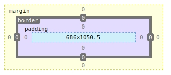

margin

border

padding

context

## 盒子边框(border)

语法:

```css
border: border-width || border-style || border-color
```

border-style: 边框样式,常用的属性

```
none: 没有边框即忽略所有边框的宽度(默认值)
solid: 边框为单实线(最为常用的)
dashed: 边框为虚线
dotted: 边框为点线
```


### 盒子边框总结表

| 设置内容     | 样式属性                                                     | 常用属性                                                     |
| ------------ | ------------------------------------------------------------ | ------------------------------------------------------------ |
| 上边框       | border-top-style:样式;border-top-width:宽度;border-top-color:颜色;border-top:宽度 样式 颜色； |                                                              |
| 下边框       | border-bottom-style:样式;border-bottom-width:宽度;border-bottom-color:颜色;border-bottom:宽度 样式 颜色； |                                                              |
| 左边框       | border-left-style:样式;border-left-width:宽度;border-left-color:颜色;border-left:宽度 样式 颜色； |                                                              |
| 右边框       | border-right-style:样式;border-right-width:宽度;border-right-color:颜色;border-right:宽度 样式 颜色； |                                                              |
| 样式综合设置 | border-style: 上边 [右边 下边 左边]；                        | none无(默认)、solid单实线、dashed虚线、dotted点线、double双实线 |
| 宽度综合设置 | border-width: 上边 [右边 下边 左边]；                        | 像素值                                                       |
| 颜色综合设置 | border-color: 上边 [右边 下边 左边]；                        | 颜色值、#十六进制、rgb(r,g,b)、rgb(%r,g%,b%)                 |


### 表格的细线边框

```css
table {
    border-collapse:collapse; //collapse单词是合并的意思
}

border-collapse: collapse; //表示边框合并在一起
```


案例

```css
table {
  width: 70rem;
  height: 30rem;
  border: 0.1rem solid red;
  border-collapse: collapse;
}

td {
  border: 0.1rem solid red;
}
```


### 圆角边框(CSS3)

语法格式:

```css
border-radius: 左下角 右上角 右下角 左下角
```

案例:

```css
div {
    width:200px;
 	height:200px;
}

div {
 border-radius: 10px; //如果这个圆角值越大最终可以变成一个圆,前提div是个正方形,取div宽度和高度的一般
 border-radius: 50%;//但是如果宽和高的值不是一个整数,可以使用百分数,这样也能得到一个圆
}

div {
    border-radius: 100px;
    height: 100px; //这样可以得到一个胶囊
}
```


## 内边距

padding属性用于设置内边距，是指边框与内容之间的距离

padding-top

padding-right

padding-bottom

padding-left

顺时针方向：上右下左


## 外边距

margin-top

margin-right

margin-bottom

margin-left

顺时针方向：上右下左

### 外边距实现盒子居中

可以让一个盒子实现水平居中,需要满足一下两个条件：

1. 必须是块级元素
2. 盒子必须指定宽度

然后给**左右的外边距**设置为auto，就可以水平居中了

实际工作中常用这种方式进行网页布局，实例代码：

```css
.header { width:960px; margin:0 auto; }
```

### 清除元素的默认内外边距

为了方便地控制网页中的元素，制作网页时，可使用如下代码清除元素默认内外边距

```css
* {
  padding: 0;
  margin: 0;
}
```

注意: 行内元素是只有左右内外边距的，是没有上下内外边距 。

我们尽量不给行内元素指定上下外边距

###  文字水平居中和盒子水平居中的区别

文字水平居中：text-align: center

盒子水平居中 margin: 10px auto;

### 插入图片和背景图片的区别

插入图片:

​	在一个盒子里面有一个img，img也是一个盒子

​	更改大小是width height 

​	更改位置padding margin 

​	如果里面有文字或其他元素会被挤下去

背景图片:

​	更改大小是background-size

​	更改位置background-position

​	如果里面有文字或其他元素不会被挤下去,图片在文字或元素的下方

一般情况下背景图片适合做一些小图标 比如logo, 荣耀的背景等等，产品展示用插入图片 


## 外边距合并

### 相邻块元素垂直外边距的合并

两个垂直方向上的块级盒子 外边距会发生重叠，以最大的外边距为准

解决方案：避免就好了 给其中一个盒子指定垂直方向上外边距就好了

### 嵌套块元素垂直外边距的合并

可以给父元素定义1像素的边框或内边距

可以父元素添上overflow:hidden

## content宽度和高度

使用宽度属性width和高度height可以对盒子的大小进行控制

width和height的属性可以为不同单位的数值或相对于父元素的百分比%，实际工作中最常用的是像素值

大多数浏览器符合w3c规范

```
/*外盒尺寸计算(元素空间尺寸)*/
元素(element)空间高度 = content height + padding + border + margin
元素(element)空间宽度 = content width + padding + border + margin
/*内盒尺寸计算(元素大小)*/
元素(element)空间高度 = content height + padding + border
元素(element)空间宽度 = content width + padding + border
```

注意：

1. 宽度属性width和高度属性height仅适用于块级元素，对行内元素无效(img标签和input除外)
2. 计算盒子模型的总高度时，还应考虑上下两个盒子垂直外边距合并的情况
3. 如果一个盒子没有给定宽度/高度或者继承父亲的宽度/高度，则padding不会影响本盒子大小

## 盒子模型布局稳定性

开始学习盒子模型，同学们最大的困惑就是，分不清内外边距的使用，什么情况下使用内边距，什么情况下使用外边距？

答案是，其实他们大部分情况下是可以混用的。就是说，你用内边距也可以，外边距也可以，你觉得哪个方便用那个， 但是，总有一个最好用，我们根据稳定性来分，建议如下：

按照优先使用宽度，其次使用内边距，再次使用外边距。

```
width > padding > margin
```

原因：

1. margin会有外边距合并 还有ie6下面margin加倍的bug(讨厌)所以最后使用
2. padding会影响盒子大小，需要进行加减计算(麻烦)其次使用
3. width没有问(嗨皮)我们经常使用宽度剩余法高度剩余法来做


## CSS3盒模型

css3中可以通过box-sizing来指定盒子模型,既可指定为context-box,border-box,这样我们计算盒子大小的方式就会发生改变。

可以分两种情况：

1. box-sizing:center-box 盒子大小为width+padding+border context-box:此值为其默认值，
2. Box-sizing:border-box 盒子大小为width 就是说padding和border是包含到width里面的

注: 上面标注的width指的是css属性里面的width; length,content的值会自动调整的


## 盒子阴影

语法格式:

```css
box-shadow: 水平位置 垂直位置 模糊距离 阴影尺寸(影子大小 )  阴影颜色 内/外阴影
```

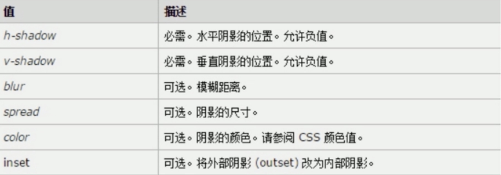

1. 前两个属性是必须写的。其余的可以省略
2. 外阴影(outset)但是不能写 默认 想要内阴影 inset

```css
box-shadow: 0 15px 30px rgba(0,0,0,.4);
box-shadow: 0 15px 30px rgba(0,0,0,.4) inset, /*内阴影*/
0 15px 30px rgba(0,0,0,.4); /*可以使用,添加多个影子效果*/
```

# 浮动

## 普通流(norml flow)

前面我们说过，网页布局的核心，就是用css来摆放盒子位置。如何把盒子摆放到合适的位置？

CSS定位机制有3种: 普通流(标准流)、浮动和定位

html语言当中另外一个相当重要的概念------标准流！或普通流，或者文档流。普通流实际上就是网页内标签元素正常从上到下，从左到右排列顺序的意思。比如块级元素独占一行，行内元素会按顺序依次前后排列，按照这种大前提的布局排列之下绝对不会例外的情况叫做普通流布局

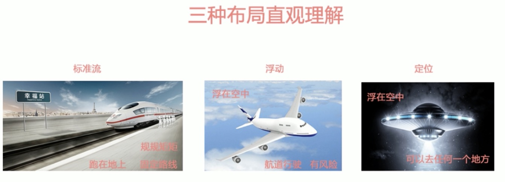

## 浮动

三个div在一行内排列

在之前如果转化为行内块元素就可以放在一起 有宽度高度  但是元素之间有缝隙 不方便处理

所以使用float:left三个在一行排列还没有缝隙

## 什么是浮动？

元素的浮动是指设置了浮动属性的元素会脱离标准普通的控制，移动到其父元素中指定位置的过程

在css中,通过float属性来定义浮动，其基本语法格式：

```css
选择器{float:属性}
```

| 属性值 | 描述               |
| ------ | ------------------ |
| left   | 元素向左浮动       |
| right  | 元素向右浮动       |
| none   | 元素不浮动(默认值) |

浮动过后会漂在标准流的上边，遮(压)住标准流 

## 浮动的详细内幕特性

浮动脱离标准流,不占位置，会影响标准流。浮动只有左右浮动。

```
浮动首先会创建包含块的概念(包裹)。就是说，浮动的元素总是找离它最近的父级元素对齐。但是不会超出内边距的范围
浮动的前提是有一个标准流父元素将其包裹
```

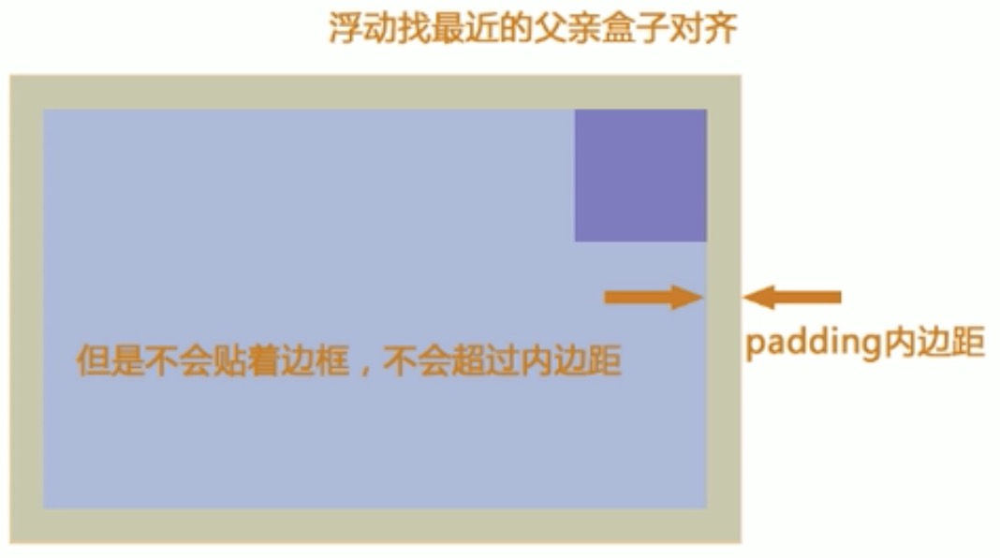

```
浮动的元素排列位置，跟上一个元素(块级)有关系。如果上一个元素有浮动,则A元素顶部会和上一个元素的顶部对齐;如果上一个元素是标准流，则A元素的顶部会和上一个元素的底部对齐
```

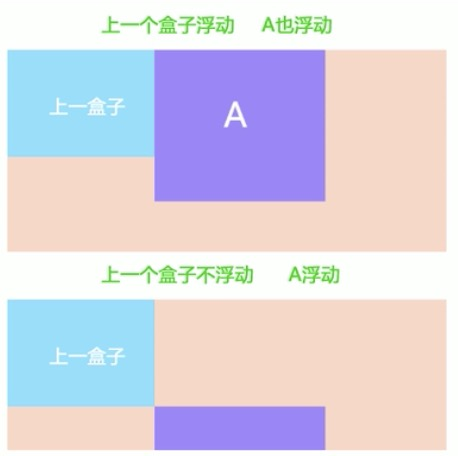

```
由此可以推断出，一个父盒子里面子盒子，如果其中一个子级有浮动的，则其他子级都需要浮动。这样才能一行对其显示
```

```
元素添加浮动后，元素会具有行内块元素的特性。元素的大小完全取决于定义的大小或默认内容多少
```

```
浮动根据元素书写的位置来显示相应的浮动
```

总结: 浮动 --> 浮漏特

一句话总结浮动：浮动的主要目的就是为了让多个块级元素一行内显示

浮：加了浮动的元素盒子是浮起来的，漂浮在其他的标准流盒子上面

漏：加了浮动的盒子不占位置的，它浮起来了，它原来的位置漏给了标准流的盒子

特：特别注意，首先浮动的盒子需要和标准流的父级搭配使用， 其次特别注意浮动可以使元素显示模式体现为行内块特性。

# 版型和布局流程

阅读报纸时容易发现，虽然报纸的内容很多但是经过合理地排版，版面依然清晰、易读。同样，制作网页时，要想页面结构清晰、有条理，也需要对网页进行排版

“版心”是指网页中主体内容所在的区域。一般在浏览器窗口中水平居中显示，常见的宽度值为960px、980px、1000px、1200px等。

## 布局流程

为了提高网页的版心

1. 确定页面版心
2. 分析页面的行模块，以及每个模块中的列模块
3. 制作html结构
4. css初始化，然后开始运用盒子模型的原理，通过DIV+CSS来控制网页的各个模块

## 一列固定宽度且居中

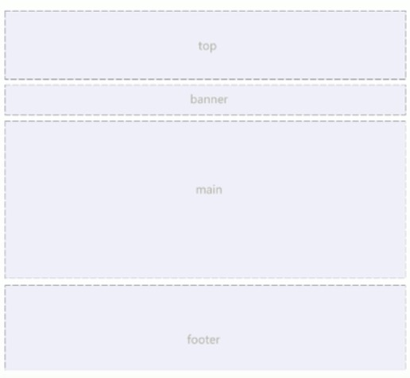


## 两列左窄右宽型

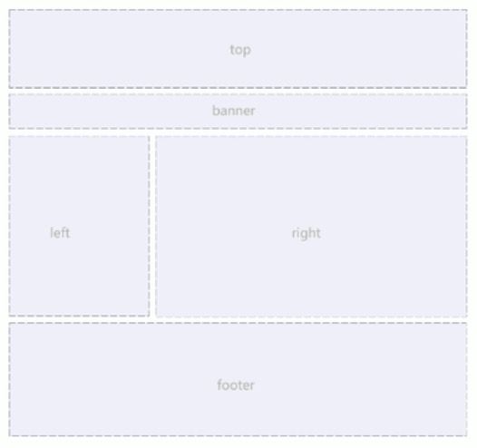

```css
/*.top+.banner+(.main>.left+.right)+.footer*/
* {
  margin: 0;
  padding: 0;
}

.top,.banner,.main,.footer {
  width:960px;
  margin: 0 auto;
  margin-bottom: 8px; 
}
.top {
  height: 80px;
}
.banner {
  height: 150px;
}
.main {
  height: 500px;
}
.left {
  width: 360px;
  height: 500px;
  float: left;
  margin-right: 8px;
}
.right {
  width: 592px;
  height: 500px;
  float: right;
}
.footer {
  height: 120px;
}

<div class="top"></div>
<div class="banner"></div>
<div class="main">
  <div class="left"></div>
  <div class="right"></div>
</div>
<div class="footer"></div>
```

## 通栏平均分布型

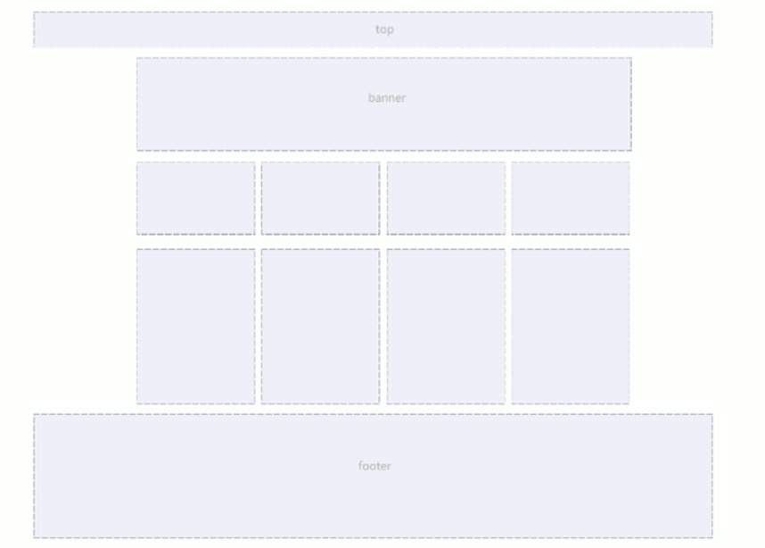

```css
/*.top+.banner+(.main>ul>li*4)+.footer*/
* {
  margin: 0;
  padding: 0; 
}
ul {
  list-style: none; 
}
.top {
  height:60px;
}
.banner {
  width: 960px;
  height: 400px;
  margin: 20 auto;
  border-radius: 15px;
}
.main	{
  width: 960px;
  height: 200px;
  margin: 0 auto;
}
.main ul li {
  width: 240px;
  height: 200px;
  float: left;
}
.footer {
  height: 100px;
}


    <div class="top"></div>
    <div class="banner"></div>
    <div class="main">
        <ul>
            <li></li>
            <li></li>
            <li></li>
            <li></li>
        </ul>
    </div>
    <div class="footer"></div>
```

# 清除浮动

有浮动的开始，就有浮动的结束

## 为什么要清除浮动

我们前面说过，浮动本质是用来做一些文字混排效果的,但是被我们拿来做布局用，则会出现很多的问题，但是，你不能说浮动不好。由于浮动元素不再占有原文档流的位置，所以它会对后面的元素排版产生影响，为了解决这些问题，此时就需要在该元素中清除浮动。

准确地说,并不是清除浮动，而是**清除浮动后造成的影响**

如果浮动一开始就是一个美丽的错误,那么请正确的方法挽救它。

## 清除浮动的本质

清除浮动主要为了解决父级元素因为子级浮动引起内部高度为0的问题

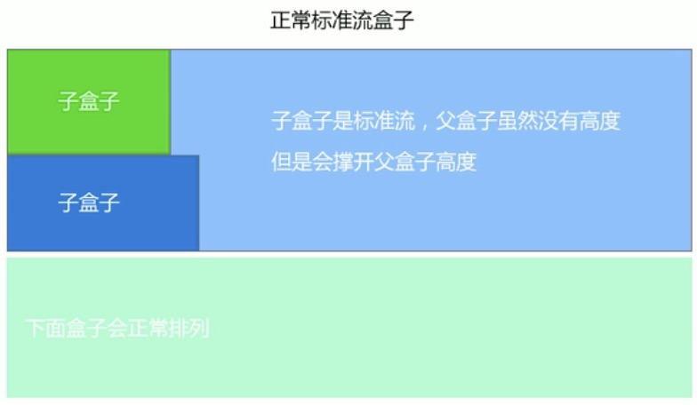

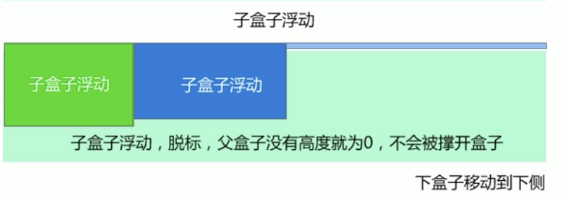


## 清除浮动的方法

其实本质叫做闭合浮动更好一些，清除浮动就是把浮动的盒子圈到里面，让父盒子闭合出口和入口不让他们出来影响其他元素。

在css中,clear属性用于清除浮动，其基本语法格式如下:

```
选择器{clear:属性值;}
```

| 属性值 | 描述                                     |
| ------ | ---------------------------------------- |
| left   | 不允许左侧有浮动元素(清除左侧浮动的影响) |
| right  | 不允许右侧有浮动元素(清除右侧浮动的影响) |
| both   | 同时清除左右浮动的影响                   |


### 额外标签法

```
是w3c推荐的做法是通过在浮动元素末尾添加一个空的标签例如 <div style="clear:both"></div>,或则其他标签br等亦可
```

优点:  通俗易懂,书写方便

缺点:  添加许多无意义的标签,结构化较差。我只能说,w3c你推荐的方法我不接受,你不值得拥有...

### 父级添加overflow属性方法

可以通过触发BFC的方式,可以实现清除浮动效果。(BFC后面讲解)

```
可以给父级添加: overflow为hidden|auto|scroll 都可以实现
```

优点：代码简洁

缺点:  内容增多时候容易造成不会自动换行导致内容被隐蔽掉,无法显示需要益出的元素

### 使用after伪元素清除浮动

**:after**方式为空元素的升级版,好处是不用单独加标签了

使用方法: 

```css
.clearfix:after { center:".",display:block;height:0;clear:both;visibility:hidden;}
.clearfix:after { *zoom:1; } /*ie6，7专用*/
```

优点: 符合闭合浮动思想 结构语义化正确

缺点: 由于IE6-7不支持:after,使用zoom:1触发hasLayout

代表网站: 百度、淘宝、网易等

注意: content:"."里面尽量跟一个小点，或者其他，尽量不要为空，否则firefox7.0前的版本会有生成空格

### 使用before和after双伪元素清除浮动

使用方法:

```css
.clearfix:before,.clearfix:after {
  content:"";
  display: table; /*这句话可以触发BFC BFC可以清除浮动,BFC我们后面讲*/
}
.clearfix:after {
  clear:both;
}
.clearfix { 
  *zoom:1;
}
```

优点: 代码更简洁

缺点: 由于IE6-7不支持:after,使用zoom:1触发hasLayout。

代表网站: 小米、腾讯等

# Photoshop图像处理专家

我们学习PS目的不是为了设计海报做电商和UI的,而是要求

1. 会简单的抠图
2. 会简单的修改PSD效果图
3. 熟练的切图

## Photoshop基本使用

## PS界面的组成

## 基本操作

文件下拉菜单：

1. 新建 新建文档 CTRL+N

   单位：像素 厘米 毫米

   屏幕显示：单位 像素 72像素/英寸 RGB颜色模式

2.关闭文档 CTRL+W(替存)

3.存储 CTRL+S(替存)

4.存储为CTRL+SHIFT+S 另一份文件

5.格式:

​	.psd PS源文件格式，图层、文字、样式等，可再次编辑(给自己)

   .jpg 有损压缩格式(给客户)品质最高12

6.文件打开

​	1）文件下啦菜单-打开(CTRL+O欧)

​	2）双击空白处也能打开

## 移动工具V

1.在不同文件之间拖拽

## 自由变形

ctrl+t可以改变图像的大小

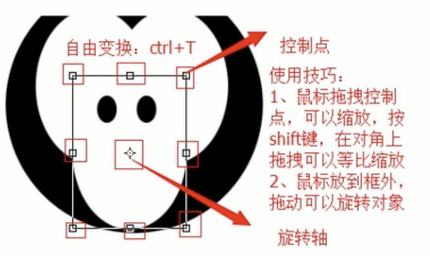

按下回车确认操作

## 图层操作(重点)

图层面板快捷键 F7 其实图层就是一张张透明的纸 可以实现叠加问题

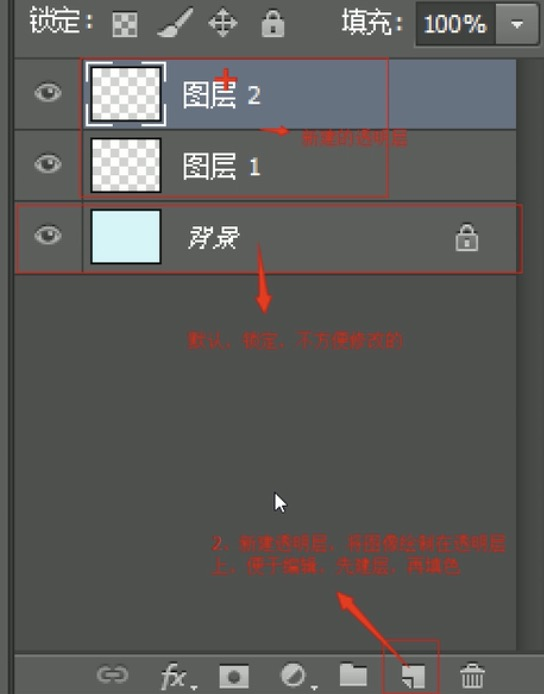

图层选择：使用移动工具v

​	1.图层缩览图判断

​	2.按住ctrl,在目标图像上单击

​	3.将光标放置在目标图像上右键，选择图层名称

图层面板中加选图层:

​	1.按SHIFT,单击另一目标图层 中间所有图层被选中

​	2.按CTRL,单击另一目标图层 只选中目标图层

复制图层:选中目标图层后(移动工具状态下)

​	1.按alt拖拽图像

​	2.ctrl+j  (复制)

## 图层编组

选中目标图层，ctrl+g

取消编组： ctrl+shift+g

双击图层名称可重新命名

双击组名称，可命名组

​	移动工具v选择或图层时需要选项栏

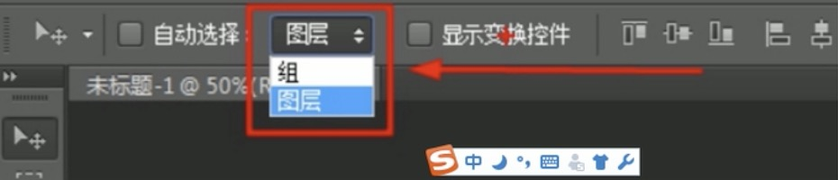

## 图层上下位置移动

图层合并

图层透明度

矩形选取工具

颜色填充

套索工具

磁性套索

魔棒工具

选取布尔运算

钢笔工具

Photoshop切图

切片工具

切图插件

# 定位(position)

