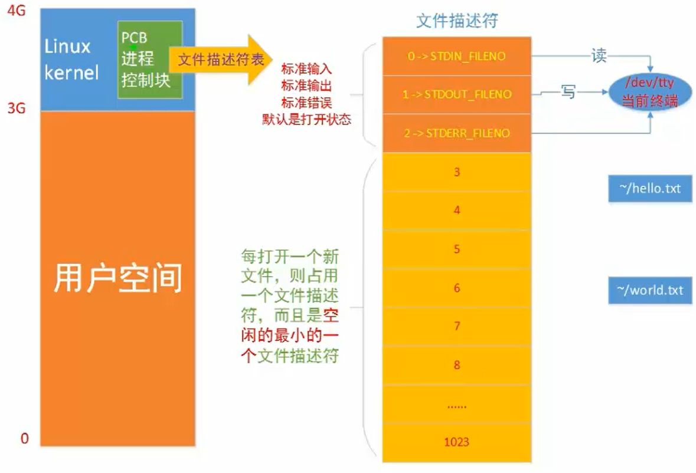
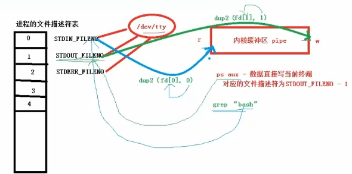

# 两种分区表和格式化

## 分区

 MBR分区表: 最大支持2.1TB硬盘,最多支持4个分区
        主分区:最多只能有4个
        扩展分区:
            最多只能1个
            主分区加扩展分区最多4个
            不能写入数据,只能包含逻辑分区
        逻辑分区
    GPT分区表（全局唯一标示分区表）:GPT支持9.4ZB
    硬盘(1ZB=1024PB，1PB=1024EB，1EB=1024TB)。
    理论上支持的分区数没有限制,但windows限制128个主分区

## 格式化(高级格式化)又称逻辑格式化

​    为了写入文件系统
​    它是指根据用户选定的文件系统(如FAT16,FAT32,NTFS,EXT2,EXT3,EXT4等),
​    在磁盘的特定区域写入特定数据,在区域中划出一片用于存放文件分配表,目录表等用于文件管理的磁盘空间

分区相当于一个柜子,格式化就是对分区进行分格子,会分一个小的和一个大的,然后在大的里面再一个一个分格子叫block(数据块,4kB)block不一定是连续的，系统会尽量连续,一个block是数据存储的最小单元

每个文件都有一个节点号(INode 128B),在分得的小的格子存放了文件的Inode(inode号,权限,时间...)

## 设备文件名

| 硬件  | 设备文件名 |
| ---- | ---- |
|IDE硬盘            | /dev/hd[a-d]     |
|SCSI/SATA/USB硬件  | /dev/sd[a-p]     |
|光驱               | /dev/cdrom或/dev/sr0 |
|软盘               | /dev/fd[0-1] |
|打印机(25针)       | /dev/lp[0-1]  |
|打印机(USB)        | /dev/usb/lp[0-15] |
|鼠标               |  /dev/mouse  |

## 分区设备名称

​    /dev/hda1(IDE硬盘接口)
​    /dev/sda1(SCSI硬盘接口、SATA硬盘接口)

挂载点(使用已经存在的空目录作为挂在点) 类似于windows的盘符
    理论上所有空目录,包括新建目录都可以作为挂载点,但是
    /bin,/lib,/etc要单独分出来

## 挂载

​    必须分区
​        /(根分区)
​        swap分区(交换分区) 注意前面没有/，就是swap是没有挂载点
​            如果真实内存小于4GB,swap为内存的两倍
​            如果真实内存大于4GB,swap为内存一致
​            实验环境,不大于2GB
​    推荐分区 （虽然是推荐分区,但是最好也分区）
​        /boot (启动分区,1GB)
​    常用分区
​        /home （用于文件服务器）
​        /www (用于web服务器)

挂载类型 自动、手动
    类型：自动 手动。
    自动：系统安装创建的挂载点，后期使用会自动与硬盘分区建立联系。
    手动：系统运行过程中，临时添加的U盘，移动硬盘不会被系统应用起来，
    需要手动创建一个文件目录并使其与该硬件进行联系，挂载。

与新硬件形成挂载
    把挂载点目录内部的旧的文件释放出去
    再进行挂载操作

## 目录说明

    bin 存放系统命令的目录,普通用户和超级用户都可以执行.是/usr/bin/目录的软连接
    sbin 存放系统命令的目录,只有超级用户才可以执行. 是/usr/sbin/目录的软连接
    usr 用于存放共享的系统资源
        /usr/bin/ 存放系统命令的目录,普通用户和超级用户
        /usr/sbin/ 存放系统命令的目录,只有超级用户才可以执行.
        /usr/lib/ 应用程序调用的函数库位置
        /usr/local/ 手工安装的软件位置 记住
        /usr/share/ 应用程序的资源文件保存位置,如帮助文档,说明文档,和字体目录
        /usr/src/ 源码包保存位置,我们手工下载的源码包和内核源码包都可以保存这里,习惯上放到/usr/local/src 记住
        /usr/src/kernels/ 内核源码保存位置
    boot 系统启动目录,保存于系统启动相关的文件,如内核文件和启动引导程序
    dev 用于存放设备文件
        例如 /dev/cdrom是光驱
        /dev/skin 是第一块scsi硬盘
    etc 存放系统配置文件(采用默认安装方式rmp安葬)的服务配置文件全部保存在此目录中
        /etc/passwd 用于存储用户信息的文件
        /etc/group   用于存储组别信息文件
    home 存放用户文件的根目录
        用户的"家目录"
        给系统每增加一个”普通用户“的同时，都会在该目录为该用户设置一个文件夹目录
        代表该用户的“家目录”，用户后期使用系统的时候会首选进入其家目录
        家目录名字默认与当前用户名字一致
        用户对家目录拥有绝对最高的权限
        波浪线代表用户处于自己的家目录
    lib 系统调用函数库保存位置。是/usr/lib/的软连接
    lib64 64位系统调用函数库保存位置。是/usr/lib64/的软连接
    lost+found 当系统意外崩溃或意外关机,而产生一些文件碎片存放在这里。当系统启动的过程中fask工具会检查这里,并修复已经损坏的文件系统
    media 挂载目录。系统建议是用来挂载媒体设备的,如软盘和关盘
    misc 挂载目录
    mnt 挂载目录 U盘 习惯上用这个
    opt 该目录类似win系统的c:/Program files目录
        该目录经常用于安装各种软件
        一般习惯安装到/usr/local/
    proc 内存映射目录，该目录可以查看系统的相关硬件信息
        比如 cat cpuinfo 能看到cpu的信号
    sys 虚拟文件系统 和proc目录相似,该目录的数据都保存在内存中,主要保存与内核相关的信息
    net 内存的挂载点 和proc，sys一样
    root 超级用户目录
    selinux 安装增强型的linux
        对系统形成保护
        会对给系统的安装软件时有干扰
        限制root的权限
    srv 服务数据目录
    tmp 用于存放各种临时文件
    var 动态数据保存位置 可变的、易变的
        该目录存储的文件经常会发生变动（增加、修改、删除)
        经常用于部署项目程序文件
        /var/www/html RPM包安装的Apache的网页主目录
        /var/lib/ 程序运行中需要调用或改变的数据保存位置 如：mysql的数据库保存在/var/lib/mysql目录中
        /var/log/ 系统日志保存位置
        /var/run/ 一些服务和程序运行后,它们的PID保存位置。如 /run/目录的软链接
        /var/spool/ 放置队列数据的目录。就是排队等待其他程序使用的数据,比如邮件队列和打印队列
        /var/spool/mail/ 新收到的邮件队列保存位置。系统新收到的邮件会保存在此目录中
        /var/spool/cron/ 系统的定时任务队列保存位置。系统的计划任务会保存在这里
    /run 是各种各样数据的家园
## ext4 

​    类似于win系统的FAT32和NTFS类型
​    给/boot目录单独创建一个分区结构，对其形成保护，避免其他的文件占据该目录空间
​    影响服务器的开关机。

# 网络配置
    对于redhat的系统,一开始没有vim 那么使用setup命令
    配置ip地址和子网掩码
    编辑配置文件 ：
    cd /etc/sysconfig/network-scripts
    cp ifcfg-eth0 ./ifcfg-eth0.bak  修改前先备份
    修改/etc/sysconfig/network-scripts/ifcfg-eth0 做网络的具体配置：
        DEVICE=eth0
        HWADDR=00:0C:29:EE:C7:1B
        TYPE=Ethernet
        UUID=0093d70b-1a03-4195-be15-d840614a776
        ONBOOT=no 
        MM_CONTROLLED=yes
        BOOTPROTO=dhcp
    对默认配置进行修改
        DEVICE=eth0
        HWADDR=00:0C:29:EE:C7:1B
        TYPE=Ethernet
        UUID=0093d70b-1a03-4195-be15-d840614a776
        ONBOOT=yes # 系统自动开启网络
        MM_CONTROLLED=yes 
        BOOTPROTO=static # 改为静态IP
        IPADDR=192.168.174.100 # IP和子网掩码具体配置
        NETMASK=255.255.255.0 # IP和子网掩码具体配置
        GATEWAY=192.168.174.2 # 网关，不设置网关是上不了网的 虚拟机虚拟网卡是192.168.174.1
        DNS1=8.8.8.8
    重启网卡
        service network  restart/stop/start
    本机和linux互相ping通
        问题：本机可以ping同linux，但是linux不能ping通本机。
        解决：关闭本机防火墙
    复制镜像可能需要重置UUID
        vi /etc/sysconfig/network-scripts/ifcfg-eth0
            删除MAC地址行
        rm -rf /etc/udev/rules.d/70-persistent-net.rules
            删除MAC地址和UUID绑定文件
        shutdown -r now
            重启服务器

如果是虚拟机安装的,还需要配置虚拟机的网络配置    

| 连接方式     | 连接网卡     | 是否能连接本机      | 是否能连接局域网     | 是否能连接公网     |
| ---- | ---- | ---- | ---- | ---- |
| 桥接     | 本地真实网卡     | 可以     | 可以     | 可以     |
| NAT     | VMnet8     | 可以     | 不能     | 可以     |
| 仅主机     | VMnet1     | 可以     | 不能     | 不能     |

NAT不会占用真实的ip

# 远程工具
    xshell 个人用户免费版
    secureCRT
    putty 比较古老
    winscp 上传文件

# 注意事项
    linux严格区分大小写
    linux一切皆文件
    linux不靠扩展名区分文件类型,建议写上
    linux中所有的存储设备都必须在挂载之后才能使用
    
    服务器不能关机只能重启,重启之前终止正在执行的服务
        sync 数据同步命令,可以让暂时保存在内存中的数据同步到硬盘上
        shutdown -r now 重启系统 使用这个，在重启之前最好多执行几次sync
    不要在服务器访问高峰运行高负载命令
    远程配置防火墙不要把自己踢出服务器
        防火墙: 基本功能是数据包过滤(IP地址,MAC地址,端口号,协议类型,数据包中数据)
        先写一个系统定时任务,让它每5分钟清空一下防火墙规则,就算写错了也还有反悔的机会,等测试没有问题了再删除这个系统定时任务

# 常用命令

## [root@localhost ~] #

​    []: 这是体是符的分隔符号,没有特殊含义
​    root: 显示的是当前的登陆用户
​    @: 分隔符号,没有特殊含义
​    localhost: 当前系统的简写主机名称
​    ～: 代表用户当前所在的目录 在家目录
​    #: 命令提示符。超级用户#，普通用户是$

## ls--查看目录下有什么文件/目录

​    ls      列出目录的文件信息
​    ls -l   以“详细信息“查看目录文件
​    ll      以“详细信息“查看目录文件
​    ls -a   查看目录全部（包含隐藏文件）文件
​    ls -al  查看目录全部（包含隐藏文件）文件,以“详细信息“展示
​    ls 目录  查看指定目录下有什么文件
​    ls -i   查看文件的i节点号   
​    ls -lh  人性化显示
​    ls -ld  显示目录本身

第一列: 权限
第二列: 引用计数. 文件的引用计数代表该文件的硬链接数个数,而目录的引用计数代表该目录有多少个一级子目录
第三列: 所有者,也就是文件所属哪个用户
第四列: 所属组,也就是文件所属哪个组织
第五列: 文件大小 字节单位
第六列: 文件的修改时间
第七列: 文件名

## cd--进行目录切换

​    cd dirname 进行目录切换
​    cd .. 向上级目录切换
​    cd ~ 或 cd  直接切换到当前的对应的家目录
​    cd - 进入上次所在目录

## mkdir--创建目录

​    mkdir 目录的名字
​    mkdir -p newdir/newdir/newdir 递归方式创建多个连续目录
​                                  新的多级目录数目如果大于等于2个，就要使用-p参数
​    mkdir dir/newdir              不用-p参数
​    mkdir -p dir/newdir/newdir    使用-p参数
​    mkdir dir/newdir/dir/newdir

## rm--删除文件或目录

​    rm 文件
​    rm -r  目录     -r[recursive递归]递归方式删除目录
​    rm -rf 文件/目录 -r force 递归强制方式删除文件 force强制，不需要额外的提示
​    rm -rf /
​    这个删除是不能反悔的,所以再删除之前可以安装extundelete数据恢复软件

## touch--创建文件

​    touch dir1/filename 如果没有此文件,就创建文件,如果有此文件只是修改访问时间,不会修改文件内容的
​    touch filename

## echo--给文件追加内容

​    echo 内容 > 文件名称   把”内容“以覆盖写方式追加给”文件“ 如果文件不存在会创建文件
​    echo 内容 >> 文件名称  把”内容“以追加形式写给”文件“ 如果文件不存在会创建文件

## 查看文件内容

### stat--显示文件系统的详细信息

​	stat filename 显示文件或文件系统的详细信息 linux是没有文件创建时间

### cat--打印文件内容到输出终端

​	cat filename 打印文件内容到输出终端
​	cat -n filename 查看文件并显示行号
​	cat -A filename[相当于-vET选项的整合]  查看文件并列出所有隐藏符号

### more-- 分屏显示文件

​	more filename 分屏显示文件 默认从第一行开始查看,不支持回看
​        b:向上翻页
​        空格:向下翻页
​        回车键:向下滚动一行
​        q:退出查看
​        /字符串:搜索

### less--分行显示文件

​    less filename 分行显示文件
​        通过“上下左右”键查看文件的各个部分内容
​        支持回看
​        q 退出查看

### head--查看文件的头n行内容

​    head -n filename 查看文件的头n行内容

### tail--查看文件的末尾n行内容

​    tail -n filename 查看文件的末尾n行内容
​    tail -f filename 监听文件的新增内容

### wc--查看文件的行数

​    wc filename 查看文件的行数

### od--打开二进制文件

​    od 打开二进制文件
​        -tc

### du--通进文件和子文件的大小

​	  du -h 目标 以K，M，G为单位显示目录或文件占据磁盘空间的大小(block块默认=4k)

### df--查看磁盘空间

​    df -lh 查看系统分区情况

## ln -d--硬链接

​    ln -d 源文件 硬链接文件
​    源文件和硬链接文件拥有相同的Inode和Block
​    修改任意一个文件,另一个都改变
​    删除任意一个文件,另一个都能使用
​    硬链接标记不清,很难确认硬链接文件位置,不建议使用
​    硬链接不能链接目录
​    硬链接不能跨分区

## ln -s--软链接

    ln -s 源文件 软链接文件 相当于快捷方式
​    软链接和源文件拥有不同的Inode和Block
​    两个文件修改任意一个,另一个都改变
​    删除软链接,源文件不受影响，删除源文件,软链接不能使用
​    软链接没有实际数据,只保存源文件的Inode,无论源文件多大,软链接大小不变
​    软链接的权限是最大权限lrwxrwxrwx，但是由于没有实际数据,最终访问时需要参考源文件权限
​    软链接可以链接目录
​    软链接可以跨分区
​    软链接特征明显,建议使用软链接
​    软链接一定要写绝对路径

## cp--文件的复制

​    cp     file1  dir/newfile2     			file1被复制一份到dir并改名字为newfile2
​    cp     file1  dir            			file1被复制一份到dir并改名字为原名字
​    cp     dir1/filea    dir2/newfile       file1被复制一份到dir2并改名字为newfile

## cp -r--目录的复制

需要设置-r[recursive递归]参数，目视目录层次

​    cp -r dir1 dir2            	     dir1被复制到dir2目录下，并改名字为原名
​    cp -r dir1/dir2 dir3/newdir        dir2被复制到dir3目录下，并改名字为newdir
​    cp -r dir1/dir2 dir3/dir4          dir2被复制到dir4目录下，并改名字为原名
​    cp -r dir1/dir2 dir3/dir4/newdir   dir2被复制到dir4目录下，并改名字newdir
​    cp -r dir1 ../../newdir         	 dir1被复制到上两级目录下，并改名字为newdir
​    cp -a 相当于-dpr选项的集合. 目标文件和源文件一模一样
​    cp -d 如果源文件为软链接(对硬链接无效),则复制出的目标文件也为软链接
​    cp -i 询问,如果目标文件已经存在,则会询问是否覆盖
​    cp -p 复制后目标文件保留源文件的属性(包括所有者，所属组、权限和时间)

## date--查看系统时间

​    date
​    date -s "2013-09-13 19:42:30" 给系统设置时间

## mv--移动目录

（文件和目录）剪切

​    mv dir1 dir2           把dir1移动到dir2目录下
​    mv dir1/dir2 dir3       把dir2移动到dir3目录下
​    mv dir1/dir2 dir3/dir4  把dir2移动到dir4目录下
​    mv dir1/dir2 ./         把dir2移动到当前目录下

## mv--改名字（文件和目录）

​    mv dir newdir                   修改dir1的名字为newdir
​    mv dir1 ./newdir                dir1移动到当前目录下，并改名字为newdir
​    mv dir1/dir2 dir3               dir1移动到dir3目录下，并改名字为“原名”  
​    mv dir1/dir2 dir3/newdir        dir1移动到dir3目录下，并改名字为“newdir ”
​    mv dir1/dir2 dir3/dir4          dir2移动到dir4目录下，并改名字为“原名	”
​    mv dir1/dir2 dir3/dir4/newdir   dir2移动到dir4目录下，并改名字为“newdir"   

## chmod--给文件设置权限

- --- --- ---
​    文件类型 主人权限 同组权限 其他组权限
​    linux文件类型
​        -:代表普通文件
​        b:块设备文件
​        c:字符设备文件
​        d:目录文件
​        l:软链接文件
​        p:管道符文件
​        s:套接字文件
​    权限 r(读) w(写) x(执行)
​    字母相对方式设置权限
​        +:增加权限 -:删除权限 =:设置权限
​        u:主人权限 g:同组权限 o:其他组权限
​        针对一个组别设置权限，其他组别没有变化,称为“相对方式”权限设置
​        chmod u+rwx filename 给filename文件的主人增加"读 、写、执行"权限
​        chmod g-rx  filename 给filename文件的同组用户 删除"读 、执行"权限
​        chmod u+/-rwx,g+/-rwx,o+/-rwx filename
​        说明：
​            每个单元“+” "-"  只能使用一个
​            可以同时给一个组或多个组设置权限，组别之间使用“,”分割
​            每个单元的权限可以是rwx中的一个或多个
​            chmod u+w,g-rx,o+rw filename 给filename文件主人增加权限，同组删除读 、执行权限，其他组增加读、写权限
​            chmod u+w,u-x filename 给filename文件主任增加写权限，同时删除执行权限
​            chmod u=rwx,g=r,o=w    不用关心文件的权限直接设置上权限
​            chmod +/-rwx filename  无视具体组别，统一给全部的组设置权限
​            chmod +rw filename     给filename全部用户增加读、写权限
​    数字绝对方式设置权限
​        r读:4 w写:2 x执行:1
​        0:没有权限
​        1:执行
​        2:写
​        3:写、执行
​        4:读
​        5:读、执行
​        6:读、写
​        7:读、写、执行
​        chmod ABC filename ABC分别代表主人、同组、其他组用户的数字权限
​        chmod 753 主人都、写 、执行 ，同组 都执行  其他组用户 写执行
​        常用的数字权限 644 文件基本权限 755目录的基本权限 777最大权限
​    问:字母相对 和数字绝对 方式权限设置取舍?
​    答:修改的权限相对比较少的时候使用“字母方式” 相反，权限变得非常多的时候就使用“数字”方式

## 用户操作

### 用户相关文件/etc/passwd

root:  x:    0:   0:  root:  /root:     /bin/bash
        games: x:    5:   60:  games:/usr/games:/usr/sbin/nologin
        用户名:密码:用户ID:组ID:用户说明:家目录:该用户执行的shell脚本
        用户ID:
            0 超级用户UID.如果用户UID为0,代表这个账号是管理员账号
                那Linux如何把普通用户升级成为管理员呢?就是把其他用户的UID修改为0就可以了,这点和Windows是不同的.
            1-499 系统用户(伪账号)UID.这些UID账号是系统保留给系统系统账户的UID
                也就是说UID是1-499范围内的用户是不能登陆系统的,而是用来运行系统或服务的.其中1-99是系统保留的账号,
                系统自动创建.100-499是预留给用户系统创建系统账号的
            500-65535 普通用户ID.建立的普通用户UID从500开始,最大到65535.
                这些用户足够使用了,但是如果不够也不用害怕,2.6.x内核以后的Linux系统用户UID已经可以支持2的32次方这么多了

### 影子文件/etc/shadow

​        root:*:17960:0:99999:7:::
​        用户名:加密密码:密码最近更改时间:两次密码的修改间隔时间:密码有效期:密码修改到期前的警告天数:密码过期后的宽限天数:
​            密码失效时间:保留
​        加密密码:我们也可以在密码前人为的加入!或*改变加密值让密码暂时生效,使用这个用户无法登陆,达到暂时禁止用户的目的
​            注意所有伪用户的密码都是!!或*,代表没有密码是不能登陆的.当然我新创建的用户如果不设定密码,它的密码也是!!,
​            代表这个用户没有密码,不能登陆
​        密码最近更改时间:
​            date -d "1970-01-01 15775 days"
​            2013年03月11日星期一 00:00:00 CST
​            echo $(($(date --date="2013/03/11" +%s)/86400 +1))    

### 用户组信息文件/etc/group

​        root:x:0:root
​        组名:组密码位:GID:此组中支持的其他用户.附加组是此组的用户
​        初始组:每个用户初始组只能有一个,初始组只能有一个,一般都是和用户名相同的组作为初始组
​        附加组:每个用户可以属于多个附加组.要把用户加入组,都是加入附加组

### 组密码文件/etc/gshadow

​        如果我给用户组设定了组管理员,并给该用户组设定了组密码,组密码就保存在这个文件当中.
​        组管理员就可以利用这个密码管理这个用户组了.

### 用户邮箱目录/var/spool/mail

​        /var/spool/mail

### 用户模板目录/etc/skel/

​        /etc/skel/

### 创建用户

#### 手动添加用户

​            /etc/passwd
​            /etc/shadow
​            /etc/group
​            /etc/gshadow
​            /home/user1
​            /var/spool/mail/user1

#### useradd 选项 用户名

​            -u 550 指定UID
​            -g 组名 指定初始组,不要手工指定
​            -G 组名 指定附加组,把用户加入组,使用附加组
​            -c 说明 添加说明
​            -d 目录 手工指定家目录,目录不需要事先建立
​            -s shell /bin/bash
​        useradd默认值
​            useradd添加用户时参考的默认值文件主要有两个,分别是/etc/default/useradd和/etc/login.defs

#### passwd--设定密码

​        passwd 用户名
​            -l:暂时锁定用户
​            -u:解锁用户
​            --stdin:可以将通过管道符输出的数据作为用户密码.主要在批量添加用户时使用
​        passwd直接回车代表修改当前用户的密码
​        echo "123" | passwd --stdin lamp可以使用字符串作为密码不需要人机交互
​        可以通过命令,把密码修改日期归零(shadow第三字段),这样用户一登陆就要修改密码
​        change -d 0 lamp

### usermod--修改用户

​        usermod
​            -u 用户编号: 修改用户的UID
​            -d 家目录: 修改用户的家目录.家目录必须写绝对路径
​            -c 用户说明: 修改用户的说明信息,就是/etc/passwd文件的第五个字段
​            -g 组名: 修改用户的初始组,就是/etc/passwd文件的第四个字段
​            -G 组名: 修改用户的附加组,其实就是把用户加入其他组用户,常用这个
​            -s shell: 修改用户的登陆shell.默认时/bin/bash
​            -e 日期: 修改用户的失效日期,格式为"YYYY-MM-DD",也就是/etc/shadow文件的第八个字段
​            -L: 临时锁定用户
​            -U: 解锁用户
​        改名usermod -l 新名 旧名,但是不建议,可以删除旧用户,再建立新用户

### userdel删除用户

​		同时删除其家目录

​        userdel username
​        userdel -r username 删除用户同时删除其家目录

### su--切换用户身份

​        su 用户名
​            -:选项只使用-代表连带用户的环境变量一起切换
​            -c 命令:仅执行一次命令,而不切换用户身份

## 组管理操作

配置文件: /etc/group

groupadd--创建组

​        groupadd music
​        groupadd movie
​        groupadd php

groupmod--修改组

​        groupmod -g gid -n 新名字 groupname

groupdel--删除组

​        groupdel groupname 组下边如果有用户存在，就禁止删除

把用户加进组或从组中删除

​        gpasswd 组名
​            -a 用户名:把用户加入组,其实就是把用户加入其他组用户
​            -d 用户名:把用户从组中删除
​       	 	比usermod好用

## chown--修改文件和目录的所有者和所属组

修改文件和目录的所有者和所属组
    chown 主人 filename
        chown user1 abc 把文件abc所有者改为user1
    chown 主人.组别 filename
    chown 主人:组别 filename
        chown root.root bcd
        chown root:root bcd
    chown .组别 filename
    chown :组别 filename 
    chown -R  主人.组别   dir 通过递归方式设置目录的属性组信息
    chown -R  765  dir 通过递归方式设置目录的权限
    chgrp 修改文件和目录的所属组,这个一般不用
        chgrp user1 bcd 给文件bcd修改为user1组
    注意事项
        普通用户可以修改所有者是自己的文件的权限
        普通用户不能修改文件的所有者(哪怕文件是属于普用用户的,也不能送给别人)
        只有超级用户才能修改文件的所有者和所属组

## umask默认权限

​    linux有6种基本权限 r,w,x,umask,...
​    新建了一个文件就有了一个默认权限 保证文件和目录都有权限
​    umask 可以查看到默认文件是系统设置好的
​    系统针对文件新建默认的最大权限666,没有执行(x)权限,执行权限是有危险的
​    系统针对目录新建默认的最大权限777,对于目录没有这个风险
​    umask 033 是临时修改了默认权限,要想永久修改默认权限，必须修改配置文件
​    umask 永久修改默认权限
​        vi /etc/profile 这是环境变量配置文件 里面修改umask值
​    umask默认权限计算方式:
​        二进制进行逻辑与和逻辑非联合运算才得到新建文件和新建目录的默认权限
​        但是这是计算机的计算方式,人类计算它太复杂了,我们可以按照字母来计算
​        文件的默认权限最大只能是666，而umask的值是022
​            -rw-rw-rw- 减去 -----w--w- 等于默认文件的权限 -rw-r--r--
​        目录的默认权限最大可以是777，而umask的值是022
​            drwxrwxrwx 减去 d----w--w- 等于默认目录的权限 drwx-r-xr-x
​            减完是负的就是没有权限,因为没有负的权限

## 帮助命令查看文档命令

###     man --指令查看帮助手册 manual pages

​        man ls
​            上箭头:向上移动一行
​            下箭头:向下移动一行
​            PgUp:向上翻一页
​            PgDn:向下翻一页
​            g:移动到第一页
​            G:移动到最后一页
​            q: 退出
​            /字符串:从当前页向下搜索字符串
​            ?字符串:从当前页向上搜索字符串
​            n:在搜索字符串时,可以使用n键找到下一个字符串
​            N:在搜索字符串时,可以使用N键反向找字符串
​        命令的帮助级别
​            1:普通用户执行的系统命令和可执行文件的帮助
​            2:内核可以调用的函数和工具的帮助
​            3:c语言函数的帮助
​            4:设备和特殊文件的帮助
​            5:配置文件的帮助
​            6:游戏的帮助(个人版的Linux中是有游戏的)
​            7:杂项的帮助
​            8:超级用户可以执行的系统命令的帮助
​            9:内核的帮助
​        man -f 命令 或者 whatis 查看命令拥有哪个级别的帮助
​        man -k 命令 或者 apropos 查看和命令相关所有帮助 没什么用

###     info --指令查看帮助信息是一套完整的资料

​        info ls
​            上箭头:向上移动一行
​            下箭头:向下移动一行
​            PgUp:向上翻一页
​            PgDn:向下翻一页
​            Tab:在有"*"符号的节点间进行切换
​            回车:进入有"*"符号的子页面,查看详细帮助信息
​            u:进入上一层信息(回车是进入下一层信息)
​            n:进入下一小节信息
​            p:进入上一小节信息
​            ?:查看帮助信息
​            q:退出info信息

###     help--只能获取shell内置命令的帮助信息 基本不用

​        什么是shell内置命令(shell自带的)
​            type cd 显示 cd 是 shell 内建
​        什么是外部命令(别人开发的)
​            type mkdir 显示 mkdir 是 /bin/mkdir
​    --help选项
​        ls --help

## 搜索

### whereis

​    whereis 搜索系统命令的命令,不能搜索普通文件，只能搜索系统命令
​        会显示源文件和帮助文档

### which

​    which 搜索系统命令的命令,不能搜索普通文件，只能搜索系统命令
​        如果这个命令存在别名,会显示这个命令的别名

### whoami

​    whoami 查看当前的用户是谁

### locate

​    locate 按照文件名搜索普通文件
​        优点: 按照数据库搜索,搜索速度快,消耗资源小。数据库位置/var/lib/mlocate/mlocate.db
​        缺点: 只能按照文件名来搜索文件,而不能执行更复杂的搜索,比如按照权限,大小,修改,时间等搜索文件
​    updatedb 更新数据库
​        vim /etc/updatedb.conf 禁止了搜索一些

### whatis

​    whatis 指令是干什么的
​    makewhatis 更新whatis数据库

### find

​    find 在目录中搜索文件
​        按照文件名搜索
​            -name 按照文件名搜索
​                find / -name passwd[完全名称] “递归遍历”系统全部目录，寻找名称等于“passwd”文件
​                find / -name "pas*"[模糊查找] 在系统全部目录，模糊查找一个文件是“pas”开始的文件
​                find / -name "*er*"  文件名字出现"er"字样即可，不要位置
​            -iname 按照文件名搜索，不区分文件名大小写
​            -inum  按照inode号搜索
​            可以使用通配符
​        限制查找的目录层级
​            -maxdepth  限制查找的最深目录
​            -mindepth  限制查找的最浅目录
​            find / -name passwd -maxdepth 4
​            find / -maxdepth 4 -mindepth 3 -name passwd 
​        按照文件大小为条件进行文件查找
​            -size   +/-数字
​            +号表示大小大于某个范围
​            -号表示大小小于某个范围
​            大小单位：
​            -size 5   默认单位是512字节  5*512字节
​            -size 10c 单位是“字节”   10字节
​            -size 3k  单位是“千字节” 3*1024字节
​            -size 6M  单位是 “1024*千字节 ” 6M兆字节
​            find ./  -size  14c 在当前目录查找大小等于14字节的文件
​            find  / -size +500M 在系统全部目录里边查找大小大于50M的文件
​        按照文件的修改时间来搜索
​            -atime [+|-]时间: 按照文件访问时间搜索
​            -mtime [+|-]时间: 按照文件数据修改时间搜索
​            -ctime [+|-]时间: 按照文件状态修改时间搜索
​            -5: 代表5天内修改的文件
​             5: 代表前5～6天那一天修改的文件
​            +5: 代表6天前修改的文件
​        按照权限搜索
​            -perm  权限模式: 查找文件权限刚好等于权限模式的文件
​            -perm -权限模式: 查找文件权限全部包含权限模式的文件
​            -perm +权限模式: 查找文件权限全部包含权限模式任意一个权限的文件
​        按照所有者和所属组搜索
​            -uid 用户ID:  按照用户ID查找所有者是指定ID的文件
​            -gid 组ID:   按照用户组ID查找所属组是指定ID的文件
​            -user 用户名: 按照用户名查找所有者是指定用户的文件
​            -group 组名:  按照组名查找所属组是指定用户组的文件
​            -nouser:     查找没有所有者的文件
​            按照所有者和所属组搜索时,"-nouser"选项比较常用,主要用于查找垃圾文件
​            只有一种情况例外，那就是外来文件。比如光盘和U盘中的文件如果是windows复制的,
​            在Linux中查看就是没有所有者的文件;再比如手工源码包安装的文件,也可能没有所有者
​        按照文件类型搜索
​            -type d: 查找目录
​            -type f: 查找普通文件
​            -type l: 查找软链接文件
​        逻辑运算
​            -a: and 与
​            -o: or 或
​            -not: not 非
​            find 目录 条件 逻辑运算符 条件
​            find . -size +1k -a -type f
​            find . -size +1k -o -type f
​            find . -not -name cangls
​        其他选项
​            -exec
​            -ok

​    grep 在文件中搜索符合条件的字符串
​        grep "搜索内容" 文件名
​        -i 忽略大小写
​        -n 输出行号
​        -v 取反
​        --color=auto 搜索出的关键字用颜色显示
​        搜索的内容可以使用正则表达式


## 管道符

命令1 | 命令2
命令1的正确输出作为命令2的操作符号
    ll -a /etc/ | more
    将ll -a /etc/的输出想象是一个临时文件,然后使用more来查看
    ll /etc | grep yum 只要是管道符那么命令1的输出是字符串,命令2要将命令1的内容当作字符串来处理
    统计正在链接的网络链接数量 netstat -an | grep ESTABLISHED | wc -l
其中的许多指令（grep head tail wc ls 等等）都可以当做管道符号使用。
ls -l | wc 计算当前目录一共有多少文件
grep sbin passwd | wc 计算passwd 文件中出现sbin内容的行数
is -l | head -20 | tail -5 查看当前目录中第16-20个文件信息

## grep--查看文件中的字符串

行提取命令

-A 数字: 列出符合条件的行,并列出后续的n行

-B 数字: 列出符合条件的行,并列出前面的n行

-c: 统计找到的符合条件的字符串的次数

-i: 忽略大小写

-n: 输出行号

-v: 反向查找

--color=auto 搜索出的关键字用颜色显示

## alias--别名

​    alias 显示设置命令的别名 照顾管理员的习惯 别名的优先级大于系统的命令
​    alias ser='service network restart'
​    alias 临时生效的,要向永久生效,需要写如环境变量配置文件~/.bashrc

## 快捷键

​    table 补全名称
​    ctrl + A 把光标移动到命令行的开头
​    ctrl + E 把光标移动到命令行的结尾
​    ctrl + C 强制终止当前命令
​    ctrl + L 清屏
​    ctrl + U 删除或剪切光标之前的命令。
​    ctrl + Y 粘贴ctrl + U剪切的内容
​    ctrl + B 向左

​	ctrl + F 向右
​    history 历史操作列表
​    history -c 清除历史命令
​    ctrl + P 向上切换历史操作命令
​    ctrl + N 向下切换历史操作命令
​    ctrl + H 删除光标前面的字符  backspace  
​    ctrl + D 删除光标后面的字符(光标盖住的字符)

cttl + 空格  输入错误不能删除使用这个可以删除


## 压缩

###     zip

​        压缩
​            zip 生成压缩包的名字 压缩的文件
​            zip 生成压缩包的名字 -r 压缩的目录(-r递归操作)
​            zip zna.zip anaconda-ks.cfg
​            zip zna.zip -r aa
​        解压缩
​            unzip 压缩包的名字 默认解压到当前目录
​            unzip 压缩包的名字 -d　指定解压目录
​            uzip ana.zip -d /tmp/

###     gz

​        压缩
​            gzip 源文件 会删除源文件
​            -c: 将压缩数据输出到标准输出中,可以用于保留源文件
​            -r: 压缩目录下的文件,但是不会对这个目录进行压缩,也就是不会打包
​            gzip -c abc >> abc.gz 这样是可以保留源文件的,默认是不保留源文件
​            gzip -r abc
​        解压缩
​            gzip -d
​            gunzip

###     bz2

​        压缩
​            bzip2 源文件 不能压缩目录
​            -k: 压缩时,保留源文件
​            -v: 显示压缩的详细文件
​        解压缩
​            bzip2 -d: 解压缩
​            bunzip2 压缩包的名字

### tar

​    tar 不使用z/j参数, 该命令只能对文件或目录打包
​        -j:	使用bzip2方式压缩文件
​        -z: 使用gzip方式压缩文件
​        -c: 创建,压缩,打包
​        -x:	释放,解压缩,解打包
​        -t: 只是查看包，不解压缩
​        -f: 指定压缩文件的名字
​        -v:	显示提示信息 压缩解压缩 可以省略
​        压缩
​            打包不压缩: tar -cvf test.tar 123 abc bcd
​            打包压缩bzip2: tar -jcvf 生成压缩包的名字(xxx.tar.bz2)　要压缩的文件或目录
​            打包压缩gzip: tar -zcvf 生成压缩包的名字(xxx.tar.gz)　 要压缩的文件或目录    　
​        解压缩
​            解压bzip2: tar -jxvf  xxx.tar.bz2要压缩的名字(默认解压到当前目录)
​            解压gzip:  tar -zxvf  xxx.tar.gz压缩包名字　-C 压缩的目录
​        注意包的后缀名

### rar

​    rar 必须手动安装该软件(sudo apt install rar)
​        -a: 压缩
​        x: 解压缩
​        压缩
​            rar a 生成的压缩文件的名字（temp）　压缩的文件或者目录
​        解压缩
​            rar x　压缩文件名　(解压缩目录)

## 关机和重启

###     sync 数据同步命令

​        刷新文件系统缓冲区
​        可以让暂时保存在内存中的数据同步到硬盘上

###     shutdown 重启系统

​        -c: 取消已经执行的shutdown命令
​        -h: 关机
​        -r: 重启
​        后面可以跟一个时间
​        shutdown -r 05:30
​        shutdown -r now 重启系统 使用这个，在重启之前最好多执行几次sync

###     reboot 重启系统

​        现在reboot是安全的,但是还是使用shutdown

###     poweroff 关闭系统 

​        不会正确保存的正在使用的数据 不建议使用

###     halt 关闭系统 

​        不会正确保存的正在使用的数据 不建议使用
​    init 3
​    init 5
​    init 0
​    hostname 查看主机名称
​    ps -A 查看系统活跃进程
​    kill -9 pid 杀死系统进程号的进程
​    pwd 查看完整的操作位置


## 网络

​    配置IP地址 参考网络配置

###     ifconfig 查看IP信息

​        enp1s0: flags=4163<UP,BROADCAST,RUNNING,MULTICAST>  mtu 1500
​        #标志                                               最大传输单元
​        inet 10.0.11.147  netmask 255.255.254.0  broadcast 10.0.11.255
​        #IP地址            子网掩码                广播地址
​        inet6 fe80::1a86:574f:5df2:d134  prefixlen 64  scopeid 0x20<link>
​        #IPv6地址(目前没有生效)
​        ether 98:e7:f4:f3:e6:3c  txqueuelen 1000  (以太网)
​        #MAC地址
​        RX packets 85705  bytes 84865698 (84.8 MB)
​        RX errors 0  dropped 0  overruns 0  frame 0
​        #接收的数据包情况
​        TX packets 44099  bytes 6132250 (6.1 MB)
​        TX errors 0  dropped 0 overruns 0  carrier 0  collisions 0
​        #发送的数据包情况

###     ping 刺探网络

​        -b: 后面加入广播地址,用于对整个网段进行刺探
​        -c 次数: 用于指定ping的次数
​        -s 字节: 指定刺探包的大小
​        ping -b -c 4 10.0.11.255 用于探测局域网上有多少台电脑

###     netstat

​        -a: 列出所有网络状态,包括Socket程序
​        -c: 指出每隔几秒刷新一次网络状态
​        -n: 地使用IP址和端口号显示,不使用域名与服务名
​        -p: 显示PID和程序名
​        -t: 显示使用TCP协议端口的链接状态
​        -u: 显示使用UDP协议端口的链接状态
​        -l: 仅显示监听状态的链接
​        -r: 显示路由表
​        netstat -tuln 查询本机所有开启端口
​            Proto: 网络链接协议,一般就是TCP协议和UDP协议
​            Recv-Q: 表示接收到的数据,已经在本地的缓冲中,但是还没有被进程取走
​            Send-Q: 表示从本机发送,对方还没有收到的数据,依然在本地的缓冲中,一般是不具备ACK标志包的数据包
​            Local Address: 本机IP地址和端口号
​            Foreign Address: 远程主机的IP地址和端口号
​            State: 状态
​                LISTEN: 监听状态,只有TCP协议需要监听,而UDP协议不需要监听
​                ESTABLISHED: 已经建立链接状态。如果使用-l选项,则看不到已经建立链接的状态
​                SYN_SENT: SYN发起包,就是主动发起链接的数据包
​                SYN_RECV: 接收到主动链接的数据包
​                FIN_WAIT1: 正在中断的链接
​                FIN_WAIT2: 已经中断的链接,但是正在等待对方主机确认
​                TIME_WAIT: 链接已经中断,但是套接字依然在网络中等待结束
​        netstat -tulnp 查看到是哪个程序占用了端口,并且可以知道这个程序的PID
​        netstat -an 查看所有
​        netstat -rn 查网关

###     write 向指定的登陆的用户发送信息

​        write 用户名 终端号
​        write user1 pts/1
​        hello
​        I will be in 5 mintues to restart, please save your data
​        向在pts/1(远程终端1)登陆的user1用户发送信息,使用Ctrl+D快捷键保存发送的数据

###     wall 向所有的登陆的用户发送信息

​        wall "I will be in 5 mintues to restart, please save your data"
​        Ctrl+D发送的数据

###     mail 邮件

​        发邮件
​            mail user1
​                Subject:hello       <-邮件标题
​                Nice to meet you    <-邮件具体内容
​                .                   <-使用"."来结束邮件输入
​            mail -s "test mail" root < /root/anaconda-ks.cfg 发送文件内容 -s指定邮件的标题
​                把/root/anaconda-ks.cfg文件的内容发送给root用户
​        查看邮件
​            mail 查看邮件
​            N:选择其中一份没有看过的邮件
​            h:列出邮件标题
​            d:删除指定邮件
​            s:保存邮件
​            quit:退出,并把自己操作过的邮件进行保存
​            exit:退出,但是不保存任何操作
​            ?:帮助文档

## w -系统痕迹

​    w 显示系统中正在登陆用户的信息
​        14:16:49 up  1:09,  1 user,  load average: 1.89, 1.82, 1.76
​        #系统时间   持续开机时间 登陆用户  系统在1分钟,5分钟,15分钟前的平均负载
​        USER     TTY      来自           LOGIN@   IDLE   JCPU   PCPU WHAT
​        zler     :0       :0               13:09   ?xdm?   2:29   0.01s /usr/lib/gdm3/gdm-x-session --run-script env GNOME_SHELL_SESSION_MODE=ubuntu gnome-session --session=ubuntu
​    who 显示系统中正在登陆用户的信息
​    last 查看系统所有登陆过的用户信息
​    lastlog 查看系统中所有用户最后一次的登陆时间
​    lastb 查看错误登陆的信息

## mount--挂载

​    linux所有的存储设备都必须挂载使用,包括硬盘
​        将空的目录与硬件设备进行链接
​        光盘设备文件名是 /dev/hdc, /dev/sro
​        无论哪个系统的操作系统都有软链接/dev/cdrom与可以作为光盘的设备文件名
​    挂载和卸载光盘
​        mount 查询系统已经挂载的设备
​        mkdir /mnt/cdrom 新建一个空的目录       
​        mount -t iso9660 /dev/cdrom /mnt/cdrom 把光驱挂载到cdrom目录
​        /mnt/cdrom 退出光盘
​        umount /dev/sr0 卸载光驱
​        umount /dev/cdrom (硬件)卸载光驱
​        umount /mnt/cdrom (挂载点)卸载光驱
​        eject 弹出光盘
​    挂载和卸载U盘
​        fdisk -l U盘会和硬盘共用设备文件名,所以U盘的设备文件名不是固定的,需要手工查询/dev/sdb4
​        mkdir /mnt/usb
​        mount -t vfat /dev/sdb4 /mnt/usb/  vfat=windows的FT32
​        mount -t vfat -o iocharset=utf8 /dev/sdb4 /mnt/usb/ 指定字符集显示中文
​        umount /mnt/usb/ 卸载
​    mount
​        -a:依据配置文件/etc/fstab的内容,自动挂载
​        -t 文件系统: 加入文件系统类型来指定挂载的类型,可以ext3,ext4,iso9660等文件系统
​        -l 卷标名: 挂载指定卷标的分区,而不是安装设备文件名挂载
​        -o 特殊选项: 可以指定挂载的额外选项,比如读写权限,同步异步等 如果不指定则默认值生效.
​    挂载NTFS分区
​        linux的驱动加载顺序
​            驱动直接放入系统内核之中.这种驱动主要是系统启动加载必须的驱动,数量较少
​            驱动以模块的形式放入硬盘.大多数驱动都已这种方式保存,保存位置在
​                /lib/modules/3.10.0-862.el7.x86_64/kernel中
​                /lib/modules/5.0.0-31-generic/kernel/中
​            驱动可以被linux识别,但是系统认为这种驱动一般不常用,默认不加载.如果需要加载这种驱动
​                需要重新编译内核,而NTFS文件系统的驱动就属于这种情况
​            硬件不能被linux内核识别,需要手工安装驱动.当然前提是厂商提供了该硬件针对linux的驱动
​                否则就需要自己手动开发驱动了
​        NTFS-3G安装NTFS文件系统模块
​            下载NTFS-3G插件,从官网:http://www.tuxera.com/community/ntfs-3g-download
​            安装NTFS-3G插件
​                要保证gcc安装了
​                tar -zxvf ntfs-3g_ntfsprogs-2013.1.13.tgz
​                cd ntfs-3g_ntfsprogs-2013.1.13
​                ./configure
​                make
​                make install
​            安装完成可以挂载使用windows的NTFS分区了.
​                不过要注意挂载分区时的文件系统不是ntfs，而是ntfs-3g
​                mount -t ntfs-3g /dev/sdb1 /mnt/win

# 通配符

| 通配赋 | 作用                                                         |
| ------ | ------------------------------------------------------------ |
| ?      | 匹配一个任意的字符                                           |
| *      | 匹配0个或者任意多个字符,也可以是匹配任何内容                 |
| []     | 匹配中括号中任意一个字符。例如:abc]代表一定匹配一个字符,或者是a,或者是b,或者是c |
| [-]    | 匹配中括号中任意一个字符, -代表一个范围。例如:[a-z]代表匹配一个小写字母 |
| [^]    | 逻辑非,表示匹配不是中括号内的一个字符。例如:[\^0-9]代表匹配一个不是数字的字符 |

# 正则表达式
    用于匹配字符串,包含匹配
    ?:匹配前一个字符重复0次,或1次
    *:匹配前一个字符重复0次,或任意多次
    []:匹配中括号任意一个字符
        [abc]代表一定匹配一个字符,或者是a,或者是b，或者c
    [-]:匹配中括号任意一个字符，-代表一个范围
        [a-z]代表匹配一个小写字母
    [^]:逻辑非,表示匹配不是中括号内的一个字符
        [^0-9]代表匹配一个不是数字的字符
    ^: 匹配行首  
    $: 匹配行尾

# vim
    vim是一个全屏幕纯文本编辑器,是vi的增强版
    alias vi='vim'，永久生效,请放入环境变量配置文件(~/.bashrc)
    进入编辑器模式
        a: 光标所在字符后插入
        A: 光标所在字符行尾插入
        i: 光标所在字符前插入 不发生任何变换
        I: 光标所在行行首插入
        o: 在光标下插入新行
        O: 在光标上插入新行
        s: 删除光标所在字符
    尾行模式的操作
        ZZ保存退出
        :q 退出编辑器
        :w 对修改后的内容进行保存
        :wq 保持修改并退出编辑器
        :q! （不保存）强制退出编辑器
        :w! 强制保存
        :wq! 强制保存并退出编辑
        :set nu   设置行号
        :set nonu 取消行号
        :数字 跳转到光标所在行
        查找
            :/查找内容 从光标所在行向下查找
            :?查找内容 从光标所在行向上搜索
                n 下一个
                N 上一个
        替换
            :s/cont1/cont2/  替换光标所在行的第一个cont1 字符串cout1被替换为cont2
            :1,10s/cont1/cont2/g  替换1到10行的所有字符串cout1被替换为cont2
            :s/cont1/cont2/g 替换光标所在行的全部cont1
            :%s/cont1/cont2/g 替换整个文档的cont1
            :1,10s/^/#/g 注释1到10行 ^代表行首
            :1,10s/^#//g 取消注释
            :1,10s/^/\/\//g 注释1到10行
            :1,10s/^\/\///g 取消注释
    命令模式操作
        移动光标
            字符级
                左 下 上 右  移动光标
                h  j  k l 
            单词级
                w：word移动到下个单词的首字母
                e:    end 移动到下个（本）单词的尾字母
                b:    before移动到上个（本）单词的首字母
            行级
                $:    行尾
                0:    行首
                ^:    行首
            段落级
                {：上个（本）段落首部
                }：下个（本）段落尾部
            屏幕级
                H：屏幕首部
                L: 屏幕尾部
            文档级
                gg:移动到文件头
                G:文档尾部
                1G：文档第一行
                nG:文档第n行
        内容删除
            dd:  删除光标当前行
            2dd：包括当前行在内，向后删除2行内容
            ndd：包括当前行在内，删除后边n行内容
            :10,20d 删除指定范围内的行
            x:   删除光标所在字符
            nx:  删除光标所在字符的n个字母
            dG:  从光标所在行删到文件尾
            cw:  从光标所在位置删除至单词结尾，并进入编辑模式        
        内容复制
            yy:  复制光标当前行
            2yy： 包括当前行在内，向后复制2行内容
            nyy： 包括当前行在内，复制后边n行内容
            p：   对（删除）复制好的内容进行粘贴到光标后
            P：   对（删除）复制好的内容进行粘贴到光标前
        相关快捷键
            u: 撤销
            ctrl+r: 反撤销
            J： 合并上下两行
            r： 单个字符替换
            R: 从光标所在处开始替换字符,按ESC结束
            .点：重复执行上次最近的指令
    vim的配置文件"~/.vimrc"，把你需要的参数写入配置文件   
        :syntax on  开启语法颜色
        :syntax off 关闭语法颜色
        :set hlsearch 高亮显示
        :set nohlsearch 不高亮显示
        :set ruler 右下角的状态栏
        :set noruler 不右下角的状态栏
        :set showmode 设置左下角的状态栏入INSERT
        :set noshowmode 取消左下角的状态栏入INSERT
        :set list 设置显示隐藏字符
        :set nolist 设置不显示隐藏字符
        :set tx=4 设置Tab为4个空格
    使用技巧
        导入文件内容
            :r 文件名 把文件的内容导入到光标处
            :r!命令 在vim中执行系统命令
            :r !命令 在vim中执行系统命令,并把结果导入到光标所在行
        设定快捷键
            :map 快捷键 快捷键的命令 自定义快捷键
            :map ^P I#<ESC> 按"ctrl + p"时,在行首加入注释
            :map ^B ^x      按"ctrl + b"时,删除行首第一个字母(删除注释)
            :map ^D yyp     复制当前行到下一行
            注意:^P快捷键不能手工输入,需要执行ctrl+v然后ctrl+p
        字符替换
            :ab 源字符 替换字符 
            :ab mymail shenchao@163.com 当碰到"mymail"时,转变为邮箱
        多文件打开
            vim -o abc bcd 上下分屏打开两个文件
            ctrl+w加左右箭头来切换屏幕
            vim -O abc bcd 左右分屏打开两个文件
            ctrl+ww:来切换屏幕
            :wqall保存所有文件   

# 软件包管理
    软件包分类
        源码包
            开源,如果有足够的能力,可以修改源代码
            可以自由选择需要的功能
            软件是编译安装,所以更加适合自己的系统,更加稳定也更加高效
            卸载方便
            安装过程步骤较多,尤其安装较大的软件集合时(如LAMP),容易出现拼写错误
            编译过程时间较长,安装比二进制安装时间长
            因为是编译安装,安装过程中一旦报错新手很难解决
        二进制包
            window的.exe
            linux的debian和ubuntu的.dpkg
            linux的redhat的.rpm
    软件包安装建议
        源码包:如果服务是给大量客户端访问的,建议使用源码包,源码包效率高(LAMP)
        二进制包:如果程序是给少量用户访问,或者本地使用的,建议RPM或者dpkg包,因为RPM或者dpkg包管理方便
    rpm和yum
        windwos控制面板 添加/卸载程序 进行程序的安装,更新,卸载,查看,Setup.exe
        包的依赖性
        包全名:如果操作的是未安装软件包,则使用全包名,而且需要注意绝对路径
        包名:如果操作的是已经安装的软件包,则使用包名即可,系统会生产RPM包的数据库(/var/lib/rpm),
            而且可以在任何路径使用
        rpm命令:相当于windows的添加/卸载程序,进行程序的安装、更新、卸载、查看Step.exe
        安装: rpm -ivh 包全名 安装包
            -i: install
            -v: 显示更详细的信息
            -h: 打印显示安装进度
            --nodeps:不检查依赖性
            --prefix:指定安装位置,不建议指定位置,rpm包安装会记录安装位置的数据库,卸载的时候会找到并卸载，
                源码包安装需要指定安装位置,不然默认位置乱放,不好卸载,源码包卸载很简单直接删除安装目录
            --force:强制安装,不管是否已经安装,都重新安装
                如果一个软件的文件被我们误删除,那么没法启动这个软件,可以使用强制安装,再重新安装一片
            --test:测试安装,不会实际安装,只是检测一下依赖性
            rpm包安装后软件的位置，不是绝对的只是大部分
                /etc/ 配置文件安装目录
                /usr/bin/ 可执行的命令安装
                /usr/lib/ 程序所使用的函数库保存位置
                /usr/share/doc/ 基本的软件使用手册保存位置
                /usr/share/man/ 帮助文档保存位置
            rpm安装的包如何启动
                service 服务名 start|stop|restart|status
                /etc/rc.d/init.d/httpd start|stop|restart
                service搜索的也是/etc/rc.d/init.d/目录
        升级: rpm -Uvh 包全名
            这个只是升级安装包
        升级安装: rpm -Fvh 包全名
            升级安装包并安装
        卸载: rpm -e 包名
            --nodeps:不检查依赖性
            -e: 卸载
            卸载的时候也会按照安装的依赖卸载
        查看:rpm -q 包名
                查询是本地是否已安装
            rpm -qa 包名
                查询所有
            rpm -qi 包名
                查询软件信息
            rpm -qip 包全名
                查还没有安装的软件包的信息
            rpm -ql 包名
                查询已经安装的软件包中的文件列表和安装的完整目录
            rpm -qlp 包全名
                查询还没有安装的软件包中的文件列表和打算安装的位置
            rpm -qf 系统文件名
                查询系统文件属于哪个包
            rpm -qR 包名
                查询所有系统中和已经安装的软件包的依赖关系的软件包
            rpm -Va
                校验本机已经安装的所有软件包
                校验是为了保证是否是正版的比如:md5加密的文件包
                验证的包的内容比如大小,配置文件,等等
            rpm -V 包名
                校验本机已经安装的软件包
            rpm -Vf 系统文件名
                校验某个系统文件是否被修改
            rpm -g 包全名
                查看软件是否有安装
            rpm2cpio 包全名 | cpio -idv . 文件绝对路径
                提取RPM包中文件，比如httpd的配置文件
        数字证书:
            校验方法只能对已经安装的RPM包中的文件进行校验,但如果RPM包本身就被动手脚,
            那么校验就不能解决问题。
            数字证书的特点:
                首先必须找到原厂的公钥文件,然后进行安装
                再安装RPM包,会去提取RPM包中的证书信息,然后和本机安装的原厂证书进行验证
                如果验证通过,则允许安装;如果验证不通过,则不允许安装并警告
            数字证书的位置:
                光盘里面RPM-GPG-KEY-CentOS-6
                本机/etc/pki/rpm-gpg/RPM-GPG-KEY-CentOS-6
            数字证书导入
                rpm --import RPM-GPG-KEY-CentOS-6
            查看系统安装过的数字证书
                rpm -qa | grep gpg-pubkey
        yum:相当于可以联网的rpm命令
            相当于先联网下载程序安装包、程序的更新包,自动执行rpm命令
            联网安装的话,不需要手动解决安装包的各种依赖包
            yum源配置文件保存在/etc/yum.repos.d/目录中,文件的扩展名一定是"*.repo"
            yum操作大部分是要访问源服务器
            yum list 
                查询所有可用软件包列表
            yum list 包名
                查询yum源服务器中是否包含某个软件包
            yum search 关键字
                搜索服务器上所有和关键字相关软件包
            yum info 包名
            yum -y install 包名
                -y:自动回答yes
            yum -y update 包名
            yum remove 包名
            yum grouplist 
                查看可以安装的软件组
            yum groupinfo 软件组名
                查看软件组的详细信息
            yum -y groupinstall 软件组名
                安装软件组
            yum groupremove 软件组名
                卸载软件组
    dpkg和apt-get
        dpkg -i package.deb 	    安装包
        dpkg -r package 	        删除包
        dpkg -P package 	        删除包（包括配置文件）
        dpkg -L package 	        列出与该包关联的文件
        dpkg -l package 	        显示该包的版本
        dpkg –unpack package.deb 	解开 deb 包的内容
        dpkg -S keyword 	        搜索所属的包内容
        dpkg -l 	                列出当前已安装的包
        dpkg -c package.deb 	    列出 deb 包的内容
        dpkg –configure package 	配置包
        apt-get命令:相当于可以联网的dpkg命令
            相当于先联网下载程序安装包、程序的更新包,自动执行dpkg命令
    源码包安装
        下载软件包
        解压缩
        进入解压缩文件
        ./configure: 编译前准备
            安装之前需要检测系统环境是否符合安装要求
            自定义需要的功能选型./configure支持的功能选项较多,可以执行./configure --help命令、
                查询支持的功能.一般都会通过./configure --prefix=安装路径,来指定安装路径
            把系统环境的检测结果和定义好的功能选项写入Makefile文件,后续的编译和安装需要依赖这个文件的内容
            Makefile只有执行了./configure后才会生成这个文件
        make: 编译
            make会调用gcc编译器,并读取Makefile文件中的信息进行系统软件编译.编译的目的就是把源码程序转变成
                为linux识别的可执行文件,这些可执行文件保存在当前目录下.编译过程较为耗时,需要有足够的耐性
        make clean: 清空编译内容(非必须步骤)
            如果在./configure或make编译中报错,那么我们在重新执行命令前一定要记得执行make clean命令,它
                会清空Makefile文件或编译产生的.o头文件
        make install: 编译安装
            这才是真正的安装过程,一般会写清楚程序的安装位置.如果忘记指定安装目录,则可以把这个命令的执行过程
                保存下来,以备将来删除使用
    打入补丁
        diff -Naur /root/test/old.txt /root/test/new.txt > txt.patch
            比较两个文件的不同,同时生成txt.patch补丁文件
        patch -pn < 补丁文件
            按照补丁文件进行更新
    脚本安装程序
        就是一个shell脚本,里面写了一些RPM包和源码包的安装命令
        Webmin软件
            这个是用web浏览器来管理linux服务器的一个软件
            http://sourceforge.net/projects/webadmin/files/webwin/
            https://sourceforge.net/projects/webadmin/files/webmin/1.930/webmin-1.930.tar.gz/download
        tar -zxvf webmin-1.930.tar.gz
        ./Setup.sh

# ACL权限管理
    用于解决用户对文件身份不足的问题的
    不再考虑文件的所属组和所属人,直接赋予用户可执行的权限
    开启ACL
        dumpe2fs -h /dev/sda3
        -h 仅显示超级块中信息,而不显示磁盘块组的详细信息
    手工开启ACL权限
        mount -o remount,acl /
            重新挂载根分区,并挂载加入acl权限,临时生效的
        也可以通过修改/etc/fstab文件,永久开启ACL权限:
            vi /etc/fstab
            UUID=44d25e35-ae89-4c93-b453-08ba076ce37a / ext4    defaults,acl 0    1
        mount -o remount
    基本命令
        getfacl 文件名 
            查询文件的ACL权限
        setfacl 选项 文件名 设定ACL权限
            -m 设定ACL权限
            -b 删除ACL权限
            -x:用户 删除单个用户的ACL权限
        setfacl -m u:用户名:权限 文件名
            setfacl -m u:aa:rwx /test
            setfacl -m u:aa:rx -R soft/ 只对已经存在的文件生效
            setfacl -m d:u:aa:rwx -R /test 只对以后新建的文件生效
        setfacl -m g:组名:权限 文件名
            setfacl -m g:组名:权限 文件名
        ACL权限,一旦递归之后,不可避免的出现权限益出
    最大有效的权限mask
        setfacl -m m:rx project/
            修改mask权限
        getfacl 查看文件权限时有 mask::rwx
    删除ACL权限
        setfacl -x u:st /project/
            删除指定用户和用户组的ACL权限
        setfacl -b /project/
            会删除文件的所有的ACL权限
    sudo授权 给普通用户赋予部分管理员权限
        授予的权限越详细,普通用户得到的权限越小
        授予的权限越简单,普通用户得到的权限越大
        visudo 赋予普通用户权限命令,命令执行之后和vi一样使用
            root ALL=(ALL) ALL
                用户名 被管理主机的地址=(可使用的身份) 授权命令(绝对路径)
            %wheel ALL=(ALL) ALL
                %组名 被管理主机的地址=(可使用的身份) 授权命令(绝对路径)
        例子授权用户user1,可以重启服务器
            visudo
            user1 ALL=/sbin/shutdown -r now
            sudo -l 查看可用的授权
            sudo /sbin/shutdown -r now
        例子授权user1可以添加用户并且可以修改密码,但不能修改root
            user1 ALL=/usr/sbin/useradd
            user1 ALL=/usr/bin/passwd [A-Za-z]*, !/usr/bin/passwd "", !/usr/bin/passwd root
    文件特殊权限SetUID,SetGID,Sticky BIT
        特殊权限
            SUID:只能针对执行程序
            SGID:既可以针对执行文件
                 也可以针对目录文件
            SBIT:只能针对目录
        SetUID
            只有可以执行的二进制程序才能设定SUID权限
            命令执行者要对该程序拥有x(执行)权限
            命令执行者在执行程序时获得该程序文件属主的身份(在执行程序的过程中灵魂附体为文件的属主)
            SetUID权限只在该程序执行过程中有效,也就是说身份改变只在程序执行过程中有效
            几点建议
                关键目录应严格控制写权限.
                用户的密码设置要严格遵循密码三原则
                对系统中默认应该具有SetUID权限的文件作一列表,定时检查有没有这之外的文件被设置了SetUID权限
        SetGID
            既可以针对文件生效,也可以针对目录生效,这和SUID明显不同
            如果针对文件
                只有可执行的二进制程序才能设置SGID权限
                命令执行者要对该程序拥有x(执行)权限
                命令执行在执行程序的时候,组身份升级为该程序文件的属组
                SetGID权限同样只在该程序执行过程中有效,也就是说组身份改变只在程序执行过程中有效
            如果针对目录
                普通用户必须对此目录拥有r和x权限,才能进入此目录
                普通目录在此目录中的有效组会变成此目录的属组
                若普通用户对此目录拥有w权限时,新建的文件的默认属组是这个目录的属组
        Sticky BIT
            黏着位目前只针对目录有效
            普通用户对该目录拥有w和x权限,即普通用户可以在此目录拥有写入权限
            如果没有黏着位,因为普通用户拥有w权限,所以可以删除此目录下所有文件,包括其他用户建立的文件.
                一旦赋予了黏着位,除了root可以删除所有文件,普通用户就算拥有w权限,也只能删除自己建立的、
                文件,但是不能删除其他用户建立的文件.
        设定文件特殊权限
            4代表SUID
                chmod 4755 ftest (也可以u+s)
            2代表SGID
                chmod 2755 ftest (也可以g+s)
            1代表SBIT
                chmod 1755 ftest (也可以o+t)
    文件系统属性chattr权限
        可以包括root在内用户的权限
        命令格式
            chattr [+=] 选项 文件或目录名
            +: 增加权限
            -: 删除权限
            =: 等于某权限
            i: 如果对文件设置i属性,那么不允许对文件进行删除,改名,也不能添加和修改
                数据;如果对目录设置i属性,那么只能修改目录文件的数据,但不允许建立删除
                文件
            a: 如果对文件设置a属性,那么只能在文件增加数据,但是不能删除也不能修改数据;
                如果对目录设置a属性,那么只允许在目录中建立和修改文件,但是不允许删除
            e: Linux中绝大多数的文件都默认拥有e属性.表示该文件是使用ext文件系统进行
                存储的,而且不能使用chattr -e命令取消e属性
        查看文件系统属性lsattr
            lsattr 选项 文件或目录名
            -a: 显示所有文件和目录
            -d: 若目标是目录,仅列出目录本身的属性,而不是子文件的

# 文件系统管理

## linux文件系统的特性

- super block(超级块):记录整个文件系统的信息,包括block与inode的总量,已经使用的inode和block的数量,未使用的inode和block的数量,block与inode的大小,文件系统的挂载时间,最近一次写入时间,最近一次的磁盘检查时间等. 

  dumpe2fs -h /dev/sda1

- data block(数据块,也称作block):用来实际保存数据的(柜子的隔断),block的大小(1KB、2KB或4KB)和数量在格式化后就已经决定,不能改变,除非重新格式化(制作柜子的时候,隔断大小就已经决定,不能改变,除非重新制作柜子).每个block只能保存一个文件的数据,要是文件数据小于一个block块,那么这个block的剩余空间不能被其他使用,要是文件数据大于一个block块,则占用多个block块.Windows中磁盘碎片整理工具原理就是把一个文件占用的多个block块尽量整理在一起,这样可以加快读写速度.

- inode(i节点,柜子门上的标签):用来记录文件的权限(r,w,x),文件的所有者和属组,文件的大小,文件的状态改变时间(ctime),文件的最近一次读取时间(atime),文件的最近一次修改时间(mtime),文件的数据真正保存的block编号.每个文件需要占用一个inode.

## linux常见文件系统

| 文件系统 | 描述                                                         |
| -------- | ------------------------------------------------------------ |
| ext      | linux中最早的文件系统,由于在性能和兼容性上具有很多缺陷,现在已经很少使用 |
| ext2     | 是ext文件系统的升级版本,Red Hat Linux7.2版本以前的系统默认都是ext2文件系统.于1993年发布,支持最大16TB的分区和最大2TB的文件(1TB=102GB=1024x1024KB) |
| ext3     | 是ext2文件系统的升级版本,最大的区别就是带日志功能,以便在系统突然停止时提高文件系统的可靠性.支持最大16TB的分区和最大2TB的文件 |
| ext4     | 是ext3文件系统的升级版本.ext4在性能、伸缩性和可靠性方面进行了大量的改进.ext4的变化可以说是翻天覆地的.比如向下兼容ext3、最大1EB文件系统和16TB文件、无限数量子目录、Extents连续数据块概念、多块分配、延迟分配、持久预分配、快速FSCK、日志校验、无日志模式、在线碎片整理、inode增强、默认启动barrier等.它是CentOS6.x的默认文件系统 |
| xfs      | XFS最早针对IRIX操作系统研发,是一个高性能的日志型文件系统,能够在断电以及操作系统崩溃的情况下保证文件系统数据的一致性.它是一个64位的文件系统,后来进行开源并且移植到了Linux操作系统中,目前CentOS 7.x将XFS+LVM作为默认的文件系统.据官方所称,XFS对于打文件的读写性能较好. |

## 常用的硬盘命令

1. df命令

   df -ahT

   -a 显示特殊文件系统,这些文件系统几乎都是保存在内存中的.如/proc,因为是挂载在内存中,所以占用量都是0

   -h 单位不再只用KB,而是换算成习惯单位

   -T 多出了文件系统类型一列

2. du命令

   du [选项] [目录或文件名]

   -a 显示每个子文件的磁盘占用量.默认只统计子目录的磁盘战用量

   -h 使用习惯单位显示磁盘占用量,如KB，MB或GB等

   -s 统计总占用量,而不列出子目录和子文件的占用量

   du和df的区别:

   ​	du是用于统计文件大小的,统计的文件大小是准确的

   ​	df是用于统计空间大小的,统计的剩余空是准确的

   lsof | grep deleted 查看被删除的文件,然后一个进程一个进程的手工kill也是可以的

3. fsck 文件系统修复命令

   fsck -y /dev/sdb1 自动修复

4. 显示磁盘状态dumpe2fs

   dumpe2fs -h /dev/sda1

5. 查询文件的详细时间

   stat test.sh

6. 判断文件类型

   file 文件名 判断文件类型

   type 命令名 判断命令类型

7. fdisk命令手工分区

   1. fdisk -l

      查看系统所有硬盘及分区

   2. fdisk /dev/sdb 进行磁盘分区(分区还没有分区号)

      | 命令 | 说明                                                       |
      | ---- | ---------------------------------------------------------- |
      | a    | 设置可引导标记                                             |
      | b    | 编辑bsd磁盘标签                                            |
      | c    | 设置DOS操作系统兼容标记                                    |
      | d    | 删除一个分区                                               |
      | l    | 显示已知的文件系统类型. 82为Linux swap分区,  83为Linux分区 |
      | m    | 显示帮助文档                                               |
      | n    | 新建分区                                                   |
      | o    | 建立空白DOS分区表                                          |
      | p    | 显示分区列表                                               |
      | q    | 不保存退出                                                 |
      | s    | 新建空白SUN磁盘标签                                        |
      | t    | 改变一个分区的系统ID                                       |
      | u    | 改变显示记录单位                                           |
      | v    | 验证分区表                                                 |
      | w    | 保存退出                                                   |
      | x    | 附加功能(仅专家)                                           |

   3. partprobe 

      强制重读所有分区文件,重新挂载分区文件内所有分区.这不是分区必须命令,如果没有提示重启,可以不执行,也可以重启系统

      如果这个命令不存在请安装parted-2.1-18.e16.i686这个软件包

   4. 格式化 建立文件系统 ext3是linux默认文件系统

      mkfs -t ext4 /dev/sdb1

      mkfs -t ext4 /dev/sdb5

      mkfs命令非常简单易用,不过是不能调整分区的默认参数的(比如块大小是4096)，这些默认参数除非特殊情况,否则不需要调整,如果想要调整就需要使用mke2fs命令进行格式化,命令格式如下

      mke2fs [选项] 分区设备文件名

      ​	-t 文件系统: 指定格式化成哪个文件系统, 如 ext2, ext3, ext4

      ​	-b 字节: 指定block块的大小

      ​	-i 字节: 指定"字节/inode"的比例,也就是多少个字节分配一个inode

      ​	-j : 建立带有ext3日志功能的文件系统

      ​	-L 卷标名 : 给文件系统设置卷标名,就不使用e2label命令

      mke2fs -t ext4 -b 2048 /dev/sdb6 格式化分区,并指定block的大小为2048

   5. 建立挂在点

      mkdir /disk1 ------ /dev/sdb1

      mkdir /disk5------ /dev/sdb5

   6. 挂载

      mount /dev/sdb1  /disk1

      mount /dev/sdb5  /disk5

   7. 查看

      mount 查看所有已经挂载的分区和光盘

      fdisk -l 查看系统分区

      df 查看分区占用百分比

   8. 自动挂载

      修改分区自动挂载文件

      vi /etc/fstab 注意:此文件直接参与系统启动,如果修改错误,系统启动报错

      /dev/sdb1  /disk1  ext3 default  1  2

      第一列: 设备文件名

      第二列: 挂载点

      第三列: 文件系统

      第四列: 挂载选项

      第五列: 1 是否可以备份 0 不备份 1 每天备份 2 不定期备份

      第六列: 2 是否检查磁盘fsck 0 不检测 1 启动时检测 2 启动后检测

      dumpe2fs /dev/sdb5

      ls -l /dev/disk/by-uuid/

   9. mount -a

      重新挂载所有内容,最好是重启机器

8. /etc/fstab/文件修复

   mount -o remount,rw /

9. parted命令分区

   我们linux系统中有两种常见的分区表MBR(主引导记录分区表)和GPT分区表(GUID分区表)其中:

   - MBR分区表: 支持的最大分区是2TB(1TB=1024GB);最多支持4个主分区,或3个主分区1个扩展分区

   - GPT分区表: 支持最大18EB的分区(1EB=1024PB=1024*1024TB);最多支持128个分区,其中1个系统保留分区,127个用户自定义分区

     不过parted命令也有点小问题,就是命令本身分区的时候只能格式化ext2文件系统,不支持ext3文件系统,那就更不用说ext4文件系统了(截止到CentOS 6.8还是这样,这里只是指不能用parted命令把分区格式化成ext4文件系统,但是parted命令还是可以识别ext4文件系统的).不过这没多大的影响,因为我们可以先分区再用mkfs进行格式化麻!


     parted交互模式
    
     重启之前,一定要把/etc/fstab之前分区的内容删除掉
    
     parted /dev/sdb
    
     help
    
     | parted交互命令                          | 说明                                  |
     | --------------------------------------- | ------------------------------------- |
     | check NUMBER                            | 做一次简单的文件系统测试              |
     | cp [FROM-DEVICE] FROM-NUMBER TO-NUMBER  | 复制文件系统到另外一个分区            |
     | help [COMMAND]                          | 显示所有的命令帮助                    |
     | mklabel,mktable LABEL-TYPE              | 创建新的磁盘卷标(分区表)              |
     | mkfs NUMBER FS-TYPE                     | 在分区上建立文件系统                  |
     | mkpart PART-TYPE [FS-TYPE] STAT END     | 创建一个分区                          |
     | mkpart PART-TYPE FS-TYPE STAT END       | 创建分区,并建立文件系统               |
     | move NUMBER START END                   | 移动分区                              |
     | name NUMBER NAME                        | 给分区命名                            |
     | print [devices\|free\|list,all\|NUMBER] | 显示分区表,活动设备,空闲空间,所有分区 |
     | quit                                    | 退出                                  |
     | rescue START END                        | 修复丢失的分区                        |
     | resize NUMBER START END                 | 修改分区大小                          |
     | rm NUMBER                               | 删除分区                              |
     | select DEVICE                           | 选择需要编辑的设备                    |
     | set NUMBER FLAG STATE                   | 改变分区标记                          |
     | toggle [NUMBER [FLAG]]                  | 切换分区表的状态                      |
     | unit UNIT                               | 设置默认的单位                        |
     | Version                                 | 显示版本                              |
    
     mklabel gpt?Ignore?yes 重启

​     

     建立分区
    
     ​	mkpart?disk1?ext2?1MB?2MB
    
     建立文件系统
    
     ​	mkfs 格式化
    
     格式化 ext4
    
     ​	使用系统的mkfs -t ext4 /dev/sdb1
    
     挂载mount /dev/sdb1  /disk1/
    
     自动挂载vi /etc /fstab
    
     调整分区大小
    
     ​	unmount /dev/sdb1
    
     ​	parted /dev/sdb
    
     ​	resize
    
     ​		注意先的把文件类型该为ext2才可以
    
     删除分区
    
     ​	要把自动挂载的取消掉
    
     ​	rm
    
     到底使用fdisk进行分区?还是parted命令呢? 看个人习惯,看硬盘的大小

10. 分配swap分区

    1. 分区,并修改swap分区ID
    
       free -h 查看内存
    
       fdisk /dev/sdb
    
    2. 格式化
    
       mkswap /dev/sdb1
    
    3. 使用swap
    
       free -h
    
       swapon  /dev/sdb1 临时生效
    
       让swap分区开机之后自动挂载
    
       ​	  vi /etc/fstab
       ​        /dev/sdb1  swap swap     defaults  0   0

# 高级文件系统管理

## 磁盘配额

用户配额和组配额

磁盘容量限制和文件个数限制

软限制和硬限制

宽限时间	

## LVM 逻辑卷管理

P103

# shell

## 概念

cat /etc/shells

bash

csh

## shell 脚本执行方式

### echo 命令

echo [选项] [输出内容]

-e: 支持反斜线控制的字符转换

-n: 取消输出后行末的换行符号(就是内容输出后不换行)

在echob命令中如果使用了"-e"选项,则可以支持控制字符如下表:

| 控制字符 | 作用                                                        |
| -------- | ----------------------------------------------------------- |
| \\\\     | 输出\\本身                                                  |
| \a       | 输出警告音                                                  |
| \b       | 退格键,也就是向左删除键                                     |
| \c       | 取消输出行末的换行符.和"-n"选项一致                         |
| \e       | ESCAPE键                                                    |
| \f       | 换页符                                                      |
| \n       | 换行符                                                      |
| \r       | 回车键                                                      |
| \t       | 制表符,也就是Tab键                                          |
| \v       | 垂直制表符                                                  |
| \0nnn    | 按照八进制ASCII码表输出字符,其中0为数字零,nnn是三位八进制数 |
| \xhh     | 按照十六进制ASCII码表输出字符,其中hh是两位十六进制数        |

echo -e  "\a"

echo -e  "\x61"

echo -e  "\e[1;31m  abc \e[0m" 

​	给字符串加上颜色 

​	\e[1;  颜色的开始

​	31m 代表颜色

​			30m=黑色

​			31m=红色

​			32m=绿色

​			33m=黄色

​			34m=蓝色

​			35m=洋红

​			36m=青色

​			37m=白色

​			41开头是给字符串加上背景色

​	abc 内容

​	\e[0m 颜色的结束

### shell脚本执行方法

```shell
#!/bin/bash

echo "11111111! "

```

chmod 755 hello.sh

./hello.sh

## Bash基本功能

### history--历史命令

history [选项] [历史命令保存文件]

-c: 清空历史命令

-w: 把缓存中的历史命令写入历史命令保存文件.如果不手工指定历史命令保存文件,则放入默认历史命令保存文件~/.bash_history中

vi /etc/profile

​	HISTSIZE=1000 修改历史命令保存的数量

历史命令的调用

​	如果想要使用原先的历史命令有这样几种方法:

​		使用上、下箭头调用以前的历史命令

​		使用"!n"重复执行第n条历史命令

​		使用"!!"重复执行上一条历史命令

​		使用"!字符串"重复执行最后一条以字符串开头历史命令

​		使用"!$"重复上一条历史命令的最后一个参数

### alias--别名

命令的执行顺序

1. 用绝对路径或相对路径执行的命令
2. 别名
3. bash的内部命令
4. 按照$PATH环境变量定义的目录查找顺序找到第一个命令

### 输入输出重定向

1. bash的标准输入输出

   | 设备   | 设备文件名  | 文件描述符 | 类型         |
   | ------ | ----------- | ---------- | ------------ |
   | 键盘   | /dev/stdin  | 0          | 标准输入     |
   | 显示器 | /dev/stdout | 1          | 标准输出     |
   | 显示器 | /dev/stderr | 2          | 标准错误输出 |


2. 输出重定向

   | 类型                       | 符号                      | 作用                                                    |
   | -------------------------- | ------------------------- | ------------------------------------------------------- |
   | 标准输出重定向             | 命令 > 文件               | 以覆盖的方式,把命令的正确输出输出到指定的文件设备当中   |
   | 标准输出重定向             | 命令 >> 文件              | 以追加的方式,把命令的正确输出输出到指定的文件设备当中   |
   | 标准错误重定向             | 错误命令 2>文件           | 以覆盖的方式,把命令的错误输出输出到指定的文件设备当中   |
   | 标准错误重定向             | 错误命令 2>>文件          | 以追加的方式,把命令的错误输出输出到指定的文件设备当中   |
   | 正确输出和错误输出同时保存 | 命令 > 文件 2>&1          | 以覆盖的方式,把正确输出和错误输出都保存到同一个文件当中 |
   | 正确输出和错误输出同时保存 | 命令 >> 文件 2>&1         | 以追加的方式,把正确输出和错误输出都保存到同一个文件当中 |
   | 正确输出和错误输出同时保存 | 命令 &> 文件\|            | 以覆盖的方式,把正确输出和错误输出都保存到同一个文件当中 |
   | 正确输出和错误输出同时保存 | 命令 &>> 文件             | 以追加的方式,把正确输出和错误输出都保存到同一个文件当中 |
   | 正确输出和错误输出同时保存 | 命令 >> 文件 1  2 >>文件2 | 把正确输出追加到文件1中,把错误输出追加到文件2中         |

3. 输入重定向

   wc [选项] [文件名]

   -c: 统计字节数
   -w: 统计单词数

   -l: 统计行数

### 多命令执行顺序

| 多命令执行符号 | 格式             | 作用                                                         |
| -------------- | ---------------- | ------------------------------------------------------------ |
| ;              | 命令1 ; 命令2    | 多个命令顺序执行,命令之间没有任何逻辑联系                    |
| &&             | 命令1 && 命令2   | 当命令1正确执行($?=0),则命令2才会执行; 当命令1执行不正确($?&ne;0),则命令2不会执行 |
| \|\|           | 命令1 \|\| 命令2 | 当命令1执行不正确($?&ne;0),则命令2才会执行; 当命令1正确执行($?=0),则命令2不会执行 |

### grep和find区别

grep命令是在文件当中搜索条件的字符串,如果需要模糊查询,使用正则表达式进行匹配

find命令是在系统当中搜索符合条件的文件名,如果需要模糊查询,使用通配符

## Bash中其他特殊符号

| 符号 | 作用                                                         |
| ---- | ------------------------------------------------------------ |
| ''   | 单引号。在单引号中所有的特殊符号,入$和`都没有特殊含义        |
| ""   | 双引号。在双引号中特殊符号都没有特殊含义,但是$、`和\是例外,拥有"调用变量的值"、"引用命令"和"转义符"的特殊含义 |
| ``   | 反引号。反引号括起来的内容是系统命令,在Bash中会先执行它。和$()作用一样,不过推荐使用$(),因为反引号容易看错 例如a=\`date\` |
| $()  | 和反引号作用一样,用来引用系统命令。例如a=$(date) b=$(ls /root) |
| ()   | 用于一串命令执行时, ()中的命令会在子shell中运行              |
| {}   | 用于一串命令执行时, {}中的命令会在当前shell中执行。也可以用于变量变形和替换 |
| []   | 用于变量的测试。                                             |
| #    | 在shell脚本中,#开头的行代表注释                              |
| $    | 用于调用变量的值,入需要调用变量name的值时,需要用$name的方式得到变量的值 |
| \    | 转义符,跟在\之后的特殊符号将失去特殊含义,变为普通字符。      |

pstree 查看父子进程的树形图

()和{}都是把一串命令放在括号里面,并且命令之间用;号隔开

()最后一个命令可以不用分号

{}最后一个命令要用分号

{}的第一个命令和左括号之间必须要有一个空格

()里面的各个命令不必和括号有空格

()和{}中的括号里面的某个命令重定向只影响该命令,但括号外的重定向则影响到括号里面的所以命令

## Bash的变量和运算符

### 什么是变量

变量用等号连接值,等号左右两侧不能有空格

变量的值如果有空格,需要使用单引号或双引号

如果需要增加变量的值,那么可以进行变量值的叠加。不过变量需要双引号包含$变量名或用${变量名}包含变量名

### 变量的分类

用户自定义变量

环境变量:  主要保存和系统环境相关的数据,比如当前登陆用户,用户的家目录

位置参数变量:  主要是用来向脚本当中传递参数或数据的,变量名不能自定义,变量作用是固定的

预定义变量:  是Bash中已经定义好的变量,变量名不能自定义,变量作用也是固定的

### 用户自定义变量

#### set--查看变量

set能查看所有的变量

env只能查看系统变量

-u: 如果设定此选项,调用未声明变量时会报错(默认无任何提示)

-x: 如果设定此选项,在命令执行之前,会把命令先输出一次

#### unset--删除变量

```shell
name=sc
echo $name
set
echo $bac
set -u
echo $bac
unset bac
```

### 环境变量

用户自定义环境变量在当前的shell中有效,在子shell中无效,系统自带环境变量无论在哪里都是有效的

#### 用户自定义环境变量

- 设置

  使用export声明的变量既是环境变量

  export AGE = 18

- 查询

  env命令和set命令的区别,set命令可以查看所有变量,而env命令只能查看环境变量

- 删除

  unset

#### 系统自带环境变量

- PATH变量:系统查找命令的路径

  PATH="$PATH":/root/sh

- PS1变量:命令提示符设置

  PS1是一个很有意思的变量,是用来定义命令行的提示符,可以安装我们自己需求来定义自己喜欢的提示符。PS1可以支持以下这些选项:

  ```shell
  \d：显示日期,格式为"星期 月 日"
  \H:  显示完整的主机名 默认主机名"localhost.localdomain"
  \h:  显示简写主机名 默认主机名"localhost"
  \t:   显示24小时制时间,格式为"HH:MM:SS"
  \T:  显示12小时制时间,格式为"HH:MM:SS"
  \A:  显示24小时制时间,格式为"HH:MM"
  \@:  显示12小时制时间,格式为"HH:MM am/pm"
  \u:   显示当前用户名
  \v:   显示Bash的版本信息
  \w:   显示当前所在目录的完整名称
  \W:   显示当前所在目录的最后一个目录
  \#:  执行的第几个命令
  \$:  提示符。如果是root用户会显示提示符为#,如果是普通用户会提示为～
  
  PS1=' [\u@\H:\A \w]\$ '
  ```

- LANG

  LANG变量定义了Linux系统的主语系环境

  echo $LANG

  locale  -a 查看支持的语系

  locale已经安装的语系

  cat /etc/sysconfig/i18n 默认系统语系

### 位置参数变量

| 位置参数变量 | 作用                                                         |
| ------------ | ------------------------------------------------------------ |
| $n           | n为数字,$0代表命令本身,$1-$9代表第一到第九个参数,十以上的参数需要用大括号包含,如${10}. |
| $*           | 这个变量代表命令行中所有的参数,$*把所有的参数看成一个整体    |
| $@           | 这个变量也代表命令行所有的参数,不过$@把每个参数区分对待      |
| $#           | 这个变量代表命令行中所有参数的个数                           |

```shell
#!/bin/bash

a=$1
b=$2
sum=$(( $a + $b ))
echo $sum
echo $0

echo "\$* is $*"
echo "\$@ is $@"
echo "\$# is $#"

for i in "$*"
    do
        echo $i
    done

echo "================================="

for y in "$@"
    do
        echo $y
    done
```

### 预定义变量

| 预定义变量 | 作用                                                         |
| ---------- | ------------------------------------------------------------ |
| $?         | 最后一次执行的命令的返回状态。如果这个变量的值为0，证明上一个命令正确执行;如果这个变量的值为非0(具体是哪个数,由命令自己来决定),则证明上一个命令执行不正确 |
| $$         | 当前进程的进程号                                             |
| $!         | 后台运行的最后一个进程的进程号                               |

### read--接收键盘输入

-p "提示信息":  在等待read输入时,输出提示信息

-t 秒数:  read命令会一直等待用户输入,使用此选项可以指定等待时间

-n 字符数:  read命令只接受指定的字符数,就会执行

-s:  隐藏输入的数据,适用于机密信息的输入

```shell
#!/bin/bash

read -t 30 -p "please input a num1: " num1
read -t 30 -p "please input a num2: " num2

sum=$(( $num1+$num2 ))
echo $sum
```

### declare--声明变量类型

-:    给变量设定类型属性

+:    取消变量的类型属性

-a:   将变量声明为数组型

-i:   将变量声明为整数型

-r：将变量声明为只读变量.注意,一旦设置为只读变量,既不能修改变量的值,也不能删除变量,甚至不能通过+r取消只读属性

-x:    将变量声明为环境变量

-p:    显示指定变量的被声明的类型

### 使用expr或let数值运算工具

dd=$(expr $aa + $bb)

### 使用$((运算式))或$[运算式]方式运算

ff = $(( $aa+$bb ))

### shell常用运算符

| 优先级 | 运算符                             | 说明                              |
| ------ | ---------------------------------- | --------------------------------- |
| 13     | -，+                               | 单目负,单目正                     |
| 12     | !, ~                               | 逻辑非,按位取反或补码             |
| 11     | *, / , %                           | 乘、除、取模                      |
| 10     | + ， -                             | 加、减                            |
| 9      | << , >>                            | 按位左移、按位右移                |
| 8      | <=,>=,<,>                          | 小于或等于、大于或等于,小于，大于 |
| 7      | ==,!=                              | 等于,不等于                       |
| 6      | &                                  | 按位与                            |
| 5      | ^                                  | 按位异或                          |
| 4      | \|                                 | 按位或                            |
| 3      | &&                                 | 逻辑与                            |
| 2      | \|\|                               | 逻辑或                            |
| 1      | =,+=,-=,*=,/=,%=,&=,^=,\|=,<<=,>>= | 赋值、运算且赋值                  |

### 变量的测试与内容置换

| 变量置换方式 | 变量y没有设置          | 变量y为空值            | 变量y设置值   |
| ------------ | ---------------------- | ---------------------- | ------------- |
| x=${y-新值}  | x=新值                 | x为空                  | x=$y          |
| x=${y:-新值} | x=新值                 | x=新值                 | x=$y          |
| x=${y+新值}  | x为空                  | x=新值                 | x=新值        |
| x=${y:+新值} | x为空                  | x为空                  | x=新值        |
| x=${y=新值}  | x=新值 y=新值          | x为空  y值不变         | x=$y  y值不变 |
| x=${y:=新值} | x=新值 y=新值          | x=新值  y=新值         | x=$y  y值不变 |
| x=${y?新值}  | 新值输出到标准错误输出 | x为空                  | x=$y          |
| x=${y:?新值} | 新值输出到标准错误输出 | 新值输出到标准错误输出 | x=$y          |

通过x值来判断y的值

### 环境变量配置文件

#### source命令

source 配置文件

.(点) 配置文件

#### 环境变量配置文件

1. 登陆时生效的环境变量配置文件

   在linux系统登陆时主要生效的环境变量配置文件有以下五个:

   - /etc/profile
   - /etc/profile.d/*sh
   - ~/.bash_profile
   - ~/.bashrc
   - /etc/bashrc

   环境变量配置文件调用过程

## 字符截取和替换命令

1. cut列提取命令

   cut  [选项]  文件名

   -f 列号:   提取第几列

   -d 分隔符:  按照指定分隔符合割列

   -c 字符范围:  不依赖分隔符来区分列,而是通过字符范围(行首为0)来进行字段提取。

   ​				"n-"表示从第n个字符到行尾;  "n-m"从第n个字符到第m个字符;

   ​				"-m"表示从第1个字符到第m个字符

   cut 命令的默认分隔符是制表符,也就是"tab"键,不过对空格符是支持的不怎么好啊。

   grep "root" /etc/passwd 提取行的

2. awk编程

   - printf格式化输出

     printf '输出类型输出格式' 输出内容

     输出类型

     ​		%ns: 	输出字符串。n是数字指代表输出几个字符

     ​		%ni: 	输出整数。n是数字指代表输出几个数字

     ​		%m.nf:  输出浮点数。m和n是数字,指代表输出的整数位数和小数位数。如%8.2

     ​						代表共输出8位数,其中2位是小数,6位是整数

     输出格式:

     ​		\a:  输出警告声音

     ​		\b:  输出退各键,也就是Backspace键

     ​		\f:  清除屏幕

     ​		\n:  换行

     ​		\r:   回车,也就是Enter键

     ​		\t:   水平输出退格键,也就是Tab键

     ​		\v:  垂直输出退格键,也就是Tab键
     
   - awk基本使用
   
     awk   '条件1{动作1} 条件2{动作2}...'    文件名
   
     条件
   
     ​		一般使用关系表达式作为条件
   
     动作
   
     ​		格式化输出
   
     ​		流程控制语句
   
     awk   '{printf   $2  "\t"  $6  "\n"}'   //student.txt 输出第2列和第6列
   
     df -h  |  awk  '{print $5}'
   
     df -h  |  grep  "dev/sda3"  |  awk  '{print  $5}'  | cut -d "%" -f  1
   
   - awk的条件
   
     awk 'BEGIN{print 1111111}  {print  $2 "\t"  $6}'   student.txt
   
     awk 'END{print 1111111}  {print  $2 "\t"  $6}'   student.txt
   
     grep -v  "Name" student.txt  |  awk  '$6  >= 86  {print $2}'
   
     awk  '$2  ~  /Sc/  {printf  $6  "\n"}'  student.txt
   
     awk  '/Liming/  {printf  $6  "\n"}'  student.txt
     
   - awk内置变量
   
     | awk内置变量 | 作用                                                         |
     | ----------- | ------------------------------------------------------------ |
     | $0          | 代表目前awk所读入的整行数据。我们已知awk是一行一行对读入数据的,$0就代表当前行的整行数据 |
     | $n          | 代表目前读入行的第n个字段                                    |
     | NF          | 当前行拥有的字段(列)总数                                     |
     | NR          | 当前awk所处理的行,是总数据的第几行                           |
     | FS          | 用户定义分隔符。awk的默认分隔符是任何空格,如果想要使用其他分隔符(如":"),就需要FS变量定义 |
     | ARGC        | 命令行参数个数                                               |
     | ARGV        | 命令行参数数组                                               |
     | FNR         | 当前文件中的当前记录数(对输入文件起始1)                      |
     | OFMT        | 数值的输出格式(默认为%.6g)                                   |
     | OFS         | 输出字段的分隔符(默认为空格)                                 |
     | ORS         | 输出记录分隔符(默认为换行符)                                 |
     | RS          | 输入记录分隔符(默认为换行符)                                 |
   
     cat /etc/pwasswd | grep "/bin/bash"  |  awk  'BEGIN{FS=":"}  $3=="500"  {print  $1}'
   
3. sed命令

   sed主要是用来将数据进行选取、替换、删除、新增的命令

   sed [选项] '[动作]'  文件名

   选项:

   -n:  一般sed命令会把所有数据都输出到屏幕,如果加入此选择,则只会把经过sed命令处理的行输出到屏幕

   -e: 允许对输入数据应用多条sed命令编辑

   -f 脚本文件名:  从sed脚本中读入sed操作。和awk命令的-f非常类似

   -r:  在sed中支持扩展正则表达式

   -i:  用sed的修改结果直接读取数据的文件,而不是由屏幕输出动作


   动作:

   a \: 追加,在当前行后添加一行或多行。添加多行时,除最后一行外,每行末尾需要用"\"代表数据未完结

   c \: 行替换,用c后面的字符串替换原来数据行,替换多行时,除最后一行外,每行末尾需用"\"代表数据未完结

   i \:   插入,在当期行前插入一行或多行。插入多行时,除最后一行外,

   d:   删除,删除指定的行

   p:  打印,输出指定的行。

   s:  字符替换,用一个字符替换另外一个字符串。格式为"行范围 s/旧字符串/新字符串/g"


   ```shell
   sed -n '2p' student.txt  //打印第二行
   sed   '2,4d' student.txt  //删除第二行,到第四行,显示在屏幕上
   sed  -i  '2,4d' student.txt  //删除第二行,到第四行,真实的在文件删除了
   sed  '2a 1111111111' student.txt  追加，只在屏幕上显示了追加
   sed  -i   '2a 1111111111' student.txt  追加，真实的在文件追加了
   sed  -i  -e  '3d ; 4d' student.txt  
   sed  '3,4 s/aa/bb/g' student.txt  替换
   sed  -i  '3,4 s/aa/bb/g' student.txt  替换,改变了文件的数据
   sed  's/74/99/g  ;  s/Tg/cangls/g'  student.txt 替换 
   ```

## 字符处理命令

1. 排序命令sort

   sort [选项] 文件名

   -f : 忽略大小写

   -b: 忽略每行前面的空白部分

   -n:  以数值型进行排序,默认使用字符串型排序

   -r:   反向排序

   -u:  删除重复行，就是uniq命令

   -t:  指定分隔符,默认是分隔符是制表符

   ```shell
   sort -n -t ":"  -k 3,3    /etc/passwd
   ```

2. uniq

   uniq命令是用来取消重复行的命令,其实和"sort -u"选项是一样

   -i: 忽略大小写

3. 统计命令wc

   wc   [选项]  文件名

   -l:  只统计行数

   -w:  只统计单词数

   -m:  只统计字符数

## 条件判断

1. 按照文件类型进行判读

   | 测试选项 | 作用                                                         |
   | -------- | ------------------------------------------------------------ |
   | -b 文件  | 判断该文件是否存在,并且是否为块设备文件(是块设备文件为真)    |
   | -c 文件  | 判断该文件是否存在,并且是否为字符设备文件(是字符设备文件为真) |
   | -d 文件  | 判断该文件是否存在,并且是否为目录文(是目录为真)              |
   | -e 文件  | 判断该文件是否存在(存在为真)                                 |
   | -f 文件  | 判断该文件是否存在,并且是否为普通文件(是普通文件为真)        |
   | -L 文件  | 判断该文件是否存在,并且是否为符号链接文件(是符号链接文件为真) |
   | -p 文件  | 判断该文件是否存在,并且是否为管道文件(是管道文件为真)        |
   | -s 文件  | 判断该文件是否存在,并且是否为非空(非空为真)                  |
   | -S 文件  | 判断该文件是否存在,并且是否为套接字文件(是套接字文件为真)    |

   ```shell
   test  -e  ip.txt
   
   echo $?
   
   [ -e  abc ]  &&  echo yes || echo no
   ```

2. 按照文件的权限进行判断

   | 测试选项 | 作用                                                         |
   | -------- | ------------------------------------------------------------ |
   | -r 文件  | 判断该文件是否存在,并且是否该文件拥有读权限(有读权限为真)    |
   | -w 文件  | 判断该文件是否存在,并且是否该文件拥有写权限(有写权限为真)    |
   | -x 文件  | 判断该文件是否存在,并且是否该文件拥有执行权限(有执行权限为真) |
   | -u 文件  | 判断该文件是否存在,并且是否该文件拥有SUID权限(有SUID权限为真) |
   | -g 文件  | 判断该文件是否存在,并且是否该文件拥有SGID权限(有SGID权限为真) |
   | -k 文件  | 判断该文件是否存在,并且是否该文件拥有SBit权限(有SBit权限为真) |

3. 两个文件之间进行比较

   | 测试选项          | 作用                                                         |
   | ----------------- | ------------------------------------------------------------ |
   | 文件1  -nt  文件2 | 判断文件1的修改时间是否比文件2的新(如果新则为真)             |
   | 文件1  -ot  文件2 | 判断文件1的修改时间是否比文件2的旧(如果旧则为真)             |
   | 文件1  -ef  文件2 | 判断文件1是否和文件2的Inode号一致,可以理解为两个文件是否为同一个文件。这个判断用于判断硬链接是很好的办法 |

4. 两个整数之间比较

   | 测试选项          | 作用                                     |
   | ----------------- | ---------------------------------------- |
   | 整数1  -eq  整数2 | 判断整数1是否和整数2相等(相等为真)       |
   | 整数1  -ne  整数2 | 判断整数1是否和整数2不等(不相等为真)     |
   | 整数1  -gt  整数2 | 判断整数1是否大于整数2(大于为真)         |
   | 整数1  -lt  整数2 | 判断整数1是否小于整数2(小于为真)         |
   | 整数1  -ge  整数2 | 判断整数1是否大于等于整数2(大于等于为真) |
   | 整数1  -le  整数2 | 判断整数1是否小于等于整数2(小于等于为真) |

5. 字符串的判断

   | 测试选项            | 作用                                         |
   | ------------------- | -------------------------------------------- |
   | -z  字符串          | 判断字符串是为空(为空返回真)                 |
   | -n 字符串           | 判断字符串是为非空(非空返回真)               |
   | 字符串 == 字符串    | 判断字符串1是否和字符串2相等(相等返回真)     |
   | 字符串1  != 字符串2 | 判断字符串1是否和字符串2不相等(不相等返回真) |

6. 多重条件判断

   | 测试选项         | 作用                                           |
   | ---------------- | ---------------------------------------------- |
   | 判断1  -a  判断2 | 逻辑与,判断1和判断2都成立,最终结果才为真       |
   | 判断1  -o  判断2 | 逻辑或,判断1和判断2有一个成立,最终的结果就为真 |
   | !判断            | 逻辑非,使原始的判断式取反                      |


## 流程控制

1. if条件判断

   if [ 条件判断式 ] ; then

   ​		程序

   fi


   if [  条件判断式  ] 

   ​		 then

   ​		程序

   fi

   ```shell
   #!/bin/bash
   
   aa=$(df -h | grep /dev/sda2 | awk '{print $5}' |  cut -d "%" -f 1)
   
   if [ "$aa" -ge 30 ]
       then
           echo "硬盘快慢了"
   fi
   ```

2. 双分支if条件语句

   if [ 条件判断式 ]

   ​	then

   ​		条件成立时,执行的程序

   ​	else

   ​		条件不成立时,执行的程序

   fi

   ```shell
   #!/bin/bash
   
   #	备份mysql数据库 局限性
   #	Author:zher (E-mail: 724174309@qq.com)
   
   # 同步系统事件
   ntpdate  asia.pool.ntp.org &> /dev/null
   # 把当前系统按照年月日格式赋值给date
   date=$(date +%y%m%d)
   # 统计mysql数据库的大小,并把大小赋值给size变量
   size=$(du -sh /var/lib/mysql)
   
   if [ -d /tmp/dbbak ]
   	then
   		echo "Date : $date!" > /tmp/dbbak/dbinfo.txt
   		echo "Date size : $size" >> /tmp/dbbak/dbinfo.txt
   		cd /tmp/dbbak
   		tar -zcvf mysql-lib-$date.tar.gz /var/lib/mysql dbinfo.txt &> /dev/null
   		rm -rf /tmp/dbbak/dbinfo.txt
   	else
   		mkdir /tmp/dbbak
   		echo "Date : $date!" > /tmp/dbbak/dbinfo.txt
   		echo "Date size : $size" >> /tmp/dbbak/dbinfo.txt
   		cd /tmp/dbbak
   		tar -zcvf mysql-lib-$date.tar.gz /var/lib/mysql dbinfo.txt &> /dev/null
   		rm -rf /tmp/dbbak/dbinfo.txt
   if
   ```


   检测80端口,判断apache是否启动中

   ```shell
   #!/bin/bash
   
   aa=$( netstat -tuln | awk '{print $4}' | grep ":80\$" )
   if  [ "$a" = "" ]
   	then
   		echo "httpd is down, must restart"
   		/etc/rc.d/init.d/httpd  start &> /dev/null
   	else
   		echo "httpd is ok"
   fi
   ```

   nmap -sT  192.168.4.240

   ```shell
   #!/bin/bash
   
   port=$( nmap -sT 127.0.0.1 | grep tcp | grep http | awk ' { print $2} ' )
   if [ "$port" == "open" ]
   	then
   		echo "$(date) httpd is ok" >> /tmp/autostart-acc.log
   	else
   		/etc/rc.d/init.d/httpd start &> /dev/null
   		echo "$(date) restart httpd !!"  >> /tmp/autostart err.log
   fi
   ```

3. 多分支if条件语句

   if  [ 条件判断式1 ]

   ​	then

   ​		当条件判断式1成立时,执行程序1

   elif  [ 条件判断式2 ]

   ​	then

   ​		当条件判断式2成立时,执行程序2

   else

   ​	当所有条件都不成立时,最后执行此程序

   fi

   ```shell
   #!/bin/bash
   
   read -t 30 -p  "please input a filename: " filename
   
   if [ -z $filename ]
   	then
   		echo "111111111"
   		exit 101
   elif [  ! -e  $filename ]
   	then
   		echo "222222222"
   		exit 102
   elif [ -f $filename  ]
   	then
   		echo "$filename  is  putong file"
   elif [ -d $filename  ]
   	then
   		echo "$filename is dire"
   else
   	echo "$filename is other file"
   fi
   ```

4. 分支case条件语句

    case $变量名 in

   ​		"值1")

   ​				如果变量的值等于值1,则执行程序1

   ​				;;

   ​		"值2")

   ​				如果变量的值等于值2,则执行程序2

   ​				;;

   ​		.....

   ​		*)

   ​				如果变量的值等于值2,则执行程序2

   ​				;;

   esac

   ```shell
   #!/bin/bash
   
   echo "want to beijing,please input 1 "
   echo "want to shanghai,please input 2 "
   echo "want to chendu,please input 3 "
   
   read -t 30 -p "please input your choice:" choice
   
   case $choice in 
       "1")
           echo "beijin11111"
           ;;
       "2")
           echo "shanghai222"
           ;;
       "3")
           echo "chendu333"
           ;;
       *)
           echo "error input"
           ;;
   esac
   ```

   

5. for循环

   for 变量 in 值1 值2 值3...

   ​		do

   ​				程序

   ​		done

   ```shell
   #!/bin/bash
   
   for i in 1 2 3 4
       do
           echo $i
       done
   ```

   for (( 初始化;循环控制条件;变量变化  ))

   ​		do

   ​				程序

   ​		done

   ```shell
   #!/bin/bash
   
   s=0
   for (( i=1; i<=100; i=i+1 ))
       do
           s=$(( $s+$i ))
       done
   
   echo "The sum of 1+2+...+100 is : $s"
   ```

   对比两种for循环
   
   ```shell
   #!/bin/bash
   
   cd /root/sh/tar
   
   ls *.tar.gz > tar.log
   ls *.tgz >> tar.log &> /dev/null
   
   aa=$(cat tar.log | wc -l)
   
   for(( i=1; i<="$aa"; i=i+1  ))
       do
           bb=$(cat tar.log | awk 'NR==$i {print $1}')
           tar -zxvf $bb -C /root/sh/tar
       done
   ```
   
   ```shell
   #!/bin/bash
   
   cd /root/sh/tar
   
   ls *.tar.gz > tar.log
   ls *.tgz >> tar.log &> /dev/null
   
   for i in $(cat tar.log)
       do
           tar -zxvf $i
       done
   ```
   
   P151
   
   

# 启动引导与修复

## 一、系统运行级别

1. 运行级别

   Linux默认7个运行级别

   | 运行级别 | 含义                                                    |
   | -------- | ------------------------------------------------------- |
   | 0        | 关机                                                    |
   | 1        | 单用户模式,可以想象为windows的安全模式,主要用于系统修复 |
   | 2        | 不完全的命令行模式,不含NFS服务                          |
   | 3        | 完全的命令行模式,就是标准字符界面                       |
   | 4        | 系统保留                                                |
   | 5        | 图形模式                                                |
   | 6        | 重启动                                                  |

   runlevel命令来查看系统的运行级别

   init N 改变运行级别

2. 系统默认运行级别

   /etc/inittab 开机的默认级别写在这里

3. /etc/rc.d/rc.local文件

   用户登陆之前读取这个文件

   /etc/rc.local这个时是软连接

   开机执行

## 二、启动引导程序

早期Lilo引导

现在grub引导

如果安装了多个操作系统是可以引导去开启哪个操作系统

1. /boot/grub目录

2. grub的配置文件

   /boot/grub/grub.conf
   
3. grub加密

   grub-md5-crypt

## 三、系统修复模式

1. 单用户模式
2. 光盘修复模式

# 服务管理

## 服务分类

1. RPM包安装的服务

   - 独立的服务:  单独的服务

     - 启动:

       - [ ] /etc/init.d/httpd start   (/etc/rc.d/init.d/httpd start)
       - [ ] service 独立服务名 start|stop|restart

     - 自启动(下次开机自动启动程序):

       - [ ] 使用chkconfig服务自启动管理命令

         chkconfig  [--level 运行级别]  [独立服务名]  [on|off]

         --level: 设定在哪个运行级别中开机自启动(on),或是关闭自启动(off)

         chkconfig --level  2345  httpd on

         chkconfig  httpd on

         chkconfig  httpd off

       - [ ] 修改/etc/rc.d/rc.local文件,设置的服务自启动

         /etc/init.d/httpd start

       - [ ] 使用ntsysv命令管理自启动

         ntsysv --level 运行级别:可以指定自启动的运行级别

         这个命令的操作是这样的:

         - 上下键:在不同服务之间移动
         - 空格键:选定或取消服务的自启动.就是在服务之前是否加入"*"
         - tab键:在不同项目间切换
         - F1键: 显示服务的说明

       - [ ] 推荐使用:   修改/etc/rc.d/rc.local文件,设置的服务自启动

   - 基于xinetd服务:   把基于xinetd的服务放在里边
     
     - 启动:
     
       vi /etc/xinetd.d/telnet
     
       ​		disabled = yes 改为  disable = no
     
       service xinetd restart
     
     - 自启动:
     
       chkconfig   telnet on
     
       ntsysv
     
   - chkconfig --list 查询已经安装的服务和区分服务自启动的状态

2. 源码包安装的服务

   - 启动:
   
     绝对路径启动脚本
   
   - 自启动:
     修改/etc/rc.d/rc.local文件,设置的服务自启动
   
3. 让源码包服务被服务管理命令识别
   先源码安装服务

   对服务启动脚本或可执行程序进行软链接，例如:

   ​		ln -s  /usr/local/apache2/bin/apachectl  /etc/rc.d/init.d/

   service apache restart

   让源码包的apache服务被chkconfig命令管理自启动

   ​	vi /etc/init.d/apache 添加

   ```shell
   #!/bin/bash
   
   # chkconfig: 35  86  76
   # description: source package apache
   
   ```

   ​	chkconfig   --add apachectl	

## Linux中常见服务的作用

| 服务名称        | 功能简介                                                     | 建议 |
| --------------- | ------------------------------------------------------------ | ---- |
| acpid           | 电源管理接口。如果是笔记本用户建议开启,可以监听内核层的相关电源事件。 | 开启 |
| anacron         | 系统的定时任务程序。cron的一个子系统,如果定时任务错过了执行时间,可以通过anacron继续唤醒执行。 | 关闭 |
| alsasound       | Alsa声卡驱动。如果使用alsa声卡,开启                          | 开启 |
| apmd            | 电管管理模块。如果支持acpid，就不需要apmd，可以关闭          | 关闭 |
| atd             | 指定系统在特定时间执行某个任务,只能执行一次。如果需要则开启,但我们一般使用crond来进行循环定时任务 | 关闭 |
| auditd          | 审核子系统。如果开启了此服务,SELinux的审核信息会写入/var/log/audit/audit.log文件,如果不开启,审核信息会记录在syslog中 | 开启 |
| autofs          | 让服务器可以自动挂载网络中的其他服务器的共享数据,一般用来自动挂载NFS服务。如果没有NFS服务建议关闭 | 关闭 |
| avahi-daemon    | Avahi是zeroconf协议的实现。它可以在没有DNS服务的局域网里发现基于zeroconf协议的设备和服务。除非有兼容设备或使用zeroconf协议,否则关闭 | 关闭 |
| bluetooth       | 蓝牙设备支持。一般不会在服务器上启用蓝牙,关闭                | 关闭 |
| capi            | 仅对使用 ISND设备的用户有用                                  | 关闭 |
| chargen-dgram   | 使用UDP协议的chargen server。主要功能是提供类似远程打字的功能 | 关闭 |
| chargen-stream  | 同上                                                         | 关闭 |
| cpuspeed        | 可以用来调整CPU的频率。当闲置时可以自动降低CPU频率来节省电量 | 开启 |
| crond           | 系统的定时任务,一般的Linux服务器都需要定时任务帮助系统维护。建议开启 | 开启 |
| cvs             | 一个版本控制系统                                             | 关闭 |
| daytime-dgram   | daytime使用TCP协议的Daytime守护进程,该协议为客户机实现从远程服务器获取日期和时间的功能 | 关闭 |
| daytime-slream  | 同上                                                         | 关闭 |
| dovecot         | 邮件服务中 POP3/IMAP 服务的守护进程，主要用来接收信件。如果启动了邮件服务则开启：否则关闭 | 关闭 |
| echo-dgram      | 服务器回显客户服务的进程                                     | 关闭 |
| echo-stream     | 同上                                                         | 关闭 |
| firstboot       | 系统安装完成后，有一个欢迎界面，需要对系统进行初始设定，这就是这个服务的作用。既然不是第一次启动了，则建议关闭 | 关闭 |
| gpm             | 在字符终端 (ttyl~tty6) 中可以使用鼠标复制和粘贴，这就是这个服务的功能 | 开启 |
| haldaemon       | 检测和支持 USB 设备。如果是服务器则可以关闭，个人机则建议开启 | 关闭 |
| hidd            | 蓝牙鼠标、键盘等蓝牙设备检测。必须启动 bluetooth 服务        | 关闭 |
| hplip           | HP 打印机支持，如果没有 HP 打印机则关闭                      | 关闭 |
| httpd           | apache 服务的守护进程。如果需要启动 apache，就开启           | 开启 |
| ip6tables       | IPv6 的防火墙。目前 IPv6 协议并没有使用，可以关闭            | 关闭 |
| iptables        | 防火墙功能。Linux 中的防火墙是内核支持功能。这是服务器的主要防护手段，必须开启 | 开启 |
| irda            | IrDA 提供红外线设备（笔记本电脑、PDA’s、手机、计算器等）间的通信支持。建议关闭 | 关闭 |
| isdn            | 使用 ISDN 设备连接网络。目前主流的联网方式是光纤接入和 ADSL，ISDN 己经非常少见，请关闭 | 关闭 |
| kudzu           | 该服务可以在开机时进行硬件检测，并会调用相关的设置软件。建议关闭，仅在需要时开启 | 关闭 |
| lvm2-monitor    | 该服务可以让系统支持LVM逻辑卷组，如果分区采用的是LVM方式，那么应该开启。建议开启 | 开启 |
| mcstrans        | SELinux 的支持服务。建议开启                                 | 开启 |
| mdmonitor       | 该服务用来监测 Software RAID 或 LVM 的信息。不是必需服务，建议关闭 | 关闭 |
| mdmpd           | 该服务用来监测 Multi-Path 设备。不是必需服务，建议关闭       | 关闭 |
| messagebus      | 这是 Linux 的 IPC (Interprocess Communication，进程间通信）服务，用来在各个软件中交换信息。建议关闭 | 关闭 |
| microcode _ctl  | Intel 系列的 CPU 可以通过这个服务支持额外的微指令集。建议关闭 | 关闭 |
| mysqld          | MySQL 数据库服务器。如果需要就开启；否则关闭                 | 开启 |
| named           | DNS 服务的守护进程，用来进行域名解析。如果是 DNS 服务器则开启；否则关闭 | 关闭 |
| netfs           | 该服务用于在系统启动时自动挂载网络中的共享文件空间，比如 NFS、Samba 等。 需要就开启，否则关闭 | 关闭 |
| network         | 提供网络设罝功能。通过这个服务来管理网络，建议开启           | 开启 |
| nfs             | NFS (Network File System) 服务，Linux 与 Linux 之间的文件共享服务。需要就开启，否则关闭 | 关闭 |
| nfslock         | 在 Linux 中如果使用了 NFS 服务，那么，为了避免同一个文件被不同的用户同时编辑，所以有这个锁服务。有 NFS 时开启，否则关闭 | 关闭 |
| ntpd            | 该服务可以通过互联网自动更新系统时间.使系统时间永远准确。需要则开启，但不是必需服务 | 关闭 |
| pcscd           | 智能卡检测服务，可以关闭                                     | 关闭 |
| portmap         | 用在远程过程调用 (RPC) 的服务，如果没有任何 RPC 服务，则可以关闭。主要是 NFS 和 NIS 服务需要 | 关闭 |
| psacct          | 该守护进程支持几个监控进程活动的工具                         | 关闭 |
| rdisc           | 客户端 ICMP 路由协议                                         | 关闭 |
| readahead_early | 在系统开启的时候，先将某些进程加载入内存整理，可以加快启动速度 | 关闭 |
| readahead_later | 同上                                                         | 关闭 |
| restorecond     | 用于给 SELinux 监测和重新加载正确的文件上下文。如果开启 SELinux，则需要开启 | 关闭 |
| rpcgssd         | 与 NFS 有关的客户端功能。如果没有 NFS 就关闭                 | 关闭 |
| rpcidmapd       | 同上                                                         | 关闭 |
| rsync           | 远程数据备份守护进程                                         | 关闭 |
| sendmail        | sendmail 邮件服务的守护进程。如果有邮件服务就开启；否则关闭  | 关闭 |
| setroubleshoot  | 该服务用于将 SELinux 相关信息记录在日志 /var/log/messages 中。建议开启 | 开启 |
| smartd          | 该服务用于自动检测硬盘状态。建议开启                         | 开启 |
| smb             | 网络服务 samba 的守护进程。可以让 Linux 和 Windows 之间共享数据。如果需要则开启 | 关闭 |
| squid           | 代理服务的守护进程。如果需要则开启：否则关闭                 | 关闭 |
| sshd            | ssh 加密远程登录管理的服务。服务器的远程管理必须使用此服务，不要关闭 | 开启 |
| syslog          | 日志的守护进程                                               | 开启 |
| vsftpd          | vsftp 服务的守护进程。如果需要 FTP 服务则开启；否则关闭      | 关闭 |
| xfs             | 这是 X Window 的字体守护进程，为图形界面提供字体服务。如果不启动图形界面，就不用开启 | 关闭 |
| xinetd          | 超级守护进程。如果有依赖 xinetd 的服务，就必须开启           | 开启 |
| ypbind          | 为 NIS (网络信息系统）客户机激活 ypbind 服务进程             | 关闭 |
| yum-updatesd    | yum 的在线升级服务                                           | 关闭 |

# 系统管理

## 进程管理

### 进程管理的作用

判断服务器的健康状态

​		内存不超过70%

​		CPU不超过90%

查看系统中所有的进程

杀死进程

### 进程查看

#### ps -- 命令

ps aux

a:  显示一个终端的所有进程,除了会话引线

u:  显示进程的归属用户及内存的使用情况

x:  显示没有进程终端的过程
l:  长格式显示.显示更详细的信息

-e:  显示所有进程,和A作用一致

```shell
USER       PID %CPU %MEM    VSZ   RSS TTY      STAT START   TIME COMMAND
root         1  0.1  0.1 225708  6364 ?        Ss   08:43   0:40 /sbin/init splash
root         2  0.0  0.0      0     0 ?        S    08:43   0:00 [kthreadd]
root         3  0.0  0.0      0     0 ?        I<   08:43   0:00 [rcu_gp]
root         4  0.0  0.0      0     0 ?        I<   08:43   0:00 [rcu_par_gp]
root         6  0.0  0.0      0     0 ?        I<   08:43   0:00 [kworker/0:0H-kb]
root         9  0.0  0.0      0     0 ?        I<   08:43   0:00 [mm_percpu_wq]
root        10  0.0  0.0      0     0 ?        S    08:43   0:01 [ksoftirqd/0]
root        11  0.2  0.0      0     0 ?        I    08:43   1:07 [rcu_sched]
root        12  0.0  0.0      0     0 ?        S    08:43   0:00 [migration/0]
root        13  0.0  0.0      0     0 ?        S    08:43   0:00 [idle_inject/0]
root        14  0.0  0.0      0     0 ?        S    08:43   0:00 [cpuhp/0]
```

VSZ:该进程占用虚拟内存的大小,单位:KB

RSS:该进程占用实际物理内存的大小,单位:KB

STAT: 进程状态

​		D:不可被唤醒的睡眠状态,通常用户I/O情况

​		R: 该进程正在运行

​		S: 该进程在睡眠状态,可被唤醒

​		T:停止状态,可能是在后台暂停或进程在除错状态

​		W: 内存交互状态(从2.6内核开始无效)

​		X:死掉的进程(应该不会出现)

​		Z: 僵尸进程。进程已经终止,但是部分程序还在内存当中

​		<: 高优先级(以下状态在BSD格式当中出现)

​		L: 被锁入内存

​		s:包含子进程

​		l:多线程

​		+:位于后台

START: 该进程启动时间

TIME: 该进程占用CPU的运算时间,注意不是系统时间

COMMAMD:产生的进程的命令名

#### top--命令

top [选项]

​		-d 秒数:		指定top命令每隔几秒更新 。默认是3秒

​		-b:		使用批处理模式输出。一般和"-n"选项合用,用于把top命令重定向到文件中

​		-n 次数:	指定top命令执行的次数。一般和"-b"选项合用

​		-p:	指定PID。只查看某个PID进程	

​		-s:	使top在安全模式运行,避免在交互模式中出现错误

​		-u 用户名:	只监听某个用户的进程

在top交互模式当中可以执行的命令:

​		?或h:	显示交互模式的帮助

​		P:	以 CPU使用率排序

​		M:	以内存的使用率排序

​		N:	 以PID排序

​		T:	按照CPU积累运算时间排序,也就是用TIME+项排序

​		k:	按照PID号,给予某个进程一个信号。一般用于终止某个进程,信号9是强制终止的信号。

​		r:	按照PID号,给某个进程重设优先级(Nice)值

​		q:	退出top

```shell
top - 09:23:35 up 33 min,  1 user,  load average: 1.55, 1.55, 1.38
任务: 309 total,   3 running, 255 sleeping,   0 stopped,   0 zombie
%Cpu(s): 13.5 us,  4.3 sy,  0.0 ni, 81.9 id,  0.1 wa,  0.0 hi,  0.3 si,  0.0 st
KiB Mem :  3950096 total,   229328 free,  2175280 used,  1545488 buff/cache
KiB Swap:  2097148 total,  2010096 free,    87052 used.   824468 avail Mem 

进�� USER      PR  NI    VIRT    RES    SHR �  %CPU %MEM     TIME+ COMMAND                                                                                                                                        
 8335 zler      20   0 2161628 329372 147924 S  24.2  8.3   4:36.06 chrome                                                                                                                                         
 8062 zler      20   0  581848 119548  94608 R   8.9  3.0   1:46.70 chrome                                                                                                                                         
 3981 zler      20   0 1309968 116376  84584 S   7.0  2.9   1:26.27 Xorg                                                                                                                                           
 4129 zler      20   0 3985024 278276 124924 R   6.6  7.0   3:12.41 gnome-shell                                                                                                                                    
 8521 zler      20   0  824804  44796  33040 S   3.3  1.1   0:01.14 gnome-terminal-                                                                                                                                
 7375 zler      20   0 1224224 150700 108168 S   2.6  3.8   0:48.56 Typora                                                                                                                                         
 8019 zler      20   0  886188 181324 131948 S   2.6  4.6   0:40.24 chrome                                                                                                                                         
 4173 zler      20   0  438696  14172   6384 S   0.7  0.4   0:36.48 ibus-daemon                                                                                     
 
 top -b -n 1 > test
 
```

#### pstree--命令

pstree [选项]

​		-p: 显示进程的PID

​		-u: 显示进程的所属用户

### 进程的杀死

#### kill-命令

​	kill [信号] PID

​	kill -l PID 重启

#### killall--命令

​	按照进程名杀死进程

​	killall [选项]   [信号]  进程名

​			-i： 交互式,询问是否杀死某个进程

​			-l:	忽略进程名的大小写

#### pkill --命令

​		pkill与killall一样的

​		-t  终端号:  按照终端号踢出用户

​		pkill -9 -t pts/0

## 工作管理

前台程序和后台程序

如何把命令放入后台?

​	1 "命令 &"

​	2  在命令执行过程中按ctrl+z快捷键,命令在后台暂停状态

后台命令管理

#### jobs -- 查看后台的工作

​		-l: 显示工作的PID

#### fg -- 将后台程序恢复到前台程序执行

​		%工作号:  %号可以省略,但是注意工作号和PID的区别

#### bg -- 将后台暂停的工作恢复到后台执行

​		%工作号:  %号可以省略,但是注意工作号和PID的区别

后台命令脱离登陆终端运行?

​		前面的是依赖终端的,那么脱离终端后台执行方法:

​		1 需要执行的命令加入/etc/rc.local文件

​		2 使用系统定时任务

​		3 nohup

#### nohup [命令] &

## 系统资源查看

### vmstat--监控系统资源

bmstat [刷新延时] [刷新次数]

```reStructuredText
procs -----------memory---------- ---swap-- -----io---- -system-- ------cpu-----
 r  b 交换 空闲 缓冲 缓存   si   so    bi    bo   in   cs us sy id wa st
 0  0 306944 347932  56072 1325516    1   10   112    39  422  241 15  5 78  2  0
 0  0 306944 347752  56072 1325700    0    0     0    20 2175 6846 18  7 75  0  0
 0  0 306944 350540  56072 1322864    0    0     0     0 2662 9139 26  8 66  0  0

```

procs: 进程信息字段

​	r: 等待运行的进程数,数量越大,系统越繁忙

​	b: 不可被唤醒的进程数量,数量越大,系统越繁忙

memory: 内存信息字段

​	swpd; 虚拟内存的使用情况,单位KB

​	free: 空闲的内存容量,单位KB

​	buff: 缓冲的内存容量,单位KB

​	cache: 缓存的内存容量,单位KB

swap: 交换分区的信息字段

​	si:    从磁盘中交换到内存数量的数据,单位KB

​	so:  从内存中交换到磁盘中数据的数量,单位KB

io:  磁盘读写信息字段

​	bi :   从块设备读入数据的总量,单位是块

​	bo:	写到块设备的数据的总量,单位是块。此两个数越大,代表系统的I/O越繁忙

system: 系统信息字段

​	in: 每秒被中断的进程次数

​	cs: 每秒钟进行的事件切换次数.此两个数越大,代表系统与设备的通信非常繁忙

cpu: cpu信息字段

​	us: 非内核进程消耗CPU运算时间的百分比

​	sy: 内核进程消耗CPU运算时间的百分比

​	id: 空闲CPU的百分比

​	wa: 等待I/O所消耗的CPU百分比

​	st: 被虚拟机所盗用的CPU

### dmesg--显示开机时内核检测信息

### free -- 查看内存使用状态

free  [-b|-k|-m|-g]

-b: 以字节为单位显示

-k: 以KB为单位显示,默认就是以KB为单位显示

-m: 以MB为单位显示

-g: 以GB为单位显示

### 查看CPU信息

/proc/cupinfo

### 查看内存信息

/proc/meminfo

### 看用户

w

who

### uptime

uptime命令的作用就是显示系统的启动时间和平均负载,也就是top命令的第一行。其实w命令也能看到这一行数据,具体使用哪一个看个人习惯

### uname--查看系统与内核相关信息

-a: 查看系统所有相关信息

-r: 查看内核版本

-s: 查看内核名称

### file /bin/ls -- 查看系统是多少位的

### lsb_release -a -- Linux发行版本

## 系统定时任务

### at 一次性执行定时任务

at命令要想正确执行,需要atd服务的支持,atd服务是独立的服务

service atd start

白名单: /etc/at.allow

黑名单: /etc/at.deny

at [选项] 时间 回车

-m:  当at工作完成后,无论是否命令有输出,都用email通知执行at命令的用户

-c  工作号:  显示该at工作的实际内容

at 支持的时间格式如下:

HH:MM

HH:MM YYYY-MM-DD

HH:MM[am|pm] [month] [date]

HH:MM[am|pm] + [minutes|hours|days|weeks]


 at now +2 minutes

at> /root/hello.sh >> /root/hello.log

ctrl + d 保存


atq查询工作任务号

at - c  工作号


### crontab循环执行定时任务

crontab命令是crond服务支持

crond服务是独立的服务

service crond restart|start|stop

白名单: /etc/cron.allow

黑名单: /etc/cron.deny


crontab命令设置任务,针对的是当前用户

crontab [选项]

-e:  编辑crontab定时任务

-l:  查询crontab任务

-r:  删除当前用户所有的crontab任务,如果有多任务,只想删除一个,可以用crontab -e

-u 用户名: 修改或删除其他用户的crontab任务.只有root可用


\*  \*  \* \* \*  执行的任务

| 项目    | 含义                 | 范围                  |
| ------- | -------------------- | --------------------- |
| 第一个* | 一小时当中的第几分钟 | 0-59                  |
| 第二个* | 一天当中的第几小时   | 0-23                  |
| 第三个* | 一个月当中的第几天   | 1-31                  |
| 第四个* | 一年当中的第几月     | 1-12                  |
| 第五个* | 一周当中的星期几     | 0-7(0和7都代表星期日) |


| 特殊符号 | 含义                                                         |
| -------- | ------------------------------------------------------------ |
| *        | 代表任何时间。比如第一个*代表一小时中每分钟都执行一次        |
| ,        | 代表不连续的时间。比如 "0 8,12,16 * * * 命令",就代表每天的8点0分,12点0分,16点0分都执行一次命令 |
| -        | 代表连续的时间范围。比如"0 5 * * 1-6 命令",代表在周一到周六的凌晨5点0分执行命令 |
| */n      | 代表每隔多久执行一次。比如 "*/10 * * * * 命令",代表每隔10分钟就执行一扁命令 |

举例

| 时间              | 含义                                                         |
| ----------------- | ------------------------------------------------------------ |
| 45 22 * * * 命令  | 在22点45分执行命令                                           |
| 0 17 * * 1 命令   | 每周1的17点0分执行命令                                       |
| 0 5 1,15 * * 命令 | 每月1号和15号的凌晨5点0分执行命令                            |
| 40 4 * * 1-5 命令 | 每周一到周五的凌晨4点40分执行命令                            |
| */10 4 * * * 命令 | 每天的凌晨4点,每隔10分钟执行一次命令                         |
| 0 0 1,15 * 1 命令 | 每月1号和15号,每周1的0点0分都会执行命令。注意:星期几和几号最好不要同时出现 |
| * * * * * 命令    | 每分钟执行命令                                               |

crontab的注意事项

​	六个选项都不能为空,必须填写,如果不确定时间使用 * 代表任意时间

​	crontab定时任务,最小有效时间是分钟,最大时间范围是月,像2018年某时执行,3点30分30秒这样把的时间都不能识别

​	在定义时间时,日期和星期最好必要在一条定时任务中出现,因为它们都是以天作为单位,非常容易混淆

​	在定时任务中,不管是直接写命令,还是在脚本中写命令,最好都是绝对路径


/etc/crontab配置文件设置任务,针对的是所有用户

1 * * * * root run-parts /etc/cron.hourly

### aracron

anacron 【选项】【工作名】

-s:  开始anacron工作，依据/etc/anacrontab文件中的设定的延迟时间执行

-n:  立即执行/etc/anacrontab中所有的工作,忽略所有的延迟时间

-u:  更新/var/spool/anacron/cron.{daily,weekly,monthly}文件中的时间戳,但是不执行任何工作

工作名:  是依据/etc/anacrontab文件中定义的工作名


## 日志管理

### rsysloged

### 常见的系统日志文件

| 日志文件         | 说明                                                         |
| ---------------- | ------------------------------------------------------------ |
| /var/log/cron    | 记录了系统定时任务相关的日志                                 |
| /var/log/cups/   | 记录打印信息的日志                                           |
| /var/log/dmesg   | 记录了系统在开机时内核自检的信息。也可以使用dmesg命令直接查看内核自检信息 |
| /var/log/btmp    | 记录错误登陆的日志。这个文件是二进制文件,不能直接vi查看,而要使用lastb命令查看 |
| /var/log/lastlog | 记录系统中所有用户最后一次的登陆时间的日志。这个文件也是二进制文件,不能直接vi,而要使用lastlog命令查看 |
| /var/log/mailog  | 记录邮件记录                                                 |
| /var/log/message | 记录系统重要信息的日志。这个日志文件中会记录Linux系统的绝大多数重要信息,如果系统出现问题时,首先要检查的就应该是这个日志文件。 |
| /var/log/secure  | 记录验证和授权方面的信息,只要涉及账户和密码的程序都会记录。比如说系统的登陆,ssh的登陆,su切换用户,sudo授权,甚至添加用户和修改用户密码都会记录在这个日志文件中 |
| /var/log/wtmp    | 永久记录所有用户的登陆、注销信息、同时记录系统的启动、重启、关机事件。同样这个文件也是一个二进制文件,不能直接vi,而需要使用last命令来查看 |
| /var/run/utmp    | 记录当前已经登陆的用户信息。这个文件会随着用户的登陆和注销而不断变化,只记录当前登陆用户的信息。同样这个文件不能直接vi,而要使用w,who,users等命令来查询 |

源码包的服务日志

| 日志文件        | 说明                                |
| --------------- | ----------------------------------- |
| /var/log/httpd/ | RPM包安装的apache服务的默认日志目录 |
| /var/log/mail/  | RPM包安装的邮件服务的额外日志目录   |
| /var/log/samba/ | RPM包安装的samba服务的日志目录      |
| /var/log/sssd/  | 守护进程安全服务目录                |


P183

# 网络服务

## centos6和centos7区别

centos6.x

​	文件系统: EXT4

​	防火墙: iptables

​	内核版本: 2.6.x-x

​	默认数据库: MySQL

​	时间同步: ntpq -p

​	修改时区: /etc/sysconfig/clock

​	修改语言: /etc/sysconfig/i18n

​	主机名: /etc/sysconfig/network(永久设置)

​	网卡名: eth0

​	网络配置命令: ifconfig/setup

​	网络服务: network 服务

centos7.x

​	文件系统:XFS

​	防火墙: firewalld

​	内核版本: 3.10.x-x

​	默认数据库: MariaDB

​	时间同步: chronyc sources

​	修改时区: timedatectl set-timezone Asia/Shanghai

​	修改语言: localectl set-locale LANG=zh_CN.UTF-8

​	主机名: /etc/hostname(永久设置)

​					hostnamectl set-hostname atguigu.com

​	网卡名: ens33

​	网络配置命令: ip/nmtui

​	网络服务: c 服务（network作为备用）

| 操作行为               | CentOS6                | CenntOS7                  |
| ---------------------- | ---------------------- | ------------------------- |
| 启动指定服务           | service 服务名 start   | systemctl start 服务名    |
| 关闭指定服务           | service 服务名 stop    | systemctl stop 服务名     |
| 重启指定服务           | service 服务名 restart | systemctl restart 服务名  |
| 查看指定服务状态       | service 服务名 status  | systemctl status 服务名   |
| 查看所有服务状态       | service --status-all   | systemctl list-units      |
| 设置服务自重启         | chkconfig 服务名 on    | systemctl enable 服务名   |
| 设置服务不自重启       | chkconfig 服务名 off   | systemctl disable 服务名  |
| 查看所有服务自启动状态 | chkconfig --list       | systemctl list-unit-files |

## centos7网卡配置文件

​	配置文件目录: /etc/sysconfig/network-scripts/ifcfg-ens33
​	配置管理命令: ifconfig/ip  address show 

​	配置文件内容:

​		DEVICE=ens33	#设备名称

​		NAME=ens33	#网卡名称

​		BOOTPROTO=static	#连接方式(dhcp/static)

​		ONBOOT=yes	#是否开机加载

​		IPADDR=192.168.12.250	#IP地址

​		NETMASK=255.255.255.0	#子网掩码(PREFIX=24)

​		GATEWAY=192.168.12.1	#网关

​		DNS1=8.8.8.8	#DNS

​	注意: 选项要大写,参数小写

## centos7修改网卡名

​	修改网卡配置文件名(建议将原配置文件备份)

​		cp -a ifcfg-ens33 ifcfg-eth0

​	修改网卡配置文件内容

​		NAME=eth0

​		DEVICE=eth0

​	修改grub配置文件

​		vi /etc/default/grub

​		GRUB_CMDLINE_LINUX=''crashkernel=auto rhgb quiet net.ifnames=0 biosdevname=0"

​		#在指定位置新增红色参数,关闭一致性命令规则

​	更新grub配置文件，并加载新的参数

​		grub2-mkconfig -o /boot/grub2/grub.cfg

​	重启操作系统

​		reboot

## 常见网络协议和端口

​	应用层协议: FTP、HTTP 、SMTP、Telnet、 DNS等

​	传输层协议:TCP、UDP等

​	网络层协议:IP、ICMP、ARP等

​	数据链路层协议: PPP协议等

​	物理层: 不常用

​	

​	端口配置文件: /etc/services

| 20/21 | ftp服务               | 文件共享       |
| ----- | --------------------- | -------------- |
| 22    | ssh服务               | 安全远程管理   |
| 23    | telnet服务            | 不安全远程管理 |
| 25    | smtp:简单邮件传输协议 | 发信           |
| 465   | smtp(ssl)             | 发信           |
| 110   | pop3:邮局协议         | 收信           |
| 143   | imap4                 | 收信           |
| 993   | imap4(ssl)            | 收信           |
| 80    | www服务(http://)      | 网页访问       |
| 443   | www服务(https://)     | 加密网页访问   |
| 3306  | mysql端口             | 数据库连接端口 |
| 53    | DNS端口               | 域名解析端口   |

## 路由和网关

​	路由:

​		不同网段数据转发

​		路由选择

​			动态分配

​			静态分配

​	网关:

​		不同网段数据转发

​		路由选择

​		默认路由

​		NAT转换

​		可以是硬件和软件实现

​	route -n 查看系统中的路由表信息

​		临时:

​			网关: 

​				添加: route add default gw ip

​				删除: route del default gw ip

​		永久:

​			网关:

​				/etc/sysconfig/network-scripts/ifcfg-eth0

## DNS配置命令

nslookup:域名解析测试命令

配置文件：

局部:/etc/sysconfig/network-scripts/ifcfg-eth0

DNS=ip

全局:/etc/resolv.conf

nameserver ip

相关配置文件/etc/hosts

## 网络查看命令

netstat查看系统的网络连接状态、路由、接口

常用选项:

​	-a: 显示所有活动连接

​	-n: 以数字形式显示

​	-t: 查看TCP协议相关信息

​	-u: 查看UDP协议相关信息

​	-p: 显示PID和进程名

​	-l: 监听


traceroute: 测试从当前主机到目的主机之间经过的网络节点,用于追踪数据包在网络上传输时全部路径,它默认发送的数据包大小是40字节，默认使用ICMP协议

常用选项:

​	-p: 使用UDP端口进行测试,默认端口为33434

​	-q 3: 指定测试时发送的数据包个数(即测试次数)

​	-n: 以IP的方式进行连接测试,避开DNS的解析

注意: 该命令在使用NAT模式时无法实现效果,请切换桥接模式


ping: 测试网络连通性

常见选项:

-i: 指定间隔时间

-c: 指定ping的次数

-s: 指定数据包的大小


arp: 地址解析协议,将ip地址解析成MAC地址

常见选项:

-a: 查看所有

-d: ip地址,删除某条ARP记录


nmap: 网络探测扫描命令

-sP: 探测某网段内有哪些主机是存活的

-sT: 探测某主机开启了哪些TCP端口


## 远程连接工具

Windows->Linux: Xshell、SecurceCRT等

Linux -> Windows: rdesktop命令(图形界面)

Linux -> Linux: ssh命令

## ssh安全远程管理

### 什么是ssh

​		ssh是Secure Shell的缩写,是一个建立在应用层上的安全远程管理协议。ssh是目前较为可靠的传输协议，专为远程登陆会话和其他网络服务提供安全性。利用ssh协议可以有效防止远程管理过程中的信息泄露问题。

​		ssh可用于大多数UNIX和类UNIX操作系统中,能够实现子符界面的远程登陆管理,它默认使用22端口,采用密文的形式在网络中传输数据,相对于通过明文传输的Telnet协议,具有更高的安全性

### ssh的登陆验证模式

​		ssh提供了基于账户密码(口令)和密钥对两种登陆验证方式,这两者都是通过密文传输数据的。

#### 账户密码验证:

​				账户密码登陆认证过程中传输的是用户的账户名和密码,密码具有足够的复杂度才能有更高的安全性

​				Linux主机之间的远程管理工具是ssh命令,所以我们直接使用ssh进行远程登陆

​				格式:

​					ssh 用户名@IP地址

​					ssh root@192.168.88.20

​				windows远程登陆Linux主机一般使用第三方工具,比如Xshell等工具

#### 密钥对验证:

​				首先需要在Client上创建一对密钥,并且需要把公钥放在需要访问的Server上

​				当Client需要建立Server时,Client端的软件就会向Server端发出登陆请求,请求使用密钥对中的公钥进行安全验证

​				Server收到请求之后,会在该用户的家目录下查询公钥文件,拿Client发送过来的公钥和自己家目录下的公钥进行比较

​				如果两个公钥一致,Server就用公钥加密"challenge(质疑)",并把它发送给Client软件,Client收到加密内容之后,使用本地的私钥进行解密,再把解密结果发送给Server端,Server端验证成功后,允许登陆

​		注意: 若第3个步骤对比结果失败,则Server端会通知Client端此公钥未在本机注册,无法验证登陆

### 配置ssh服务

#### 	环境准备

​		准备好两台Linux操作系统的主机,配置好相关网络参数,实现可以正常通信,并将主机名修改为不同的名字

​		临时关闭防护功能:

​			iptables - F #清空防火墙规则

​			setenforce 0 #临时关闭SELinux

​		永久关闭防护功能:

​			chkconfig iptables off #设置防火墙开机不自启动

​			sed -i '7s/enforcing/disabled' /etc/selinux/config #永久关闭SELinux

​			注意: 以上两条命令执行后,需要重启服务器才生效,切记

#### 	用户密码登陆

​		ssh root@192.168.88.20

#### 	密钥对验证

##### 		Linux主机之间的密钥对登陆验证

​				1客户端生成密钥对文件

​						ssh-keygen -t rsa -b 2048

​						-t 指定加密类型(rsa/dsa等)

​						-b 指定密钥对加密长度

​						询问1:执行过程中会询问保存位置,一般默认保存在当前家目录下的.ssh/目录下

​						询问2:是否对密钥文件进行加密

​								加密:若加密,则在调用密钥文件时需要先验证的密钥的密码,密码正确才能使用密钥文件

​								不加密: 若不加密,则密钥文件可以直接被调用,整个登陆验证过程中无需输入任何密码,即为免密登陆

​				2将公钥文件上传至服务端

​						ssh-copy-id 用户名@服务器IP地址

​						#该用户名和要用来登陆服务器的用户名一致

​				3客户端尝试登陆服务器

​						ssh 用户名@服务名IP地址

​						#密钥对验证优先级大于账户密码验证

##### 		Windows使用密钥对登陆Linux

​				1使用Xshell自带的密钥对生成向导生成密钥对

​						新建用户密钥生成向导

​				2将公钥导入Linux主机的指定用户下的指定公钥文件内

​					后面用哪个用户登陆就放在谁家里,这里我们先用root用户做实验

​					在root家目录下,找到.ssh目录,然后在里面创建authorized_keys文件,并且将个公钥写入进去

​				3使用windows尝试登陆指定用户

#### 	禁止使用密码登陆

​		当我们学会了使用密钥对进行验证后,建议生产环境下将账户密码登陆功能关掉

​		配置文件: /etc/ssh/sshd_config

​		选项:

​				PasswordAuthentication no

​		注意:ssh的配置文件中并不是注释掉的就是不生效的,有些是默认生效,需要修改时一定要取消注释再修改

#### 	禁止使用root远程登陆

​		root在系统中是一个可以为所欲为的角色,我们可以在平时的操作中用普通用户操作,在有需要修改一些系统配置的时候再从普通用户切换到root用户,这样可以最大限度的避免因为误操作而对系统造成破坏,同时也可以避免黑客在暴力破解后直接使用root用户登陆系统,一般在远程登陆管理上我们会禁止直接使用root用户登陆

​		配置文件: /etc/ssh/sshd_config

​		选项:

​			PermitRootLogin no

#### 	修改默认端口、限制ssh监听IP

​		修改默认端口: ssh作为一个用来远程管理服务器的工具,需要特别安全,默认情况下使用TCP的22端口,若不进行修改,很容易被利用遭到攻击,所以我们一般都会修改端口,尽量修改一个高位端口(范围1-65535)

​		配置文件: /etc/ssh/sshd_config

​		选项:

​			Port 59527

​			ssh -p 用户名@服务器IP

​			ssh 用户名@服务器IP 服务器端口

​		限制ssh监听IP: 有些服务器则安全级别更高一些,不允许使用外网直接登陆,只有通过局域网才能登陆,我们可以在机房里设置其中一台能够被外网远程连接,其他的主机都通过这个机器进行远程连接即可

​		配置文件: /etc/ssh/sshd_config

​		选项:

​			ListenAddress 192.168.88.100

### 	ssh服务相关命令

​		scp: 安全的远程文件复制命令

​		scp是secure copy的简写,用于在Linux下进行远程拷贝文件的命令.类似于命令有cp，scp传输是加密的,所以可能稍微影响一点速度。另外,scp还非常不占用资源,不会提高多少系统负荷

​		格式: scp 本地文件 用户名@服务器IP:目录

​					scp /root/abc.txt root@192.168.0.3:/tmp

​					-P 端口 #若端口不是默认22,则需要使用此格式指定端口

​		sftp:安全的文件传输协议

​		sftp是Secure FileTransferProtocol的缩写,安全文件传送协议.sftp于ftp有着几乎一样的语法和功能.由于这种传输方式使用了加密/解密技术,所以sftp比ftp更安全一些,但传输效率比普通的FTP要低得多

​		格式: sftp 用户名@服务器IP

​		选项: -oPort=端口 #若端口不是默认22,则需要使用此格式指定端口

​		交互命令:

​				help: 查看在交互模式下支持哪些命令

​				pwd|lpwd：pwd是查看服务器所在路径;lpwd是查看客户端所在路径

​				ls|lls: ls是查看服务器当前目录下的文件列表;lls是查看客户机当前所在路径的所有文件列表

​				put: 将客户机的指定文件上传服务器

​				get: 将服务器端的指定文件下载到客户机的的当前所在目录

​				rm: 删掉服务器端的指定文件

​				quit: 退出sftp的交互模式,断开和服务器之间的连接

## TCP Wrappers(简单防火墙)

### TCP Wrappers简介

TCP Wrappers是一个工作在第四层(传输)的安全工具,对有状态连接(TCP)的特定服务进行安全检测并实现访问控制,界定方式是凡是调用libwrap.so库文件的程序就可以受TCP_Wrappers的安全控制.它的主要就是控制谁可以访问,常见的程序有rpcbind、vsftpd、sshd, telnet

判断方式:

​	1查看对应服务命令所在位置

​	2查看指定命令执行时是否调用libwrap.so文件

​		ldd /usr/sbin/sshd | grep libwrap.so

### TCP Wrappers工作原理

以ssh为例,每当有ssh的连接请求时,先读取系统管理员所设置访问控制文件,符合要求,则会把这次连接原封不动的转给ssh进程，由ssh完成后续工作;如果这次连接发起的ip不符合访问控制文件中的设置,则会中断连接请求,拒绝提供ssh服务

1优先查看hosts.allow匹配即停止

2允许个别,拒绝所有: hosts.allow文件添加允许的策略,hosts.deny文件添加all

3拒绝个别,允许所有: hosts.allow文件为空,hosts.deny文件添加单个拒绝的策略

### TCP Wrappers的使用

TCP_Wrappers的使用主要依靠两个配置文件/etc/hosts.allow,/etc/hosts.deny.以此实现访问控制,默认情况下,

/etc/hosts.allow, /etc/hosts.deny什么都没有添加,此时没有限制

配置文件编写规则:

service_list@host: client_list

service_list: 是程序(服务)的列表,可以是多个,多个时,使用,隔开

@host:设置允许或禁止他人从自己的哪个网口进入。这一项不写,就代表全部。

client_list:是访问者的地址,如果需要控制的用户较多,可以使用空格或,隔开

格式如下:

​		基于IP地址:192.168.88.1  192.168.88.

​		基于主机名:www.aa.com  aa.com较少用

​		基于网络/掩码: 192.168.0.0/255.255.255.0

​		内置ACL: ALL(所有主机)、LOCAL(本地主机)

实验案例:

​		拒绝单个IP使用ssh远程连接

​				配置文件:

​				hosts.allow: 空着

​				hosts.deny: ssh:192.168.23.20

​		拒绝某个网端使用ssh远程连接:

​				hosts.all: 空着

​				hosts.deny: ssh:192.168.30.
​		仅允许某一IP使用ssh远程连接

​				hosts.allow: ssh:192.168.88.20

​				hosts.deny: ALL

## DHCP服务

### DHCP简介

DHCP(Dynamic Host Configuration Protocol,动态主机配置协议)是一个工作在应用层局域网网络协议,数据传输时使用UDP不可靠传输协议工作,通常被应用在大型的局域网络环境中,主要作用是集中的管理、分配网路资源,使网络环境中的主机能动态的获得IP地址、Gateway地址、DNS服务器地址等信息,并能够提升地址的使用率

### DHCP工作原理(租约四部曲+续租)


#### DHCP客户端进行IP请求

​		当一个DHCP客户机启动时,会自动将自己的IP地址配置0.0.0.0，由于使用0.0.0.0不能进行正确通信,所以客户机就必须通过DHCP服务器来获取一个合法的地址。由于客户机不知道DHCP的IP地址,所以它使用0.0.0.0的地址作为源地址,使用255.255.255.255作为目标地址,使用UDP 67端口作为目的端口来广播请求IP地址信息。广播信息DHCP Discover中包含了DHCP客户机的MAC地址和计算机名，以便使DHCP服务器确定是哪个客户机发送的请求。

#### DHCP服务器相应请求

​		当DHCP服务器接收到客户机请求IP地址的信息时,它就在自己的IP地址池中查找是否由合法的IP地址提供给客户机。如果有,DHCP服务器就将此IP地址做上标记,加入到DHCP OFFER的消息中,然后DHCP服务器就广播一则包括下列信息的DHCP OFFER消息:

​		DHCP客户机MAC地址；DHCP服务器提供的合法IP地址；子网掩码；默认网关(路由);租约的期限;DHCP服务器的IP地址-MAC

​		因为DHCP客户机还没有IP地址,所以DHCP服务器使用自己的IP地址作为源地址,使用255.255.255.255作为目标地址,使用UDP 68端口作为源端口来广播DHCP OFFER信息

#### DHCP客户机选择IP

​		DHCP客户机从接收到第一个DHCP OFFER	消息中选择IP地址,发出IP地址的DHCP服务器将该地址保留,这样该地址就不能提供给另一个DHCP客户机.当客户机从第一个DHCP服务器接收DHCP OFFER并选择IP地址后,DHCP租约的第三过程发生.客户机将DHCP REQUEST消息广播到所有的DHCP服务器,表明它接收提供的内容.DHCP REQUEST消息包括为该客户机提供IP配置的服务器的服务标识符(IP地址).DHCP服务器查看服务器标识符字段,以确定它自己是否被选择为指定的客户机提供IP地址,如果那些DHCP OFFER被拒绝,则DHCP服务器会取消提供并保留其IP地址以用于下一个IP租约请求.

​		在客户机选择IP过程中,虽然客户机选择了IP地址,但是还没有配置IP地址,而一个网路中可能有几个DHCP服务器,所以客户机仍然使用0.0.0.0的地址作为源地址,使用255.255.255.255作为目标地址,使用UDP 67端口作为目的端口来广播DHCP REQUEST信息	

#### DHCP服务器确租约

​		DHCP客户机在租期过去50%的时候,直接向为其提供IP地址的DHCP服务器发送DHCP REQUEST消息包.如果客户机接收到该服务器回应的DHCP ACK消息包,客户机就根据包中提供的新的租期以及其它已经更新的TCP/IP参数,更新自己的配置,IP租用更新完成.如果没有收到该服务器的回复,则客户机继续使用现有的IP地址,因为当前租期还有50%.

​		如果在租期过去50%的时候没有更新,则DHCP客户机将在租期过去87.5%的时候再次向为其提供IP地址的DHCP服务器联系。如果还不成功,则租约的100%时候,DHCP客户机必须放弃这个IP地址,重新申请.如果此时无DHCP服务器可用,DHCP客户机会使用169.254.0.0/16中随机的一个地址,并且每隔5分钟再进行尝试.


#### DHCP客户机续租

### DHCP服务搭建

#### 准备实验环境

​		两台机器,网络连接模式设为自定义VMnet*模式

​		防护的关闭:

​				1iptables -L #防火墙

​				2getenforce #SELinux

​				3关闭Vmware虚拟网络编辑器的DHCP功能,切记

#### DHCP相关信息

​		软件名:

​				dhcp		#DHCP服务软件包

​				dhcp-common		#DHCP命令软件包(默认已安装)

​		服务名:

​				dhcd		#DHCP服务名

​				dhcrelay		#DHCP中继服务名

​		端口号:

​				udp	67		#作为客户端的目标端口,接收客户端的请求DHCP请求

​				udp	68		#作为服务器的源端口,用来向客户端回复数据包

​		配置文件:

​				dhcp /etc/dhcp/dhcp.conf		#此配置文件默认是空的,需要找到模板文件重新生成

​				dhcp.conf.sample /usr/share/doc/dhcp-4.\*.\*/dhcp.conf.sample		#DHCP的模板配置文件

​				dhcrelay /etc/sysconfig/dhcrelay		#该文件时中继配置文件,中继实验中用到

#### DHCP配置文件详细

subnet 192.168.88.0 netmask 255.255.255.0{			#声明要分配的网段和子网掩码

​		range	192.168.88.3	192.168.88.254;				 #声明可用IP地址池

​		option domain-name "zler.com";						   #设置DNS域

​		option domain-name-server 8.8.8.8;				     #设置DNS服务器地址		

​		option routers 192.168.88.2;									  #默认网关的地址

​		option broadcast-address 192.168.88.255;		 #广播地址(可不写)

​		default-lease-time 600;												#默认租约(s)

​		max-lease-time 7200;													#最大租约(s)	

}

### DHCP实验部署

#### DHCP基本功能实验

生成配置文件

​		cp -a /usr/share/doc/dchp-4.\*.\*/dhcpd.conf.sample  /etc/dhcp/dhcpd.conf

修改配置文件

​		将配置文件的前几个subnet声明注释掉.修改最后一个subnet声明

​		# 注意配置文件每行结尾的分号和结束大括号,谢谢

​		subnet 192.168.88.0 netmask 255.255.255.0{			#声明要分配的网段和子网掩码

​		range	192.168.88.3	192.168.88.254;				 #声明可用IP地址池

​		#option domain-name "zler.com";						   #设置DNS域

​		#option domain-name-server 8.8.8.8;				     #设置DNS服务器地址		

​		option routers 192.168.88.2;									  #默认网关的地址

​		#option broadcast-address 192.168.88.255;		 #广播地址(可不写)

​		default-lease-time 600;												#默认租约(s)

​		max-lease-time 7200;													#最大租约(s)	

​	}

重启服务

​		service dhcpd start

​		ifdown eth0;ifup eth0 客户机重启网卡

#### 保留地址(固定地址分配)

1获取客户端的mac地址

​		arp -a #查看客户机的mac地址

2修改/etc/dhcp/dhcpd.conf文件

​		host fantasia {

​			hardware ethernet mac 地址; #客户机的mac的地址

​			fixed-address IP地址; #固定分配给客户机的ip地址(可以使用地址池以外的IP)

​		}

3重启DHCP服务

​		service dhcpd restart

4重启客户机网卡验证IP获取是否成功

​		ifdown eth0; ifup eth0

#### 超级作用于域(同一局域网)

1超级作用域介绍

​		DHCP服务器可为单个物理网络上的客户端提供多个作用域租约地址


2实验环境准备

​		三台虚拟机同一网络模式,一个DHCP服务器,两个客户机

3实验步骤

​		1设置DHCP服务器的单臂路由所需子网卡

​				cp -a ifcfg-eth0 ifcfg-eth0:0 #编辑此文件,修改网卡名和IP地址即可

​		2开启路由转发

​				vim /etc/sysctl.conf

​						net.ipv4.ip_forward = 1 #此选项修改为1即可

​				sysctl -p	#刷新内核参数配置文件

​		3修改/etc/dhcp/dhcpd.conf文件

​				#之前的网段声明和主机声明全部注释掉!

​				shared-network public {

​						subnet 192.168.88.0 netmask 255.255.255.0 {

​								option routers 192.168.88.10;

​								range 192.168.88.100  192.168.88.100;

​						}

​						subnet 192.168.99.0 netmask 255.255.255.0 {

​								option routers 192.168.88.10;

​								range 192.168.88.100  192.168.88.100;

​						}

​				}

​				#剩余内容注释掉或删除掉,切记别落下括号

​		4重启DHCP服务器

​				service dhcpd restart

​		5分别重启两台机器的网卡,查看获取的地址

#### DHCP中继

​		1DHCP中继介绍

​				DHCP Relay(DHCPR) DHCP中继是一个小程序,可以实现在不同子网和物理网段之间处理和转发dhcp信息的功能。


​		2实验环境实验

​				DHCP服务器:

​						eth0(192.168.10.10) VMnet10

​				DHCP中继:

​						eth0(192.168.10.20) VMnet10

​						eth0(100.100.100.20) VMnet11

​				外网客户机:

​						eth0(IP地址自动获取) VMnet11

​				注: 关闭所有防护: iptables、SELinux

​		3配置DHCP服务器

​				1软件安装:

​						yum -y install dhcp

​				2修改/etc/dhcp/dhcpd.conf文件:

​						#声明两个subnet，其他无光可以不做操作或删除

​						subnet 192.168.10.0 netmask 255.255.255.0 {	#实验中并未用到该地址池分配IP

​								range 192.168.10.100  192.168.10.110;

​								option  routers  192.168.10.20;

​						}

​						subnet 100.100.100.0 netmask 255.255.255.0 {

​								range 100.100.100.100  100.100.100.110;

​								option  routers  100.100.100.20;

​						}

​				3重启dhcp服务

​						service  dhcpd  start

​				4指定网关

​						只能中继的内网IP为网关地址

​		4配置DHCP中继服务器

​				1网卡配置

​						一块网卡ip=192.168.10.20

​						一块网卡ip=100.100.100.20

​				2软件安装

​						yum -y install dhcp

​				3修改中继配置文件

​						vim /etc/sysconfig/dhcrelay文件

​								INTERFACES="eth0 eth1"

​								DHCPSERVERS="192.168.10.10"

​				4开启路由转发

​						vim /etc/sysctl.conf文件

​								netipv4.ip_forward = 1

​						sysctl -p

​				5重启中继服务

​						service dhcrelay start

​				6测试外网主机

​						重启网卡 ifdown ifup ifconfig

## DNS域名系统服务器

### DNS的介绍

1. 什么是域名?

   域名(Domain Name)，简称域名、网域，是由一串用点分隔的名字组成的Internet上某一台计算机或计算机组的名称,用于在数据传输时标识计算机的电子方位。具有独一无二,不可重复的特性。

2. 什么是DNS?

   域名系统(Domain Name System,缩写:DNS)是互联网的一项服务。域名解析是把域名指向网站空间IP，让人们通过注册的域名可以方便地访问到网站的一种服务。IP地址是网络上标识站点的数字地址,为了方便记忆,采用域名来代替IP地址标识站点地址。域名解析就是域名到IP地址转换过程。

   域名解析工作由DNS服务器完成。可以理解为DNS就是翻译官

   正向解析: 域名--》IP地址

   反向解析:IP地址--》域名

3. 域名的组成和分类

   常见格式: www.zler.com

   完整格式: www.zler.com.

   .:	根域,可省略不写

   com:顶级域名,由ICANN组织指定和管理

   分类:

   ​		国家地区域名: cn(中国)、hk(香港)、sg(新加坡)等

   ​		通用顶级域名: com(商业机构)、org(非营利组织)、edu(教育机构)等

   ​		新通用顶级域名: red(红色、热情)、top(顶级、高端)等

   zler: 二级域名(注册域),可由个人或组织申请注册

   www: 三级域(子域),服务器网站名代表

   主机名: s1.www.zler.com.中的s1就是主机名,一般用来表示具体某一台主机


   扩展: com.cn属于"二级域名",是cn顶级域的子域

### 域名解析过程


1.客户机首先查看查找本地hosts文件,如果有则返回,否则进行下一步

2.客户机查看本地缓存,是否存在本条目的缓存,如果有则直接返回，否则进行下一步

3.将请求转发给指向的DNS服务器

4.查看域名是否是本地解析,是则本地解析返回,否则进行下一步。

5.本地DNS服务器首先在缓存中查找,有则返回,否则进行下一步。

6.向全球13个根服务器发起DNS请求,根域返回org域的地址列表。

7.使用某一个org域的IP地址,发起DNS请求,org域返回kernel域服务器地址列表

8.使用某一个kernel域IP地址,发起DNS请求,kernel域返回www.kernel.org主机的IP地址,本地DNS服务收到后,返回给客户机,并在本地DNS服务器保存一份

### 分布式DNS服务器


### DNS软件信息

软件名称:

​		bind

​		安装 yum -y install bind

服务名称:

​		named

软件端口:

​		UDP 53 数据通信(域名解析)

​		TCP 53 数据同步(主从同步)

配置文件:

​		主配置文件: /etc/named.conf(服务器运行参数)

```reStructuredText
options {
		listen-on port 53 { 127.0.0.1; }; #设置服务器监听网卡(可以写具体某一个IP(比如本机IP地址)，也可以写any)
		listen-on-v6 port 53 { ::1;  };  # 写any
		directory	"/var/named"; 	#数据文件位置
		dump-file	"/var/named/data/cache_dump.db"; 	#数据文件位置
		statistics-file	"/var/named/data/named_stats.txt"; 	#数据文件位置
		allow-query		{ localhost; }; #设置可以访问服务器的客户端IP(可用any)
		recursion	yes;
}
```

​		区域配置文件: /etc/named.rfc1912.zones(服务器解析的区域配置,正反向区域定义信息)

```reStructuredText
zone	"localhost.localdomain"	IN	{ #正向区域配置文件标签,修改为要解析的域
		type	master; #DNS服务器类型(master/slave)
		file	"named.localhost"; #正向数据配置文件名称(默认保存在/var/name下)
		allow-update	{ none; }; #允许数据更新的列表(填写IP地址)
}

zone 	"1.0.0.127.in-addr.arpa"	IN { #反向区域配置文件标签,仅修改IP位置,并且将IP写反
		type	master;										#例如: 30.0.168.192.in-addr.arpa
		file	"named.localhost";
		allow-update	{  none;  }
}
```

​		数据配置文件: /var/named/xx.xx(主机名和IP地址的对应解析关系,及主从同步信息)


​	记录类型

| A:     | 地址记录,用来指定域名IPv4地址的记录                          |
| ------ | ------------------------------------------------------------ |
| CNAME: | 将域名指向另一个域名,再由另一个域名提供IP地址,就需要添加CNAME记录 |
| TXT:   | 可填写任何东西,长度限制255。绝大多数的TXT记录是用来做SPF的(反垃圾邮件) |
| NS:    | 域名服务器记录,如果需要把子域名交给其他DNS服务商解析,就需要添加NS记录。 |
| AAAA:  | 地址记录，用来指定域名的IPv6地址的记录                       |
| MX:    | 邮件交换记录,如果需要设置邮件,让邮箱能收到邮件,就需要添加MX记录 |


### DNS实验搭建

1. DNS服务搭建

   先关闭服务器和客户机上的防火墙和SELinux

   1.1 软件安装

   ​		yum -y insall bind

   1.2 配置主配置文件(/etc/named.conf)

   1.3 配置区域文件(/etc/named.rfc1912.zones)

   ​		注: 先对区域文件进行备份,删除多余的模板,只留下一个正向和一个反向(反向修改时,网络位的反写格式,如 192.168.100.2-->100.168.192.)

   1.4 配置数据文件/var/named/

   ​		A.先复制生成正向解析文件和反向解析文件

   ​		B.编辑正向解析文件(注意域名结尾的".")

   ​		C.编辑反向解析文件(注意域名结尾的".")

   1.5 重启DNS服务器
   		service named restart

   1.6 客户端测试

   ​		在网卡配置文件中添加DNS服务器的地址,然后nslookup测试

2. 主从DNS服务器

   实验目的:

   ​	减轻主服务器的压力

   ​	先关闭服务器和客户机上的防火墙和SELinux

   实验准备:

   ​	一台主服务器,一台从服务器，一台测试机

   搭建过程:

   ​	搭建主服务器步骤(同上,不截图了):

   ​		a.安装bind软件

   ​		b.主配置文件的修改

   ​		c.区域配置文件的修改

   ​		d.配置数据文件

   ​			正向数据文件

   ​			反向数据文件(可选做)

   ​		e.启动named服务

   ​		注意:主DNS的区域配置文件中allow-update参数添加从服务器IP地址。

   ​	搭建从服务器步骤:

   ​		a.安装bind软件

   ​		b.修改主配置文件/etc/named.conf

   ​		c.配置区域文件(/etc/named.rfc1912.zones)

   ​			注意:从配置文件的类型需要修改为slave,并且需要填写主服务器的地址,如下

   ```reStructuredText
   type slave:
   masters { 192.168.0.10; }; # 大括号两侧留有空格
   文件保存位置修改为file "slaves/zler.localhost" ;
   ```

   ​		d.重启服务

   ​		e.在测试机上填写从服务器的IP,并且使用nslookup测试

3. DNS缓存服务器

   先关闭服务器和客户机上的防火墙和SELinux

   实验作用:

   ​	加快解析速度,提高工作效率

   实验软件:

   ​	dnsmasq

   配置文件:

   ```reStructuredText
   /etc/dnsmasq.conf
   		domain=域名		#需要解析的域名
   		server=ip				#主DNS服务器IP
   		cache-size=15000		#声明缓存条数
   ```

   重启服务:

   ​	service dnsmasq restart

   测试效果:

   ​	在测试机上填写DNS缓存服务器的ip地址

4. 智能DNS(分离解析)

   实验原理: DNS分离解析即将相同域名解析为不同的IP地址。显示网络中一些网站为了让用户有更好的体验效果解析速度更快,就是把来自不同的运营商的用户解析到相应的服务器这样就大大提升了访问速度

   实验环境:

   ​	一台内网测试机(单网卡)

   ​	一台网关+DNS(双网卡)

   ​	一台外网测试机(单网卡)

   ​	一台web服务器(双网卡)

   先关闭服务器和客户机上的防火墙和SELinux

   实验步骤

   ​	1.安装bind软件

   ​	2.内核配置文件开启路由转发,修改/etc/sysctl.conf

   ​	3.修改主配置文件/etc/named.conf

   ```reStructuredText
   view lan {
   	match-clients { 192.168.10.0/24; };
   	zone "." IN {
   		type hint;
   		file "named.ca";
   	};
   	include "lan.zones";
   };
   view lan {
   	match-clients { 192.168.10.0/24; };
   	zone "." IN {
   		type hint;
   		file "named.ca";
   	};
   	include "wan.zones";
   }
   #include  "/etc/named.rfc1912.zones";
   include  "/etc/named.root.key";
   ```

   ​	注意:不同的解析放在了各自的区域配置文件(便于区分和维护更新)

   ​	4.生成自己定义的区域文件(反向解析省略掉了)

   ​		cp  -a  named.rfc1912.zones lan

   ​		cp  -a  named.rfc1912.zones wan

   ​	5.配置数据文件

   ​		配置内网的正向解析文件

   ​		配置外网的正向解析文件

   ​	6.重启服务

   ​		service named restart

   ​	7.效果检测

   ​		内网客户端网卡配置

   ​			

## VSFTP

### VSFTP概述

​	FTP是File Transfer Protocol （文件传输协议）的英文简称，用于Internet上的文件的双向传输。使用FTP来传输时,具有一定程度的危险性,因为数据在因特网上面是完全没有受保护的明文传输方式!

​	VSFTP是一个基于GPL发布的类Unix系统上使用的FTP服务器软件，它的全称是Very Secure FTP,从名称定义上基本可以看出,这是为了解决ftp传输安全性问题的。

#### 安全特性

​	1.vsftp程序的运行者一般是普通用户,降低了相对应进程的权限,提高了安全性

​	2.任何需要执行较高权限的指令都需要上层程序许可

​	3.ftp所需使用的绝大多数命令都被整合到了vsftp中,基本不需要系统额外提供命令

​	4.拥有chroot功能,可以改变用户的根目录,限制用户只能在自己的家目录

### VSFTP链接类型

控制连接(持续连接) -》 TCP21(命令信道) -》用户收发FTP命令

数据连接(按需连接) -》TCP20(数据信道) -》用于上传下载数据

### VSFTP工作模式


### VSFTP传输模式

Binary模式: 不对数据进行任何处理,适合进行可执行文件、压缩文件、图片等。

ASCII模式: 进行文本传输时,自动适应目标操作系统的结束符,如回车等。

Linux的红帽发行版中VSFTP默认采用的是Binary模式,这样能保证绝大多数文件传输后能正常使用

切换方式:在ftp>提示符下输入ascii即转换到ASCII方式,输入bin，即转换到Binary方式

### VSFTP软件信息

服务段软件名:vsftpd

客户端软件名;vsftpd

端口号: 20、21、指定范围内随机端口

配置文件: /etc/vsftpd/vsftpd.conf

### 登陆验证方式

匿名用户验证:

​	账户账号名称: ftp或anonymous

​	账户账号密码: 无密码

​	工作目录:/var/ftp

​	默认权限: 默认可下载不可上传,上传权限由两部分组成(主配置文件和文件系统)

本地用户验证:

​	用户账号名称: 本地用户(/etc/passwd)

​	用户账号密码: 用户密码(/etc/shadow)

​	工作目录:登陆用户的宿主目录

​	权限: 最大权限(drwx------)

虚拟(virtual)用户验证:

​	1.创建虚拟用户用来代替本地用户,减少本地用户曝光率

​	2.使用本地用户作为虚拟用户的映射用户,为虚拟用户提供工作目录和权限控制

​	3.能够设置严格的权限(为每一个用户生成单独的配置文件)

### VSFTP实验部署

注:先关闭服务器和客户机上的防火墙和SELinux

#### 匿名用户验证实验

匿名权限控制:

```shell
	anonymous_enable=YES	#启动匿名用户访问

​	anon_umask=022					#匿名用户所上传文件的权限掩码

​	anon_root=/var/ftp				#匿名用户的FTP根目录

​	anon_upload_enable=YES	#允许上传文件

​	anon_mkdir_write_enable=YES	#允许创建目录

​	anon_other_write_enable=YES	#开放其他写入权(删除、覆盖、重命名)

​	anon_max_rate=0		#限制最大传输速率(0为不限速,单位:bytes/秒)
```


实验需求与流程:

​	注意:在客户端登陆后,默认情况下是可以下载的,但不能上传

​	1.实现可以上传

​		a. anon_upload_enable=YES	#允许上传文件

​		b. 在/var/ftp下创建上传目录

​		c. 修改上传目录的权限或所有者,让匿名用户有写入权限

​	2.实现创建目录和文件其他操作

​		anon_mkdir_write_enable=YES	#允许创建目录

​		anon_other_write_enable=YES	#开放其他写入权(删除、覆盖、重命名)

​	3.用户进入某个文件夹时,弹出相应的说明

​		a. 在对应目录下创建.message文件,并写入相应内容

​		b. 确认dirmessage_enable=YES是否其用

​		c. 尝试切换目录查看效果(同一次登陆仅提示一次)

​	4.实现上传的文件可下载

​		默认情况下开放上传权限后,上传文件是无法被下载的，因为文件的其他人位置没有r权限

​		设置anon_umask=022，可以让上传的文件其他人位置拥有r权限,然后才能被其他人下载

#### 本地用户验证实验

```shell
 ​	local_enable=YES		# 是否启用本地系统用户

​	local_umask=022			 #本地用户所上传文件

​	local_root=/var/ftp		 #设置本地用户的FTP根目录

​	chroot_local_user=YES	#是否将用户禁锢在主目录

​	local_max_rate=0		#限制最大传输速率

​	ftpd_banner=Wecome to blah FTP service		#用户登陆时显示的欢迎信息

​	userlist_enable=YES & userlist_deny=YES
	#禁止/etc/vsftpd/user_list文件中出现的用户名登陆FTP

​	userlist_enable=YES & userlist_deny=YES
	#仅允许/etc/vsftpd/user_list文件中出现的用户名登陆FTP
	
	配置文件:ftpusers
	#禁止/etc/vsftp/ftpusers文件中出现的用户名登陆FTP,权限比user_list更高,即时生效。
```

实验需求与流程

1. 服务段需要创建用户并设置密码(所创建的用户,不需要登陆操作系统,仅用来登陆VSFTP)

   useradd -r -s /sbin/nologin  username

2. 将所有用户禁锢在自己的家目录下

   注:默认没有禁锢用户时,客户端登陆后可以随意切换目录，查看文件所在位置和文件名

   chroot_local_user=YES

   #开启用户家目录限制,限制所有用户不能随便切换目录

3. 将部分用户禁锢在自己的家目录下

   chroot_list_enable=YES

   #开启白名单功能,允许白名单中的用户随意切换目录

   chroot_list_file=/etc/vsftpd/chroot_list

   #白名单文件所在位置(需自己创建)

4. 配置文件:/etc/vsftpd/ftpusers

   所有写入此文件内的用户名都不允许登陆ftp，立即生效。

5. 修改被动模式数据传输使用端口

   pasv_enable=YES

   pasv_min_port=30000

   pasv_max_port=35000

#### 虚拟用户验证实验

1. 建立FTP的虚拟用户的用户数据库文件(在/etc/vsftpd)

   vim vsftpd.user

   注:该文件名可以随便定义,文件内容格式: 奇数行用户,偶数行密码

   db_load	-T	-t	bash	-f	vsftpd.user	vsftpd.db

   #将用户密码的存放文本转化为数据库类型,并使用hash加密

   chmod 600 vsftpd.db

   #修改文件权限为600，保证其安全性

2. 创建FTP虚拟用户的映射用户,并制定其用户家目录

   useradd	-d	/var/ftproot	-s	/sbin/nologin	virtual

   #创建virtual用户作为ftp的虚拟用户的映射用户

3. 建立支持虚拟用户的PAM认证文件,添加虚拟用户支持

   cp	-a	/etc/pam.d/vsftpd	/etc/pam.d/vsftpd.pam

   #使用模板生成自己的认证配置文件,方便一会调用

   编辑新生成的文件vsftpd.pam(清空原来内容,添加下列两行)

   auth	required	pam_userdb.so	db=/etc/vsftpd/vsftpd

   account	required	pam_userdb.so	db=/etc/vsftpd/vsftpd

   在vsftpd.conf文件中添加支持配置

   修改:

   ​	pam_service_name=vsftpd.pam

   添加:

   ​	guest_enable=YES

   ​	guest_username=virtual

   ​	user_config_dir=/etc/vsftpd/dir

4. 为虚拟用户建立独立的配置文件,启动服务测试

   注: 做虚拟用户配置文件设置时,将主配置文件中自定义的匿名用户相关设置注释掉

   用户可以上传:

   ​	anon_upload_enable=YES	#允许上传文件

   用户可以创建目录或文件:

   ​	anon_mkdir_write_enable=YES	#允许创建目录

   用户可以修改文件名:

   ​	anon_upload_enable=YES		#允许上传文件(为了覆盖启动)

   ​	anon_other_write_enable=YES	#允许重名和删除文件、覆盖

   注: 给映射用户的家目录 设置o+r 让虚拟用户有读权限。

#### openssl+vsftpd加密验证实验

​	扩展:使用tcpdump工具进行指定端口抓包,抓取ftp登陆过程中的数据包

​	tcpdump	-i	eth0	-nn	-X	-vv	tcp	port	21	and	ip	host 来源IP

​	-i	#interface:指定tcpdump需要监听的接口

​	-n	#对地址以数字方式显示,否则显示为主机名

​	-nn	#除了-n的作用外,还把端口显示为数值,否则显示端口服务名

​	-X	#输出包的头部数据，会以16进制和ASCII两种方式同时输出

​	-vv	#产出更详细的输出

1. 查看是否安装了openssl

   rpm -q openssl

2. 查看vsftpd是否支持openssl

   ldd /usr/sbin/vsftpd | grep libssl

3. 生成加密信息的密钥和证书文件

   位置: /etc/ssl/certs/

   a.openssl	genrsa	-out	vsftpd.key	1024

   #建立服务器私钥,生成RSA密钥

   b.openssl req -new -key vsftpd.key -out vsftpd.csr

   #需要依次输入国家，地区，城市，组织，组织单位,Email等信息。最重要的是有一个common name,

   可以写你的名字或者域名。如果为了https申请,这个必须和域名吻合,否则会引发浏览器报警。

   生成的csr文件交给CA签名后形成服务端自己的证书

   c. openssl x509 -req -days 365 -sha256 -in vsftpd.csr -signkey vsftpd.key -out vsftpd.crt

   #使用CA服务端签证发证,设置证书的有效等信息

   注意1: 生成完密钥和证书文件后,将本目录{/etc/ssl/certs/}的权限修改为500

   注意2: 实验环境中可以使用命令生成测试,在生产环境中必须要在https证书厂商注册(否则浏览器不识别)

4. 修改主配置文件/etc/vsftpd/vsftpd.conf

   ssl_enable=YES

   #启用ssl认证

   ssl_t1sv1=YES

   ssl_sslv2=YES

   ssl_sslv3=YES

   #开启tlsv1、sslv2、sslv3都支持

   allow_anon_ssl=YES

   #允许匿名用户{虚拟用户}

   force_anon_logins_ssl=YES

   force_anon_data_ssl=YES

   #匿名登陆和传输时强制使用ssl

   force_local_logins_ssl=YES

   force_local_data_ssl=YES

   #本地登陆和传输时强制ssl

   rsa_cert_file=/etc/ssl/certs/vsftpd.crt

   #rsa格式证书

   rsa_private_key_file=/etc/ssl/certs/vsftpd.key

   #rsa格式的密钥

   注: 密钥文件要在配置文件中单独声明(写入配置文件时,注释要单独一行,否则会报错)

5. 重启服务器

   service vsftpd restart

6. 测试(使用第三方客户端连接)

   FileZilla-FTP(第三方客户端工具)

   连接测试时选择:

   ​	服务器类型: 显示TLS/SSL

   ​	登陆类型: 一般或匿名

## SAMBA

### Samba概述

SMB(Server Messages Block,信息服务块)是一种在局域网上共享文件和打印机的一种通讯协议,它是局域网内不同操作系统的计算机之间提供文件及打印机等资源的共享服务。SMB协议是客户机/服务器协议,客户机通过该协议可以访问服务器上的共享文件系统、打印机及其它资源。如图:


#### 为什么要讲SAMBA?

ftp的优缺点:

​	优点:文件传输、应用层协议、可跨平台

​	缺点:只能实现文件传输,无法实现文件系统挂载;无法直接修改服务器端文件

Samba的特性:

​	使用smb/cifs协议、可跨平台、可实现文件系统挂载、可实现服务器端修改文件

#### smb协议和cifs之间的关系

随着Internet的流行,Microsoft希望将这个协议扩展到Internet上去，成为Internet上计算机之间相互共享数据的一种标准。因此它将原有的几乎没有多少技术文档的SMB协议进行整理,重新命名为CIFS(Common Internet File System)，它使程序可以访问远程Internet计算机上的文件并要求此计算机提供服务。客户程序请求远程在服务器上的服务器程序为它提供服务。服务器获得请求并返回相应。CIFS是公共的或开放的SMB协议版本,并由Microsoft使用。SMB协议在局域网上用于服务器文件访问和打印协议。

### Samba服务详解

#### Samba软件相关信息

1. 协议: SMB/CIFS

2. 服务:

   smb 实现资源共享、权限验证	TCP  139  445

3. 配置文件(/etc/samba/)

   smb.conf	主配置文件

   smbusers	别名配置文件

#### 登录验证模式(安全级别)

- share匿名验证

- user本地用户验证(Samba服务器默认的安全级别,用户在访问共享资源之前必须提供用户名和密码进行验证)

  扩展:tdbsam:该方式是使用一个数据库文件来验证。数据库文件叫passdb.tdb。可以通过pdbedit -a向数据库中添加新用户,不过要建立的Samba用户必须先是系统用户。也可以理解为我们使用pdbedit -a将系统用户转化为了samba用户。pebedit命令的参数很多,列出几个主要的

  pdbedit -a username: 新建Samba账户(将系统用户转化为samba用户,并设置密码)

  pdbedit -x username: 删除Samba账户

  pdbedit -L: 列出Samba用户列出、读取passdb.tdb数据库文件

- 别名用户访问(虚拟用户)

#### 常见配置参数解释

​	[global]用于定义Samba服务器的总体特性,其配置项对所有共享资源生效

​		workgroup = WORKGROUP

​		#设定 Samba Server 所要加入的工作组或者域

​		server string = Samba Server Version %v

​		#设定 Samba Server 的注释,可以是任何字符串,也可以不填。宏%v表示显示Samba的版本号

​		interfaces = lo eth0 192.168.12.2/24

​		#设定 Samba Server 监听哪些网卡,可以写网卡名,也可以写该网卡的IP地址。

​		hosts allow = 127.	192.168.1.	192.168.10.1

​		#表示允许连接到Samba Server的客户端,多个参数以空格隔开。可以用一个IP表示,也可以用一个网段表示。

​		hosts deny 与hosts allow刚好相反(二选一)

​		例如:

​				hosts allow=172.17.2 EXCEPT172.17.2.50

​				表示容许来自172.17.2.\*.\*的主机连接,但排除172.17.2.50

​				hosts allow=172.17.2.0/255.255.0.0

​				表示允许来自172.17.2.0/255.255.0.0子网中的所有主机连接

​		log file = /var/log/samba/log.%m

​		#设置Samba Server日志文件的存储位置以及日志文件名称。在文件名后加上宏%m(主机名),表示对每台访问

​		Samba Server的机器都单独记录一个日志文件

​		max log size = 50

​		#设置Samba Server日志文件的最大容量,单位为kb，0代表不限制

​		security = user

​		#设置用户访问Samba Server的验证方式

​		passdb backend = tdbsam

​		load printers = yes/no

​		#设置是否在启动Samba时就共享打印机

​	[homes]用于设置用户宿主目录的共享属性(特殊共享)

​		[homes]	#共享名(特殊共享,泛指每个用户对应的家目录)

​		comment = Host Directories	#共享描述

​		browseable = no	# 贡献是否可被查看	

​		writable = yes	#共享是否可写

​		；valid users = %s	#允许访问该共享的用户

​		例如: valid users = bob, @bob(多个用户或者组中间用逗号隔开,如果要加入一个组就用"@组名"表示。)

​	[printers]用于设置打印机共享资源的属性(特殊共享,共享打印设备,现在基本不用)

​		[printers]	#共享名

​		comment = All Printers	#共享描述

​		path = /var/spool/samba	#共享路径

​		browseable = no	#共享是否可被查看
​		guest ok = no	#是否可以匿名访问,类似于public

​		writable = no	#是否可写

​		printable = yes	#是否可以打印

​	[自定义]自定义共享区

​		[自定义]	#共享名

​		comment = the share is xbz	#共享描述

​		path = /share/zdy	#贡献路径

​		public = yes	#是否可以匿名访问,类似于guest ok

​		browseable = yes	#共享是否可被查看

​		writable = yes	#是否可写(同时设置目录的W)

配置文件检查工具

​		testparm: 若显示"Loaded services file OK."信息表示配置文件的语法是正确的

​		-v: 显示samba所支持的所有选项

​		

#### 访问控制

​	写入权限的控制方式(类似于vsftp的限制方式)

​	配置文件开启,文件系统严格控制(尽量采用这种)

​		writable = yes

​		setfacl 或 chmod 777

​	文件系统开启,配置文件严格控制

​		chmod	777  /dir

​		read only = yes

​		write list = 用户, @组

#### 服务启动管理

- 启动、停止、重新启动和重新加载Samba服务

  service smb start|stop|restart|reload

- 开机自动启动samba服务

  chkcomfig	--level 2345 smb on|off

#### 客户端登陆方式

- linux端:

  smbclient	-U	用户名	-L	//服务端IP	#查看服务器共享

  smbclient	-U	用户名	//服务器ip/共享名

- window端:

  \\\\服务器ip\共享名

  net use * /del	#清空登陆缓存

### Samba部署与实验

注: 先关闭服务器和客户机上的防火墙和SELinux

部署流程:

1. 服务器安装samba

   yum -y install samba

2. 确认客户端和相关命令软件包是否安装(默认是安装)

   rpm -q samba-client

   rpm -q samba-common

3. 创建共享区域

   备份主配置文件

   创建独立的共享区间(仿照模板编写)

4. 启动smb服务并查看默认共享区域

   service smb start

   smbclient -U 用户名 -L smbserverIP

#### 本地验证(登陆、上传、下载)

1. 修改配置位文件(添加自定义共享)

   [自定义]

   comment = the share is xbz

   path = /share/zdy

   public = yes

   browseable = yes

   writable = yes

2. 创建共享目录并给定相应权限

   mkdir /share/zdy

   chmod 777 /share/zdy	#最好使用ACL权限

3. 测试配置文件并重启服务

   testpart

   service smb restart

4. 首先,创建Linux用户

   useradd -s  /sbin/nologin zhangsan

   ~~passwd zhangsan~~	#不需要创建系统密码

5. 转化为samba用户

   pdbedit -a zhangsan

6. 客户端查看共享文件夹并登陆测试

   smbclient -U zhangsan -L IP地址

   smbclient -U zhangsan //IP地址/共享名

   注: 由于未设置上传文件的默认权限,指定用户上传的文件只有自己能修改和覆盖

#### 访问控制 - 通过配置限制

valid users 仅允许部分用户访问共享区域

注: 前提条件是指定目录权限给到最大,通过修改配置文件来实现实验结果


部分用户登陆samba服务器

​	修改/etc/samba/smb.conf中自定义的共享区域

​		添加: 设置合法用户列表

​		valid users = 用户, @组(多个逗号分隔)

部分用户对共享区域有写权限

​	修改/etc/samba/smb.conf中自定义的共享区域

​		添加: 开启只读,设置可写列表

​		read only = yes

​		write list = lisi

设置上传文件的默认权限

​	create mask	文件的默认权限

​	directory mask 目录的默认权限

​	修改配置文件自定义的共享区域

​		添加:

​		create mask = 666

​		directory mask = 777

#### 用户别名

1. 添加别名(/etc/samba/smbusers)

   添加:

   ​	zhangsan = zs

2. 启动别名(修改主配置文件)

   vim /etc/samba/smb.conf

   添加:

   ​	username map = /etc/samba/smusers

3. 测试

   smbclient -U 别名 //服务器ip/共享名

#### 映射网络驱动器(挂载)

Linux下:

​	临时挂载:

​		mount -t cifs -o username=xxx,password=xxx //服务器ip/服务器共享 /本地挂载目录

​	永久挂载: /etc/fstab

​		//服务器ip/服务器共享 /本地挂载目录 cifs  defaults,username=xxx,password=xxx 0 0

Window下:

​	我的电脑、计算机、此电脑、这台电脑等右键映射网络驱动器【注意是反斜杆 \】

#### 图形化web管理界面

1. 安装(导入安装包)

   使用 yum -y install * 安装所有上传的rpm包

2. 修改/etc/xinetd.d/swat

   添加:

   only_from = 登陆来源IP

   disable = no

3. 重启xinetd服务

   service xinetd restart

4. 测试

   浏览器: IP:901 #登陆时注意端口号


## NFS

### 什么是NFS？

​	NFS是Network File System的缩写,即网络文件系统。一种使用于分散式文件系统的协定,由Sun公司开发,于	1984年向外公布。功能是通过网络让不同的机器、不同的操作系统能够彼此分享个别的数据,让应用程序在客户端通过网络访问位于服务器磁盘中的数据,是在类Unix系统间实现磁盘文件共享的一种方法

​	它的主要功能是通过网络让不同的机器系统之间可以彼此共享文件和目录。NFS服务器可以允许NFS客户端将远端NFS服务器端的共享目录挂载到本地的NFS客户端中。在本地的NFS客户端的机器看来,NFS端服务器共享的目录就好像自己的磁盘分区和目录一样。一般客户端挂载到本地目录的名字可以随便,但是方便管理,我们要和服务器端一样比较好


NFS一般用来存储共享视频,图片等静态数据

### NFS挂载原理

​	NFS是通过网络来进行服务端和客户端之间的数据传输。两者之间要传输数据就要有相对应的网络端口来进行传输。NFS服务器到底使用什么网络端口来传输数据的,NFS服务器端其实是随机选择端口来进行数据传输。那NFS客户端又是如何知道NFS服务端到底使用的是哪个端口呢? 其实NFS服务器时通过远程过程调用(remote procedure call简称RPC)协议/服务来实现的。也就是说RPC服务会统一管理NFS的端口,客户端和服务端通过RPC来先沟通NFS使用了哪些端口,之后再利用这些端口(小于1024)来进行数据的传输。

​	也就是RPC管理服务端的NFS端口分配,客户端要传数据,那客户端的RPC会先跟服务端的RPC去要服务器的端口,要到端口后再建立连接,然后传输数据。

<strong style="color:#f00">那RPC和NFS之间又是如何之间相互通讯的?</strong>

​	首先当NFS启动后,就会随机的使用一些端口,然后NFS就会向RPC去注册这些端口。RPC就会记录下这些端口。并且RPC会开启111端口,等待客户端RPC的请求,如果客户端有请求,那服务端的RPC就会将记录的NFS端口信息告知客户端。

<strong style="color:#f00">RPC和NFS的启动顺序是怎样的?</strong>

​	在启动NFS SERVER之前,首先要启动RPC服务(即portmap服务,下同)否则NFS SERVER就无法向RPC服务区注册,另外,如果RPC服务重新启动,原来已经注册好的NFS端口数据就会全部丢失。因此此时RPC服务管理的NFS程序也要重新启动以重新向RPC注册。特别注意: 一般修改NFS配置文档后,是不需要重启NFS的,直接在命令执行

/etc/init.d/nfs reload


<strong style="color:#f00">总结: 客户端NFS和服务端NFS通讯过程</strong>

1. 首先服务端启动RPC服务,并开启111端口
2. 启动NFS服务,并向RPC注册端口信息
3. 客户端启动RPC(portmap服务),向服务端的RPC(portmap)服务请求服务端的NFS端口
4. 服务端的RPC(portmap)服务反馈NFS端口信息给客户端
5. 客户端通过获取的NFS端口来建立和服务端的NFS连接并进行数据的传输


### NFS相关协议及软件安装管理

协议:

​	RPC(Remote Procedure Call Protocol) -- 远程过程调用协议

软件:

​	nfs-uitls-*: 包括NFS命令与监控程序

​	rpcbind-*: 支持安全NFS RPC服务的连接

注: 通常情况下,是作为系统的默认包安装的

Cenos6.* 之前rpcbind叫portmap

### NFS系统守护进程

nfs: 它是基本的NFS守护进程,主要功能是管理客户端是否能够登陆服务器

rpcbind: 主要功能是进行端口映射工作。当客户端尝试连接并使用RPC服务器提供的服务(如NFS服务)时,rpcbind会将所管理的与服务对应的端口提供给客户端,从而使客户端可以通过该端口向服务器请求服务

### NFS服务器的配置

NFS服务器的配置相当于比较简单,只需要在相应的配置文件中进行设置，然后启动NFS服务器即可。

NFS服务的配置文件为/etc/exports，这个文件是NFS的主要配置文件,不过系统并没有默认值,所以这个文件不一定会存在,可能要使用vim手动建立,然后在文件里面写入配置内容

/etc/exports文件内容格式:

```reStructuredText
共享目录	客户端1(访问权限,用户映射,其他) 客户端2(访问权限,用户映射,其他)
```

a.共享目录: 共享目录是指NFS服务器共享给客户机使用的目录

b.客户端: 客户端是指网络中可以访问这个NFS共享目录的计算机

客户端常用的指定方式:

​	指定ip地址的主机: 192.168.0.200

​	指定子网中的所有主机: 192.168.88.0

​	指定域名的主机: www.zler.com

​	指定域中的所有主机: *.zler.com

​	所有主机: *

P255

### NFS服务器的启动与停止

### 实验相关实例

### 相关命令

# 集群

概念:集群是一组协同工作的服务器,各有分工,对外表现为一个整体

负载均衡集群LBC: 分担服务的总体压力

高可用集群HAC: 尽可能的保障服务状态的可用性

高性能运算集群 HPC: 提供单台服务器提供不了的计算能力

## 负载均衡集群

LVS NGINX HAPROXY

网络7层 : 物数网传会表应

LVS工作在第四层基于IP和端口 (B/S C/S都可以)


负载均衡器承受负载最大,但也不能对负载均衡器再负载,这样就没完没了,所以负载均衡需要高可用集群

NGINX(B/S)


### LVS工作模式


#### LVS NAT 模式


你会发现lvs机器有两块网卡,一个连接公网,一个连接局域网

数据转换图


集群节点处于同一个网络环境中

​	真实服务器必须将网关指向负载调度器

​		RIP通常是私有IP,仅用于各个集群节点通信

​			负载调度器必须位于RS和DS之间,充当网关

​				支持端口映射

​					负载调度器必须是Linux操作系统,真实服务器随意

​						进出数据报文都要经过负载调度器机器,压力较大

#### LVS TUN 模式


集群所有节点都必须直接/间接拥有公网地址

​	真实服务器必须将网关指向真实网关处

​		不支持端口映射

​			DS与RS必须开启隧道功能

​				入站由DS完成,出战由RS完成

​					负载调度器必须是Linux操作系统,真实服务器随意

​						压力大			

#### LVS DR 模式


集群节点处于同一个广播域中

​	真实服务器将网关指向真实路由器

​		负载调度器只负责处理入战 请求压力小

​			不支持端口映射

​				负载调度器必须是Linux,真实服务最好是Linux

#### LVS DR 构建

P325

# 虚拟化技术

## docker 命令

```reStructuredText
docker info			守护进程的系统资源设置
docker search	仓库的查询
docker pull
docker images	镜像查询
docker rmi			镜像删除
docker ps			容器查询
docker run
docker start/stop
```

## 单一容器管理

```reStructuredText
docker ps --no-trunc 									   查看
docker stop/start CONTAINERID 
docker start/stop MywordPress  
docker inspect MywordPress
docker logs MywordPress 						    查看容器日志
docker stats MywordPress 							查看容器所占用的系统资源 
docker exec 容器名 容器内执行的命令 	  容器执行命令
docker exec -ti 容器名  /bin/bash               登入容器的bash

还可以加的一些参数
--restart=always					 容器的自动启动
-h x.xx.xx									  设置容器主机名
--dns xx.xx.xx.xx					   设置容器使用的DNS服务器
--dns-search							 DNS搜索设置
--add-host hostname:IP		注入hostname <> IP解析
-rm												   服务停止时自动删除
```

WordPress

​	docker run --name db  --env MYSQL_ROOT_PASSWORD=example -d mariadb

​	docker run --name MyWordPress --link db:mysql -p 8080:80 -d wordpress

运行一个不能一直运行的镜像 加了-d就可以在后台运行

​	docker run -ti --name sfswoole -d ubuntu:16.04 bash

## 多容器管理docker-compose

​	两个容器需要数据交流,使用--link,前提是要注一开启的顺序和关闭顺序
​	容器编排工具,允许用户在一个模板(YAML格式)中定义一组相关的容器,会根据--link等参数,对启动的优先级进行排序

​	docker-compose的命令

```reStructuredText
    -f			  指定使用的yaml文件位置
  	ps			列出服务相关的容器
    restart  重新启动容器
    logs		查看日志信息
    config -q 验证yaml配置文件是否正确
    stop    停止容器
    start	启动容器
    up -d    启动容器项目
    pause	暂停容器
    unpause 恢复暂停
    rm      删除服务中的哥哥容器
```

wordpress.ymal

```yaml
version:	'2'

services:
	db:
		image: mysql:5.7
		restart: always
		environment: 
			MYSQL_ROOT_PASSWORD: somewordpress
			MYSQL_DATABASE: wordpress
			MYSQL_USER: wordpress
			MYSQL_PASSWORD: wordpress
	
	wordpress:
		depends_on:    # 相当于 --link
			- db
		image: wordpress:latest
		restart: always
		port:
			- "8000:80"
		environment:
			WORDPRESS_DB_HOST: db:3306
			WORDPRESS_DB_USER: wordpress
			WORDPRESS_DB_PASSWORD: wordpress
```

## 镜像

Dockerfile语法

```reStructuredText
1.FROM(指定基础image):
构建指令，必须指定且需要在Dockerfile其他指令的前面。后续的指令都依赖于该指令指定的image。FROM指令指定的基础image可以是官方远程仓库中的,也可以位于本地仓库
example:
	FROM centos:7.2
	FROM centos
	
2.MAINTAINER(用来指定镜像创建者信息):
构建指令，用于将image的制作者相关信息写入到image中,当我们对该image执行docker inspect命令时，输出中有相应的字段记录该信息。
example:
	MAINTAINER  zhanglei  "724174309@qq.com"
	
3.RUN(安装软件用)
构建指令，RUN可以运行任何被基础image支持的命令。如基础image选择了centos，那么软件管理部分只能使用Centos的包管理命令
example:
	RUN cd /tmp && curl -L 'http://archive.apache.org/dist/tomcat/tomcat-7/v7.0.8/bin/apache-tomcat-7.0.8.tar.gz' | tar -xz
	RUN ["/bin/bash", "-c", "echo hello"]
	
4.CMD(设置container启动时执行的操作):
设置指令,用于container启动时指定的操作。该操作可以是执行自定义脚本,也可以执行系统命令。该指令只能在文件中存在一次，如果有多个，则执行最后一条
example:
	CMD echo "hello, world"
	
5.ENTRYPOINT(设置container启动时执行的操作):
设置指令，指定容器启动时执行的命令，可以多次设置，但是只有最后一次有效。
example:
	ENTRYPOINT ls -l

# 该命令的使用分为两种情况,一种是独自使用,另一种和CMD指令配合使用。当独自使用时，如果你还使用CMD命令且CMD是一个完整的可执行的命令，那么CMD指令和ENTRYPOINT会相互覆盖只有最后一个CMD或者ENTRYPOINT有效
		# CMD指令将不会被执行，只有ENTRYPOINT指令被执行
		CMD echo "hello world"
		ENTRYPOINT ls -l
		
#另一种用法和CMD指令配合使用来指定ENTRYPOINT的默认参数，这时CMD指令不是一个完整的可执行命令，仅仅是参数部分；ENTRYPOINT指令只能使用JSON方式指定执行命令，而不是指定参数
		FROM ubuntu
		CMD ["-l"]
		ENTRYPOINT ["/usr/bin/ls"]

6.USER(设置container容器的用户):
设置指令,设置启动容器的用户,默认是root用户
example:
		USER daemon = ENTRYPOINT ["memcached", "-u",  "daemon"]

7.EXPOSE(指定容器需要映射到宿主机器的端口):
设置指令，该指令会将容器中的端口映射成宿主机器中的某个端口。当你需要访问容器的时候，可以不用容器的IP地址而是使用宿主机器的IP地址和映射后的端口。要完成真个操作需要两个步骤，首先在Dockerfile使用EXPOSE设置需要映射的容器端口，然后在运行容器的时候指定-p选项加上EXPOSE设置的端口，这样EXPOSE设置的端口会被随机映射成宿主机器中的一个端口号。也可以指定需要映射到宿主机器的那个端口，这时要确保宿主机上的端口没有被使用。EXPOSE指令可以一次设置多个端口号，相应的运行容器的时候，可以配套的多次使用-p选项
example:
	映射一个端口
	EXPOSE 22
	相应的运行容器使用的命令
	docker run -p port1 image
	
	映射多个端口
	EXPOSE port1 port2 port3
	相应的运行容器使用的命令
	docker run -p port1 -p port2 -p port3 image
	还可以指定需要映射到宿主机器上的某个端口号
	docker run -p host_port1:port1 -p host_port2:port2 -p host_port3:port3  image

8. ENV(用于设置环境变量): 构建指令，在image中设置一个环境变量
example:
	设置了后，后续的RUN命令都可以使用，container启动后，可以通过docker inspect查看这个环境变量，也可以通过docker run --env key=value时设置或修改环境变量。假如你安装了JAVA程序，需要设置JAVA_HOME，那么可以在Dockerfile中这样写:
	ENV JAVA_HOME  /path/to/java/dirent

9. ADD(从src复制文件到container的dest路径)可以自动解压:
example:
		ADD <src>  <dest>
				 <src>是相对被构建的源目录的相对路径，可以是文件或目录的路径，也可以是一个远程的文件url;
				 <dest>是container中的绝对路径

10. COPY(从src复制文件到container的dest路径)不会做自动解压工作:
example:
		COPY <src> <dest>

11.VOLUME(指定挂在点):
设置指令，使容器中的一个目录具有持久化存储数据的功能，该目录可以被容器本身使用，也可以共享给其他容器使用。我们知道容器使用的是AUFS，这种文件系统不能持久化数据，当容器关闭后，所有的更改都会丢失。当容器中的应用有持久化数据的需求时可以在Dockerfile中使用这指令
example:
	FROM base
	VOLUME ["/tmp/data"]
	
12. WORKDIR(切换目录): 设置指令，可以多次切换(相当于cd命令)，对RUN，CMD，ENTRYPOINT生效
example:
		WORKDIR /p1 WORKDIR p2 RUN vim a.txt        RUN cd /p1/p2  && vim a.txt
		
13. ONBUILD(在子镜像中执行) : ONBUILD指令的命令在构建镜像时并不执行，而是在它的子镜像中执行
example:
		ONBUILD  ADD   .   /app/src
		ONBUILD  RUN   /usr/local/bin/python-build  --dir   /app/src
```

案例

```reStructuredText
FROM centos:6.7
MAINTAINER  zhanglei  "724174309@qq.com"

ADD ./apache-tomcat-7.0.42.tar.gz  /root
ADD ./jdk-7u25-linux-x64.tar.gz  /root

ENV JAVA_HOMT /root/jdk1.7.0_25
ENV PATH $JAVA_HOME/bin:$PATH

EXPOSE 8080
ENTRYPOINT /root/apache-tomcat-7.0.42/bin/startup.sh  &&  tailf /root/apache-tomcat-7.0.42/logs/catalina.out
```

docker build -t tomcat:v1.0 .

## Docker仓库构建

### 官方版本搭建私有仓库构建

```reStructuredText
仓库服务器配置:
		docker run -d -v /opt/registry:/var/lib/registry -p 5000:5000  --restart=always registry
		vim /etc/docker/daemon.json
				{
						"insecure-registrise": ["10.10.10.11:5000"]
				}
客户机设置:
		vim /etc/sysconfig/docker
				--insecure-registry 10.10.10.11:5000
				
		curl -XGET http://10.10.10.11:5000/v2/_catalog  查看已有的镜像
```

docker push  10.10.10.11:5000/tomcat:v1.0

### Harbor 搭建企业级的仓库

## Docker网络通讯

容器与容器之间

容器访问外部网络

外部网络访问容器

docker网络模式修改

```reStructuredText
-b，--bridge=""  指定Docker使用的网桥设备，默认情况下Docker会自动创建和使用docker0网桥设备，通过此参数可以使用已存在的设备
--bip 指定Docker0的IP和掩码，使用标准的CIDR形式，如10.10.10.10/24
--dns 配置容器的DNS，在启动Docker进程是添加，所有容器全部生效
```

容器修改

```reStructuredText
--dns 用于指定启动的容器的DNS
--net 用于指定容器的网络通许方式，有以下四个值
	bridge: Docker默认方式，网络桥接
	none:  容器没有网络栈
	container: 使用其他容器的网络栈，Docker容器会加入其他容器的network namespace
	host: 表示容器使用Host的网络，没有自己独立的网络栈。容器可以完全访问Host网络，不安全
```

修改/etc/docker/daemon.json文件

```json
{
    "bip": "192.168.1.5/24",
    "fixed-cidr" : "10.20.0.0/16",
    "fixed-cidr-v6": "2001:db8::/64",
    "mtu": "1500",
    "default-gateway":"10.20.1.1",
    "default-geteway-v6": "2001:db8:abcd:89",
    "dns": ["10.20.1.2", "10.20.1.3"]
}
```

常见隔离方式

docker network ls 查看当前可用的网络类型

docker network create -d 类型 网络空间名称

​		类型分为:

​				overlay network

​				bridge network

example:

​		docker network create -d  bridge lamp

​		docker run --name tomcat 11 --network11=lamp  -d tomcat:v1.0

## 数据存储

关闭并重启容器，其数据不受影响；但删除Docker容器,则其改变将会全部丢失

## 资源限制

docker容器默认会榨干系统的资源

### 内存资源限制

-m --memory: 容器能使用的最大内存大小，最小值为4m

--memory-swap:  容器能够使用的swap大小

--memory-swappiness:  默认情况下，主机可以把容器使用的匿名页(anonymous page) swap出来，你可以设置一个0-100之间的值，代表允许swap出来的比例

--memory-reservation:  设置一个内存使用的soft limit，设置值小于 -m 设置

--kernel-memory:  容器能够使用的kernel memory大小，最小值为4m

--oom-kill-disable:  是否运行OOM的时候杀死容器。只有设置了-m，才可以把这个选项设置为false,否则容器会耗尽主机内存，而且导致主机应用被杀死

| --memory-swap | --memory | 功能                                                         |
| ------------- | -------- | ------------------------------------------------------------ |
| 正数S         | 正数M    | 容器可用总空间为S，其中ram为M,swap为(S-M)，若S=M,则无可用swap资源 |
| 0             | 正数M    | 相当于未设置swap(unset)                                      |
| unset         | 正数M    | 若主机(Docker Host)其启动了swap，则容器的可用swap为2*M       |
| -1            | 正数M    | 若主机(Docker Host)启用了swap，则容器可使用最大至主机上的所有swap空间的swap资源 |

注意: 在容器内使用free命令可以看到的swap空间并不具有所展现出的空间指示意义

### CPU资源限制

```reStructuredText
--cpuset-cpus=""  允许使用的CPU集，值可以为0-3，0，1
-c, --cpu-shares=0  CPU共享权值(相对权重)，默认值1024
--cpuset-mems=""  允许在上执行的内存节点(MEMs)
--cpu-period=0  即可设置调度周期，CFS周期的有效范围是1ms~1s，对应的--cpu-period的数值范围是1000～1000000
--cpu-quota=0  设置在每个周期内容器能使用的CPU时间，容器的CPU配额必须小于1ms,即--cpu-quota的值必须>=1000,单位微妙
--cpus  能够限制容器可以使用的主机CPU个数，并且还可以指定入1.5之类的小数
```

example

​	docker run -ti --cpu-period=50000 --cpu-quota=25000 ubuntu:16.04 /bin/bash

​	docker run -ti --cpu-period=10000 --cpu-quota=20000 ubuntu:16.04 /bin/bash

限制实验

​	docker stats stress

## openstack

### 组件说明

Compute(Nova)计算服务

Image Service(Glance)镜像服务

Object Storage(Swift)对象存储

Block Storage(Cinder)块存储

Networking(Neutron)网络服务

Dashboard(Horizon)仪表板

Identity Service(Keystone)认证服务

Orchestration(Heat)编排

Telemetry(Ceilometer)监控

Database Service(Trove)数据库服务

Data Processing(Sahara)数据处理

### 安装结构说明

资源配置情况


```reStructuredText
controller
	2U	1.5GB	1N	100GB
compute
	MAX U	MAX	U	2N	100GB
nuetron
	2U	1.5GB	3N	20GB
block
	2U	1GB		1N	20GB	100GB	100GB
```


### 基础环境构建

```reStructuredText
一、先决条件
		1.关闭防火墙
			systemctl stop NetworkManager
			system31tl disable NetworkManager
		2.关闭防护墙
			systemctl distable firewalld
			systemctl stop firewalld
		3.设置主机名
			hostnamectl  set-homename  xx.xx.xx
	
二、配置DNS服务器或者使用hosts进行主机名的IP对应
	controller.nice.com  192.168.x.5
	network.nice.com  192.168.x.6
	compute1.nice.com  192.168.x.10
	compute2.nice.com  192.168.x.11
	block1.nice.com  192.168.x.20
	block2.nice.com  192.168.x.21
	object1.nice.com  192.168.x.30
	object2.nice.com  192.168.x.31
	
三、配置时间同步服务器
	controller.nice.com  ntp  server  controller
	other  server                ntp  client 
	
四、安装OpenStack预备包
	1.安装yum-plugin-priorities包，防止高优先级软件被低优先级覆盖
		yum  -y install yum-plugin-priorities
	
	2.安装epel扩展yum源
		yum -y install  http://dl.fedoraproject.org/pub/epel/7/x86_64/e/epel-release-7-2.noarch.rpm
	
	3.安装OpenStack  YUM源
		yum  -y  install  http://rdo.fedorapeople.org/openstack-juno/rdo-release-juno.rpm
	
	4.更新操作系统
		yum upgrade
		
	5.安装OpenStack-selinux自动管理Selinux
		yum -y install  openstack-selinux

五、为controller节点安装数据库
	1.安装mariadb软件包
		yum -y install  mariadb  mariadb-server MYSQL-python
	
	2.编辑/etc/my.cnf软件：设置绑定IP，默认数据库引擎及默认字符集为UTF-8
		[mysql]
		bind-address = 192.168.x.5
		default-storage-engine = innodb
		innodb_file_per_table
		collation-serverv = utf8_general_ci
		init-connect = 'SET NAMES utf8'
```

Keystone认证组件  

P420

## K8S	


高可用集群副本数据最好是>=3奇数个

api server: 所有服务访问统一入口

controllerManager: 维持副本期望数目

scheduler: 负责接收任务，选择合适的节点进行分配任务

etcd: 键值对数据库,存储K8S集群所有重要的信息(持久化)


kubelet: 直接跟容器引擎交互实现容器的声明周期管理

kube proxy: 负责写入规则至iptables、ipvs实现服务映射访问的


其他插件

CoreDNS: 可以为集群中SVC创建一个域名IP对应关系解析

Ingress Controller: 官方只能实现四层，Ingress可以实现七层代理

Prometheus: 提供K8S集群的监控能力

Dashboard: 给K8s集群提供一个B/S结构访问体系

Federation: 提供一个可以跨集群中心多K8S统一管理的功能

ELK: 提供K8S集群日志统一分析介入平台


### POD

自主式Pod

控制器管理的Pod

ReplicationController & ReplicaSet & Deployment

​	>HPA(HorizontalPodAutoScale)

​		容器交给Pod进行组合成一个整体共用网络和卷,pod交给controller自动管理，官方已经将ReplicationController替换成replicationSet,将 replicationSet交给 deployment自动管理，deployment可以回滚，新增。

​		RS如何根据资源进行水平扩展的增加和减少POD，HPA可以做到

StatefulSet

​		稳定的持久化存储

​		稳定的网络标志

​		有序部署，有序扩展，即POD启动是有顺序的

​		有序收缩，有序删除		

DaemonSet

​		确保全部(或者一些)Node上运行一个Pod的副本。

Job,Cronjob

​		定时任务

网络模式

​	Flannel:让集群中不同节点主机创建的Docker容器都具有全集群唯一的虚拟IP地址


​	ETCD之Flannel提供说明:

​			存储管理Flannel可分配的IP地址段资源

​			监控ETCD中每个Pod的实际地址，并在内存中建立维护Pod节点路由表

### 集群安装

k8s-master01

k8s-node01

k8s-node02

Harbor私有仓库

Router

```reStructuredText
1.设置系统主机名及host文件
	hostnamectl  set-home  k8s-master01
	hostnamectl  set-home  k8s-node01
	hostnamectl  set-home  k8s-node02
2.安装依赖包
	yum install -y contrack ntpdate  ntp ipvsadm  ipset  jq  iptables curl sysstat libseccomp wget  vim net-tools git
3.设置防火墙为iptables并设置空规则
	systemctl stop firewalld  && systemctl disable  firewalld
	yum -y install iptables-services && systemctl start iptables && systemctl enable iptables && iptables -F 
	&& service iptables save
4.关闭selinux
	swapoff  -a  && sed -i '/ swp  /  s/^\(.*\)$/#\1/g' /etc/fstab
	setenforce 0 && sed -i 's/^SELINUX=.*/SELINUX=disabled' /etc/selinux/config
5.调整内核参数,对于K8s
	cat > kubernetes.conf << EOF
	net.bridge.bridge-nf-call-iptables-l
	net.bridge.bridge-nf-call-iptables-l
	net.ipv4.ip_forward=1
	net.ipv4.tcp_tw_recycle=0
	vm.swappiness=0 #禁止使用swap空间,只有当系统OCM时才允许使用它
	vm.overcommit_memory=1 #不检查物理内存是否够用
	vm.panic_on_ocm+0 #开启OCM
	fs.imotify.max_user_instances=8192
	fs.imotify.max_user_watches=1048576
	fs.file-max=52706963
	fs.nr_open=52706963
	net.ipv6.conf.all.disable_ipv6=1
	net.netfilter.nf_conntrack_max=2310720
	EOF
	
	cp kubernetes.conf /etc/sysctl.d/kubernetes.conf
	sysctl -p /etc/sysctl.d/kubernetes.conf
6.调整系统时区
	#设置系统时区为中国/上海
	timedatectl set-timezone Asia/Shanghai
	#将当前的UTC时间写入硬件时钟
	timedatectl set-local-rtc 0
	#重启依赖于系统时间的服务
	systemctl restart rsyslog
	systemctl restart crond
7.关闭系统不需要的服务
	systemctl stop postfix && systemctl disable postfix
8.设置rsyslogd和systemd journald
	mkdir /var/log/journal #持久性保存日志
	mkdir /etc/systemd/journald.conf.d
	cat /etc/sysytemd/journald.conf.d/99-proghet.conf << EOF
	[Journal]
	#持久化保存到磁盘
	Storage=persistent
	
	#压缩历史日志
	Compress=yes
	
	SyscIntervalSec=5m
	RateLimitInterval=30s
	RateLimitBurst=1000
	
	#最大占用空间10G
	SystemMaxUse=10G
	
	#单日志文件最大 200M
	SystemMaxFileSize=200M
	
	#日志保存时间2周
	MaxRetentionSec=2week
	
	#不将日志转发到syslog
	ForwardToSyslog=no
	EOF

	systemctl restart systemd-journald	
	
9.升级内核为4.44
	rpm -Uvh http://www.elrepo.org/elrepo-release-7.0.3.el7.elrepo.noarch.rpm
	# 安装完成后检查 /boot/grub2/grub.cfg中对应内核mecuetry中是否包含initrdi6配置,如果没有，在安装一次！
	#设置开机从新内核启动
	grub2-set-default "Centos Linux (4.4.102-1.el7.elrepo.x86_64)7(croe)"

10.kube-proxy开启ipvs的前置条件
	modprobe br_netfilter
	
	cat /etc/sysconfig/modules/ipvs.modules << EOF
	#!/bin/bash
	modprobe -- ip_vs
	modprobe -- ip_vs_rr
	modprobe -- ip_vs_wrr
	modprobe -- ip_vs_sh
	modprobe -- nf_conntrack_ipv4
    EOF
    
    chmod 755 /etc/sysconfig/modules/ipvs.modules && bash /etc/sysconfig/modules/ipvs.modules && lsmod | grep -e ip_vs -e nf_conntrack_ipv4
    
11.安装docker
	yum install -y yum-utils device-mapper-persistent-data lvm2
	
	yum-config-manager \
		--add-repo \
		http://mirrors.aliyun.com/docker-ce/linux/centos/docker-ce.repo
	
	yum update -y && yum install -y docker-ce
	
	mkdir /etc/docker
	
	cat > /etc/docker/daemon << EOF
	{
		"exec-opts": ["native.cgroupdriver-sysytemd"],
		"log-driver": "json-file",
		"log-opts": {
			"max-size":"100m"
		}
	}
	EOF
	mkdir -p /etc/systemd/system/docker.service.d
	
	systemctl daemon-reload && systemctl restart docker && systemctl enable docker

12.安装Kubeadom(主从配置)
	cat <<EOF > /etc/yum.repos.d/kubernetes.repo
	[kubernetes]
	name=kubernetes
	baseurl=http://mirrors.aliyun.com/kubernetes/yum/repos/kuberbetes-el7-x86_64
	enable=1
	gpgcheck=0
	repo_gpgcheck=0
	gpgkey=http://mirrors.aliyun.com/kubernetes/yum/doc/yum-key.gpg
	http://mirrors.aliyun.com/kubernetes/yum/doc/rpm-package-key.gpg
	EOF
	
	yum -y install kubeadm-1.15.1 kubectl-1.15.1 kubelet-1.15-1
	sysctemctl enable kubelet_service
    
   	12.1初始化主节点
   		kubeadm config print init-defaults > kubeadm-config.yaml
   			localAPIEndpoint:
   				advertiseAddress: 192.168.66.10
   			kubernetsVersion：v1.15.1
   			networking: "10.244.0.0/16"
   			serviceSubnet: 10.96.0.0/12
   			---
   			apiVersion:kubeProxyConfiguration
   			featureGates:
   				SupportIPVSProxyMode: true
   			mode: ipvs
   		
   		kubeadm init --config-kubeadm-config.yaml --experimental-upload-certs | tee kubeadm-init.log #这个使用证书高可用集群用到
   	
   	12.2加入主节点以及其余工作节点
   		执行安装日志中的加入命令即可
   		kubeadm jojin .....
   		mkdir-p $HOME/.kube
   		sudo cp -i /etc/kubernetes/admin.conf $HOME/.kube/config
   		sudo chown $(id -u):$(id -g) $HOME/.kube/config
   		
   		kubectl get node
   	12.3部署网络
   		kubectl apply -f
   		http://raw.githubusercontent.com/cores/flannel/master/Documentation/kube-flannel.yml
   		或
   		wget http://raw.githubusercontent.com/cores/flannel/master/Documentation/kube-flannel.yml
   		kubectl create -f kube-flannel.yml
   		
   		安装完成后 kubectl get pod -n kube-system
   				kubectl get node
   		将其他的节点加入进来之后
   			kubectl get pod -n kube-system -o wide
```

### 资源清单

​	1.YAML 格式

```reStructuredText

	缩进时不允许使用Tab键,只允许使用空格
	缩进的空格数目不重要，只要相同层级的元素左侧对齐即可
	#标识注释,从这个字符一直到行尾,都会被解释器忽略
	
	对象:键值对的集合,又称为映射/哈希/字典
	数组:一组按次序排列的值,又称为序列(sequence)/列表(list)
	纯量:单个的,不可再分的值
	
	对象类型:对象的一组键值对,使用冒号结构表示
            name:Steve
            age:18
		也可以写成一个行内对象
			hash: { name:Steve, age:18 }
	
	数组类型:一组连词线开头的行,构成一个数组
            animal:
            - Cat
            - Dog
		数组也可以采用行内表示法
			animal: [cat, Dog]
    
    复合结构:对象和数组可以结合使用,形成复合结构
    	languages:
    	- Ruby
    	- Perl
    	- Python
    	websites:
    	YAML: yaml.org
    	Ruby: ruby-lang.org
    	Python: python.org
    	Perl: use.perl.org
    
    纯量:纯量是最基本的、不可分割的值
    	字符串 布尔值 整数 浮点数 Null
    	时间 日期
    	
    	数值直接以字面量形式表示
    		number：12.30
    	
    	布尔值用true和false表示
			isSet: true
    	
    	null用~表示,不写也是null
    		parent: ~
    		parent:
    		
    	时间采用ISO8601格式
    		iso8601: 2001-12-14t21:59:43.10-05:00
    	
    	日期采用复合iso8601格式的年、月、日、表示
    		date: 1976-07-31
    	
    	Yaml允许使用两个感叹号,强制转换数据类型
    		e: !!str 123
    		f: !!str true
    
    字符串
    	默认不需要引号
    		str: aa
    	如果字符串包含空格或特殊字符,需要放在引号之中
    		str: 'aa bbbcccdd'
    	单引号和双引号都可以使用,双引号不会对特殊字符转义
    		s1: '内容\n字符串'
    		s2: '内容\n字符串'
    	单引号之中如果还有单引号,必须连续使用两个单引号转义
    		str: 'larbor''s day'
    	字符串可以写成多行,从第二行开始,必须有一个单空格缩进。换行符会转为空格
    		str: 这是一段
    		  多行
    		  字符串
    	多行字符串可以使用|保留换行符,也可以使用>折叠换行
    		this: |
    		Foo
    		Bar
    		
    		that: >
    		Foo
    		Bar
    	+表示保留文字块末尾的换行, -表示删除字符串末尾的换行
    		s1: |
    		  Foo
    		 
    		s2: |+
    		  Foo
    		
    		
    		s3: |-
    		  Foo
```


2.常用字段说明

​	必须存在的属性

| 参数名                  | 字段类型 | 说明                                                         |
| ----------------------- | -------- | ------------------------------------------------------------ |
| version                 | String   | 这里是指k8s API的版本,目前基本上是v1，可以使用kubectl api-version命令查询 |
| kind                    | String   | 这里指的是yaml文件定义的资源类型和角色,比如:Pod              |
| metadata                | Object   | 元数据对象,固定值就写metadata                                |
| metadata.name           | String   | 元数据对象的名字,这里由我们自己编写,比如命名Pod的名字        |
| metadata.namespace      | String   | 元数据对象的命名空间,由我们自身定义                          |
| Spec                    | Object   | 详细定义对象,固定值基于写Spec                                |
| spec.containers[]       | List     | 这里是Spec对象的容器列表定义,是个列表                        |
| spec.containers[].name  | String   | 这里定义容器的名字                                           |
| spec.containers[].image | String   | 这里定义要用到的镜像名称                                     |

​	主要对象

| 参数名                                           | 字段类型 | 说明                                                         |
| ------------------------------------------------ | -------- | ------------------------------------------------------------ |
| spec.containers[].imagePullPolicy                | String   | 定义镜像拉取策略，有Always, Never, IfNotPresent三个值 (1)Always: 意思是每次都尝试重新拉曲镜像(2)Never:表示仅是使用本地镜像(3)IfNotPresent:如果本地有镜像就使用本地镜像,没有就拉取在线镜像。以上参个值都没设置三个值没设置的话,默认是Always |
| spec.containers[].commad[]                       | List     | 指定容器启动命令,因为是数组可以指定多个,不指定则使用镜像打包时使用启动命令 |
| spec.containers[].args[]                         | List     | 指定容器启动命令参数,因为是数组可以指定多个                  |
| spec.containers[].workingDir                     | String   | 指定容器的工作目录                                           |
| spec.containers[].volumeMounts[]                 | List     | 指定容器内部的存储卷配置                                     |
| spec.containers[].volumeMounts[].name            | String   | 指定可以被容器挂载的存储卷的名称                             |
| spec.containers[].volumeMounts[].mountPath       | String   | 指定可以被容器挂载的存储卷的路径                             |
| spec.containers[].volumeMounts[].readOnly        | String   | 设置存储卷路径的读写模式,true或者false                       |
| spec.containers[].ports[]                        | List     | 指定容器需要用到的端口列表                                   |
| spec.containers[].ports[].name                   | String   | 指定端口名称                                                 |
| spec.containers[].ports[].containerPort          | String   | 指定容器需要监听的端口号                                     |
| spec.containers[].ports[].hostPort               | String   | 指定容器所在主机需要监听的端口号,默认跟上面containerPort相同,注意设置了hostPort，同一台主机无法启动该容器的相同副本(因为主机的端口号不能相同,这样会冲突) |
| spec.containers[].ports[].protocol               | String   | 指定端口协议,支持TCP和UDP,默认值为TCP                        |
| spec.containers[].env[]                          | List     | 指定容器运行前需设置的环境变量列表                           |
| spec.containers[].env[].name                     | String   | 指定环境变量名称                                             |
| spec.containers[].env[].value                    | String   | 指定环境变量值                                               |
| spec.containers[].env[].resources                | Object   | 指定资源限制和资源请求的值(这里开始就是设置容器资源上限)     |
| spec.containers[].env[].resources.limits         | Object   | 指定设置容器运行时资源的运行上限                             |
| spec.containers[].env[].resources.limits.cpu     | String   | 指定CPU的限制,单位为core数,将用于docker run --cpu-shares参数(这里前面文章Pod资源限制有讲过) |
| spec.containers[].env[].resources.limits.memory  | String   | 指定MEM内存的限制,单位为MB,、GiB                             |
| spec.containers[].env[].resources.request        | Object   | 指定容器启动和调度时的限制设置                               |
| spec.containers[].env[].resources.request.cpu    | String   | cpu请求,单位为core数,容器启动时初始化可用的数量              |
| spec.containers[].env[].resources.request.memory | String   | 内存请求,单位为MIB、GiB,容器启动的初始化可用数量             |

额外的参数项

| 参数名                | 字段类型 | 说明                                                         |
| --------------------- | -------- | ------------------------------------------------------------ |
| spec.restartPolicy    | String   | 定义Pod的重启策略,可选值为Always、OnFailure，默认值为Always. 1.Always: Pod一旦终止运行,则无论容器是如何终止的,kubelet服务都将重启它。2.OnFailure: 只有Pod以非零退出码终止时,kubelet才会重启容器。如果容器正常结束(退出码为0), 则kubelet将不会重启它。3.Never: Pod终止后,kubelet将退出码报告给Master,不会重启该Pod |
| spec.nodeSelector     | Object   | 定义Node的Label过滤标签,以key:value格式指定                  |
| spec.imagePullSecrets | Object   | 定义pull镜像时使用secret名称,以name:secretkey格式指定        |
| spec.hostNetwork      | Boolean  | 定义是否使用主机网络模式,默认值为false。设置true表示使用宿主机网络,不是用docker网桥,同时设置了true将无法在同一台宿主机上启动第二个副本 |

kubectl explain pod

kubectl explain pod.apiVersion

Pod模板例子:

```yaml
apiVersion: v1
kind: Pod
metadata:
    name: myapp-pod
    labels:
        app: myapp
        version: v1
spec:
    containers:
    - name: app
      image: hub.zler.com/library/myapp:v1
    - name: test
      image: hub.zler.com/library/myapp:v1
status:
```

kubectl create -f pod.yaml (创建pod)

kubectl get pod -o wide (以详细方式获取pod)

kubectl describe pod myapp-pod (以详细方式获取某个pod)

kubectl  log myapp-pod -c test (查看某个pod的日志)

kubectl delete pod myapp-pod (删除某个pod)

kubectl delete deployment --all   (删除所有的pod)

kubectl delete pod --all  (删除所有的pod)

kubectl get svc (获取service，service是k8s内部DNS的域名解析)

kubectl delete svc nginx-deployment(删除某一个svc)

kubectl exec -ti readiness-httpget-pod -c xxx  /bin/bash(进入某个pod的里面的某个e容器,如果就一个可以不指定-c)

### pod生命周期


```reStructuredText
pod是running状态,但是容器不一定是正常启动了

容器环境初始化-》pause(启动基础容器)-》n个init C的初始化-》进入Main C (刚运行开始的时候可以执行一个命令或脚本)-》Main C 结束的时候可以执行一个命令或脚本

Main C从开始到结束过程中,可以readiness，liveness进行探测，readiness和liveness在检测成功之前,pod是不可能出去read状态或running状态,只有readiness,liveness探测成功之后,pod才可以是read或running
```


init 容器模板

```yaml
apiVersion: v1
kind: Pod
metadata:
    name: myapp-pod
    labels:
        app: myapp
        version: v1
spec:
    containers:
    - name: myapp-container
      image: busybox
      command: ['sh', '-c', 'echo The app is running! && sleep 3600']
    initContainers:
    - name: init-myservice
      image: busybox
      command: ['sh', '-c', 'until nslookup myservice; do echo waitting for myservice; sleep 2; done;']
    - name: init-mydb
      image: busybox
      command: ['sh', '-c', 'until nslookup mydb; do echo waitting for mydb; sleep 2; done;']
```

创建内部的dns解析service

```yaml
kind: Service
apiVersion: v1
metedata:
    name: myservice
spec:
    ports:
        - protocol: TCP
        port: 80
        targetPort: 9376
---
kind: Service
apiVersion: v1
metadata:
    name: mydb
spec:
    ports:
        - protocol: TCP
        port: 80
        targetPort: 9377
```

探针

```reStructuredText
虽然init容器能够检测但是不能检测main容器内部的状态,所以使用k8s的探针定期诊断，kubelet调用容器实现handler有三种类型处理程序
	ExecAction: 在容器内执行指定命令。如果命令退出时返回码为0则认为诊断成功
	TcpSocketAction: 对指定端口上的容器的IP地址进行TCP检测。如果端口打开,则诊断被认为是成功的
	HTTPGetAction: 对指定的端口和路径上的容器的IP地址

livenessProbe: 指示容器是否正在运行。如果存活探测失败，则kubelet会杀死容器，并且容器将受其重启策略的影响。如果容器不提供存活探针,则默认状态为Success
readinessProbe: 示容器是否准备好服务请求。如果就绪探测失败,端点控制将从与Pod匹配的所有Service的端点中删除该Pod的IP地址。初始延迟之前的就绪状态默认为Failure。如果容器不提供就绪探针,则默认状态为Success
```

探针---就绪检测

readinessProbe

```yaml
apiVersion: v1
kind: Pod
metadata:
    name: readiness-httpget-pod
    namespace: default
spec:
    containers:
    - name: readiness-httpget-container
      image: myapp:v1
      imagePullPolicy: IfNotPresent
      readinessProbe:
          httpGet:
              port: 80
              path: /index1.html
          initialDelaySeconds: 1
          periodSeconds: 3
```

探针---存活检测

livenessProbe-exec

```yaml
apiVersion: v1
kind: Pod
metadata:
    name: liveness-exec-pod
    namespace: default
spec:
    containers:
    - name: liveness-exec-container
      image: busybox:laster
      imagePullPolicy: IfNotPresent
      command: ["/bin/sh", "-c", "touch /tmp/live ; sleep 60; rm -rf /tmp/live; sleep 3600"]
      livenessProbe:
          exec:
              command: ["test", "-e", "/tmp/live"]
          initialDelaySeconds: 1
          periodSecond: 3
```

livenessProbe-httpget

```yaml
apiVersion: v1
kind: Pod
metadata:
    name: liveness-httpget-pod
    namespace: default
spec:
    containers:
    - name: liveness-httpget-container
      image: myapp:v1
      imagePullPolicy: IfNotPresent
      ports:
      - name: http
        containerPort: 80
      livenessProbe:
          httpGet:
              port: 80
              path: /index.html
          initialDelaySeconds: 1
          periodSecond: 3
          timeoutSeconds: 10
```

livenessProbe-tcp

```yaml
apiVersion: v1
kind: Pod
metadata:
    name: probe-pod
spec:
    containers:
    - name: nginx
      image: nginx
      imagePullPolicy: IfNotPresent
      livenessProbe:
          initialDelaySeconds: 5
          timeoutSeconds: 1
          tcpSocket:
              port: 8080
```

启动退出动作

```yaml
apiVersion: v1
kind: Pod
metadata:
    name: lifecycle-demo
spec:
    containers:
    - name: lifecycle-demo-container
      image: nginx
      lifecycle: IfNotPresent
          postStart: 
              exec:
                  command: ["/bin/sh", "-c", "echo Hello from the postStart handler > /usr/share/message"]
          preStop:
              exec:
                  command: ["/bin/sh", "-c", "echo Hello from the poststop handler > /usr/share/message"]
```

### 控制器

```reStructuredText
ReplicationController & ReplicaSet & Deployment

	>HPA(HorizontalPodAutoScaling)

	容器交给Pod进行组合成一个整体共用网络和卷,pod交给controller自动管理，官方已经将ReplicationController替换成replicationSet,将 replicationSet交给 deployment自动管理，
deployment可以回滚，新增。

	RS如何根据资源进行水平扩展的增加和减少POD，HPA可以做到

StatefulSet
	稳定的持久化存储
	稳定的网络标志
	有序部署，有序扩展，即POD启动是有顺序的
	有序收缩，有序删除		

DaemonSet：确保全部(或者一些)Node上运行一个Pod的副本。

Job,Cronjob：定时任务
```

#### RS与RC与Deployment关联

RC用来确保容器应用的副本数始终保持在用户定义的副本数。即如果容器异常退出,会自动创建新的Pod来替代;而如果异常多出来的容器也会自动回收。

Kubernetes官方建议使用RS(ReplicaSet)替代RC(ReplicationController)进行部署,RS跟RC没有本质的不同,只是名字不一样,并且RS支持集合氏的selector

```yaml
apiVersion: extensions/v1beta1
kind: Replica Set
metadata:
    name: frontend
spec:
    replicas: 3 # 3个副本
    selector: #标签
        matchLabels: 
            tier: frontend 
    template: #模板
        metadata:
            labels:
                tier: frontend
        spec:
            containers:
            - name: php-redis
              image: grc.io/google_samples/gb-frontend:v3
              env:
              - name: GET_HOSTS_FROM
                value: dns
              ports:
              - containerPort: 80
```


**Deployment为Pod和ReplicaSet提供了声明式定义方法，用来代替以前的ReplicationController来方便的管理应用。典型的场景包括:**

- 定义Deployment来创建Pod和ReplicaSet
- 滚动升级和回滚应用
- 扩容和缩容
- 暂停和继续Deployment

部署一个简单的Nginx应用

```yaml
apiVersion: extensions/v1beta1
kind: Deployment
metadata:
    name: nginx-deployment
spec:
    replicas: 3 # 3个副本
    template: #模板
        metadata:
            labels:
                app: nginx
        spec:
            containers:
            - name: nginx
              image: nginx:1.7.9
              env:
              - name: GET_HOSTS_FROM
                value: dns
              ports:
              - containerPort: 80
```

命令

```shell
kubectl create -f nginx-deployment.yaml --record
## --record参数可以记录命令，我么可以很方便的查看revision
kubectl get deployment
kubectl get rs
kubectl get pod
kubectl get pod -o wide
```

**扩容**

```
kubectl scale deployment nginx-deployment.yaml --replicas 10
```

**如果集群支持horizontal pod autoscaling的话，还可以为Deployment设置自动扩展**

```shell
kubectl autoscale deployment nginx-deployment --min=10 --max=15 --cpu-percent=80
```

**更新镜像也比较简单**

```shell
kubectl set image deployment/nginx-deployment nginx=nginx:1.9.1
```

**回滚**

```shell
kubectl rollout undo deployment/nginx-deployment
kubectl rollout status deployment/nginx-deployment
kubectl rollout history deployment/nginx-deployment
kubectl rollout undo deployment/nginx-deployment --to-revision=2 # 回退到某个版本
kubectl rollout pause deployment/nginx-deployment # 暂停更新
```

#### DaemonSet

​		确保全部(或者一些)Node上运行一个Pod的副本。

```yaml
apiVersion: apps/v1
kind: DaemonSet
metadata:
    name: daemonset-example
    labels:
        app: daemonset
spec:
    selector:
        matchLaels:
            name: daemonset-example
    template:
        metadata:
            labels:
                name: daemonset-example
        spec:
            containers:
            - name: daemonset-example
            image: zler/app:v1
```

#### Job

定时任务

```yaml
apiVersion: apps/v1
kind: Job
metadata:
    name: p1
spec:
    template:
        metadata:
            name: p1
        spec:
            containers:
            - name: pi
            image: perl
            command: ["perl", "-Mbignum=bpi", "-wle", "print bpi(2000)"]
            restartPolicy: Never
```


#### Cronjob

定时任务 基于job kuberetes版本>=1.8

```yaml
apiVersion: batch/v1beta1
kind: CrobJob
metadata:
    name: hello
spec:
    schedule: "*/1 * * * *"
    JobTemplate:
        spec:
            containers:
            - name: hello
            image: busybox
            args:
            - /bin/sh
            - -c
            - date; echo Hello from the kuernetes clster 
            restartPolicy: onFailure 
```


## k8s2

**注意docker要与k8s版本要匹配**

安装docker

```shell
uname -r

sudo apt-get update && sudo apt-get install -y curl telnet wget man \
apt-transport-https \
ca-certificates \
software-properties-common

lsb_release -c

## 更换阿里源
sudo cp /etc/apt/sources.list /etc/apt/sources.list.bak
cat /etc/apt/sources.list

## 按照这个文档安装docker https://docs.docker.com/engine/install/ubuntu/
## 使用手动安装
curl -o docker-ce_18.06.1~ce~3-0~ubuntu_amd64.deb https://download.docker.com/linux/ubuntu/dists/bionic/pool/stable/amd64/docker-ce_18.06.1~ce~3-0~ubuntu_amd64.deb

systemctl enable docker
systemctl start docker

## 为了解决docker的权限问题，创建docker用户组并添加当前用户,退出重新登录
sudo groupadd docker
sudo usermod -aG docker $USER
exit
 
#配置镜像加速器
sudo mkdir -p /etc/docker
sudo tee /etc/docker/daemon.json <<-'EOF'
{
  "registry-mirrors": ["https://hshbvo9c.mirror.aliyuncs.com"]
}
EOF
sudo systemctl daemon-reload
sudo systemctl restart docker


```


1. 创建配置文件 

   ```shell
   sudo touch /etc/apt/sources.list.d/kubernetes.list
   ```

    

2. 添加写权限

   ```shell
   sudo chmod 666 /etc/apt/sources.list.d/kubernetes.list
   
   再添加内容如下:
   
   deb http://mirrors.ustc.edu.cn/kubernetes/apt kubernetes-xenial main
   ```

   

3. 更新源

   ```shell
   sudo apt update 可能报错需要签证
   ```

4. 添加证书

   ```shell
   sudo gpg --keyserver keyserver.ubuntu.com  --recv-keys BA07F4FB(这个看报错的信息的后8位)
   
   sudo gpg --export --armor BA07F4FB | sudo apt-key add - 
   
   再重新sudo apt update
   ```

   

5. 禁止基础设施

   ```shell
   1.禁止防火墙
   	sudo ufw disable
   2.关闭swap
       sudo swapoff -a
       sudo sed -i 's/.*swap.*/#&/' /etc/fstab
   3.禁止selinux
   	sudo apt install -y selinux-utils
   	setenforce 0
   	shutdown -r now
   	sudo getenforce
   ```

6. 配置内核参数,将桥接的IPv4流量传递到iptables的链

   创建 sudo vim /etc/sysctl.d/k8s.conf文件

   添加内容如下:

   ```shell
   net.bridge.bridge-nf-call-ip6tables = 1
   net.bridge.bridge-nf-call-iptables = 1
   vm.swappiness = 0
   ```

   执行命令使修改生效

   ```shell
   sudo modprobe br_netfilter
   sudo sysctl -p /etc/sysctl.d/k8s.conf
   ```

   

7. 安装k8s 

   注意切换到root用户 su -

   ```shell
   1.安装kubernetes目前版本v1.13.1
       apt update && apt-get install -y kubelet=1.13.1-00 kubernetes-cni=0.6.0-00 kubeadm=1.13.1-00 kubectl=1.13.1-00
       apt update && apt-get install -y kubelet=1.15.0-00 kubeadm=1.15.0-00 kubectl=1.15.0-00
   sudo passwd root
   2.设置开机年重启
   	sudo systemctl enable kubelet && systemctl start kubelet
   	sudo shutdown -r now
   
   kubelet 后端服务
   
   kubectl 客户端(用户使用的)
   
   kubeadm 客户端(权限 管理员)
   ```

8. 搭建集群

   master 172.16.150.5

   ```shell
   1.修改hostname 
   	vim /etc/hostname
   		加入master
   2.配置IP地址
   	vim /etc/netplan/50-cloud-init.yaml
   		network:
   			ethernets:
   				ens33:
   					addresses: [192.168.236.177/24]
   					dhcp4: false
   					gateway4: 192.168.236.2
   					nameservers:
   						addresses: [192.168.236.2]
   					optional: true
   			version: 2
   	重启ip配置
   		netplan apply
   3.修改hosts文件
   	vim /etc/hosts
   		192.168.236.177 master
   		192.168.236.178 node1
   		192.168.236.179 node2
   	重启机器: shutdown -r now
   4.配置master节点
   	创建工作目录
           mkdir /home/zler/working
           cd /home/zler/working
   	创建kubeadm.conf配置文件
   		kubeadm config print init-defaults ClusterConfiguration > kubeadm.conf
   	修改kubeadm.conf中的如下两项
   		vim kubeadm.conf
   			imageRepository: registry.cn-beijing.aliyuncs.com/imcto registry.aliyuncs.com/google_containers
   			kubernetesVersion: v1.13.1
   			localAPIEndpoint:
   				advertiseAddress: 192.168.236.177
   				bindPort: 6443
   			networking:
   				dnsDomain: cluster.local
   				podSubnet: 10.244.0.0/16
   				serviceSubnet: 10.96.0.0/12
   	拉取k8s必备的模块镜像
   		查看一下都需要哪些镜像文件需要拉取
   			kubeadm config images list --config kubeadm.conf
   		下载全部当前版本的k8s所关联的镜像
   			kubeadm config images pull --config ./kubeadm.conf
   	初始化kubernetes环境
   		sudo kubeadm init --config ./kubeadm.conf
   		初始化完成后会有如下提示:
               mkdir -p $HOME/.kube
               sudo cp -i /etc/kubernetes/admin.conf $HOME/.kube/config
               sudo chown $(id -u):$(id -g)$HOME/.kube/config
               如果node想要加入master集群,需要执行一下命令:
                   kubeadm jojin 192.168.236.177:6443 --token ........
            如果报端口错误重启kubeadm reset
            
       临时初始化完成后会有如下提示：
          Your Kubernetes control-plane has initialized successfully!
   
   To start using your cluster, you need to run the following as a regular user:
   
     mkdir -p $HOME/.kube
     sudo cp -i /etc/kubernetes/admin.conf $HOME/.kube/config
     sudo chown $(id -u):$(id -g) $HOME/.kube/config
   
   You should now deploy a pod network to the cluster.
   Run "kubectl apply -f [podnetwork].yaml" with one of the options listed at:
     https://kubernetes.io/docs/concepts/cluster-administration/addons/
   
   Then you can join any number of worker nodes by running the following on each as root:
   
   kubeadm join 172.16.150.5:6443 --token abcdef.0123456789abcdef \
       --discovery-token-ca-cert-hash sha256:c824e021fe2c9f00a8199d51183a022ce86b321a12d768e05981765a20034565 
            
      	执行如下命令
      		mkdir -p $HOME/.kube
      		sudo cp -i /etc/kubernetes/admin.conf $HOME/.kube/config
      		sudo chown $(id -u):$(id -g)$HOME/.kube/config
      	创建系统服务并自动启动
      		sudo systemctl enable kubelet
      		sudo systemctl start kubelet
      	验证kubernetes启动结果
      		kubectl get nodes
      	部署集群内部通信flannel网络
      		cd $HOME/working
      		wget https://raw.githubusercontent.com/coreos/flannel/master/Documentation/kube-flannel.yml
      		打开这个文件找到并修改
      			net-conf.json: 
      				{
      					"Network": "10.244.0.0/16", #保证kubeadm.conf的podSubnet一致
      					"Backend": {
      						"Type": "vxlan"
      					}
      				}
      		kubectl apply -f kube-flannel.yml
      		kubectl get nodes
   ```
```
   
node1
   
   ```shell
   1.修改hostname
   	vim /etc/hostname
   		加入node1
   2.配置IP地址
   	vim /etc/netplan/50-cloud-init.yaml
   		network:
   			ethernets:
   				ens33:
   					addresses: [192.168.236.178/24]
   					dhcp4: false
   					gateway4: 192.168.236.2
   					nameservers:
   						addresses: [192.168.236.2]
   					optional: true
   			version: 2
   	重启ip配置
   		netplan apply
   3.修改hosts文件
   	vim /etc/hosts
   		192.168.236.177 master
   		192.168.236.178 node1
   		192.168.236.179 node2
   	重启机器: shutdown -r now
   4.配置node1节点
   	启动k8s服务
           sudo systemctl enable kubelet
           sudo systemctl start kubelet
       将master机器的/etc/kubernetes/admin.conf传到node节点
       	登陆master终端
       	sudo scp /etc/kubernetes/admin.conf zler@192.168.236.178:/home/zler/
       	sudo scp /etc/kubernetes/admin.conf zler@192.168.236.179:/home/zler/
       登陆node1终端创建kube配置文件环境
       	mkdir -p $HOME/.kube
           sudo cp -i ./admin.conf $HOME/.kube/config
           sudo chown $(id -u):$(id -g) $HOME/.kube/config
       将node1加入master集群
       	sudo kubeadm jojin 192.168.236.177:6443 --token ........
       应用两个node主机分别应用flannel网络
       	sudo scp $HOME/working/kube-flannel.yml zler@192.168.236.178:/home/zler/
       	sudo scp $HOME/working/kube-flannel.yml zler@192.168.236.179:/home/zler/
       	kubectl apply -f kube-flannel.yml
```

node2

   ```shell
   1.修改hostname 
   	vim /etc/hostname
   		加入node2
   2.配置IP地址
   	vim /etc/netplan/50-cloud-init.yaml
   		network:
   			ethernets:
   				ens33:
   					addresses: [192.168.236.179/24]
   					dhcp4: false
   					gateway4: 192.168.236.2
   					nameservers:
   						addresses: [192.168.236.2]
   					optional: true
   			version: 2
   	重启ip配置
   		netplan apply
   3.修改hosts文件
   	vim /etc/hosts
   		192.168.236.177 master
   		192.168.236.178 node1
   		192.168.236.179 node2
   	重启机器: shutdown -r now
   4.配置node2节点
   	启动k8s服务
           sudo systemctl enable kubelet
           sudo systemctl start kubelet
       将master机器的/etc/kubernetes/admin.conf传到node节点
       	登陆master终端
       	sudo scp /etc/kubernetes/admin.conf zler@192.168.236.178:/home/zler/
       	sudo scp /etc/kubernetes/admin.conf zler@192.168.236.179:/home/zler/
       登陆node2终端创建kube配置文件环境
       	mkdir -p $HOME/.kube
           sudo cp -i ./admin.conf $HOME/.kube/config
           sudo chown $(id -u):$(id -g) $HOME/.kube/config
       将node2加入master集群
       	sudo kubeadm jojin 192.168.236.177:6443 --token ........
       应用两个node主机分别应用flannel网络
           sudo scp $HOME/working/kube-flannel.yml zler@192.168.236.178:/home/zler/
           sudo scp $HOME/working/kube-flannel.yml zler@192.168.236.179:/home/zler/
           kubectl apply -f kube-flannel.yml
       查看node是否已经加入到了k8s集群中
   		kubectl get nodes	
   ```


```reStructuredText
Your Kubernetes master has initialized successfully!

To start using your cluster, you need to run the following as a regular user:

  mkdir -p $HOME/.kube
  sudo cp -i /etc/kubernetes/admin.conf $HOME/.kube/config
  sudo chown $(id -u):$(id -g) $HOME/.kube/config

You should now deploy a pod network to the cluster.
Run "kubectl apply -f [podnetwork].yaml" with one of the options listed at:
  https://kubernetes.io/docs/concepts/cluster-administration/addons/

You can now join any number of machines by running the following on each node
as root:

  kubeadm join 172.16.248.129:6443 --token abcdef.0123456789abcdef --discovery-token-ca-cert-hash sha256:6f52f10d33affc7a4bfc3cf3dba8c0c29785b80dae5f6e37f046811d54575cec
```


应用实例

1. 创建mysql实例
   
   创建mysql-rc.yaml
   
      ```yaml
      apiVersion: v1
      kind: ReplicationController	#副本控制器RC
      medata:
      	name: mysql		#RC的名称，全局唯一
      spec:
      	replicas: 1		#Pod副本的期待数量
      	selector:
      		app: mysql	#符合目标的Pod拥有此标签
      	template:		#根据此模板创建Pod的副本(实例)
      		metadata:
      		    labels:
      			  app: mysql	#Pod副本拥有的标签，对应RC的Selector
      		spec:
      			containers:		#Pod内容器的定义部分
      			- name: mysql	#容器的名称
      			  image: hub.c.163.com/library/mysql 	#容器对应的Docker image
      			  ports:
      			  - containerPort: 3306	#容器应用监听的端口号
      			  env:					#注入容器的环境变量
      			  - name: MYSQL_ROOT_PASSWORD
      				value: "123456"
      ```
   
   加载到k8s集群中
   
      ```shell
      kubectl create -f mysql-rc.yaml
      kubectl delete -f mysql-rc.yaml
      kubectl get rc
      ```
   
   查看
   
      ```shell
      kubectl get pods
      kubectl describe pod mysql
      kubectl scale rc mysql --replicas=3 ## 扩容
      ```
   
   创建mysql对外访问mysql-svc.yaml
   
   ```yaml
   apiVersion: v1
   kind: Service
   metadata:
     name: mysql
   spec:
     type: NodePort
     ports:
       - port: 3306
         nodePort: 30060
     selector:
       app: mysql
   ```
   
   加载到k8s集群中
   
   ```shell
   kubectl create -f mysql-svc.yaml
   kubectl delete -f mysql-svc.yaml
   kubectl get svc # 查看
   kubectl get rc,services # 查看rc servic
   ```


1. 创建tomcat集群

   创建tomcat-rc.yaml

      ```yaml
   apiVersion: v1
   kind: ReplicationController  #副本控制器RC
   metadata:
     name: myweb  #RC的名称，全局唯一
   spec:
     replicas: 5  #Pod副本的期待数量
     selector:
       app: myweb  #符合目标的Pod拥有此标签
     template:  #根据此模板创建Pod的副本(实例)
       metadata:
         labels:
           app: myweb  #Pod副本拥有的标签，对应RC的Selector
       spec:
         containers:  #Pod内容器的定义部分
           - name: myweb  #容器的名称
             image: kubeguide/tomcat-app:v1  #容器对应的Docker image
             ports: 
             - containerPort: 8080  #容器应用监听的端口号
             env:  #注入容器的环境变量
             - name: MYSQL_SERVICE_HOST
               value: "mysql"
             - name: MYSQL_SERVICE_PORT
               value: "3306"
      ```

   加载到k8s集群中

      ```shell
      kubectl create -f tomcat-rc.yaml
      
      # 报错误ImagePullBackOff 可以删除 sudo kubectl delete -f tomcat-rc.yaml
      ```

   查看

      ```shell
      kubectl get pods
      kubectl describe pod myweb
      ```

      集群创建好了需要创建对外访问接口

      ​	myweb-svc.yaml

      ```yaml
   apiVersion: v1
   kind: Service
   metadata:
     name: myweb
   spec:
     type: NodePort
     ports:
       - port: 8080
         name: myweb-svc
         nodePort: 30001
     selector:
       app: myweb
      ```

      ​	kubectl create -f myweb-svc.yaml

      ​	kubectl get service

# 登陆终端

    本地字符终端  tty1-6        alt+F1-6
    本地图形终端  tty7          ctrl+alt+F7(按住3秒,安装启动图形界面)
    远程终端     pts/0-255
    ? 系统调用

# google-chrome 正向代理
    sudo apt update
    sudo apt install shadowsocks
    vim /etc/shadowsocks.json
    {
        "server": "hk.d.cloudss.win",
        "server_port": 30984,
        "local_address": "127.0.0.1",
        "local_port": 1080,
        "password": "MENXIN520",
        "timeout": 300,
        "method":"rc4-md5",
        "fast_open": false
    }
    sudo sslocal -c /etc/shadowsocks.json -d start
    到chrome下载安装包安装
    chrome://version/查看配置信息
    google-chrome --proxy-server="socks5://127.0.0.1:1080"

# Linux基础编程

## 01-shell操作相关快捷操作

shell--unix--Bourne shell

bash--linux--Bourne agin shell

命令解析器作用：

解释用户输入的命令,执行对应的操作

- 去指定路径搜索用户的命令
- 环境变量--路径

1. 命令或目录补齐

   a.快捷键: tab

2. 遍历历史记录相关

   - history
   - 上 == ctrl+p
   - 下 == ctrl+n

3. 光标移动

   - 左 -- ctrl+b
   - 右 -- ctrl+f
   - 移动到头部: ctrl+a
   - 移动到尾部: ctrl+e

4. 字符删除

   - 退格 -- ctrl+h -- 删除光标前边的字符
   - 删除光标后面的字符: ctrl+d = del
     - [ ] 光标覆盖的字符
   - 删除光标前的字符串: ctrl+u
   - 删除光标后的字符串: ctrl+k

## 02-常用的目录

1. /usr/include 系统的头文件
2. /usr/lib/ linux运行的时候需要加载的一些动态库

# gcc

    gcc工作流程
        预处理 -E
            宏替换
            头文件展开
            注释去掉
            xxx.c -> xxx.i
            c文件
            预处理器(cpp)
            gcc -E hello.c -o hello.i
        编译 -S
            xxx.i -> xxx.s
            汇编文件
            编译器(gcc)
            gcc -S hello.i -o hello.s
        汇编 -c
            xxx.s -> xxx.o
            二进制文件
            汇编(as)
            gcc -c hello.s -o hello.o
            file hello.o来查看文件是二进制文件还是字符文件
        链接
            将函数库中相应的代码组合到目标文件中
            xxx.o -> xxx(可执行)
            链接器(id)
            gcc hello.o -o hello
    gcc常用参数
        -v/--version
        -I:编译的时候指定头文件的路径
        -L:指定静态库或者动态库的目录
        -l:指定静态库或者动态库的名称
        -c:将汇编文件生成二进制文件,得到了一个.o文件
        -o:指定生成文件的名字
        -g:gdb调式的时候需要加
        -D:在编译的时候指定一个宏
            使用场景:测试程序的时候用
        -Wall:添加警告信息
        -On:优化代码,n是优化级别:1、2、3

# 静态库和动态库的制作和使用
    库是什么?
        二进制文件
        将源代码 -> 二进制格式的源代码
            .c .cpp
        加密
    库制作出来之后,如何给用户使用?
        头文件
        制作出的库
        动态库和静态库
            动态库在linux是.so在window是.dll
            静态库在linux是.a在window是.lib
    静态库的制作和使用
        命名规则:libxxx.a
            lib
            xxx库的名字
            .a
        制作步骤:
            原材料: 源代码.c .cpp
            将.c文件生成.o
                gcc a.c b.c -c
            将.o打包
                ar rcs 静态库的名字 原材料
                ar rcs libtest.a a.o b.o
                    ar - archiver
                nm nm libmycalc.a 来查看静态包是什么文件
        库的使用:
            gcc main.c -o app -I ./include/ -L ./lib/ -l mycalc
                -L:指定库的路径
                -l:指定库的名字去掉lib和.a
    动态库的制作和使用
        命名规则:
            libxxx.so
        制作步骤:
            将文件生成.o
                gcc a.c b.c -c -fpic(fPIC) 
            打包
                gcc -shared -o libxxx.so a.o b.o
        库的使用:
            头文件a.h
            动态库libtest.so
            参考函数声明编写测试程序main.c
                gcc main.c -o app -I ./include/ -L ./lib/ -l test
        动态库无法加载
        		file app
        		app: ELF 64-bit LSB shared object, x86-64, version 1 (SYSV), 
                dynamically linked, interpreter /lib64/l, for GNU/Linux 3.2.0, BuildID[sha1]
                =68fd2bac4abb7ee5d0228fb223789bb3385bfd7a, not stripped
            ldd app 查看可执行程序在运行时需要链接哪些库
                linux-vdso.so.1 (0x00007fff2abb2000)
                libmycalc.so => not found
                libc.so.6 => /lib/x86_64-linux-gnu/libc.so.6 (0x00007fd868332000)
                /lib64/ld-linux-x86-64.so.2 (0x00007fd868925000)
            为什么体时找不到库?
                动态链接器/lib64/ld-linux-x86-64.so.2会需要知道动态库的路径
            对于ELF格式的可执行程序,是由ld-linux.so*来完成的,它先后搜索elf文件的DT_RPATH段
                环境变量LD_LIBRARY_PATH /etc/ld.so.cache /lib,/usr/lib目录找到库文件后将其
                载入内存
            如何让系统找到共享库
                拷贝自己制作的共享库到/lib或者/usr/lib
                临时设置LD_LIBRARY_PATH
                    export LD_LIBRARY_PATH=$LD_LIBRARY_PATH:库路径
            使用环境变量
                临时设置:
                    在终端: export LD_LIBRARY_PATH=动态库的路径
                永久设置:
                    用户级别
                        ～/.bashrc
                            export LD_LIBRARY_PATH=动态库的路径:$LD_LIBRARY_patch
                        配置完成
                            重启终端
                            source ~/.bashrc
                                source可以使用.来代替
                    系统级别
                        /etc/profile
                        source /etc/profile
                            source可以使用.来代替
            /etc/ld.so.cache文件列表
                找到一个配置文件
                    /etc/ld.so.conf
                    把动态库的绝对路径添加到文件中
                        /home/zler/10/c/Calc/lib
                执行一个命令:
                    sudo ldconfig -v
        知识点扩展
        		还可以通过函数来加载库
            dlopen,dlclose,dlsym
    静态库和动态库的优缺点
        静态库
            优点
                静态库被打包到应用程序中加载速度快
                发布程序无需要提供静态库,移植方便
            缺点
                销毁系统资源,浪费内存
                更新、部署、发布麻烦
        动态库
            gcc test.c -L./ -ltest -o app
            ./app
                app制作好了之后,动态库没有打包到app中
                ./app动态库不会被加载,当程序调用动态库中的函数的
                    时候,动态库才会被加载
                程序运行之前会先判断库是否存在
                    动态链接器ld.linus.so.*
            优点
                可实现进程间资源共享
                    动态库在内存中只存在一份拷贝,避免了静态库浪费空间的问题
                程序升级简单
                程序员可以控制何时加载动态库
                    dlopen,dlclose,dlsym手动的加载
            缺点
                加载速度比静态库慢
                发布程序需要提供依赖的动态库

# makefile
    make
        gcc-编译器
        make-linux自带的构建器
            构建的规则在makefile中
    makefile文件的命名
        makefile
        Makefile
    makefile中的规则
        gcc a.c b.c c.c -o app
        三部分:目标,依赖,命令
            目标:依赖
            (tab缩进) 命令
        app: a.c b.c c.c
            gcc a.c b.c c.c -o app
        makefile中由一条或多条规则
    makefile的编写
        第一个版本
            app: main.c add.c div.c mul.c sub.c
                gcc main.c add.c div.c mul.c sub.c -o app
            缺点: 效率低,修改一个文件,所有文件会被全部重新编译
        第二个版本
            工作原理
                检查依赖是否存在:
                    向下搜索下边的规则,如果有规则是用来生成查找的依赖的,执行规则中的命令
                依赖存在,判断是否需要更新:
                    原则:目标的时间>依赖的时间 反之,则更新                
            app:main.o add.o div.o mul.o sub.o
                gcc main.o add.o div.o mul.o sub.o -o app
            main.o:main.c
                gcc main.c -c
            add.o:add.c
                gcc add.c -c
            div.o:div.c
                gcc div.c -c
            mul.o:mul.c
                gcc mul.c -c
            sub.o:sub.c
                gcc sub.c -c
            缺点:冗余
        第三版本
            自定义变量
                obj=a.o b.o c.o
                obj=10
                变量的取值
                    aa=$(obj)
            makefile自带的变量:大写
                CPPFLAGS:预处理的时候需要加的参数,比如头文件
                CC:
            自动变量
                $@:规则中的目标
                $<:规则中的第一个依赖
                $^:规则中所有的依赖
                自动变量只能在规则中的命令中使用
            obj = main.o add.o div.o mul.o sub.o
            target = app
            $(target):$(obj)
                gcc $(obj) -o $(target)
            %.o:%.c
                gcc -c $< -o $@
            模式匹配:就相当于一个公式
                %.o:%.c
                第一次:main.o没有
                    main.o:main.c
                        gcc -c main.c -o main.o
                第一次:add.o没有
                    add.o:add.c
                        gcc -c add.c -o add.o
            缺点:可移植性比较差
        第四个版本
            makefile所有的函数都是有返回值
            函数1:wildcard查找指定目录下指定类型的文件
                src = $(wildcard ./*.c)
            函数2:匹配替换
                obj = $(patsubst %.c,%.o,$(src))
            src = $(wildcard ./*.c)
            obj = $(patsubst %.c, %.o, $(src))
            target = app
            $(target):$(obj)
                gcc $^ -o $@
            %.o:%.c
                gcc -c $< -o $@
            缺点:不能清理项目
        第五个版本
            让make生成不是终极目标的目标
                第一个规则是终极目标,其他都不是
                make 目标名
            编写一个清理项目的规则
                clean:
                    -rm *.o app -f 
                    前面加-代表忽略执行失败的命令,继续向下执行其余命令
                    命令后面加-f代表强制执行
            声明伪目标
                如果目录下有一个文件名和目标规则名一样,但是需要执行这条规则,需要声明伪目标
                .PHONY:clean
            src = $(wildcard ./*.c)
            obj = $(patsubst %.c, %.o, $(src))
            target = app
            $(target):$(obj)
                gcc $^ -o $@
            %.o:%.c
                gcc -c $< -o $@
            hello:
                echo "hello, makefile"
            .PHONY:clean
            clean:
                -mkdir /abc
                -rm $(obj) $(target) -f

## 作业

1. 编写makefile

   

   在plus目录下有两个目录include和src，请

   在plus目录下编写makefile，编译src目录下的源文件

   ```makefile
   target = app
   CPPFLAGS=./include
   src = $(wildcard ./src/*.c)
   obj = $(patsubst %.c, %.o, $(src))
   
   
   $(target):$(obj)
   	gcc $^ -o $@
   
   %.o:%.c
   	gcc -c $< -o $@ -I $(CPPFLAGS)
   
   clean:
   	-rm -rf $(target) -f
   	-rm -rf $(obj) -f
   ```


2. plus有两个不相干的文件: a.c和b.c

   - 编写makefile，make之后生成a和b

     ```makefile
     app:a.c b.c
     	gcc a.c -o a
     	gcc b.c -o b
     ```


# gdb

    gcc a.c b.c c.c -o app
    gcc a.c b.c c.c -o app -g
        -g:会保留函数名和变量名
    启动gdb
        gdb 可执行程序的名字
        gdb app
        给程序传参数:set args xxx xxx
    查看代码--list
    	什么都不干,直接回车,会执行上一次输入的命令
    	当前文件:
    		l
    		l 行号
    		l 函数名
    	非当前文件:
    		l 文件名:行号
    		l 文件名:函数名
    	设置显示的行数
    		set listsize n
    		show listsize n
    	示例:
                        l
                        l 5	
                        l main
                        l insert_sort.c:15
                        l insert_sort.c:insertionSort	
                        show listsize
                        set listsize 20
    断点操作-break/b
    	设置断点是为了程序在断点停下来
        设置断点p
        	b 行号
        	b 函数名
        	b 文件名:行号
        	b 文件名:函数名		
        查看断点
        	info b
        	i b
        删除断点
        	d num(断点的编号)
        	d num1-num6
        设置断点无效
        	dis num(断点的编号)
        	dis num1-num2
        断点生效
        	ena num(断点的编号)
        	ena num1-num6
        设置条件断点
        	b 行号 if 变量 ==var
        	b 17 if i==10
    调试相关命令
    	让gdb跑起来
    		run/r  停在第一个断点的位置
    		start 运行一行,停止
    	打印变量的值
    		p 变量名
    	变量的自动显示
    		display 变量名
    		查看编号
    			i display
    		取消自动显示
    			undisplay num(变量名编号)
    	打印变量的类型
    		ptype 变量名
    	向下单步调试
    		next/n
    			不会进入函数体
    		step/s
    			会进入到函数体的内部
    			跳出函数体: finish
    				如果出不去,看一下函数体中的循环中
    				是否有断点,如果有删掉,或者设置无效
    	继续运行gdb,停在下一个断点的位置
    		continue/c
    	退出gdb
    		quit/q
    	从循环体直接跳出
    		until
    			不能有断点
    	直接设置变量等于某一个值
    		set var 变量名=value
    		set var i=5

# 文件io操作

## 文件IO

1. open/close

   - 函数原型

     - int open(const char *pathname, int flags);
     - int open(const char *pathname, int flags, mode_t mode);

   - 参数

     - flags

       - [ ] 必选项 O_RDONLY, O_WRONLY,  O_RDWR

       - [ ] 可选项

         - 创建文件: O_CREAT

           - [ ] 创建文件时检测文件是否存在: O_EXCL
           - [ ] 如果文件存在,返回-1
           - [ ] 必须与O_CREAT一起使用

         - 追加文件: O_APPEND

         - 文件截断: O_TRUNC

           相当于清空文件了

         - 设置非阻塞: O_NONBLOCK

     - mode

        用来设置文件的权限

       - [ ] mode & ~umask

         0777 &~0002

         111111111

         111111101

         &

         111111101

2. read

   - 函数原型:ssize_t read(int fd, void *buf, size_t count);

     - 参数:

       - [ ] fd:  open的返回值
       - [ ] buf:  缓冲区,存储要读取的数据
       - [ ] count:  缓冲区能存储的最大字节数sizeof(buf)

     - 返回值:

       - [ ] -1：失败
       - [ ] 成功:
         - &gt;0:  读出的字节数
         - =0:  文件读完了

     - 发散

       系统函数的read和c库函数哪个效率高?

       ​	不一定,因为c库函数有缓冲区,而系统函数没有缓冲区

       size_t: unsigned short 

       ssize_t: short

3. write

   - 函数原型:ssize_t write(int fd, const void *buf, size_t count);
     - 参数:  
       - [ ] fd:  open的返回值
       - [ ] buf:  要写到文件的数据
       - [ ] count:  有效字节数strlen(buf)
     - 返回值: 
       - [ ] -1:  失败
       - [ ] &gt;0: 写入到文件的字节数

4. lseek

   - 函数原型:off_t lseek(int fd, off_t offset, int whence);

     - SEEK_SET头部
     - SEEK_CUR当前位置
     - SEEK_END尾部

   - 使用:
     
     1. 文件指针移动到头部:
     
        lseek(fd, 0, SEEK_SET);
     
     2. 获取文件指针当前的位置:
     
        int len = lseek(fd, 0,SEEK_CUR);
     
     3. 获取文件长度:
     
        int len = lseek(fd, 0, SEEK_END);
     
     4. 文件扩展
     
        - 文件原大小100k，扩展为1100k
     
          lseek(fd, 1000, SEEK_END);
     
        - 最后做一次写操作
     
          write(fd, "a", 1);

5. 阻塞和非阻塞

   - 阻塞就是代码走到这个位置,不会向下执行,条件满足之后代码才能往下走

   - 阻塞和非阻塞是文件的属性还是read函数的属性?

     - 文件的属性

     - 普通文件: hello.c

       - [ ] 默认不阻塞

     - 终端设备: /dev/tty

       - [ ] 默认阻塞

       - [ ] 管道

       - [ ] 套接字

         要想不阻塞需要open的时候设置O_NONBLOCK

   - 阻塞的读终端

     ```c
     #include <stdio.h>
     #include <unistd.h>
     #include <stdlib.h>
     #include <sys/types.h>
     #include <sys/stat.h>
     #include <fcntl.h>
     #include <string.h>
     
     //阻塞读终端
     int main(int argc, char const *argv[])
     {
         char buf[10];
         int n;
         n = read(STDIN_FILENO, buf, 10);
         if(n < 0){
             perror("read STDIN_FILENO");
             exit(1);
         }
         write(STDOUT_FILENO, buf, n);
         return 0;
     }
     ```


   - 非阻塞的读终端

     ```c
     #include <stdio.h>
     #include <unistd.h>
     #include <stdlib.h>
     #include <sys/types.h>
     #include <sys/stat.h>
     #include <fcntl.h>
     #include <string.h>
     #include <errno.h>
     
     #define MSG_TRY "try again\n"
     
     int main(int argc, char const *argv[])
     {
         char buf[10];
         int fd, n;
     
         // /dev/tty ---> 当前打开的终端设备
         fd = open("/dev/tty", O_RDONLY | O_NONBLOCK);
         if(fd < 0) {
             perror("open /dev/tty");
             exit(1);
         }
     
         tryagin:
         n = read(fd, buf, 10);
         if (n < 0) {
     
             // 如果write为非阻塞,但是没有数据可读,此全局变量errno被设置为EAGAIN
             if (errno == EAGAIN) {
                 sleep(3);
                 write(STDOUT_FILENO, MSG_TRY, strlen(MSG_TRY));
                 goto tryagin;
             }
     
             perror("read /dev/tty");
             exit(1);
         }
         write(STDOUT_FILENO, buf, n);
         close(fd);
         return 0;
     }
     ```

6. 全局变量:errno

   不同的值,对应不同的错误信息

   perror(errno): 打印对应的错误信息

### c库IO函数工作流程


###    c库函数与系统函数的关系


### 虚拟地址空间

Liunx每一个运行的程序(进程)操作系统都会为其分配一个0～4G的地址空间(虚拟地址空间)


int main(int argc, char * argv[], char ** env);

### pcb和文件描述符表

pcb(进程控制块)里面有一个文件描述符


stdin 0 对应一个文件描述符 都指向了/dev/tty

stdout 1 对应一个文件描述符 都指向了/dev/tty

stderr 2 对应一个文件描述符 都指向了/dev/tty

linux系统函数open返回的就是这个文件描述符中的fd值0,1,2..

pcb：结构体

一个进程有一个文件描述表:1024

- 前三个被占用
- 文件描述符的作用: 寻找磁盘文件

### open函数的flags参数


### 作业

1. 有一个很大的文件,open，读数据出来,read，读出的数据写到另一个文件中

   ```c
   #include <stdio.h>
   #include <sys/types.h>
   #include <sys/stat.h>
   #include <fcntl.h>
   #include <unistd.h>
   #include <string.h>
   #include <errno.h>
   
   int main(int argc, char const *argv[])
   {
       int fd = open("a.tx", O_RDONLY);
       printf("fd = %d\n", fd);
       if(fd == -1) {
           perror("open");
           exit();
       }
   
       int fd1 = open("b.txt", O_RDWR | O_CREAT | O_APPEND, 0664);
       printf("fd1 = %d\n", fd1);
       if(fd1 == -1) {
           perror("open");
           exit();
       }
   
       char buf[4096] = {0};
       ssize_t len = read(fd, buf, sizeof(buf));
   
       while ( len > 0 ) {
           //数据写入文件中
           ssize_t ret = write(fd1, buf, len); 
           printf("ret = %lu\n", ret);
           //read
           len = read(fd, buf, sizeof(buf));
       }
       
       close(fd);
       close(fd1);
   
       return 0;
   }
   ```


## stat/lstat函数

1. 获取文件属性

   \- struct stat {

   ​		dev_t     st_dev;		//文件的设备编号

   ​		ino_t     st_ino;		//节点

   ​        mode_t    st_mode;	//文件的类型和存储的权限

   ​		nlink_t   st_nlink; 		//遇到该文件的硬链接数目,则建立的文件值为1

   ​		uid_t     st_uid;			//用户ID

   ​		gid_t     st_gid;			//组ID

   ​		dev_t     st_rdev; 		//(设备类型)若此文件为设备文件,则为其设备编号

   ​		off_t     st_size;			//文件字节数(文件大小)

   ​		blksize_t st_blksize; 		//块大小(文件系统I/O缓冲区大小)

   ​		blkcnt_t  st_blocks; 		//块数

   ​		struct timespec st_atim; //最后一次访问时间

   ​		struct timespec st_mtim; //最后一次修改时间

   ​		struct timespec st_ctim; //最后一次改变时间(指属性)

   ​		#define st_atime st_atim.tv_sec

   ​		#define st_mtime st_mtim.tv_sec

   ​		#define st_ctime st_ctim.tv_sec

   ​	}

   

   \- st_mode -- 16位整数

   - 0-2 bit -- 其他人权限

     \-  S_IROTH  00004  读权限

     \-  S_IWOTH 00002  写权限

     \-  S_IXOTH   00001  执行权限

     \-  S_IRWXO  00007  掩码,过滤st_mode中除了其他人权限以外的信息

   - 3-5 bit -- 所属组权限

     \-  S_IRGRP  00040  读权限

     \-  S_IWGRP  00020  写权限

     \-  S_IXGRP  00010  执行权限

     \-  S_IRWXG  00070  掩码,过滤st_mode中除了所属组权限以外的信息

   - 6-8 bit -- 文件所有者权限

     \-  S_IRUSR  00400  读权限

     \-  S_IWUSR  00200  写权限

     \-  S_IXUSR  00100  执行权限

     \-  S_IRWXU  00700  掩码,过滤st_mode中除了文件所有者权限以外的信息

   - 12-15 bit -- 文件类型

     \-  __S_IFSOCK  0140000  套接字

     \-  __S_IFLNK     0120000  符号链接(软链接)

     \-  __S_IFREG     0100000  普通文件

     \-  __S_IFBLK     0060000  块设备

     \-  __S_IFDIR      0040000  目录

     \-  __S_IFCHR     0020000  字符设备

     \-  __S_IFIFO       0010000  管道

     \-  __S_IFMT     0170000  掩码,过滤st_mode中除了文件类型以外的信息

     （st_mode &  S_IFMT）==  S_IFREG

   - int stat(const char *pathname, struct stat *statbuf);

   - int lstat(const char *pathname, struct stat *statbuf);

     - lstat读取的是链接文件本身的属性

     - stat读取的是链接文件指向的文件的属性

       \-  追踪, 穿透

     - 所以要想知道7种文件类型使用lstat

   - int fstat(int fd, struct stat *statbuf);

     - 如果是open打开文件返回了文件描述符,直接可以使用fd就可以了

   ```c
   #include <stdio.h>
   #include <unistd.h>
   #include <stdlib.h>
   #include <sys/types.h>
   #include <sys/stat.h>
   #include <fcntl.h>
   #include <string.h>
   #include <errno.h>
   
   int main(int argc, char const *argv[])
   {
       struct stat st;
       
       int ret = stat("a.txt", &st);
       if(ret == -1){
           perror("stat error");
           exit(1);
       }
   
       printf("file size = %lu\n", st.st_size);
       //文件类型 判断是不是普通文件
       if ((st.st_mode & __S_IFMT) == __S_IFREG) {
           printf("这个文件是一个普通文件\n");
       }
   
       //所有者对文件的操作权限
       if (st.st_mode & S_IRUSR) {
           printf("    r");
       }
       if (st.st_mode & S_IWUSR) {
           printf("    w");
       }
       if (st.st_mode & S_IXUSR) {
           printf("    x");
       }
       return 0;
   }
   ```

   按位与是将某些位置0
   
   按位或是将某些位置1
   
   按位异或是用来对内容进行加密

## 文件属性函数

1. 测试当前用户指定文件是否具有某种属性

   - 当前用户,使用哪个用户调用这个函数,这个用户就是当前用户

   - int access(const char *pathname, int mode);

     - 参数:

       pathname: 文件名

       mode:

       ​		R_OK -- 读

       ​		W_OK -- 写
       ​		X_OK -- 执行

       ​		_OK -- 文件是否存在

     - 返回值:

       0 - 有某种权限,或者文件存在

       -1 - 没有,或文件不存在

2. 修改文件权限

   - int chmod(const char *pathname, mode_t mode);
   - 参数
     - pathname -- 文件路径
     - mode: 文件权限,八进制

3. 修改文件所有者和所属组

   - int chown(const char *pathname, uid_t owner, gid_t group);
   - 函数参数:
     - pathname--文件路径
     - owner -- 整形值,用户ID
       - [ ] /etc/passwd
     - group -- 组ID
       - [ ] /etc/group

4. 修改文件大小

   - int truncate(const char *path, off_t length);
   - 参数:
     - path -- 文件名
     - length -- 文件的最终大小
       1. 比原来小,删掉后边部分
       2. 比原来大,向后扩展

## 目录操作相关函数

1. 文件重命名

   - int rename(const char *oldpath, const char *newpath);

2. 修改当前进程(应用程序)的路径cd

   - int chdir(const char *path);
     - 参数: 切换的路径

3. 获取当前进程的工作目录pwd

   - char *getcwd(char *buf, size_t size);
     - 返回值:
       - [ ] 成功: 当前的工作目录
       - [ ] 失败: NULL
     - 参数
       - [ ] buf: 缓冲区,存储当前的工作目录
       - [ ] size: 缓冲区大小 sizeof(buf)

4. 创建目录mkdir

   - int mkdir(const char *pathname, mode_t mode);

     - 参数:

       - [ ] pathname: 创建的目录名

       - [ ] mode: 目录权限,八进制的数,实际权限:

         mode & ~umask

5. 删除一个空目录

   - int rmdir(const char *pathname);
     - 参数: 空目录的名字

## 目录遍历相关函数

1. 打开一个目录

   - DIR *opendir(const char *name);
     - 参数: 目录名
     - 返回值: 指向目录的指针

2. 读目录

   struct dirent {
                  ino_t          d_ino;       //此目录进入的inode
                  off_t          d_off;       //目录文件开头至此目录进入点的位移
                  unsigned short d_reclen;    //d_name的长度,不包含NULL字符
                  unsigned char  **d_type**;      //d_t ype所指的文件类型
                  char           **d_name**[256];   //文件名
              };

   ​		结构体的前三个了解就行,主要是后面两个

   d_type

   ​		DT_BLK  - 块设备

   ​		DT_CHR - 字符设备

   ​		DT_DIR  - 目录

   ​		DT_FIFO -  管道

   ​		DT_LNK - 软链接

   ​		DT_REG - 普通文件

   ​		DT_SOCK - 套接字

   ​		DT_UNKNOWN - 未知

   - struct dirent *readdir(DIR *dirp);

     - 参数: opendir的返回值

     - 返回值: 目录项结构体 

     - while(readdir) 遍历当前一级文件夹所有子目录和子文件

       读到的返回值为NULL,表示读完了

3. 关闭目录

   - int closedir(DIR *dirp);

4. 独立完成递归读取目录中指定类型文件个数的操作

   ```c
   #include <stdio.h>
   #include <unistd.h>
   #include <stdlib.h>
   #include <sys/types.h>
   #include <sys/stat.h>
   #include <fcntl.h>
   #include <string.h>
   #include <dirent.h>
   
   //定义函数,读指定目录中文件的个数
   int getFileNum(const char* root)
   {
       int total = 0;
       //读目录
       DIR* dir = opendir(root);
       if(dir == NULL){
           perror("opendir error");
           exit(1);
       }
       //循环读取目录文件
       struct dirent* ptr = NULL;
       while ((ptr = readdir(dir)) != NULL) {
           // 不处理.和..目录
           if(strcmp(".", ptr->d_name) == 0 || strcmp("..", ptr->d_name) == 0){
               continue;
           }
           // 判断是不是普通文件
           if(ptr->d_type == DT_REG){
               total++;       
           }
           //如果是目录
           if(ptr->d_type == DT_DIR){
               //求出子目录
               char path[1024] = {0};
               sprintf(path, "%s/%s", root, ptr->d_name);
               total += getFileNum(path);
           }
       }
       //关闭目录
       closedir(dir);
   
       return total;
   }
   
   int main(int argc, char const *argv[])
   {
       if(argc < 2){
           printf("./a.out pathname\n");
           exit(1);
       }
       int total = getFileNum(argv[1]);
       printf("%s 目录下普通文件共: %d个\n", argv[1], total);
       return 0;
   }
   ```


## dup-dup2-fcntl

1. 复制文件描述符

   - int dup(int oldfd);

     - oldfp - 要复制的文件描述符
     - 返回值: 新的文件描述符
     - dup调用成功:
       - [ ] 有两个文件描述符指向同一个文件
     - 返回值: **取最小的且没被占用的文件描述符**

   - int dup2(int oldfd, int newfd);

     - oldfd->hello

     - newfd->world

       - [ ] 假设newfd已经指向了一个文件,首先断开close那个文件链接，newfd指向oldfd指向的文件

         - 文件描述符重定向

         - oldfd和newfd指向同一个文件，dup2不操作
- [ ] newfd没有被占用,newfd指向oldfd指向的文件
     - dup2比dup灵活，因为dup**取最小的且没被占用的文件描述符**,而dup2可以指定文件描述符

2. 改变已经打开的文件的属性: fcntl

   - 变参函数

   - 复制一个已有的文件描述符

     int ret = fcntl(fd, F_DUPFD);

     - [ ] dup(old)

   - 获取/设置文件状态标志

     - open的flags参数

       1. 获取文件状态标识

          int flag = fcntl(fd, F_GETFL);

       2. 设置文件状态标识

          - [ ] flag = flag | O_APPEND;
          - [ ] fcntl(fd, F_SETFL, flag);
          - [ ] open只是一开始设置文件的属性,fcntl打开过后也能再次修改文件属性

   - 可以更改的几个标识: O_APPEND, O_NONBLOCK(常用)

     - 错误操作
       - [ ] open("tremp", O_RDONLY);
         - 需要设置文件为O_RDWR

   - int fcntl(int fd, int cmd, ... /* arg */ )

3. 例子

   - [ ] dup

     ```c
     #include <stdio.h>
     #include <unistd.h>
     #include <stdlib.h>
     #include <sys/types.h>
     #include <sys/stat.h>
     #include <fcntl.h>
     #include <string.h>
     
     int main(int argc, char const *argv[])
     {
         int fd = open("temp", O_RDWR | O_CREAT, 0664);
         if(fd == -1){
             perror("open");
             exit(1);
         }
     
         //复制文件描述符
         // int fd2 = dup(fd);
         int fd2 = fcntl(fd, F_DUPFD);
         //写文件
         char* p = "让编成改变世界......";
         write(fd2, p, strlen(p));
         close(fd2); //这一次close关掉了不会释放文件,只是f_count-1当f_count为0时才会彻底的释放
     
         char buf[1024];
         lseek(fd, 0, SEEK_SET); //dup,dup2,fcntl 操作了文件描述符后，文件指针的位置还是在原来的位置上,所以要移动指针到初始位置
         read(fd, buf, sizeof(buf));
         printf(" buf = %s\n", buf);
         close(fd);
     
         return 0;
     }
     ```

   - [ ] dup2

     ```c
     #include <stdio.h>
     #include <unistd.h>
     #include <stdlib.h>
     #include <sys/types.h>
     #include <sys/stat.h>
     #include <fcntl.h>
     #include <string.h>
     
     int main(int argc, char const *argv[])
     {
         int fd = open("temp", O_RDWR | O_CREAT | O_APPEND, 0664);
         if (fd == -1) {
             perror("open");
             exit(1);
         }
     
         int fd2 = open("temp1", O_RDWR | O_CREAT | O_APPEND, 0664);
         if (fd2 == -1) {
             perror("open open");
             exit(1);
         }
     
         //复制文件描述符
         dup2(fd, fd2);
         //写文件
         char* p = "change the world by programing ......";
         write(fd2, p, strlen(p));
         close(fd2);
     
         char buf[1024];
         lseek(fd, 0, SEEK_SET);
         read(fd, buf, sizeof(buf));
         printf(" buf = %s\n", buf);
         close(fd);
         
         return 0;
     }
     ```
     
     
   
   ```
   多个文件描述符指向同一个文件指针,每次dup的时候都会增加文件指里面的f_count的数量，当close文件的时候 f_count会减少一个
   ```
   
   


# Linux 系统编程

## 进程

### 进程相关概念

1. 程序和进程

   - 程序:	二进制文件, 占用的是磁盘空间
   - 进程:    启动的程序
     - 所有的数据都在内存中
     - 需要占用更多的系统资源
       - [ ] cpu, 物理内存 

2. 并行和并发

   

   并发是一个时间段的概念

   

3. 进程控制块pcb

   我们知道,每个进程在内核中都有一个进程控制块(PCB)来维护进程相关的信息,linux内核的进程控制块是task_struct结构体。/usr/src/linux-headers-3.16.0-30/include/sched.h文件中可以查看struct task_struct结构体定义。其内部成员有很多,我们重点掌握以下部分即可:

   - [ ] 进程id.系统中每个进程有唯一的id，在c语言中用pid_t类型表示,其实就是一个非负整数

   - [ ] 进程的状态,有就绪、运行、挂起、停止等状态。

   - [ ] 进程切换时需要保存和恢复的一些CPU寄存器。

   - [ ] 描述虚拟地址空间的信息。

   - [ ] 描述控制终端的信息

   - [ ] 当前工作目录

   - [ ] umask掩码

   - [ ] 文件描述符,包含很多指向file结构体的指针

   - [ ] 和信号相关的信息

   - [ ] 用户id和组id

   - [ ] 会话Session和进程组

   - [ ] 进程可以使用的资源上线

     例如:

     可以使用的文件描述符个数

     可以使用的管道的个数

     ```shell
     ulimit -a 查看进程使用的资源
     
     core file size          (blocks, -c) 0
     data seg size           (kbytes, -d) unlimited
     scheduling priority             (-e) 0
     file size               (blocks, -f) unlimited
     pending signals                 (-i) 15241
     max locked memory       (kbytes, -l) 16384
     max memory size         (kbytes, -m) unlimited
     open files                      (-n) 1024
     pipe size            (512 bytes, -p) 8
     POSIX message queues     (bytes, -q) 819200
     real-time priority              (-r) 0
     stack size              (kbytes, -s) 8192
     cpu time               (seconds, -t) unlimited
     max user processes              (-u) 15241
     virtual memory          (kbytes, -v) unlimited
     file locks                      (-x) unlimited
     ```

4. 进程的五种状态

   

### 进程控制

1. fork

   - pid_t fork(void);

   

   

   fork的时候做了一次复制 复制资源，内存等等

   - 回答问题

     - fork函数的返回值
   
       - [ ] &gt;0 ,  父进程的返回值
    - [ ] =0,   子进程的返回值
      
- [ ] =-1,  创建失败，不会有子进程
       
  - 子进程创建成功之后,代码的执行位置
  
    - [ ] 父进程执行到了哪儿,子进程就从哪儿开始执行
  
  - 父子进程的执行顺序?
  
    - [ ] 不一定,  谁抢到cpu谁执行
  
    - [ ] 终端现象解释
  
      shell进程不知道a.out创建子进程,shell检测到父进程执行完毕之后,shell切换到了前台,子进程最后执行完
  
  - 如何区分父子进程?
  
    - [ ] 通过fork函数的返回值
  
   - getpid/getppid
  
     - getpid 得到当前进程的PID
     - getppid 得到当前进程的父进程的PID
  
2. 练习:

   - 编写程序,创建一个子进程

     ```c
     #include <stdio.h>
     #include <unistd.h>
     #include <stdlib.h>
     #include <sys/types.h>
     #include <sys/stat.h>
     #include <fcntl.h>
     #include <string.h>
     
     int main(int argc, char const *argv[])
     {
         pid_t pid;
         for (int i = 0; i < 4; i++){
             printf("---------------- i = %d\n", i);
         }
     
         pid = fork();
         //父进程
         if(pid > 0){
             printf("parent process,pid = %d\n", getpid());
         }
         //子进程
         else if(pid == 0){
             printf("child process,pid = %d, ppid=%d\n", getpid(), getppid());
         }
     
         for (int i = 0; i < 4; i++){
             printf("i = %d\n", i);
         }
         
         return 0;
     }
     ```


   - 编写程序,循环创建多个子进程

     - 多个子进程是兄弟关系

       ```c
       #include <stdio.h>
       #include <unistd.h>
       #include <stdlib.h>
       #include <sys/types.h>
       #include <sys/stat.h>
       #include <fcntl.h>
       #include <string.h>
       
       int main(int argc, char const *argv[])
       {
           int i = 0;
           int number = 5;
           pid_t pid;
       
           for (i = 0; i < number; ++i){
               pid = fork();
               if(pid == 0){
                   break; //在此出创建完了,跳出来指向子进程的任务
               }
           }
           
           // 如果判断是第几个孩子
           // 通过循环因子i去半段
           if(i == 0){
               printf("first process，pid = %d\n", getpid());
           }
       
           if(i == 1){
               printf("second process，pid = %d\n", getpid());
           }
       
           if(i == 5){ //i==number时可以判断出父进程
               printf("first process，pid = %d\n", getpid());
           }
       
           return 0;
       }
       ```

3. 进程相关的命令

   - ps
     - ps aux | grep "xxx"    x  的意思是现实不依赖的终端的程序
     - ps ajx | grep "xxx" 查看的信息更多
   - kill - 向指定的进程发送信号
     - 查看信号: kill -l 
     - 杀死某个进程: kill -9 (SIGKILL) PID

4. 进程共享

   父子进程数据永远一样吗?

   fork完成之后,一样
   
   读时共享,写时复制-有血缘关系
   
   
   
   num的地址值是一样的,因为是克隆出来,但是位置不一样,一个在父进程空间里面,一个在子进程里面
   
   - 测试父子进程是不共享全局变量

### exec函数族

之前fork之后，要通过if语句来判断父子进程执行什么样的操作，代码很长，另外循环因子判断的要很细很细才行，很容易弄错 。

有一个需求就是每个进程执行毫不相干的操作，这样使用if很繁琐

exec就可以很方便的解决这个问题

1. exec函数簇

   - **让父子进程执行不相干的操作**

   - 能够替换进程地址空间中的源代码.text段

     
     
   - 当前程序中调用另外一个应用程序

     - 首先想到exec之前需要fork

   - 返回值:

     - 如果函数执行成功,不返回   不用判断返回值
     - 如果执行失败,打印错误信息,退出当前进程

2. 执行指定目录下的程序

   - int execl(const char *path, const char *arg, .../* (char  *) NULL */);

     - path: 要执行的程序的绝对路径

     - 变参arg: 要执行的程序的需要的参数

     - 第一arg: 占位 写什么都无所谓

     - 后边的arg: 命令的参数

     - 参数写完之后: NULL

     - 一般执行自己写的程序

       ```c
       #include <stdio.h>
       #include <unistd.h>
       #include <stdlib.h>
       #include <sys/types.h>
       #include <sys/stat.h>
       #include <fcntl.h>
       #include <string.h>
       
       int main(int argc, char const *argv[]){
           //父进程数数
           for (int i = 0; i < 8; i++){
               printf(" parent i = %d\n", i);
           }
       
           //创建一个子进程
           pid_t pid = fork();
           //让子进程执行ls命令
           if(pid == 0){
               //ls使用的是子进程的地址空间
               //execl("/bin/ls", "ls", "-lah", NULL);
               execl("/home/zler/桌面/c/Process/hello", "hello", NULL);
               perror("execl");
               exit(1);
           }
       
           //子进程是不会执行这个for循环,因为.text段被替换了
           for (int i = 0; i < 3; i++){
               printf("+++++++++i = %d\n", i); 
           }
           
           return 0;
       }
       ```


   - int execvp(const char *path, char *const argv[]);

     - 参数:

3. 执行PATH环境变量能够搜索到的程序

   - int execlp(const char *file, const char *arg, ... /* (char  *) NULL */);

     - file:执行的命令的名字

     - 第一个arg:占位

     - 后边的arg:命令的参数

     - 参数写完之后: NULL

     - 执行系统自带的程序

       execlp执行自定义的程序:file参数绝对路径

   - int execvp(const char *file, char *const argv[]);

     - 参数

4. 执行指定路径,指定环境变量下的程序--(了解即可)

   - int execle(const char *path, const char *arg, .../*, (char *) NULL, char * const envp[] */);

### 进程回收

1. 孤儿进程

   - 爹生孩子
   - 爹先死,孩子还活着,孩子叫孤儿进程
   - 孤儿被init进程领养,init进程变为孤儿进程的父亲
   - 为了释放子进程占用的系统资源
     - 进程结束之后,能够释放用户区空间
     - 释放不了pcb，必须由父进程释放

2. 僵尸进程

   - 孩子死了,爹还活着,爹不去释放子进程的pcb，孩子就变成了僵尸进程

   - 是一个已经死掉的进程

   - ps aux 

     Z+

3. 进程回收

   - wait - 阻塞函数

       函数作用：

     ​		阻塞并等待子进程退出
     
     ​		回收子进程残留资源
     
     ​        获取子进程结束状态(退出原因)
     
     - pid_t wait(int *wstatus);
     
  - [ ] 返回值:
         - -1:  回收失败,已经没有子进程了
         - &gt;0: 回收是子进程对应的pid
       - [ ] 参数: wstatus
         - 判断子进程是如何死去的
           - [ ] 正常退出
           
             WIFEXITED(status)：为非0 ->进程正常结束
         
             WEXITSTATUS(status)：获取进程退出的状态(exit/return)的参数
           
           - [ ] 被某个信号杀死了
           
             WIFSIGNALED(status)： 为非0 -> 进程异常终止
           
             WTERMSIG(status)：取得使进程终止的那个信号的编号
       - [ ] 调用一次只能回收一个子进程
       
       ```c
       #include <stdio.h>
       #include <unistd.h>
       #include <stdlib.h>
       #include <sys/types.h>
       #include <sys/stat.h>
       #include <fcntl.h>
       #include <string.h>
       #include <sys/wait.h>
       
       int main(int argc, char const *argv[]){
           pid_t pid = fork();
       
           //父进程
           if(pid > 0){
               printf("parent process, pid = %d,ppid = %d\n", getpid(),getppid());
               // 回收子进程
               //pid_t wpid = wait(NULL); //判断子进程是如何死去的,不想知道直接NULL
               int status;
               pid_t wpid = wait(&status);
               // 是否是正常结束
               if(WIFEXITED(status)){
                   printf("exit value: %d\n", WEXITSTATUS(status));
               }
               // 是否被信号杀死的
               if(WIFSIGNALED(status)){
                   printf("exit by signal: %d\n", WTERMSIG(status));
               }
               printf("died child pid = %d\n", wpid);
           }
           //子进程
           else if(pid == 0){
               while(1){
                   sleep(2);
                   printf("child process, pid = %d,ppid = %d\n", getpid(),getppid());
               }
           }
       
           for(int i = 0; i < 5; i++){
               printf("pid:%d i = %d\n", getpid(), i);
           }
           
           return 9;
       }
       ```


   - waitpid -- 

     - pid_t waitpid(pid_t pid, int *wstatus, int options);
     
       - [ ] 调用一次只能回收一个子进程
     
       - [ ] 参数 pid: 
         - pid &gt; 0 : 某个子进程的pid
         - pid  ==  -1:  回收所有的子进程
           - [ ] 循环回收
           - [ ] while((wpid = waitpid(-1, &status, xx)) != -1)
         - pid == 0 :
           - [ ] 回收当前进程组所有的子进程
         - pid < 0: 子进程的pid取反(加减号)
       - [ ] options:
         - 0 - waitpid阻塞
         - 设置为 **WNOHANG** - 非阻塞 
       - [ ] 返回值:
         -  -1 : 回收失败,  没有子进程
         - &gt;0:  被回收的子进程的pid
         - 如果为非阻塞(WNOHANG):
           - [ ] = 0: 子进程处于运行状态

```c
#include <stdio.h>
#include <unistd.h>
#include <stdlib.h>
#include <sys/types.h>
#include <sys/stat.h>
#include <fcntl.h>
#include <string.h>
#include <sys/wait.h>

int main(int argc, char const *argv[]){
    int num = 3;
    int i = 0;
    pid_t pid;

    for (i = 0; i < num; i++){
        pid = fork();
        if(pid == 0){
            break;
        }
    }
    sleep(1);
    
    if(i == 0){
        execlp("ps", "ps", "aux", NULL);
        perror("execlp ps");
        exit(1);
    }

    if(i == 1){
        execl("/home/zler/桌面/c/Process/hello", "hello", NULL);
        perror("execl hello");
        exit(2);
    }

    if(i == 2){
        execl("./error", "error", NULL);
        perror("execl error");
        exit(3);
    }

    if(i == num){
        pid_t wpid;
        int status;
        while ((wpid = waitpid(-1, &status, WNOHANG)) != -1){
            if(wpid == 0){
                continue;
            }
            printf("---- child died pid = %d\n", wpid);
            if(WIFEXITED(status)){
                printf("return value:%d\n", WEXITSTATUS(status));
            }

            if(WIFSIGNALED(status)){
                printf("died by signal:%d\n", WTERMSIG(status));
            }
        }
    }

    return 0;
}
```


### 进程相关函数

1. pid_t wait(int* status);

   - 函数作用:

     1. 阻塞并等待子进程退出
     2. 回收子进程残留资源
     3. 获取子进程结束的状态(退出原因)

   - 返回值:

     成功: 清理掉的子进程ID

     失败: -1(没有子进程)

   - 参数:子进程的退出状态--传出参数

     1. WIFEXITED(status): 为非0  -> 正常结束

        WEXITSTATUS(status):

        如上述宏为真,使用此宏 -> 获取进程退出状态(exit/return)的参数

     2. WIFSIGNALED(status): 为非0 -> 进程异常终止

        WTERMSIG(status):

        如上述宏为真,使用此宏 -> 取得使进程终止的那个信号的编号。

2. pid_t waitpid(pid_t pid, int *wstatus, int options);

   - 函数作用: 同wait函数

   - 参数:

     1. pid:

        pid  ==  -1   等待任一子进程.与wait等效

        pid  >  0      等待其进程ID与pid相等的子进程

        pid  ==  0  等待其组ID等于调用进程的组ID的任一子进程

        pid  < 0      等待其组ID等于pid的绝对值的任一子进程

     2. status:  子进程的退出状态,用法同wait函数

     3. options:  设置为WNOHANG,  函数非阻塞,  设置为0，函数阻塞

   - 返回值:

     &gt;0 : 返回清理掉的子进程ID；

     -1:  无子进程

     =0: 参3为WNOHANG,且子进程正在运行。

### 作业

1. 编写测试程序,测试父子进程之间是否共享文件

   - 共享文件-文件描述符

     - 文件描述符 -> pcb
     - 打开一个文件 -> fd
     - fork()
     - 父进程-write
     - 子进程-read

     ```c
     #include <stdio.h>
     #include <unistd.h>
     #include <stdlib.h>
     #include <sys/types.h>
     #include <sys/stat.h>
     #include <fcntl.h>
     #include <string.h>
     #include <sys/wait.h>
     
     int main(int argc, char const *argv[]){
         int fd = open("temp", O_RDWR | O_CREAT | O_APPEND, 0664);
         if(fd == -1){
             perror("open error");
             exit(1);
         }
     
         pid_t pid = fork();
         if(pid == -1){
             perror("fork error");
             exit(1);
         }
     
         if(pid > 0){
             char* p = "Recently, Microsoft has made olive branch to Linux developers, hoping that Linux developers can transfer to windows 10 platform for development";
             write(fd, p, strlen(p)+1);
             close(fd);
         }
     
         if(pid == 0){
             //睡1s保证父进程已经完成了文件的写操作
             sleep(1);
             char buf[1024] = {0};
             lseek(fd, 0, SEEK_SET);
             int len = read(fd, buf, sizeof(buf));
             printf("%s\n", buf);
             close(fd);
         }
     
         return 0;
     }
     ```


2. 父进程fork三个子进程:

   其中一个调用ps命令:

   一个调用自定义应用程序

   一个调用会出现段错误的程序

   父进程回收三个子进程(waitpid),并且打印三个子进程的退出状态


   ===段错误===

   1>.访问了非法内存

   2>.访问了不可写的区域进行写操作

   3>.栈空间溢出

   char* p = "hello, world"

   p[0] = 'a'

   段错误内核会发送 11) SIGSEGV 信号

   ```c
   #include <stdio.h>
   #include <unistd.h>
   #include <stdlib.h>
   #include <sys/types.h>
   #include <sys/stat.h>
   #include <fcntl.h>
   #include <string.h>
   #include <sys/wait.h>
   
   int main(int argc, char const *argv[]){
       int num = 3;
       int i = 0;
       pid_t pid;
   
       for (i = 0; i < num; i++){
           pid = fork();
           if(pid == 0){
               break;
           }
       }
       sleep(1);
       
       if(i == 0){
           execlp("ps", "ps", "aux", NULL);
           perror("execlp ps");
           exit(1);
       }
   
       if(i == 1){
           execl("/home/zler/桌面/c/Process/hello", "hello", NULL);
           perror("execl hello");
           exit(2);
       }
   
       if(i == 2){
           execl("./error", "error", NULL);
           perror("execl error");
           exit(3);
       }
   
       if(i == num){
           pid_t wpid;
           int status;
           while ((wpid = wait(&status)) > 0){
               printf("---- child died pid = %d\n", wpid);
               if(WIFEXITED(status)){
                   printf("return value:%d\n", WEXITSTATUS(status));
               }
   
               if(WIFSIGNALED(status)){
                   printf("died by signal:%d\n", WTERMSIG(status));
               }
           }
       }
   
       return 0;
   }
   ```

   

## 进程间通讯

### 进程间通信相关的概念

1. 什么是IPC

   a.  进程间通讯

   ​	i. InterProcess Communication

2. 进程间通信常用的4种方式

   a.  管道 - 简单

   b.  信号 - 系统开销小

   c.  共享映射区 - (有无血缘关心的进程间通讯都可以)

   d.  本地套接字 - 稳定

   其是还有很多，只介绍常用的

### 管道(匿名)

1. 管道的概念

   - 本质: 

     - 内核缓冲区
- 伪文件 - 不占用磁盘空间
     - 我们在查询linux经常使用 ｜

   - 特点:

     - 两部分:
       - [ ] 读端, 写端, 对应两个文件描述符
       - [ ] 数据写端流入，读端流出
     - 操作管道的进程被销毁之后,管道自动被释放了
     - 管道默认是阻塞的。
       - [ ] 读端和写端都是阻塞的

2. 管道的原理

   - 内部实现方式: 队列
     - 环形队列
     - 特点: 先进先出
   - 缓冲区大小:
     - 默认4k
     - 大小会根据实际情况做适当调整，但是不会无限的增大

3. 管道的局限性

   - 队列: 

     - 数据只能读取一次,不能重复读取

   - 半双工:

     - 单工:  遥控器
     - 半双工:  对讲机
       - [ ] 数据传输的方向是单向的
     - 双工:  电话

   - 匿名管道:

     - 适用于有血缘关系的进程

       父子 叔侄  堂兄弟姐妹...

4. 创建匿名管道

   - int pipe(int pipefd[2]);

     - pipefd - 传出参数

     - pipefd[0] - 读端

     - pipefd[1] - 写端

     - 返回值

       -1 失败

       0 成功

5. 父子进程使用管道通信

   - 思考:

     - 单个进程能否使用管道完成读写操作?
       - [ ] 可以
     - 父子进程间通讯是否需要sleep函数?
       - [ ] 父 写 -- 写的慢
       - [ ] 子 读 -- 读的快
       - [ ] 不需要

   - 注意事项:

     父进程读

     ​	--关闭写端

     子进程写

     ​	--关闭读端

     

   - 练习

     - 父子进程间通讯,实现ps aux | grep bash

       - [ ] 数据重定向: dup2

       - [ ] execlp

         
         
         ```c
         #include <stdio.h>
         #include <unistd.h>
         #include <stdlib.h>
         #include <sys/types.h>
         #include <sys/stat.h>
         #include <fcntl.h>
         #include <string.h>
         #include <sys/wait.h>
         
         int main(int argc, char const *argv[]){
             int pipefd[2];
             int ret = pipe(pipefd);
             if(ret == -1){
                 perror("pipe error");
                 exit(1);
             }
         
             pid_t pid = fork();
             if (pid == -1){
                 perror("fork error");
                 exit(1);
             }
             
             //父进程ps aux
             if(pid > 0){
                 // 写管道的操作,关闭读端
                 close(pipefd[0]);
                 // 文件描述符重定向
                 // stdout_fileno -> 管道的写端
                 dup2(pipefd[1], STDOUT_FILENO);
                 //执行ps aux
                 execlp("ps", "ps", "aux", NULL);
                 perror("execlp");
                 exit(1);
             }
             //子进程 grep "bash"
             else if(pid == 0){
                 close(pipefd[1]);
                 dup2(pipefd[0], STDIN_FILENO);
                 execlp("grep", "grep", "bash", "--color=auto", NULL);
                 perror("execlp");
                 exit(1);
             }
         
             return 0;
       }
         ```

     - 兄弟进程间通讯,实现ps aux | grep bash

       - [ ] 父进程回收资源

       - [ ] 父进程管道的读段和写段都要关闭掉
       
       - [ ] 一个子进程读段关闭,另一个子进程写段关闭
       
         ```c
         #include <stdio.h>
         #include <unistd.h>
         #include <stdlib.h>
         #include <sys/types.h>
         #include <sys/stat.h>
         #include <fcntl.h>
         #include <string.h>
         #include <sys/wait.h>
         
         int main(int argc, char const *argv[]){
             int i;
             int num = 2;
             int pipefd[2];
             int ret = pipe(pipefd);
             if(ret == -1){ 
                 perror("pipe error");
                 exit(1);
             }
         
             for ( i = 0; i < num; ++i){
                 pid_t pid = fork();
                 if(pid == -1){
                     perror("fork error");
                     exit(1);
                 }
                 if(pid == 0){
                     break;
                 }
             }
         
             if(i == 0){
                 close(pipefd[0]);
                 dup2(pipefd[1], STDOUT_FILENO);
                 execlp("ps", "ps", "aux", NULL);
                 perror("execlp error");
                 exit(1);
             }
         
             if(i == 1){
                 close(pipefd[1]);
                 dup2(pipefd[0], STDIN_FILENO);
                 execlp("grep", "grep", "bash", "--color=auto", NULL);
                 perror("execlp error");
                 exit(1);
             }
         
             if(i == num){
                 close(pipefd[0]);
                 close(pipefd[1]);
                 int status;
                 pid_t wpid;
                 while ((wpid = waitpid(-1, &status, WNOHANG)) != -1){
                     if(wpid == 0){
                         continue;
                     }
                     printf("child died pid = %d\n", wpid);
                     if(WIFEXITED(status)){
                         printf("exit value:%d\n", WEXITSTATUS(status));
                     }   
                     if(WIFSIGNALED(status)){
                         printf("died by signal:%d\n", WTERMSIG(status));
                     }
                 }        
             }
         
             return 0;
         }
         ```

6. 管道的读写行为

   - 读操作
     - 有数据
     
       - [ ] read(fd)  - 正常读,返回读出的字节数
     
     - 无数据
     
       - [ ] 写端全部关闭
     
         - read解除阻塞,返回0
     
         - 相当于读文件读到了尾部
     
       - [ ] 没有全部关闭
     
         - read阻塞
     
   - 写操作
     - 读端全部关闭
       - [ ] 管道破裂,进程被终止
         - 内核给当前进程发送信号SIGPIPE
     
     - 读端没全部关闭
       - [ ] 缓冲区写满了
         - write阻塞
       - [ ] 缓冲区没满
         - write继续写
     
   - 如何设置非阻塞
   
     - 默认读写两端都阻塞
   
     - 设置读端为非阻塞pipe(pipefd[2])
   
       - [ ] fcntl - 变参函数
   
         - 复制文件描述符 - dup
         - 修改文件属性 - open的时候对应flag属性
   
       - [ ] 设置方法:
   
         获取原来的flags
   
         int flags = fcntl(fd[0], F_GETFL);
   
         //设置新的flags
   
         flags |= O_NONBLOCK;
   
         //flags = flags | O_NONBLOCK;
   
         fcntl(fd[0], F_SETFL,  flags);
   
7. 查看管道缓冲区大小

   - 命令

     - ulimit -a

       ```reStructuredText
       core file size          (blocks, -c) 0
       data seg size           (kbytes, -d) unlimited
       scheduling priority             (-e) 0
       file size               (blocks, -f) unlimited
       pending signals                 (-i) 15241
       max locked memory       (kbytes, -l) 16384
       max memory size         (kbytes, -m) unlimited
       open files                      (-n) 1024
       pipe size            (512 bytes, -p) 8
       POSIX message queues     (bytes, -q) 819200
       real-time priority              (-r) 0
       stack size              (kbytes, -s) 8192
       cpu time               (seconds, -t) unlimited
       max user processes              (-u) 15241
       virtual memory          (kbytes, -v) unlimited
       file locks                      (-x) unlimited
       ```


   - 函数

     - fpathconf

       ```c
       #include <stdio.h>
       #include <unistd.h>
       #include <stdlib.h>
#include <sys/types.h>
       #include <sys/stat.h>
       #include <fcntl.h>
       #include <string.h>
       #include <sys/wait.h>
       
       int main(int argc, char const *argv[]){
           int pipefd[2];
           int ret = pipe(pipefd);
           if(ret == -1){
               perror("pipe error");
               exit(1);
           }
           // 测试管道大小
           long size = fpathconf(pipefd[0], _PC_PIPE_BUF);
           printf("pipe size = %ld\n", size);
           return 0;
       }
       ```
       
       

### fifo(有名)


1. 特点

   - 有名管道
   - 在磁盘上有这样一个文件ls -l  -> p
   - 伪文件,在磁盘大小永远为0
   - 在内核中有一个对应的缓冲区
   - 半双工的通信方式

2. 使用场景

   - 没有血缘关系的进程间通讯

3. 创建方式

   - 命令: mkfifo 管道名
   - 函数: mkfifo

4. fifo文件可以使用IO函数进行操作

   - open/close
   - read/write
   - 不能执行lseek操作

5. 进程间通信

   a.fifo文件 -- myfifo

   - 两个不相干的进程,进程A(a.c)和进程B(b.c)
   - a.c ---> read
     - int fd = open("myfifo",  O_RDONLY);
     - read(fd, buf, sizeof(buf));
     - close(fd)

   b.c --- write

   int fd1 = open("myfifo", O_WRONLY);

   write(fd1, "hello, world", 11);

   close(fd1);

6. 代码:

   - writefifo.c

     ```c
     #include <stdio.h>
     #include <unistd.h>
     #include <stdlib.h>
     #include <sys/types.h>
     #include <sys/stat.h>
     #include <fcntl.h>
     #include <string.h>
     #include <sys/wait.h>
     
     int main(int argc, char const *argv[]){
         if(argc < 2){
             printf("./a.out fifoname\n");
             exit(1);
         }
     
         //判断文件是否存在
         int ret = access(argv[1], F_OK);
         if(ret == -1){
             int r = mkfifo(argv[1], 0664);
             if(r == -1){
                 perror("mkfifo error");
                 exit(1);
             }
             printf("有名管道%s创建成功\n", argv[1]);
         }
     
         int fd = open(argv[1], O_WRONLY);
         if(fd == -1){
             perror("open error");
             exit(1);
         }
     
         char* p = "hello,world";
         while (1){
             sleep(1);
             int len = write(fd, p, strlen(p) + 1);
         }
     
         close(fd);
         
         return 0;
     }
     ```


   - readfifo.c

     ```c
     #include <stdio.h>
     #include <unistd.h>
     #include <stdlib.h>
     #include <sys/types.h>
     #include <sys/stat.h>
     #include <fcntl.h>
     #include <string.h>
     #include <sys/wait.h>
     
     int main(int argc, char const *argv[]){
         if(argc < 2){
             printf("./a.out fifoname\n");
             exit(1);
         }
     
         //判断文件是否存在
         int ret = access(argv[1], F_OK);
         if(ret == -1){
             int r = mkfifo(argv[1], 0664);
             if(r == -1){
                 perror("mkfifo error");
                 exit(1);
             }
             printf("有名管道%s创建成功\n", argv[1]);
         }
     
         int fd = open(argv[1], O_RDONLY);
         if(fd == -1){
             perror("open error");
             exit(1);
         }
     
         char buf[512];
         while (1){
             int len = read(fd, buf, sizeof(buf));
             buf[len] = 0;
             printf("buf =  %s, len = %d\n", buf, len);
         }
         
         close(fd);
         return 0;
     }
     ```


### 内存映射区

1. mmap - 创建内存映射区

   - 作用: 将磁盘文件的数据映射到内存,用户通过修改内存就能修改磁盘

   - 函数原型:

     void *mmap(void *addr,size_t length,int prot, int flags, int fd，off_t offset);

     void *mmap(

     ​		void *addr,           // 映射区首地址,传NULL就可以了,我们不知道,内核知道

     ​		size_t length, 	 // 映射区的大小 

     ​					1.就写文件的大小,实际大小是4k的整数倍 ,最小也是4096个字节

     ​					2.不能为0，也就是提前磁盘文件必须要有数据

     ​					3.一般文件多大,length就指定多大     但不一定是你指定的大小 内核会自动给设置4k的整数倍

     ​		int prot, 				// 映射区权限

     ​					1. PROT_READ -- **映射区必须要有读权限的**

     ​                    2.PROT_WRITE

     ​                    3.PORT_READ | PORT_WRITE

     ​		int flags, 			  // 标志位参数

     ​					1.MAP_SHARED

     ​							修改了内存数据会同步到磁盘

     ​					2.MAP_PRIVATE

     ​							修改了内存数据不会同步到磁盘

     ​		int fd,					// 文件描述符

     ​					1.干嘛的文件描述符?

     ​							要映射的文件对应的文件

     ​					2.怎么得到?

     ​							open()

     ​		 off_t offset		// 映射文件的偏移量

     ​					1.映射的时候文件指针的偏移量

     ​							必须是4k的整数倍

     ​							0 不偏移,就是从文件的头部开始映射

     );

   - 返回值ptr:

     - 调用成功:   映射区的首地址 内核把缓冲区的首地址传给我们
     - 调用失败:  MAP_FAILED

   

2. munmap - 释放内存映射区

   - 函数原型:  int munmap(void *addr, size_t length);
     - addr -- mmap的返回值,映射区的首地址
     - length -- mmap的第二个参数,映射区的长度
     - 正确返回0
     - 错误返回-1

3. 思考问题:

   - 如果对mmap的返回值(ptr)做++操作(ptr++),munmap是否能够成功?
     - 不能
   - 如果open时O_RDONLY, mmap时prot参数指定PROT_READ | PROT_WRITE会怎样?
     - mmap调用失败
     - open文件指定权限应该大于等于mmap第三个参数prot指定的权限
   - 如果文件偏移量offset为1000会怎样?
     - 必须是4096的整数倍
   - 如果不检测mmap的返回值会怎样?
     - 出了错误不知道
   - mmap什么情况下会调用失败?
     - 第二个参数length = 0
     - 第三个参数prot必须指定PROT_READ
       - [ ] fd对应的打开权限必须大于等于prot
     - 偏移量: 必须是4k的整数倍
   - 可以open的时候O_CREAT一个新文件来创建映射区吗?
     - 可以,需要做文件扩展
       - [ ] lseek
       - [ ] truncate(path, length)
   - mmap后关闭文件描述符,对mmap映射有没有影响?
     - 没有
   - 对ptr越界操作会怎样？
     - 越界操作是非法操作内存,出现段错误
   
   ```c
   #include <stdio.h>
   #include <unistd.h>
   #include <stdlib.h>
   #include <sys/types.h>
   #include <sys/stat.h>
   #include <fcntl.h>
   #include <string.h>
   #include <sys/wait.h>
   #include <sys/mman.h>
   
   int main(int argc, char const *argv[]){
       //打开一个文件
       int fd = open("a.txt", O_RDWR);
       //获取文件的大小
       int len = lseek(fd, 0, SEEK_END);
   
       //创建内存映射区
       void* ptr = mmap(NULL, len, PROT_READ | PROT_WRITE, MAP_SHARED, fd, 0);
       if(ptr == MAP_FAILED){
           perror("mmap error");
           exit(1);
       }
   
       printf("%s", (char*)ptr);
   
       //释放内存映射区
       munmap(ptr, len);
       close(fd);
       return 0;
   }
   ```
   
4. 进程间通信

   - 有血缘关系的

     - 父子进程共享内存映射区

   - 没有血缘关系的进程间通信

     - 如何通讯?

       - [ ] 不能使用匿名映射的方式
       - [ ] 只能借助磁盘文件创建映射区 - hello
       - [ ] 不阻塞

     - a(a.c)  b(b.c)

       - [ ] a.c

         int fd = open("hello");

         void* ptr = mmap(,,,,,fd, 0);

         对映射区进行读写操作

         - ptr

       - [ ] b.c

         int fd1 = open("hello");

         void* ptr1 = mmap(,,,,fd1, 0);

         对映射区进行读写操作

         - ptr1

5. mmap实现内存映射:

   - 必须有一个文件
   - 文件数据什么时候用:
     - 单纯文件映射
     - 进程间通信
       - [ ] 文件数据是没有用的

6. 如何创建匿名映射区

   - mmap的时候:
     - 第二个参数length:  指定映射区大小
     - 第四个参数flags:  除了MAP_SHARED需要添加MAP_ANON宏
     - 第五个参数fd:  -1
     - 只能在有血缘关系进程间通信

7. 父子进程永远共享的东西?

   - 文件描述符
   - 内存映射区

8. 代码

   - 父子间通讯 -- 有文件的映射区

     ```c
     #include <stdio.h>
     #include <unistd.h>
     #include <stdlib.h>
     #include <sys/types.h>
     #include <sys/stat.h>
     #include <fcntl.h>
     #include <string.h>
     #include <sys/wait.h>
     #include <sys/mman.h>
     
     int main(int argc, char const *argv[]){
         //打开一个文件
         int fd = open("a.txt", O_RDWR);
         //获取文件的大小
         int len = lseek(fd, 0, SEEK_END);
     
         //创建内存映射区
         void* ptr = mmap(NULL, len, PROT_READ | PROT_WRITE, MAP_SHARED, fd, 0);
         if(ptr == MAP_FAILED){
             perror("mmap error");
             exit(1);
         }
         close(fd);
     
         pid_t pid = fork();
         if(pid == -1){
             perror("fork error");
             exit(1); 
         }
     
         if(pid > 0){
             // 写数据
             strcpy((char *)ptr, "你是我儿子吗?");
             // 回收
             wait(NULL);
         }
     
         if(pid == 0){
             // 读数据
             printf("%s\n", (char *)ptr);
         }
     
         //释放内存映射区
         int ret = munmap(ptr, len);
         if(ret == -1){
             perror("munmap error");
             exit(1);
         }
         
         return 0;
     }
     ```


   - 父子间通讯 -- 匿名文件映射区

     ```c
     #include <stdio.h>
     #include <unistd.h>
     #include <stdlib.h>
     #include <sys/types.h>
     #include <sys/stat.h>
     #include <fcntl.h>
     #include <string.h>
     #include <sys/wait.h>
     #include <sys/mman.h>
     
     int main(int argc, char const *argv[]){
         //创建匿名内存映射区
         int len = 4096;
         void* ptr = mmap(NULL, len, PROT_READ | PROT_WRITE, MAP_SHARED | MAP_ANON, -1, 0);
         if(ptr == MAP_FAILED){
             perror("mmap error");
             exit(1);
         }
     
         pid_t pid = fork();
         if(pid == -1){
             perror("fork error");
             exit(1); 
         }
     
         if(pid > 0){
             // 写数据
             strcpy((char *)ptr, "你是我儿子吗?");
             // 回收
             wait(NULL);
         }
     
         if(pid == 0){
             // 读数据
             printf("%s\n", (char *)ptr);
         }
     
         //释放内存映射区
         int ret = munmap(ptr, len);
         if(ret == -1){
             perror("munmap error");
             exit(1);
         }
         
         return 0;
     }
     ```

   - 没有血缘关系的进程间通讯

     不能使用匿名内存映射,只能使用文件内存映射

     父进程代码

     ```c
     #include <stdio.h>
     #include <unistd.h>
     #include <stdlib.h>
     #include <sys/types.h>
     #include <sys/stat.h>
     #include <fcntl.h>
     #include <string.h>
     #include <sys/wait.h>
     #include <sys/mman.h>
     
     void printError(const char* errorString){
         perror(errorString);
         exit(1);
     }
     
     int main(int argc, char const *argv[]) {
         if(argc < 2){
             printError("./a.out not found mmap file");
         }
     
         int fd = open(argv[1], O_CREAT | O_RDWR, 0664);
         if(fd == -1){
             printError("open error");
         }
     
         //因为mmap的第二个参数不能为0
         int ret = ftruncate(fd, 4096);
         if(ret == -1){
             printError("ftruncate error");
         }
     
         int len = lseek(fd, 0, SEEK_END);
         if(len == -1){
             printError("lseek error");
         }
     
         void* ptr = mmap(NULL, len, PROT_READ | PROT_WRITE, MAP_SHARED, fd, 0);
         if(ptr == MAP_FAILED){
             printError("mmap error");
         }
         close(fd);
     
         while (1){
             char* p = (char*)ptr;
             strcpy(p, "hello parent, i am your 朋友!!!\n");
             sleep(2);
         }
         
         ret = munmap(ptr, len);
         if(ret == -1){
             printError("munmap error");
         }
         return 0;
     }
     ```

     子进程代码

     ```c
     #include <stdio.h>
     #include <unistd.h>
     #include <stdlib.h>
     #include <sys/types.h>
     #include <sys/stat.h>
     #include <fcntl.h>
     #include <string.h>
     #include <sys/wait.h>
     #include <sys/mman.h>
     
     void printError(const char* errorString){
         perror(errorString);
         exit(1);
     }
     
     int main(int argc, char const *argv[]) {
         if(argc < 2){
             printError("./a.out not found mmap file");
         }
     
         int fd = open(argv[1], O_CREAT | O_RDWR, 0664);
         if(fd == -1){
             printError("open error");
         }
     
         int ret = ftruncate(fd, 4096);
         if(ret == -1){
             printError("ftruncate error");
         }
     
         int len = lseek(fd, 0, SEEK_END);
         if(len == -1 || len == 0){
             printError("lseek error");
         }
     
         void* ptr = mmap(NULL, len, PROT_READ | PROT_WRITE, MAP_SHARED, fd, 0);
         if(ptr == MAP_FAILED){
             printError("mmap error");
         }
         close(fd);
     
         while (1){
             sleep(1);
             printf("%s\n", (char*)ptr);
         }
     
         ret = munmap(ptr, len);
         if(ret == -1){
             printError("munmap error");
         }
         return 0;
     }
     ```


9. 优点

   它不需要文件IO操作

   数据是在内存中操作的

   不阻塞

   效率高了,但是写的数据和读的数据是有出入的,因为它不阻塞,所以要考虑数据的先后问题

### 信号

#### 信号的初步认识

1. 特点:

   - 简单
   - 携带的信息量少
   - 使用在某个特定的场景中

2. 信号的状态

   - 产生

   - 未决状态 - 没有被进程处理的状态

   - 递达 -  信号被进程处理了

   - 信号都是内核向这个进程发出

     

     我们需要做的是捕捉然后修改为用户自定义的动作
   
     


3. 处理方式

4. 信号的四要素

5. 通过man文档查询信号

   - man 7 signal

   - The signals SIGKILL and SIGSTOP cannot be caught, blocked,or ignored.

   - 无法捕获、阻塞或忽略SIGKILL和SIGSTOP信号。

   - Linux常见信号一览表

     Term：终止进程 

     Ign:　忽略信号(默认即时对该种信号忽略操作) 

     Core： 终止进程，生成core文件(查验进程死亡原因,用于gdb调试) 

     Stop:  强制暂停进程 

     Cont：继续运行进程


     | 编号   | 信号              | 对应事件                                                     | 默认动作             |
     | ------ | ----------------- | ------------------------------------------------------------ | -------------------- |
     | 1      | SIGHUP            | 当用户退出shell时，由该shell启动的所有进程将收到这个信号，默认动作为终止进程 | 终止进程             |
     | 2      | SIGINT 【重点】       | 当用户按下ctrl+c组合键时，用户终端向正在运行中的由该终端启动的程序发出此信号．默认动作为终止进程． | 终止进程             |
     | 3      | SIGQUIT 【重点】      | 当用户按下ctrl+\组合按键时产生该信号，用户终端向正在运行中的由该终端启动的程序发出些信号．默认动作为终止进程 | 终止进程             |
     | 4      | SIGILL            | CPU检测到某进程执行了非法指令．默认动作为终止进程产生core文件 | 终止进程产生core文件 |
     | 5      | SIGTRAP           | 该信号由断点指令或其他trap指令产生．默认动作为终止里程并产生core文件 | 终止进程产生core文件 |
     | 6      | SIGABRT【重点】       | 调用abort函数时产生该信号．默认动作为终止进程并产生core文件  | 终止进程产生core文件 |
     | 7      | SIGNBUS           | 非法访问内存地址，包括内存对齐出错，默认动作为终止进程产生core文件 | 终止进程产生core文件 |
     | 8      | SIGFPE            | 在发生致命的运算错误时发出．不仅包括浮点运算错误，还包括溢出及除数为0等所有的算法错误．默认动作为终止进程并产生core文件 | 终止进程产生core文件 |
     | 9      | SIGKILL【重点】       | 无条件终止进程．本信号不能被忽略，处理和阻塞．默认动作为终止进程．它向系统管理员提供了可以杀死任何进程的方法 | 终止进程             |
     | 10     | SIGUSE1           | 用户定义的信号．即程序员可以在程序中定义并使用该信号．默认动作为终止进程 | 终止进程             |
     | 11     | SIGSEGV【重点】       | 指示进程进行了无效内存访问．默认动作为终止进程产生core文件   | 终止进程产生core文件 |
     | 12     | SIGUSR2           | 另外一个用户自定义信号，程序员可以在程序中定义并使用该信号．默认动作为终止进程 | 终止进程             |
     | 13     | SIGPIPE【重点】       | Broken pipe向一个没有读端的管道写数据．默认动作终止进程      | 终止进程             |
     | 14     | SIGALRM【重点】       | 定时器超时，超时的时间　由系统调用alarm设置．默认动作为终止进程 | 终止进程             |
     | 15     | SIGTERM           | 程序结束信号，与SIGKILL不同的是，该信号可以被阻塞和终止．通常用来要表示程序正常退出．执行shell命令kill时，缺省产生这个信号．默认动作为终止进程 | 终止进程             |
     | 16     | SIGSTKFLT         | linux早期版本出现的信号，现仍保留向后兼容．默认动作为终止进程 | 终止进程             |
     | 17     | SIGCHLD 【重点】      | 子进程结束时，父进程会收到这个信号．默认动作为忽略这个信号   | 忽略信号             |
     | 18     | SIGCONT           | 如果进程已停止，则使其继续运行．默认动作为继续/忽略          | 忽略信号             |
     | 19     | SIGSTOP【重点】       | 停止进程的执行．信号不能被忽略，处理和阻塞．默认动作为暂停进程 | 强制暂停进程         |
     | 20     | SIGTSTP【重点】       | 停止终端交互进程的运行．按下ctrl+z组合键时发出这个信号．默认动作为暂停进程 | 强制暂停进程         |
     | 21     | SIGTTIN           | 后台进程读终端控制台．默认动作为暂停进程                     | 强制暂停进程         |
     | 22     | SIGTTOU           | 该信号类似于SIGTTIN，在后台进程要向终端输出数据时发生．默认动作为暂停进程 | 强制暂停进程         |
     | 23     | SIGURG            | 套接字上有紧急数据时，向当前正在运行的进程发出些信号，报告有紧急数据到达．如网络带外数据到达，默认动作为忽略该信号 | 忽略信号             |
     | 24     | SIGXCPU           | 进程执行时间超过了分配给该进程的CPU时间，系统产生该信号并发送给该进程．默认动作为终止进程 | 终止进程             |
     | 25     | SIGXFSZ           | 超过文件的最大长度设置．默认动作为终止进程                   | 终止进程             |
     | 26     | SIGVTALRM         | 虚拟时钟超时时产生该信号．类似于SIGALRM,但是该信号只计算该进程占用CPU的使用时间．默认动作为终止进程 | 终止进程             |
     | 27     | SGIPROF           | 类似于SIGVTALRM，它不仅包括该进程占用CPU时间还包括执行系统调用时间．默认动作为终止 | 终止进程             |
     | 28     | SIGWINCH          | 窗口变化大小时发出                                           | 忽略该信号           |
     | 29     | SIGIO             | 此信号向进程指示发出了一个异步IO事件                         | 忽略该信号           |
     | 30     | SIGWR             | 关机                                                         | 终止进程             |
     | 31     | SIGSYS            | 无效的系统调用                                               | 终止进程产生core文件 |
     | 34～64 | SIGRTMIN~SIGRTMAX | Linux的实时信号,它们没有固定的含义(可以由用户自定义)         | 终止进程             |

6. 概念:阻塞信号集,未决信号集

   - 在pcb中,也就是在内核里面
   - 不能直接操作这两个信号集合 记住这两个概念
   - 阻塞信号集: 不想让当前进程处理哪一个信号,就把哪个信号放在阻塞信号集里面
     - 要屏蔽的信号
   - 未决信号集: 如果信号被放在阻塞信号集,就被屏蔽了,该信号会在未决信号集有记录
     - 没有被处理的信号的集合
     - 当把信号从阻塞信号集合去除,也就是不屏蔽不阻塞了,那么未决信号集也就没有了该信号的记录了

#### 信号相关函数

1. kill -- 发送信号给指定进程

   - 函数原型: int kill(pid_t pid, int sig);

     - 参数:

       - [ ] pid:
         - pid > 0: 发送信号给指定的进程
         - pid = 0: 发送信号给与调用kill函数进程属于同一进程组的所有进程
         - pid < -1: 取|pid|发给对应的进程组
         - pid = +1:  发送给进程有权限发送的系统中所有进程

     - 返回值

       0：成功

       -1: 失败

2. raise -- 自己给自己发送信号

   - 函数原型:  int raise(int sig);

     - 返回值:

       0：成功

       -1: 失败

3. abort -- 给自己发送异常终止信号

   - 函数原型: void abort(void);
     - 没有参数没有返回值,永远不会调用失败

4. 闹钟(定时器)

   - alarm -- 设置定时器(每个进程只有一个定时器)

     - 使用的是自然定时法

       - [ ] 不受进程状态的影响

     - 函数原型:  unsigned int alarm(unsigned int seconds);

       - [ ] 参数: 秒

       - [ ] 当是时间到达之后,函数发出一个信号: SIGALRM

       - [ ] 返回值:

         

     - 练习:  测试你的电脑1s能数多少个数字?

       - [ ] 测试程序运行的时间: time可执行程序

         ```c
         #include <stdio.h>
         #include <unistd.h>
         #include <stdlib.h>
         #include <sys/types.h>
         #include <sys/stat.h>
         #include <fcntl.h>
         #include <string.h>
         #include <sys/wait.h>
         #include <sys/mman.h>
         #include <signal.h>
         
         int main(int argc, char const *argv[]){
             alarm(1);
             int i = 0;
             while (1){
                 printf("%d\n", i++);
             }
             return 0;
         }
         ```
         
         time 来测试程序的时间


```shell

     #!/bin/bash
     time ./shushu # 输出到终端 频繁的open close
     time ./shushu > file
     
     real	0m1.002s
     user	0m0.215s
     sys	0m0.653s

     #real = 用户+内核+损耗
     #损耗来自文件IO操作(频繁的open,close)
```

   - setitimer -- 定时器,并实现周期性定时

     - 函数原型: 

       int setitimer(int which,

       ​					 const struct itimerval *new_value,
       ​                     struct itimerval *old_value

       );
       
       struct itimerval {
                  struct timeval it_interval; // 定时器循环周期
                  struct timeval it_value;    //第一次 触发定时器的时间
       
        };
       
        struct timeval {
              time_t      tv_sec;         /* 秒 seconds  */
              suseconds_t tv_usec;        //微妙microseconds 
       
       ​	//这两个值向加的值是最终得到的值 不设置系统会随机给个值 所以要赋值一下 才准确的执行
       
        };
       
     - 参数:

       - [ ] which:定时的法则
         - ITIMER_REAL 自然定时法则，内核对应发出SIGALRM信号
         - real = 用户+内核+损耗
         - ITIMER_REAL real时间的用户时间，内核对应发出SIGVTALRM信号
         - ITIMER_PROF real时间的用户+内核时间,内核对应发出SIGPROF,信号
         - 由于对应的信号不一样所以捕捉的时候需要看which对应的是什么信号
       - [ ] new_value: 设置定时
       - [ ] old_value:获取上次定时,一般不需要知道 传NULL

     - 返回值:

       正确:0

       错误:-1

       ```c
       #include <stdio.h>
       #include <unistd.h>
       #include <stdlib.h>
       #include <sys/types.h>
       #include <sys/stat.h>
       #include <fcntl.h>
       #include <string.h>
       #include <sys/wait.h>
       #include <sys/mman.h>
       #include <signal.h>
       #include <sys/time.h>
       
       int main(int argc, char const *argv[]){
           //设置定时器
           struct itimerval newValue;
           //第一次触发的时间
           newValue.it_value.tv_sec = 2;
           newValue.it_value.tv_usec = 0;
           //周期性定时
           newValue.it_interval.tv_sec = 1;
           newValue.it_interval.tv_usec = 0;
           int ret = setitimer(ITIMER_REAL, &newValue, NULL); //从这一行开始倒计时
           if(ret == -1){
               perror("setitimer error");
               exit(1);
           }
       
           //倒计时2s
           while (1){
               printf("hello, world\n");
               sleep(1);
           }
       
           return 0;
       }
       ```


#### 信号集

信号集操作相关函数

1. 概念:

   - 未决信号集:
     - 没有被当前进程处理的信号
     - 为什么会有未决信号？因为阻塞引起的 都是人为造成的 阻塞信号挡住了不让它递达
     - 内核发送一个信号 先到未决信号集里面
   - 阻塞信号集:
     - 将某个信号放到阻塞信号集,这个信号就不会被处理
     - 阻塞解除之后,信号被处理 信号就到了递达 才被处理
     - 我们无非就是通过自定义信号改变阻塞信号 挡住未决信号 不让它递达就不会被处理

   

2. 自定义信号集

   - 集合都是sigset_t *set

   - int sigemptyset(sigset_t *set); 

     - 将set集合置空(将所有的标志为置为0)

   -  int sigfillset(sigset_t *set); 

     - 将所有信号加入set集合(将所有的标志为置为1)

   -  int sigaddset(sigset_t *set, int signum); 

     - 将signo信号加入到set集合(将某个的标志为置为1)

   -  int sigdelset(sigset_t *set, int signum);

     - 从set集合中移除signo信号(将某个的标志为置为0)

   -  int sigismember(const sigset_t *set, int signum);

     - 判断信号是否存在(判读某个的标志是否置为1)


3. sigprocmask函数

   - 屏蔽and接触信号屏蔽,将自定义信号集设置给阻塞信号

   - 函数原型:

     int sigprocmask(int how, const sigset_t *set, sigset_t *oldset);
     
     - 参数:
     
       - [ ] how:
     
         ​	SIG_BLOCK: 当how设置为此值,set表示需要屏蔽的信号设置。相当于mask=mask|set
     
         ​				设置阻塞信号  将阻塞信号集的某些位按照自定义集合设置为1
     
         ​	SIG_UNBLOCK: 当how设置为此值,set表示需要解除屏蔽的信号。相当于mask=mask&～set
     
         ​				取消阻塞信号 将阻塞信号集的某些位按照自定义集合设置为0
     
         ​	SIG_SETMASK: 当how设置为此值,set表示用于替代原始屏蔽及新屏蔽集。相当于mask=set若调用sigprocmask解除了对当前若干信号的阻塞,则在sigprocmask返回前,至少将其中一个信号递达
     
         ​				直接覆盖阻塞信号集
     
         how使用SIG_BLOCK就可以了
       
       - [ ] set: 自定义信号集
       
       - [ ] oldset: 传出参数,获取设置之前的阻塞信号集的状态

4. sigpending -- 读取当前进程的未决信号集

   - 函数原型:int sigpending(sigset_t *set);
   - 参数: set -- 内核将未决信号集写入set

5. 练习:

   - 编写程序, 设置阻塞信号集并把所有常规信号的未决状态打印至屏幕

     ```c
     #include <stdio.h>
     #include <unistd.h>
     #include <stdlib.h>
     #include <sys/types.h>
     #include <sys/stat.h>
     #include <fcntl.h>
     #include <string.h>
     #include <sys/wait.h>
     #include <sys/mman.h>
     #include <signal.h>
     #include <sys/time.h>
     
     int main(int argc, char const *argv[]) {
         // 手动的屏蔽某个信号,设置自定义信号集
         // 1.自定义信号集合
         sigset_t myset;
         // 2.所有设置为0
         sigemptyset(&myset);
         // 3.添加要阻塞的信号
         sigaddset(&myset, SIGINT); // ctrl+c
         sigaddset(&myset, SIGQUIT);// ctrl+反斜杠
         sigaddset(&myset, SIGKILL);
         
         // 4.自定义集合数据设置给内核阻塞信号集
         sigprocmask(SIG_BLOCK, &myset, NULL);
     
         //每隔1s读一次内存的未决信号集
         while (1){
             sigset_t set;
             sigpending(&set);
             // 1-31
             for (int i = 0; i < 32; i++) {
                 //对每一个信号一次判断
                 if(sigismember(&set, i) == 1){
                     printf("1");
                 } else{
                     printf("0");
                 } 
             }
             printf("\n");
             sleep(1);
         }
         
         return 0;
     }
     ```


#### 信号捕捉

1. signal函数

   - typedef void (*sighandler_t)(int);   函数指针

   - sighandler_t signal(int signum, sighandler_t handler);

   - 参数一 要捕捉的函数  参数二 函数指针 捕捉信号处理的动作
   
   - 注意这个函数不是POSIX标准 有些平台用不了
   
     ```c
     #include <stdio.h>
     #include <unistd.h>
     #include <stdlib.h>
     #include <sys/types.h>
     #include <sys/stat.h>
     #include <fcntl.h>
     #include <string.h>
     #include <sys/wait.h>
     #include <sys/mman.h>
     #include <signal.h>
     #include <sys/time.h>
     
     void myfunc(int no){
         printf("catch you signal: %d\n", no);
     }
     
     int main(int argc, char const *argv[]){
         // 捕捉ctrl+c
         // 注册捕捉函数
         signal(SIGINT, myfunc);
     
         while (1) {
             printf("hello\n");
             sleep(1);
         }
         
         return 0;
     }
     ```


2. sigaction函数

   - 函数原型:

     int sigaction(

     ​					int signum,  //捕捉的信号

     ​					const struct sigaction *act, //
     ​                     struct sigaction *oldact //上一次的捕捉的设置,一般传NULL

     );

     struct sigaction {
                    void     (\*sa_handler)(int);  //函数指针
                    void     (*sa_sigaction)(int, siginfo_t *, void \*);  //一般不用 两个函数指针二选一
                    sigset_t   sa_mask;*
     
     ​					//在信号处理函数执行过程中,临时屏蔽指定的信号
     
     ​					//当函数处理完之后,临时屏蔽的信号又自动的解除屏蔽,又将被进程处理
     
     ​					//需要的时候用,不需要的时候传空的集合
     
     ​					//sa_mask是信号集
     
     ​               int        sa_flags;
     
     ​					//如果参数一指针选择了sa_handler   那么这个值一定是传0
     
     ​					//如果参数二指针选择了sa_sigaction   那么这个值一定是传非0
     
     ​               void     (*sa_restorer)(void); //废弃
      };
     
     ```c
     #include <stdio.h>
     #include <unistd.h>
     #include <stdlib.h>
     #include <sys/types.h>
     #include <sys/stat.h>
     #include <fcntl.h>
     #include <string.h>
     #include <sys/wait.h>
     #include <sys/mman.h>
     #include <signal.h>
     #include <sys/time.h>
     
     void myfunc(int no){
         printf("hello,world\n");
         sleep(3);
         printf("wake up");
     }
     
     int main(int argc, char const *argv[]){
         struct sigaction act;
         
         act.sa_flags = 0;
         sigemptyset(&act.sa_mask); // 信号集合置为0
       
         // 添加临时屏蔽信号
         sigaddset(&act.sa_mask, SIGQUIT); //当信号来的时候被捕捉，当执行完了信号捕捉函数之后，才会被内核处理默认动作 终止 忽略 。。。
       
         act.sa_handler = myfunc;
         sigaction(SIGINT, &act, NULL);
     
         while (1);
         return 0;
     }
     ```

## 守护进程

1. 守护进程的特点

   - 后台服务进程
   - 独立于控制终端 不需要进行交互
   - 周期性执行某个任务
   - 不受用户登陆注销影响
   - 一般采用以d结尾的名字(服务)

2. 进程组

   - 进程的组长?
     - 组里边的第一进程
     - 进程组的ID == 进程组的组长ID
   - 进程组组长的选择
     - 进程中的第一个进程
   - 进程组ID的设定
     - 进程组的id就是组长的进程ID

3. 会话 - 多个进程组

   - 创建一个会话注意事项:
     - 不能是进程组长
     - 创建会话的进程成为新进程组的组长
     - 有些linux版本需要root权限执行此操作(ubuntu不需要)
     - 创建出的新会话会丢弃原有的控制终端
     - 一般步骤:先fork,父亲死,儿子执行创建会话操作(setsid)
   - 获取进程所属的会话ID
     - pid_t getsid(pid_t pid);
   - 创建一个会话
     - pid_t setsid(void); //作用成为会长 可以脱离原来的终端

   ```c
   #include <stdio.h>
   #include <unistd.h>
   #include <stdlib.h>
   #include <sys/types.h>
   #include <sys/stat.h>
   #include <fcntl.h>
   #include <string.h>
   #include <sys/wait.h>
   #include <sys/mman.h>
   #include <signal.h>
   #include <sys/time.h>
   
   int main(int argc, char const *argv[]){
       // 创建一个会话
       // 将子进程成为会长
       pid_t pid = fork();
       if(pid > 0){
           exit(1);
   #if 0
           kill(getpid(), SIGKILL);
           raise(SIGKILL);
           abort();
   #endif
       }
   
       if(pid == 0){
           // 变成会长
           // 会长就是一个守护进程
           setsid();
           // 让子进程一直活着
           while(1);    
       }
       return 0;
   }
   ```


4. 创建守护进程模型

   - fork子进程,父进程退出

     - 必须

   - 子进程创建新会话

     - 必须
     - setsid();

   - 改变当前工作目录chdir

     - 插了一个U盘，a.out，在U盘目录中启动a.out
     - a.out启动过程中,U盘拔掉了
     - 不是必须的

   - 重设文件掩码

     - 子进程会继承父进程的掩码
     - 增加子进程程序操作的灵活性
     - umask(0);
     - 不是必须的

   - 关闭文件描述符

     - 都脱离了终端,终端都没有了,要打开终端的描述符没什么用了

     - close(0)
     - close(1)
     - close(2)
     - 释放资源
     - 不是必须的

   - 执行核心工作

     - 必须的

5. 练习:

   写一个守护进程,每隔2s获取一次系统时间,将这个时间写入到磁盘

   - 创建守护进程
   - 需要一个定时器,2s触发一次
   - setitimer
   - 信号捕捉
   
   ```c
   #include <stdio.h>
   #include <unistd.h>
   #include <stdlib.h>
   #include <sys/types.h>
   #include <sys/stat.h>
   #include <fcntl.h>
   #include <string.h>
   #include <sys/wait.h>
   #include <sys/mman.h>
   #include <signal.h>
   #include <sys/time.h>
   #include <time.h>
   
   void dowork(int no){
       time_t curtime;
       // 获取当前系统时间
       time(&curtime);
       // 格式化时间
       char* pt = ctime(&curtime);
       // 将时间写入文件
       int fd = open("./temp++++.txt", O_CREAT | O_WRONLY | O_APPEND, 0664);
       write(fd, pt, strlen(pt)+1);
       close(fd);
   }
   
   int main(int argc, char const *argv[]){
       pid_t pid = fork();
       if(pid>0){
           // 父进程退出
           exit(1);
       }
       if(pid == 0){
           // 变成会长,脱离控制终端 守护进程
           setsid();
           // 改变进程的工作目录
           chdir("./");
           // 重设文件掩码
           umask(0);
           // 关闭文件描述符
           close(STDIN_FILENO);
           close(STDOUT_FILENO);
           close(STDERR_FILENO);
         
           // 执行核心操作
           // 注册信号捕捉
           struct sigaction act;
           act.sa_flags = 0;
           act.sa_handler = dowork;
           sigemptyset(&act.sa_mask);
           sigaction(SIGALRM, &act, NULL); //信号捕捉代码必须在发信号代码的上面写
         
           // 创建一个定时器
           struct itimerval newValue;
           // 第一次触发定时器的时间
           newValue.it_value.tv_sec=2;
           newValue.it_value.tv_usec=0;
           // 循环周期
           newValue.it_interval.tv_sec=2;
           newValue.it_interval.tv_usec=0;
           setitimer(ITIMER_REAL, &newValue, NULL); //发SIGALRM信号
           
           // 保证子进程处于运行状态
           while (1);
       }
       return 0;
   }
   ```
   
   

## 线程


图中的第二个不共享应改为栈

看图可知：多个线程 ： 栈平均分不共享 堆是共享 所以在堆中的内存空间大家都可以使用 全局变量也共享

进程共享的的 子线程都会继承的共享 代码 文件描述符 内存映射区。。。因为线程的pcb是复制来的

套接字也可以在进程间通信

### 线程操作函数

线程相关概念

- 自行安装线程man page 命令:

  sudo apt-get install manpages-posix-dev

- 查看指定线程的LWP(线程号)号:

  - 线程号和线程ID时有区别的
  - 线程号是给内核看的
  - 线程ID是给用户看的
  - 查看方式
    - 找到程序的进程ID
    - ps -Lf pid
  
- 相同点:函数调用成功返回0，失败返回错误号

- 创建线程 -- pthread_create        **对应的是进程的fork函数**

  - 函数原型:

    //如果成功返回0，失败返回错误号

    //perror()不能使用该函数打印错误信息

    int pthread_create(

    ​		pthread_t *thread,  //线程ID=无符号长整形 传出参数

    ​		const pthread_attr_t *attr, //线程属性,默认传NULL 只要学一个线程分离就够了
    ​        void \*(\*start_routine) (void *), //线程处理函数

    ​		void *arg);//线程处理函数参数

    - 参数:
      - [ ] thread:传出参数,线程创建成功之后,会被设置一个合适的值
      - [ ] attr:默认传NULL
      - [ ] start_routine: 子线程的处理函数
      - [ ] arg: 回调函数的参数

    ```c
    #include <pthread.h>
    #include <stdio.h>
    #include <unistd.h>
    #include <string.h>
    
    void* myfunc(void *arg)
    {
        //取数据
        //int num = *((int*)arg); 如果传地址 是有问题的 因为他拿到的是主线程i的地址 子线程共用 出现线程安全问题
        int num = (int)arg; //void *就4个字节 而int 8字节强转回出现精度的问题
        // 打印子线程的ID
        printf("%dth child thread id: %lu\n", num, pthread_self());
        return NULL;
    }
    
    int main(int argc, char const *argv[])
    {
        // 创建一个子线程
        pthread_t pthid[5]; //线程ID 定义一个线程数组
    
        for(int i = 0; i < 5; ++i){
            // 第4个参数传递的是地址，根据具体情况到底是传地址还是传值
            //int ret = pthread_create(&pthid[i], NULL, myfunc, (void*)&i); //传地址
            int ret = pthread_create(&pthid[i], NULL, myfunc, (void*)i); //传值会失去精度
            if(ret != 0)
            {
                printf("error number: %d\n", ret);
                // 打印错误信息
                printf("%s\n", strerror(ret));
            }
        }
        
        printf("parent thread id: %lu\n", pthread_self());
    
        for (int i = 0; i < 5; i++)
        {
            printf("i = %d\n", i);
        }
        sleep(2);
        return 0;
    }
    ```

    编译要加上链接库
    
    ```shell
    gcc pthread_create.c -lpthread
    ```


  - 主线程先退出,子线程会被强制结束 因为主线程先退出释放了地址空间 子进程就没有空间可以使用了

  - 验证线程之间共享全局变量

  ```c
  #include <pthread.h>
  #include <stdio.h>
  #include <unistd.h>
  #include <string.h>
  #include <stdlib.h>

  void* myfunc(void *arg)
  {
      // 打印子线程的ID
      printf("child thread id: %lu\n", pthread_self()); // pthread_self() 当前线程的id 类似于进程的getpid()
      for(int i = 0; i < 5; i++){
          printf("child i = %d\n", i);
          if(i == 2){
              // 子线程退出
              // exit(1); 
              // return NULL;
              int number = 100;
              pthread_exit(NULL);
          }
      }
      return NULL;
  }
  
  int main(int argc, char const *argv[])
  {
      pthread_t pthid; //线程ID
  
      int ret = pthread_create(&pthid, NULL, myfunc, NULL);
      if(ret != 0){
          printf("error number: %d\n", ret);
          // 打印错误信息
          printf("%s\n", strerror(ret));
      }
      printf("parent thread id: %lu\n", pthread_self());
  
      int i = 0;
      while (1)
      {
          printf("parent i = %d\n", i++);
      }
  
      // 退出主线程
      pthread_exit(NULL);
      return 0;
  }
  ```

- 单个线程退出 -- pthread_exit

  - 类似于进程退出函数 **exit(0);**  

  - 函数原型:  void pthread_exit(void *retval);
    - retval指针:  必须执行全局, 堆  就是在线程退出后携带信息告诉别人

- 阻塞等待线程退出,获取线程退出状态 -- pthread_join    类似于进程的 **wait waitpid**

  - 函数原型: 

    int pthread_join(pthread_t thread, void **retval);
    
    - thread: 要回收的子线程的线程id
    - retval:  读取线程退出的时候携带的状态信息
      - [ ] 传出参数
      - [ ] void* ptr
      - [ ] pthread_join(pthid, &ptr)
      - [ ] 指向的内存和pthread_exit参数指向同一块内存地址

  ```c
  #include <pthread.h>
  #include <stdio.h>
  #include <unistd.h>
  #include <string.h>
  #include <stdlib.h>
  
  int number = 100;
  void* myfunc(void *arg)
  {
      // 打印子线程的ID
      printf("child thread id: %lu\n", pthread_self());
      for(int i = 0; i < 5; i++){
          printf("child i = %d\n", i);
          if(i == 2){
              // 子线程退出
              // exit(1);不可以会导致整个进程退出 因为主线程和子线程共用地址空间 所以会退出
              // return NULL; 可以 要看return 到了那个地方
              //int number = 100;//不可以 必须是全局变量 或栈
              pthread_exit(&number); //number必须执行全局,堆
          }
      }
      return NULL;
  }
  
  int main(int argc, char const *argv[])
  {
      pthread_t pthid; //线程ID
  
      int ret = pthread_create(&pthid, NULL, myfunc, NULL);
      if(ret != 0){
          printf("error number: %d\n", ret);
          // 打印错误信息
          printf("%s\n", strerror(ret));
      }
      printf("parent thread id: %lu\n", pthread_self());
  
      //阻塞等待子线程的退出,并且回收其pcb
      void* ptr = NULL;
      pthread_join(pthid, &ptr);
      printf("number = %d\n", *(int*)ptr);
  
      int i = 0;
      while (i< 10)
      {
          printf("parent i = %d\n", i++);
      }
  
      return 0;
  }
  ```


- 线程分离 -- pthread_detach

  - 函数原型:  int pthread_detach(pthread_t thread);
  - **调用该函数之后不需要pthread_join**
  - **子线程会自动回收自己的pcb**
  - **平常开发的时候使用pthread_create设置分离属性创建出来的时候就已经设置分离属性,不怎么用这个函数**

- 杀死(取消)线程 -- pthread_cancel

  - 函数原型: int pthread_cancel(pthread_t thread);
  - 主线程杀死子进程
  - 使用注意事项:
    - 在要杀死的子线程对应的处理的函数的内部,必须做过一次系统调用
      - [ ] pthread_testcancel();设置一个系统调用
    - write read printf
    - int a;
    - a = 2;
    - int b = a+3;
  - **这个平常开发也用不到**

- 比较两个线程ID是否相等(预留函数) -- pthread_equal

  - 函数原型:

    int pthread_equal(pthread_t t1, pthread_t t2);
    
    **基本上不用这个函数 比较相等 直接比较不就行了 这个是预留函数 以后将来会变 现在用不到**

### 线程属性

通过属性设置线程的分离

在pthread_create创建线程的时候就设置线程分离 好处创建出来的时候就已经分离 好处就是不需要主线程回收pcb,自己就可以回收, 另外一开始设置线程分离 不会出现原来的线程刚创建起来 就死去了。

1. 线程属性类型:pthread_attr_t attr;
2. 线程属性操作函数:
   - 对线程属性变量的初始化
     - int pthread_attr_init(pthread_attr_t *attr);
   - 设置线程分离属性
     - int pthread_attr_setdetachstate(pthread_attr_t *attr, int detachstate);
     - 参数：
       - [ ] attr: 线程属性
       - [ ] detachstate: 
         - PTHREAD_CREATE_DETACHED(分离)
         - PTHREAD_CREATE_JOINABLE(非分离)
   - 释放线程资源函数
     - int pthread_attr_destroy(pthread_attr_t *attr);

```c
#include <pthread.h>
#include <stdio.h>
#include <unistd.h>
#include <string.h>
#include <stdlib.h>

void* myfunc(void *arg)
{
    printf("child thread id:%lu\n", pthread_self());
    return NULL;
}

int main(int argc, char const *argv[])
{
    pthread_t pthid; //线程ID
    //创建线程的时候设置线程分离
    pthread_attr_t attr;
    pthread_attr_init(&attr);
    pthread_attr_setdetachstate(&attr, PTHREAD_CREATE_DETACHED);
    
    int ret = pthread_create(&pthid, &attr, myfunc, NULL);
    if(ret != 0){
        printf("error number: %d\n", ret);
        // 打印错误信息 线程strerror() 进程perror()
        printf("%s\n", strerror(ret));
    }

    printf("parent thread id: %lu\n", pthread_self());
    int i = 0;
    while (i < 10)
    {
        printf("parent i = %d\n", i++);
    }
    sleep(2);
    
    pthread_attr_destroy(&attr);
    return 0;
}
```

### 案例线程数数


数据混乱的原因

- 操作了共享资源
- cpu调度问题

解决:

- 线程同步
- 什么叫同步: 
  - 协同步调,按照先后顺序执行操作

### 线程同步思想


### 互斥锁(互斥量)

1. 互斥锁的类型:   

   创建一把互斥锁 pthread_mutex_t  mutex

2. 互斥锁的特点:  

   - 多个线程访问共享数据的时候是串行的

3. 使用互斥锁的缺点？

   - 串行的话 效率低

4. 互斥锁的使用步骤

   - 创建互斥锁:   pthread_mutex_t mutex;

   - 初始化: pthread_mutex_init(&mutex, NULL); -- **此时可以理解mutex = 1此时有一把锁可以使用**

   - 找到线程共同操作的共享数据 **找到线程操作共享数据代码开始和结束上加锁和解锁 不能多也不能少**

      **如果代码中一段是操作共享数据 下一段不是操作共享数据 再下一段是共享数据.....**

      **要间隔的不断的加锁和解锁保证  操作共享资源代码的临界区越小越好**

     - 加锁: pthread_mutex_lock(&mutex) //阻塞线程。-- **此时可以理解mutex = 0 此时没有锁**
     - pthread_mutex_trylock(&mutex) //如果锁 上锁 直接返回，不阻塞
       - 。。。。共享数据操纵
     - 解锁: pthread_mutex_unlock(&mutex); -- **此时可以理解mutex = 1此时锁可以使用**
       - 阻塞在锁上的线程会被唤醒

   - 销毁：pthread_mutex_destory(&mutex);

   - **所有共享数据的线程都要用同一把锁进行加锁**

5. 互斥锁的相关函数

   - 初始化互斥锁

     pthread_mutex_init(pthread_mutex_t * restrict mutex, const pthread_mutexattr_t *  restrict attr);

     restrict 其他指针不能修改这块内存 参数二一般传NULL

   - 销毁互斥锁

     pthread_mutex_destoryt(pthread_mutex_t * mutex);

   - 加锁

     pthread_mutex_lock(pthread_mutex_t * mutex);

     - 如果加锁的时候发现锁已经被锁上了,线程会一直阻塞在这个位置
     - 锁被打开的时候解除阻塞

   - 尝试加锁，失败返回，不阻塞

     pthread_mutex_trylock(pthread_mutex_t * mutex)

     - 没有锁上： 当前线程会给这把锁加锁

     - 如果锁上了： 不会阻塞,成功加上锁返回0 **一定要对返回值进行判断**

       if(pthread_mutex_trylock(&mutex) == 0){//成功

       ​	//尝试加锁成功了 访问共享资源

       }else{

       ​	//错误处理或者等一会 再此尝试加锁 具体操作

       }

   - 解锁

     - pthread_mutex_unlock(pthread_mutex_t * mutex)

### 理解原子操作

不能分割的最小单位 不能拆分的操作

一条代码就是一条指令 cpu必须处理完成一个指令 不回失去cpu 这就是原子操作

多条指令会失去cpu 加锁就是为了让多个指令变成类似于一个原子操作 模拟了一个原子操作

### 理解死锁

造成死锁的原因？

- 自己锁自己

  ```c
  //错误代码示例
  for(int i = 0; i < 1000; ++i){
    pthread_mutex_lock(&mutex); //加锁成功不阻塞 忘记解锁 锁的传递性 不要嵌套锁
    pthread_mutex_lock(&mutex); //加锁不成功阻塞 永远走不下去了 释放锁的代码再下面 这样就一直这样了
    int cur = number;
    cur++;
    number = cur;
    printf("Thread A, id = %lu, number = %d\n", pthread_self(), number);
    pthread_mutex_unlock(&mutex);
  }
  ```

  操作完成后一定要解锁

- 两把锁

  一个共享资源就是一把锁 两个共享资源就是两把锁

  

  两个线程都阻塞了,谁也解不开,都被对方阻塞了

  如何解决呢?

  ​		让线程按照一定的顺序去访问共享资源

  ​		在访问其他锁的时候，需要先将自己的锁解开

  ​		trylock也可以解决死锁

### 读写锁

1. 读写锁是几把锁？
   - 一把锁
   - pthread_rwlock_t  lock
   
2. 读写锁的类型
   - 读锁  - 对内存做读操作时候上读锁
   - 写锁  - 对内存做写操作时候上写锁
   
3. 读写锁的特性
   - 线程A加读锁成功,又来了三个线程,做读操作,可以加锁成功
     - **读共享  - 并行处理**
   - 线程A加写锁成功,又来了三个线程,做读操作,三个线程阻塞
     - **写独占 写操作只允许一个线程来处理**
   - 线程A加读锁成功,又来了B线程加写锁阻塞,又来了C线程加读锁阻塞,做读操作
     - **读写不能同时进行**
     - **写的优先级高**
   
4. 读写锁场景练习    目的:   这些进程谁先执行谁之后执行
   - 线程A加写锁成功,线程B请求读锁
     - 线程B阻塞 因为写独占
   - 线程A持有读锁,线程B请求写锁
     - 线程B阻塞  因为读写不能同时进行
   - 线程A持有读锁,线程B请求读锁
     - 线程B加锁成功
   - 线程A持有读锁,然后线程B请求写锁,然后线程C请求读锁
     -  B阻塞   C阻塞  写优先级高
     - A解锁 B加写锁成功，C继续阻塞
     - B解锁 C加读锁成功
   - 线程A持有写锁,然后线程B请求读锁,然后线程C请求写锁
     - B阻塞  C阻塞
     - A解锁 C加写锁成功 B阻塞
     - C解锁 B加读锁成功
   
5. 读写锁的适用场景

   - 互斥锁 - 不管读写操作都是串行的
   - 读写锁
     - 读: 并行
     - 写: 串行
   - 程序读操作大于写操作的时候加读写锁效率比较高

6. 主要操作函数

   - 初始化读写锁

     pthread_rwlock_init(pthread_rwlock_t * restrict rwlock,const pthread_rwlockattr_t * restrict attr);

   - 销毁读写锁

     pthread_rwlock_destroy(pthread_rwlock_t  * rwlock);

   - 加读锁

     pthread_rwlock_rdlock(pthread_rwlock_t *  rwlock);

     - 之前对这把锁加的写锁操作就会阻塞

   - 尝试加读锁

     pthread_rwlock_tryrdlock(pthread_rwlock_t * rwlock);

     - 加锁成功: 0
     - 失败: 错误号

   - 加写锁

     pthread_rwlock_wrlock(pthread_rwlock_t * rwlock);

     - 上一次加写锁，还没有解锁的时候
     - 上一次加读锁,还没解锁的时候

   - 尝试加写锁

     pthread_rwlock_trywrlock(pthread_rwlock_t * rwlock);

   - 解锁

     pthread_rwlock_unlock(pthread_rwlock_t  * rwlock);

7. 练习

   - 3个线程不定时写同一个全局资源,5个线程不定时读同一个全局资源

     ```c
     #include <stdio.h>
     #include <unistd.h>
     #include <stdlib.h>
     #include <sys/types.h>
     #include <string.h>
     #include <pthread.h>
     
     //全局变量
     int num = 0;
     //读写锁
     pthread_rwlock_t rwlock;
     
     
     void * dowrite(void * arg){
         while (1){
             pthread_rwlock_wrlock(&rwlock);
             num++;
             printf("== write: %lu, %d\n", pthread_self(), num);
             pthread_rwlock_unlock(&rwlock);
             usleep(500);
         }
         return NULL;
     }
     
     void * doread(void * arg){
         while (1){
             pthread_rwlock_rdlock(&rwlock);
             printf("== read: %lu, %d\n", pthread_self(), num);
             pthread_rwlock_unlock(&rwlock);
             usleep(500);
         }
         return NULL;
     }
     
     int main(int argc, char const *argv[])
     {
         pthread_t p[8];
         int i = 0;
         int ret;
     
         pthread_rwlock_init(&rwlock, NULL);
     
         //创建3个写线程
         for (i = 0; i < 3; ++i){
             ret = pthread_create(&p[i], NULL, dowrite, NULL);
             if(ret != 0){
                 printf("error number: %s\n", strerror(ret));
             }
         }
     
         //创建5个读线程
         for (i = 3; i < 8; ++i){
             ret = pthread_create(&p[i], NULL, doread, NULL);
             if(ret != 0){
                 printf("error number: %s\n", strerror(ret));
             }
         }
         
         for (i = 0; i < 8; ++i){
             pthread_join(p[i], NULL);
         }
         
         pthread_rwlock_destroy(&rwlock);
     
         return 0;
     }
     ```

8. 读写锁,互斥锁

   - 两个都能阻塞线程

   - 不是什么时候都能阻塞线程? 不是  下面这种需求 读写锁和互斥锁就不能满足了

     ```c
     Node * head = NULL;  //head是链表的头节点
     while(head){//假如此时head为NULL 为NULL的话代码会往下走 
       //我们想让代码这个位置阻塞
       //等待链表有了节点之后再继续向下运行
       
       //解决办法：使用后面讲的条件变量 条件变量可以阻塞线程
     }
     
     //下面是链表不为空的处理代码
     ```

### 条件变量

1. 条件变量是锁吗？

   - 不是锁，但是条件变量能够阻塞线程
   - 使用条件变量 + 互斥量
     - 互斥量：保护一块共享数据
     - 条件变量：引起阻塞
       - 生产者和消费者模型

2. 条件变量的两个动作？

   - 条件满足，阻塞线程
   - 当条件满足，通知阻塞的线程开始工作

3. 条件变量的类型: 

   - pthread_cond_t cond;  创建一个条件变量

4. 主要函数

   - 初始化一个条件变量

     pthread_cond_init(pthread_cond_t * restrict cond, const pthread_condattr_t * restrict attr)

   - 销毁一个条件变量

     pthread_cond_destory(pthread_cond_t * cond)

   - 阻塞等待一个条件变量

     pthread_cond_wait(pthread_cond_t * restrict cond, pthread_mutex_t *  restrict mutex)

     - 阻塞线程
     - 将已经上锁mutex解锁   因为你不解锁生产者没解锁 就没办法生产 参数二  互斥锁变量
     - 唤醒通知时 该函数继续加锁，会对互斥锁加锁 然后再访问共享数据

   - 限时等待一个条件变量

     pthread_cond_timedwait(

     ​	pthread_cond_t * restrict cond, 

     ​	pthread_mutex_t *  restrict mutex,

     ​	const struct timespec * restrict abstime);

   - 唤醒至少一个阻塞在条件变量上的的线程

     pthread_cond_signal(pthread_cond_t *  cond);

   - 唤醒全部阻塞在条件变量上的的线程

     pthread_cond_broadcastl(pthread_cond_t *  cond);

5. 练习

   - 使用**条件变量+互斥锁量**实现生产者，消费者模型

     条件变量他不是锁 他只是引起阻塞的函数 一般开发的时候与互斥锁一起使用

     先从消费者开始分析

     

     为什么会使用到条件变量 因为生产者线程和消费者线程在干不同的事情，而消费者需要判断如果为空的话不消费, 需要等待生产者来生产过后通知自己，又因为烧饼是共享资源多个线程在操作同一个资源是需要加锁

     //带思考和解释

     消费者先加锁-> 判断head是否为空 为空的话 pthread_cond_wait()阻塞等待 并释放锁

     ​	->> 第一条线路 此时如果另外一个消费者线程抢到cpu 执行也判断head是否为空  此时head为空 也会执行pthread_cond_wait() 阻塞等待 并释放锁 没毛病
     
     ​	->> 第二条线路 此时如果是一个生产者线程抢到cpu 会加锁 其他生产者和消费者线程会阻塞   将烧饼加入到链表 通知所有消费者 至少有一个消费者会先加锁  其他的消费者和生产者看到已经加锁了 会阻塞  等该消费者消费后解除锁时 其他的线程就继续工作  这样也没毛病 整个逻辑是讲的通的
     
     ```c
     #include <stdio.h>
     #include <unistd.h>
     #include <stdlib.h>
     #include <sys/types.h>
     #include <sys/stat.h>
     #include <string.h>
     #include <pthread.h>
     
     //烧饼 不带头节点的链表 插入的时候用头插法 删除的时候头部删除
     //定义节点结构 
     typedef struct node{
         int data;
         struct node * next;
     }Node;
     //永远指向链表头部的指针 
     Node * head = NULL;
     
     //线程同步需要互斥锁
     pthread_mutex_t mutex;
     //条件变量
     pthread_cond_t cond;
     
     //生产者
     void * producer(void * arg){
         while (1){
             //创建一个链表的节点
             Node * pnew = (Node *)malloc(sizeof(Node));
             //节点的初始化
             pnew->data = rand() % 1000; //0~999
             pthread_mutex_lock(&mutex);
     
             pnew->next = head;
             head = pnew;
             printf("=====生产：%lu %d \n", pthread_self(), pnew->data);
     
             pthread_mutex_unlock(&mutex);
             pthread_cond_signal(&cond); //通知对面接触阻塞
             //或者 pthread_cond_broadcast(&cond);
             sleep(rand() % 3);
         }
         return NULL;
     }
     
     void * customer(void * arg){
         while (1){
             pthread_mutex_lock(&mutex);
     
             if(head == NULL){
                 //continue;
                 pthread_cond_wait(&cond, &mutex);
     
             }
             //链表不为空 //删掉一个节点  删头节点
             Node * pdel = head;
             head = head->next;
             printf("-----消费：%lu %d \n", pthread_self(), pdel->data);
             free(pdel);
     
             pthread_mutex_unlock(&mutex); 
         }
         return NULL;
     }
     
     int main(int argc, char const *argv[])
     {
         pthread_t p1, p2;
         
         pthread_mutex_init(&mutex, NULL);
         pthread_cond_init(&cond, NULL);
     
         //创建生产者线程
         pthread_create(&p1, NULL, producer, NULL);
         //创建消费者线程
         pthread_create(&p2, NULL, customer, NULL);
     
         pthread_join(p1, NULL);
         pthread_join(p2, NULL);
     
         pthread_mutex_destroy(&mutex);
         pthread_cond_destroy(&cond);
     
         return 0;
     }
     ```
     
     

### 信号量(信号灯)

1. 头文件 - **semaphore.h**

2. 信号量的类型

   - sem_t sem

   - 加强版的互斥量 高级的互斥锁

     

     就是说有4个车位 如果是互斥锁 每次只能进去一个车，而信号量每次可以进去4个车，效率就提高了。

     所以信号量这个加强版的锁 在初始化的时候可以根据共享资源的长度 来设置value 也就是图中的4个车位

3. 主要函数

   - 初始化信号量

     sem_init(sem_t * sem, int shared, unsigned int value);

     - 0 - 线程同步 shared
     - 1 - 进程同步 shared
     - value - 最多有几个线程操纵共享数据

   - 销毁信号量

     sem_destory(sem_t * sem, int shared);

   - 加锁

     sem_wait(sem_t * sem)

     调用一次相当于对sem做了--操作

     如果sem值为0,线程会阻塞

   - 尝试加锁

     sem_trywait(sem_t * sem)

     - sem == 0，加锁失败，不阻塞，直接返回

   - 限时尝试加锁

     sem_timedwait(sem_t * sem, xxxx); 在3秒中内一直尝试加锁

   - 解锁

     sem_post(sem_t * sem)

     对sem做了++操作

4. **信号量**实现的生产者和消费者模型


资源相互的给，消费者初始化给0阻塞  等到生产者sem_post(&customer) sem++操作 sem_wait就不是0了执行 sem-- 其他的消费者线程sem==0阻塞 消费完了sem_post(&produce) sem++ 生产者又获得资源 解除阻塞 生产

```c
#include <stdio.h>
#include <unistd.h>
#include <stdlib.h>
#include <sys/types.h>
#include <string.h>
#include <semaphore.h>
#include <pthread.h>

sem_t custom_sem;
sem_t produce_sem;

typedef struct node{
    int data;
    struct node * next;
}Node;

Node * head = NULL;

//生产
void * producer(void * arg){
    while (1){
        sem_wait(&produce_sem);
        Node * pnew = (Node *)malloc(sizeof(Node));
        pnew->data = rand() % 1000;
        pnew->next = head;
        head = pnew;
        printf("======生产: %lu, %d \n", pthread_self(), pnew->data);
        sem_post(&custom_sem);
        sleep(rand() % 3);  //生产不要过快 容易造成内存益处
    }
    return NULL;
}

//消费
void * customer(void * arg){
    while (1){
        sem_wait(&custom_sem);
        Node * del = head;
        head = head->next;
        printf("------消费: %lu, %d \n", pthread_self(), del->data);
        free(del);
        sem_post(&produce_sem);
    }
    return NULL;
}

int main(int argc, char const *argv[]){
    pthread_t thid[3];

    sem_init(&produce_sem, 0, 4);
    sem_init(&custom_sem, 0, 0);

    pthread_create(&thid[0], NULL, producer, NULL);
    pthread_create(&thid[1], NULL, producer, NULL);
    pthread_create(&thid[2], NULL, customer, NULL);

    for (int i = 0; i < 2; i++){
        pthread_join(thid[3], NULL);
    }
    
    sem_destroy(&produce_sem);
    sem_destroy(&custom_sem); 
    return 0;
}
```


# Linux 网络编程

## 协议


## 数据包封装


数据在网络传输过程中必须进行封装

封装数据是操作系统帮我实现的 

我们写代码只是在应用层封装了


物 数 网 传 会 表 应

网络层 

​			主要是IP协议 里面有 源mac地址 和 目标mac地址 就是我们程序中指定的ip(118.168.45.23)

​			其中IP协议中有 **TTL**：是数据包在传输过程中经历过多少下一跳   就是经过多少个路由器 每经过一个路由器做减减操作  假如经历过56跳还没有到达目标机器 那路由器会丢弃这个数据包


传输层 

​			主要选择UDP协议和TCP协议 里面有 目标地址的端口号


## TCP时序图

由于ip层也就是网络层 由于硬件的不稳定性，传输层就需要弥补操作

​	udp完全不弥补 丢了就丢了 无链接不可靠报文传输

​	tcp完全不弥补  面向链接可靠数据包报文传输 所以要建立链接 也就是三次握手和四次挥手


1.客户端发送SYN 1000(0) <mss 1460>给服务器端

​	SYN是向客户端发送的建立连接的标志位 1000是发送的包号  0字节

2.服务器接受到数据应答客户端发送的数据包 SYN,8000(0)	ACK 1001(0), <mss 1460>

​	ACK是应答的标志位 1001表示之前的100字节我都收到了 应答的同时向客户端发送了请求SYN建立连接的标志位 包号是8000 数据为0字节

3.客户端又发送ACK 2001(0), <mss 1460>给服务器端

这就是三次握手 确立了连接 确定网络通路是通的


接下来客户端和服务器之间开始发送数据 接收数据 都是 ACK  这个简单 当然这个都是随便发没有先后顺序，通过数据包的包号来确定数据包到底有没有发错，发错的重新发


为什么是四次挥手？在linux操作系统允许一端关闭连接一端不关闭 这种情况叫半关闭

1.客户端发送 FIN 1021(0) ACK 1022(0), <mss 1460>给服务器端

​	FIN是向客户端发送的关闭连接的标志位 ACK是前一次服务器发送过来的应答数据

2.**服务器给客户端**发送了应答标志位 ACK 1022(0), <mss 1460> 允许你关闭

此时客户端收到这个允许关闭的信息就关闭了，但是此时服务器还没关闭 这个时间点叫**半关闭**状态

从理论上讲此时客户端可以接受数据,但不发送数据

3.服务器也要关闭，这时候**服务器发送FIN过去**，

4.客户端发送ACK 这时候服务器也关闭连接

这就是四次挥手

## TCP状态转换图


状态图和客户端和服务器没有关系 都有可能先发起

分三个部分

​	粗实线： 主动发起连接和关闭连接   

​	虚线：被动发起连接和关闭连接

​	小细线： 两端同时操作的部分

1.对于主动一方发起的 看粗实线

​	SYN_SENT 三次握手的第1步骤 发送完SYN就进入SYN_SENT

​	ESTABLISHED 数据传输状态

​	FIN_WAIT1 也就是上面4次挥手的第1个步骤

​	FIN_WAIT2 半关闭状态 也就是上面4次挥手的第2个步骤

​	TIME_WAIT 4次挥手的第4个步骤 主动关闭不是一下子进入close 而是等待2MSL超时时间目的是确保发送ACK能够发送给对面 等一段时间过后不管又接受到还是没接受到 都进入close状态了 2MSL大概是1分钟的时间

2.被动方

​	SYN_RVVD 三次握手的第2步骤 接受到SYN就进入SYN_RVVD

​	ESTABLISHED 数据传输状态

​	CLOSE_WAIT 也就是上面4次挥手的第1个步骤我接受到了FIN 进入CLOSE_WAIT

​	LAST_ACK  也就是上面4次挥手的第3个步骤 发送FIN （在程序中调用close ）进入LAST_ACK

## 配套的程序函数调用对应的TCP时序图


很清晰一目了然

## shutdown函数比close更加的细腻

从程序的角度，可以使用API来控制实现半连接状态。这个函数就是shutdown


连接客户端和服务器端socket文件描述符是可以使用dup2进行复制的,close只是关闭当前的文件描述符，而shutdown能够关闭所有的相当于一刀切，所有的连接客户端和服务器端socket文件描述符都会被关闭掉， 由于socket文件描述符有两端一端读一端写,所以shutdown可以关闭其中一个写端或者读端

```c
#include <sys/socket.h>
int shutdown(int sockfd, int how);
sockfd: 需要关闭的socket的描述符
how:	允许为shutdown操作选择以下几种方式:
	SHUT_RD(0)：	关闭sockfd上的读功能，此选项将不允许sockfd进行读操作。
					该套接字不再接受数据，任何当前在套接字接受缓冲区的数据将被无声的丢弃掉。
	SHUT_WR(1):		关闭sockfd的写功能，此选项将不允许sockfd进行写操作。进程不能在对此套接字发出写操作。
	SHUT_RDWR(2):	关闭sockfd的读写功能。相当于调用shutdown两次：首先是以SHUT_RD,然后以SHUT_WR。

```


## NAT映射

双方都有一个NAT映射表主要是路由器分配的ip局域网也能在公网上传输 弥补了我国ip地址不足的情况


## 打洞机制

私有ip之间的通信 借助公网服务器 打洞 


公网与公网之间通信 直接访问

公网与私网之间通信 NAT映射

私网与公网之间通信 NAT映射

私网与私网之间通信 NAT映射+打洞机制

## 套接字


socket一个文件描述符指向两个缓冲区 一个读缓冲区 一个写缓冲区   也就是说同一时刻即可以读数据也可以写数据 

socket是成对出现的


## 网络字节序

在网络传输中都是二进制字节流

TCP/IP协议规定，网络数据流应采用大端字节序，即低地址高字节

而我们的x86架构的机器是小端法存储的


网络字节序和主机字节序的转换

```c
#include <arpa/inet.h>

uint32_t htonl(uint32_t hostlong); //本地字节序转网络字节序 32位 转ip的
uint16_t htons(uint16_t hostshort);//本地字节序转网络字节序 16位 转端口号 主要使用端口
uint32_t ntohl(uint32_t netlong);  //网络字节序转本地字节序 32位 转ip的
uint16_t ntohs(uint16_t netshort); //网络字节序转本地字节序 16位 转端口号 主要使用端口
```


## ip地址转换函数

man 7 ip

```c
	#include <arpa/inet.h>
	int inet_pton(int af, const char *src, void *dst); //"192.168.1.24" 字符串 转 网络字节序
		//af指定是ipv4还是ipv6
    // src就是"192.168.1.24"
		// dst传出参数 网络字节序
	const char *inet_ntop(int af, const void *src, char *dst, socklen_t size);
	//网络字节序 转 "192.168.1.24" 字符串

//还可以使用一个宏将"192.168.1.24" 字符串 转 网络字节序  htonl(INADDR_ANY)
```


## sockaddr结构体

```c

struct sockaddr_in {
  sa_family_t    sin_family; /* ipv4还是ipv6 AF_INET */
  in_port_t      sin_port;   /* 端口号 */
  struct in_addr sin_addr;   /* ip地址 */
};

/* Internet address. */
struct in_addr {
  uint32_t       s_addr;     /* address in network byte order */
};

struct sockaddr {
	sa_family_t sa_family; 		/* address family, AF_xxx */
	char sa_data[14];			/* 14 bytes of protocol address */
};
```

本身定义的应该是 struct sockaddr addr

当时因为历史原因 使用 struct sockaddr_in 然后强转为struct sockaddr addr

## 网络套接字函数

### 服务器端的函数

```c
int socket(int domain, int type, int protocol); //创建文件描述符 也就是指定什么样的协议来传输 ipv4 还是ipv6 是tcp 还是udp 

int bind(int sockfd, const struct sockaddr * addr, socklen_t addrlen);  //绑定ip和端口号

int listen(int sockfd, int backlog); //不是用来监听的  而是排队建立3次握手队列和刚刚建立3次握手队列的链接数和 也就是同一时刻允许三次握手的客户端和刚刚建立三次握手的客户端的数量 可以有多少个来连接

int accept(int sockfd, struct sockaddr * addr, socklen_t * addrlen);
	//阻塞等待客户端链接 知道客户端连接接触阻塞
  //sockdf:  socket文件描述符 socket()函数的返回值
  //addr:  传出参数，返回链接客户端地址信息，含IP地址和端口号
  //addrlen:  传入传出参数（值-结果）,传入sizeof(addr)大小，函数返回时返回真正接收到地址结构体的大小
  //返回值： 成功返回一个 新的 socket文件描述符，用于和客户端通信 失败返回-1，设置errno 
int close(sockfd);
```

### 客户端的函数

```c
int socket(int domain, int type, int protocol);//创建文件描述符 也就是指定什么样的协议来传输 ipv4 还是ipv6 是tcp 还是udp 

int connect(int sockfd, const struct sockaddr *addr, socklen_t addrlen);
//sockdf: socket文件描述符
//addr:  传入参数，指定服务器端地址信息，含IP地址和端口号
//addrlen: 传入参数,传入sizeof(addr)大小
//返回值： 成功返回0，失败返回-1，设置errno
//直接sockfd就可以和服务器通信了

int close(sockfd);
```

### 编写流程

服务器端

```
1.socket() 创建套接字
2.bind() 绑定ip端口号 struct sockaddr_in addr 初始化
3.listen() 指定最大同时发起链接数
4.accept() 阻塞等待客户端发起连接
5.read()
6.处理读取的数据
7.write() 写给客户端
8.close()
```

代码

```c
#include <stdio.h>
#include <stdlib.h>
#include <unistd.h>
#include <sys/socket.h>
#include <sys/types.h>
#include <arpa/inet.h>
#include <ctype.h>

#define SERVER_IP "127.0.0.1"
#define SERVER_PORT 6666

int main(int argc, char const *argv[])
{
    int server_fd;
    int client_fd;
    struct sockaddr_in server_addr;
    struct sockaddr_in client_addr;
    socklen_t client_addr_len;
    //定义缓冲区和缓冲区的长度
    char buf[BUFSIZ];
    int len;
    int i = 0;

    server_fd = socket(AF_INET, SOCK_STREAM, 0);

  	bzero(&server_addr, sizeof(server_addr));
    server_addr.sin_family = AF_INET;
    server_addr.sin_port = htons(SERVER_PORT); //将端口变成网络字节序
    server_addr.sin_addr.s_addr = htonl(INADDR_ANY);//将ip变成网络字节序
    bind(server_fd, (struct sockaddr *)&server_addr, sizeof(server_addr));

    listen(server_fd, 128);//默认值是128 同时和客户端建立连接的个数

    client_addr_len = sizeof(client_addr);
    client_fd = accept(server_fd, (struct sockaddr *)&client_addr, &client_addr_len);

    while (1){
      	//socket两个缓冲区在内核区 两个管道 读写不相互影响
        len = read(client_fd, buf, sizeof(buf)); //没有数据阻塞等待
        for (i = 0; i < len; i++){
            buf[i] = toupper(buf[i]); //用户的buf缓冲区 保存在栈中
        }
        write(client_fd, buf, len);
    }
    
    close(server_fd);
    close(client_fd);

    return 0;
}
```

客户端

```
1.socket() 创建套接字
2.connect() 发起连接
3.write() 写给服务器
4.read() 读服务器发回来的数据
5.close()
```

代码

```c
#include <stdio.h>
#include <stdlib.h>
#include <string.h>
#include <unistd.h>
#include <sys/types.h>
#include <sys/socket.h>
#include <arpa/inet.h>
#include <ctype.h>

#define SERVER_IP "127.0.0.1"
#define SERVER_PORT 6666

int main(int argc, char const *argv[])
{
    int client_fd;
    struct sockaddr_in server_addr;
    socklen_t server_len;
    char buf[BUFSIZ];
    int n;
    
    client_fd = socket(AF_INET, SOCK_STREAM, 0);

    memset(&server_addr, 0, sizeof(server_addr));
    server_addr.sin_family = AF_INET;
    server_addr.sin_port = htons(SERVER_PORT);
    inet_pton(AF_INET, SERVER_IP, &server_addr.sin_addr.s_addr);//客户端必须指定服务器的ip
    server_len = sizeof(server_addr);
    connect(client_fd, (struct sockaddr *)&server_addr, server_len);//阻塞等待链接服务器

    while (1)
    {
        fgets(buf, sizeof(buf), stdin);//用户的buf缓冲区 保存在栈中
      	//socket两个缓冲区在内核区 两个管道 读写不相互影响
        write(client_fd, buf, strlen(buf)); //阻塞等待读取
        n = read(client_fd, buf, sizeof(buf));
        write(STDOUT_FILENO, buf, n);
    }

    close(client_fd);
 
    return 0;
}
```

makfile

```makefile
src = $(wildcard *.c)
targets = $(patsubst %.c, %, $(src))

CC = gcc
CFLAGS = -Wall -g 

all:$(targets)

$(targets):%:%.c
	$(CC) $< -o $@ $(CFLAGS)

.PHONY:clean all
clean:
	-rm -rf $(targets) 
```


### 错误封装

由于对每个函数调用非常麻烦，所以进行了封装

wrap.h

```c
#ifndef __WRAP_H_
#define __WRAP_H_

void perr_exit(const char *s);
int Accept(int fd, struct sockaddr *sa, socklen_t *salenptr);
int Bind(int fd, const struct sockaddr *sa, socklen_t salen);
int Connect(int fd, const struct sockaddr *sa, socklen_t salen);
int Listen(int fd, int backlog);
int Socket(int family, int type, int protocol);
ssize_t Read(int fd, void *ptr, size_t nbytes);
ssize_t Write(int fd, const void *ptr, size_t nbytes);
int Close(int fd);
ssize_t Readn(int fd, void *vptr, size_t n);
ssize_t Writen(int fd, const void *vptr, size_t n);
ssize_t my_read(int fd, char *ptr);
ssize_t Readline(int fd, void *vptr, size_t maxlen);

#endif
```

wrap.c

```c
#include <stdlib.h>
#include <stdio.h>
#include <unistd.h>
#include <errno.h>
#include <sys/socket.h>

void perr_exit(const char *s)
{
	perror(s);
	exit(-1);
}

int Accept(int fd, struct sockaddr *sa, socklen_t *salenptr)
{
	int n;
//这里为什么用again是因为有些系统函数是慢速系统调用 可能被信号杀死
again:
	if ((n = accept(fd, sa, salenptr)) < 0) {
		if ((errno == ECONNABORTED) || (errno == EINTR))
			goto again;
		else
			perr_exit("accept error");
	}
	return n;
}

int Bind(int fd, const struct sockaddr *sa, socklen_t salen)
{
    int n;

	if ((n = bind(fd, sa, salen)) < 0)
		perr_exit("bind error");

    return n;
}

int Connect(int fd, const struct sockaddr *sa, socklen_t salen)
{
    int n;
    n = connect(fd, sa, salen);
	if (n < 0) {
		perr_exit("connect error");
    }

    return n;
}

int Listen(int fd, int backlog)
{
    int n;

	if ((n = listen(fd, backlog)) < 0)
		perr_exit("listen error");

    return n;
}

int Socket(int family, int type, int protocol)
{
	int n;

	if ((n = socket(family, type, protocol)) < 0)
		perr_exit("socket error");

	return n;
}

ssize_t Read(int fd, void *ptr, size_t nbytes)
{
	ssize_t n;

again:
	if ( (n = read(fd, ptr, nbytes)) == -1) {
		if (errno == EINTR)
			goto again;
		else
			return -1;
	}

	return n;
}

ssize_t Write(int fd, const void *ptr, size_t nbytes)
{
	ssize_t n;

again:
	if ((n = write(fd, ptr, nbytes)) == -1) {
		if (errno == EINTR)
			goto again;
		else
			return -1;
	}
	return n;
}

int Close(int fd)
{
    int n;
	if ((n = close(fd)) == -1)
		perr_exit("close error");

    return n;
}

/*参三: 应该读取的字节数*/                          //socket 4096  readn(cfd, buf, 4096)   nleft = 4096-1500 以太网帧每次发1500个字节 但是如果我的包要求要4096算一个包 那就可以使用Readn
ssize_t Readn(int fd, void *vptr, size_t n)
{
	size_t  nleft;              //usigned int 剩余未读取的字节数
	ssize_t nread;              //int 实际读到的字节数
	char   *ptr;

	ptr = vptr;
	nleft = n;                  //n 未读取字节数

	while (nleft > 0) {
		if ((nread = read(fd, ptr, nleft)) < 0) {
			if (errno == EINTR)
				nread = 0;
			else
				return -1;
		} else if (nread == 0)
			break;

		nleft -= nread;   //nleft = nleft - nread 
		ptr += nread;
	}
	return n - nleft;
}
//和Readn思想一样
ssize_t Writen(int fd, const void *vptr, size_t n)
{
	size_t nleft;
	ssize_t nwritten;
	const char *ptr;

	ptr = vptr;
	nleft = n;
	while (nleft > 0) {
		if ( (nwritten = write(fd, ptr, nleft)) <= 0) {
			if (nwritten < 0 && errno == EINTR)
				nwritten = 0;
			else
				return -1;
		}
		nleft -= nwritten;
		ptr += nwritten;
	}
	return n;
}

static ssize_t my_read(int fd, char *ptr) //一次 性读100字节
{
	static int read_cnt;
	static char *read_ptr;
	static char read_buf[100];

	if (read_cnt <= 0) {
again:
		if ( (read_cnt = read(fd, read_buf, sizeof(read_buf))) < 0) {   //"hello\n"
			if (errno == EINTR)
				goto again;
			return -1;
		} else if (read_cnt == 0)
			return 0;

		read_ptr = read_buf;
	}
	read_cnt--;
	*ptr = *read_ptr++;

	return 1;
}

/*readline --- fgets*/    
//传出参数 vptr 在socket读取一行 就是读\n就表示一行
ssize_t Readline(int fd, void *vptr, size_t maxlen)
{
	ssize_t n, rc;
	char    c, *ptr;
	ptr = vptr;

	for (n = 1; n < maxlen; n++) {
		if ((rc = my_read(fd, &c)) == 1) {   //ptr[] = hello\n
			*ptr++ = c;
			if (c == '\n')
				break;
		} else if (rc == 0) {
			*ptr = 0;
			return n-1;
		} else
			return -1;
	}
	*ptr = 0;

	return n;
}
```

makefile

```makefile
src = $(wildcard *.c)
obj = $(patsubst %.c, %.o, $(src))

all: server client

server: server.o wrap.o
	gcc server.o wrap.o -o server -Wall
client: client.o wrap.o
	gcc client.o wrap.o -o client -Wall

%.o:%.c
	gcc -c $< -Wall

.PHONY: clean all
clean: 
	-rm -rf server client $(obj)
```

read函数返回值

```text
1. > 0 实际读到的字节数 buf=1024  1.  == buf 1024   2. < buf  56；

		2. = 0 数据读完(读到文件、管道、socket 末尾--对端关闭) 如果对面没写数据会阻塞

		3. -1  异常

			1. errno == EINTR  被信号中断  重启/quit

			2. errno == EAGAIN (EWOULDBLOCK) 非阻塞方式读，并且没有数据

			3. 其他值   出现错误。--perror exit。
```

MTU mss 半关闭

错误处理

## 并发服务器模型

### 多进程并发服务器

父进程一边要去连接客户端,还要回收子进程,这是做不到的，使用信号就可以，因为信号的优先级高，进程会把其他事情停下来去处理信号,   收到子进程退出死亡的时候子进程会向父进程发送一个信号SIGCHLD默认是忽略,所以捕捉这个信号,来回收子进程


使用多进程并发服务器时要考虑以下几点：

1. 父进程最大文件描述个数(父进程中需要close关闭accept返回的新文件描述符)
2. 系统内创建进程个数(与内存大小相关)
3. 进程创建过多是否降低整体服务性能(进程调度)

```c
#include <stdio.h>
#include <strings.h>
#include <unistd.h>
#include <stdlib.h>
#include <arpa/inet.h>
#include <ctype.h>
#include <signal.h>
#include "wrap.h"

#define PORT 6666

void recycle_child_process(int signo){
    pid_t wpid;
    int status;
    while ((wpid = waitpid(-1, &status, WNOHANG)) != -1){
        if(wpid == 0){
            continue;
        }
        printf("---- child died pid = %d\n", wpid);
        if(WIFEXITED(status)){
            printf("return value:%d\n", WEXITSTATUS(status));
        }

        if(WIFSIGNALED(status)){
            printf("died by signal:%d\n", WTERMSIG(status));
        }
    }
    
    return;
}

int main(int argc, char const *argv[])
{
    pid_t pid;
    int server_fd, client_fd;
    struct sockaddr_in server_addr, client_addr;
    socklen_t client_addr_len;
    char buf[BUFSIZ],client_ip[BUFSIZ];
    int n,i;
    struct sigaction act;

    server_fd = Socket(AF_INET, SOCK_STREAM, 0);

    bzero(&server_addr, sizeof(server_addr));
    server_addr.sin_family = AF_INET;
    server_addr.sin_port = htons(PORT);
    server_addr.sin_addr.s_addr = htonl(INADDR_ANY);
    Bind(server_fd, (struct sockaddr *)&server_addr, sizeof(server_addr));

    Listen(server_fd, 128);

    act.sa_flags = 0;
    sigemptyset(&act.sa_mask);
    sigaddset(&act.sa_mask, SIGCHLD);
    act.sa_handler = recycle_child_process;

    while (1){
        bzero(&client_addr, sizeof(client_addr));
        client_addr_len = sizeof(client_addr);
        client_fd = Accept(server_fd, (struct sockaddr *)&client_addr, &client_addr_len);
        printf("client ip:%s, port:%d\n", 
                inet_ntop(AF_INET, &client_addr.sin_addr.s_addr, client_ip, sizeof(client_ip)),
                ntohs(client_addr.sin_port));

        pid = Fork();
        if(pid == 0){
            close(server_fd);
            break;
        }else{
            close(client_fd);
            Sigaction(SIGCHLD, &act,NULL);
        }
    }
    
    if(pid == 0){
        while (1){
            n = Read(client_fd, buf, sizeof(buf));
            if(n == 0){ //当读到0时 客户端关闭了
                close(client_fd);
                exit(0);
            }else if(n == -1){
                perror("read error");
                exit(1);
            }else{
                for (i = 0; i < n; ++i)
                    buf[i] = toupper(buf[i]);
                Write(client_fd, buf, n);
                Write(STDIN_FILENO, buf, n);
            }
        }
    }

    return 0;
}
```

### 多线程版本

在使用线程模型开发服务器时需考虑以下问题：

1. 调整进程内最大文件描述符上限
2. 线程如有共享数据，考虑线程同步
3. 服务于客户端线程退出时，退出处理。（退出值，分离态）
4. 系统负载，随着链接客户端增加，导致其它线程不能及时得到CPU

```c
#include <stdio.h>
#include <string.h>
#include <arpa/inet.h>
#include <pthread.h>
#include <ctype.h>
#include <unistd.h>
#include <fcntl.h>

#include "wrap.h"

#define MAXLINE 8192
#define SERV_PORT 8000

struct s_info {                     //定义一个结构体, 将地址结构跟cfd捆绑
    struct sockaddr_in cliaddr;
    int connfd;
};

void *do_work(void *arg)
{
    int n,i;
    struct s_info *ts = (struct s_info*)arg;
    char buf[MAXLINE];
    char str[INET_ADDRSTRLEN];      //#define INET_ADDRSTRLEN 16  可用"[+d"查看

    while (1) {
        n = Read(ts->connfd, buf, MAXLINE);                     //读客户端
        if (n == 0) {
            printf("the client %d closed...\n", ts->connfd);
            break;                                              //跳出循环,关闭cfd
        }
        printf("received from %s at PORT %d\n",
                inet_ntop(AF_INET, &(*ts).cliaddr.sin_addr, str, sizeof(str)),
                ntohs((*ts).cliaddr.sin_port));                 //打印客户端信息(IP/PORT)

        for (i = 0; i < n; i++) 
            buf[i] = toupper(buf[i]);                           //小写-->大写

        Write(STDOUT_FILENO, buf, n);                           //写出至屏幕
        Write(ts->connfd, buf, n);                              //回写给客户端
    }
    Close(ts->connfd);

    return (void *)0;
}

int main(void)
{
    struct sockaddr_in servaddr, cliaddr;
    socklen_t cliaddr_len;
    int listenfd, connfd;
    pthread_t tid;
    struct s_info ts[256];      //根据最大线程数创建结构体数组.
    int i = 0;

    listenfd = Socket(AF_INET, SOCK_STREAM, 0);                     //创建一个socket, 得到lfd

    bzero(&servaddr, sizeof(servaddr));                             //地址结构清零
    servaddr.sin_family = AF_INET;
    servaddr.sin_addr.s_addr = htonl(INADDR_ANY);                   //指定本地任意IP
    servaddr.sin_port = htons(SERV_PORT);                           //指定端口号 8000

    Bind(listenfd, (struct sockaddr *)&servaddr, sizeof(servaddr)); //绑定

    Listen(listenfd, 128);      //设置同一时刻链接服务器上限数

    printf("Accepting client connect ...\n");

    while (1) {
        cliaddr_len = sizeof(cliaddr);
        connfd = Accept(listenfd, (struct sockaddr *)&cliaddr, &cliaddr_len);   //阻塞监听客户端链接请求
        ts[i].cliaddr = cliaddr;
        ts[i].connfd = connfd;

        /* 达到线程最大数时，pthread_create出错处理, 增加服务器稳定性 */
        pthread_create(&tid, NULL, do_work, (void*)&ts[i]);
        pthread_detach(tid);                                                    //子线程分离,防止僵线程产生.
        i++;
    }

    return 0;
}
```

## 多路IO连接服务器

​	多路IO转接服务器也叫做多任务IO服务器。该类服务器实现的主旨思想是，不再由应用程序自己监视客户端连接，取而代之由内核替应用程序监视文件。

​	内核给我当帮手 以前在应用程序自己写代码处理的时候 accept都是阻塞在哪里干活 现在内核去干这个事情，我就不需要等待了,可以干别的事情了。有人连接我的时候,内核就告诉我,有人来连接了，当然链接也让内核去干

​	等到对方发送数据,内核也会通知我,这样我读数据也不用阻塞了,非常好。 accept不需要阻塞 read不用阻塞这样我就解放出来了能干其他的事情就更多,不会老阻塞在哪里。

​	效果：单进程高并发

### select

int select(int nfds, fd_set *readfds, fd_set *writefds,fd_set *exceptfds, struct timeval *timeout);

先将socket文件描述符 放入到 读事件集合里面 或者写集合里面 异常事件集合里面。然后当select返回值有值的时候表明有读 写 异常事情发生了。这时候读集合里面只保留可读的文件描述符 写集合里面也只保留可写的文件描述符异常集合只保留异常文件描述符 readfds，writefds，exceptfds 都是传入传出参数

返回值是 有读+有写+有异常的和。 select受文件描述符个数的影响只能1024个 所以要想知道哪个文件描述符在读，写，异常集合事件里面，还要挨个遍历。 哪怕只要两个文件描述符都需要遍历

所以我们一般程序猿自己新建一个数组或者集合来保存起来，这样方便遍历

### poll

poll升级了select 可以突破select 1024文件描述符的限制

监听的集合和返回事件的集合分离

int ppoll(struct pollfd *fds, nfds_t nfds,const struct timespec *tmo_p, const sigset_t *sigmask);

​      struct pollfd {

​        int  fd;     /* file descriptor */

​        short events;   /* requested events */

​        short revents;  /* returned events */

​      };

fds: 数组的首地址 每个元素包含了文件描述和文件的事件和监听到返回的事件

比如：你设置 fds[0].fd = listenfd, fds[0].events= POLLIN 等待poll监听到你设置的事件发生的时候，操作系统内核会给结构体的第三个参数添加对应的事件,依次来判断刚才设置是否发生了 fds[0].revents = POLLIN

注意：pollfd结构体的前2个参数是设置 而第三个参数是poll发生对应的事件后,内核帮我填写的,我们可以根据这个进行判断

poll函数返回值和select一样是满足总的事件的和

### epoll

```c
#include <sys/epoll.h>
int epoll_create(int size)//size：监听数目 会在内核创建一个红黑树 二叉树 返回值是二叉树的树根
//size只是一个建议值 根据实际的用户量来设置
  
#include <sys/epoll.h>
int epoll_ctl(int epfd, int op, int fd, struct epoll_event *event)
//op 将要监听的文件描述符添加到这颗树上 或者删除 修改
//fd 就是需要设置的文件描述符
  		//EPOLL_CTL_ADD (注册新的fd到epfd)，
			//EPOLL_CTL_MOD (修改已经注册的fd的监听事件)，
			//EPOLL_CTL_DEL (从epfd删除一个fd)
//event 告诉内核监听文件描述符的读 写 异常等事件
		struct epoll_event {
			__uint32_t events; /* Epoll events */
			epoll_data_t data; /* User data variable */
		};
		typedef union epoll_data {
			void *ptr; //因为是void *，那么可以传一个函数指针 当事件发生之后之间调用该函数 非常好用
			int fd; //就是设置时候的fd
			uint32_t u32;
			uint64_t u64;
		} epoll_data_t;

#include <sys/epoll.h>
int epoll_wait(int epfd, struct epoll_event *events, int maxevents, int timeout)
//上面两个函数只是把树根和节点配置好了，这个函数才是真正的去监听
//events：		用来存内核得到事件的集合，他是一个数组 是一个传出参数 每一个元素都是一个结构体
//maxevents：	告之内核这个events有多大，这个maxevents的值不能大于创建epoll_create()时的size，也就是数组大小
//timeout：	是超时时间
			//-1：	阻塞
			//0：	立即返回，非阻塞
			//>0：	指定毫秒
//返回值：	成功返回有多少文件描述符就绪，时间到时返回0，出错返回-1 和select poll返回值一样
```

select poll epoll只要是文件描述符都可以用,不是说非得是socket才可以使用 其他的普通文件，管道等都可以使用这几个函数。


epoll的触发模式

我们知道在socket通信中，如果本次epoll触发后客户端发送了1000个字节，而我们只读取了比如500个字节，还有500字节在缓冲区里面。那么问题来了,epoll应该如何触发呢? 是再次触发获取剩余的数据，还是等到下次新的事件发生后再触发。 如果不及时处理缓冲区的数据，可能造成缓冲区数据越来越多,甚至管道炸裂，崩溃。

为什么需要选择触发模式呢？因为epoll触发次数多了，也是会关系到程序的性能。

边沿触发: epoll_ET  即使你读的慢，但是epoll不会再触发，只会等到下次有新的数据来才会再次触发

水平触发：epoll_LT 发现缓冲区有数据继续触发  默认是水平触发


epoll 非阻塞IO

要将文件描述符设置为非阻塞使用fcntl函数来设置,epoll设置为epoll_ET边沿触发模式，这种模式是我们要掌握的方法 设置文件描述后read就不会阻塞，你想想看看epoll也阻塞 read也阻塞会导致死锁

```c
#include <stdio.h>
#include <string.h>
#include <netinet/in.h>
#include <arpa/inet.h>
#include <sys/wait.h>
#include <sys/types.h>
#include <sys/epoll.h>
#include <unistd.h>
#include <fcntl.h>

#define MAXLINE 10
#define SERV_PORT 8000

int main(void)
{
    struct sockaddr_in servaddr, cliaddr;
    socklen_t cliaddr_len;
    int listenfd, connfd;
    char buf[MAXLINE];
    char str[INET_ADDRSTRLEN];
    int efd, flag;

    listenfd = socket(AF_INET, SOCK_STREAM, 0);

    bzero(&servaddr, sizeof(servaddr));
    servaddr.sin_family = AF_INET;
    servaddr.sin_addr.s_addr = htonl(INADDR_ANY);
    servaddr.sin_port = htons(SERV_PORT);

    bind(listenfd, (struct sockaddr *)&servaddr, sizeof(servaddr));

    listen(listenfd, 20);

    ///////////////////////////////////////////////////////////////////////
    struct epoll_event event;
    struct epoll_event resevent[10];
    int res, len;

    efd = epoll_create(10);

    event.events = EPOLLIN | EPOLLET;     /* ET 边沿触发，默认是水平触发 */

    //event.events = EPOLLIN;
    printf("Accepting connections ...\n");
    cliaddr_len = sizeof(cliaddr);
    connfd = accept(listenfd, (struct sockaddr *)&cliaddr, &cliaddr_len);
    printf("received from %s at PORT %d\n",
            inet_ntop(AF_INET, &cliaddr.sin_addr, str, sizeof(str)),
            ntohs(cliaddr.sin_port));

    flag = fcntl(connfd, F_GETFL);          /* 修改connfd为非阻塞读 */
    flag |= O_NONBLOCK;
    fcntl(connfd, F_SETFL, flag);

    event.data.fd = connfd;
    epoll_ctl(efd, EPOLL_CTL_ADD, connfd, &event);      //将connfd加入监听红黑树
    while (1) {
        printf("epoll_wait begin\n");
        res = epoll_wait(efd, resevent, 10, -1);        //最多10个, 阻塞监听
        printf("epoll_wait end res %d\n", res);

        if (resevent[0].data.fd == connfd) {
            while ((len = read(connfd, buf, MAXLINE/2)) >0 )    //非阻塞读, 轮询
                write(STDOUT_FILENO, buf, len);
        }
    }

    return 0;
}
```

### epoll反应堆模型

源于libevent库 是跨平台 代码量精炼 使用到了 epoll反应堆+epoll 非阻塞IO+函数回调机制

1.epoll先监听到 -> 可读 ->读取到buf->这时候将文件描述符从树上摘下来+设置文件描述符写事件->再次监听文件描述符->可写->此时才将刚刚读到的数据，处理好写给客户端。 为什么要设置可写事件？是因为tcp协议中不是每个时刻都可以写，tcp的滑动窗口,缓冲区达满了是不可以写的,只有不满的时候才可以写


2.在设置文件描述符的时候 evt[i].data.ptr = struct {int fd, void (*func)(void *arg), void *arg} 不再是设置文件描述符了

最终使用这个来接受客户端请求

## 心跳包

心跳包 检测是否在线

兵乓包   比如评论功能的小红点

tcp协议本身的探测分节 SO_KEEPALIVE宏 不怎么用

## 线程池

创建线程和销毁线程需要消耗资源

如果大量的用户连链接，来不及创建线程,就会造成没有给用户回信息

可以提前创建线程

将select , poll, epoll交给一个server线程来进行和客户端事件进行监听 来了一个事件放在任务队列

然后由线程池对这个任务对列进行处理

线程池根据任务队列不为空的时候，线程池来取数据 使用条件变量pthread_cond_wait任务队列不为空

还需要一个条件变量 任务队列不为满 server停下来接受客户端发送的信息

也可以使用信号量sem来做  任务队列是共享资源需要加锁

生产者消费者模型

​	从任务队列来看  server是生产者 生产任务 线程池是消费者 消费任务

​	从客户端连接来看   客户端的事件是生产者， server是消费者

还需要一个管理者线程专门招募线程 和辞退线程

## UDP

无连接不可靠的报文

udp发送包的时候，有可能发送的包后到,原因是没有网络通道，每个数据包走的路线不一样，不管多少包都会收到 回丢包 借助setsocket函数改变接受缓冲区的大小。缓冲区才不容易被填满

tcp有连接可靠报文 tcp一旦连接后，数据大部分都是通过连接后的那一条通道传输 

tcp通过标志位判断包是否读到，没读到是可以重发的，保证不丢包 。 

滑动窗口缓冲区保证了读写快慢的问题，当滑动窗口没达到缓冲区时，是写不了的，读也是一样的， 代码上epoll反应堆模型 监听写事件的时候就是为了判断是否可写（这里面就是为了解决滑动窗口）滑动窗口保证了每次发的数据包大小一样（1500）数据是稳定的 速率是稳定的 流量是稳定的


tcp使用场景：大文件、重要文件传输

udp使用场景：对实时性要求较高的，视频会议、视频电话、聊天

腾讯：TCP----TCP+UDP --- UDP+应用层自定义协议弥补UDP的丢包


UDP不需要多线程或者多进程,epoll,select,poll，默认就支持并发。因为UDP只管接受和发送，不需要连接。只不过缓冲区数据可能被覆盖。


## 广播

​	IP: 192.169.42.255(255是广播地址)

​	IP: 192.169.42.1(网关)

​	这两个地址在个人机器上是不能设置的

​	广播局域网使用udp，广播需要把数据发送到广播地址上交换机,交给广播地址交换机发送给所有连接的客户端

​	需要setsockopt设置socket赋予广播权限，才能广播

​	setsockopt(confd, IPPROTO_IP, IP_ADD_MEMBERSHIP, &group, sizeof(group));/*设置client 加入多播组 */

​	在广播的时候此时客户端的端口就很重要，而服务器的端口就不那么重要

## 组播

​	广播是向所有的连接的客户端发送，但是有个需求就是将其中某几个分成一组，我指向这个组里面的客户端进行发送消息，这就是组播

## 本地套接字 进程间通信

domain

unlink删除文件

# libevent使用

1. ./configura  检查当前主机环境是否适合安装 -- makefile
2. make
3. sudo make install
4. 实在不行就看 README README.md 
5. .libs 是生成的动态库和静态库的地方
6. sample是例子


libevent深入浅出

libevent参考手册(中文版).pdf

libevent源码分析 解读源码一般从最出的版本去看


1. 库中所有的函数(接口)都是底层socket函数封装。(select/bind/listen/accept/connect/setsockopt)
2. 一组函数 建立socket连接所采用思想----epoll反应堆 一组函数完成一个功能 和mysql一组函数完成一个功能类似
3. 查看一个结构体 grep -r "struct eventop {" ./ -n

```c
//事件循环: event_base_loop 简化一下 event_base_dispatch(永久循环机制)
//打破这个循环使用event_base_loopbreak和event_base_loopexit 这两个函数放在回到函数里面因为当回调函数处理某个逻辑时,需要退出时可以使用这两个函数

//事件是libevent操作的基本单元
//事件对象: base,被监听的对象事件描述符fd, fd的读写事件状态、callback函数、void *arg
//事件的初始化状态-> even_add添加到base中监听 -> dispatch监听事件发生了回调注册的callback函数
//event_new 新建一个事件
//evsignal_new 新建一个信号事件
//event_priority_set设置事件的优先级
//event_add 添加事件到base中
//event_del 取消事件

//获取事件相关内容
/*
evutil_socket_t event_get_fd(const struct event *ev);
struct event_base *event_get_base(const struct event *ev);
short event_get_events(const struct event *ev);
event_callback_fn event_get_callback(const struct event *ev);
void *event_get_callback_arg(const struct event *ev);
int event_get_priority(const struct event *ev);
*/


//Bufferevent描述 本质上也是一个事件
//Bufferevent带缓冲区的事件,和之前的事件一样，只不过它里面是带了缓冲区 有两个缓冲区 读缓冲区 写缓冲区,
//一般设置时,两者选其一，不会同时搞 要么读缓冲区打开，写缓冲区关闭，要么写缓冲区打开，读缓冲区关闭

//读缓冲区低水位
//evBuffer读缓冲区有一个最低限度(默认为0)，超过这个最低限度的字节数,就会触发设置的读回调函数
//也就是说Bufferevent这个回调函数不会直接触发,而是等到evBuffer读缓冲区大于等于一个最低限度才触发回调函数
//小于的时候是不会调用,好处就是增强了程序的执行效率,不然每次都回调很不好
//内部实现应该是,先recv读取客户端发送过来的数据,放到缓冲区里面,等到读缓冲区字节数到达了最低限度就回调
//由于默认的缓冲区0，所以一读到数据就会触发回调,一直会触发

//读缓冲区高水位，设置一个最大限度的字节数 默认大小是无限
//客户端发消息,服务器就是一直读,然后放到缓冲区里面,当达到缓冲区设置的高水位,就停止读取，直到缓冲区里面的数据被抽走，小于这个高水位时，才再次读取数据。
//为什么要这么设计？因为tcp的滑动窗口,不可能无限的写,因为滑动窗口的缓冲区大小满了,是不能写的。
//由于高水位默认是无限的，所以永远不会因为缓冲区的大小而停止读取


//写缓冲区低水位
	//往外面写数据,第一步是自己的写缓冲区里面的数据写给socket内核缓冲区 ，再由操作系统发给客户端，
	//这个自己写缓冲区就是evBuffer的写缓冲区
	//evBuffer写缓冲区的左边设置一条线就是低水位,等到整个缓冲区的数据小于等于这个低水位的字节数,才触发写回调函数，否则不会触发,也就是说这个写缓冲区的里面的数据越来越少,少到低于这跟线,才会触发写回调函数
	//默认是0，也就是这个写缓冲区为空的时候,一个字节的数据的都没有，才会调用写回调函数

//写缓冲区高水位 暂时忽略

//Bufferevent使用
struct bufferevent *bufferevent_socket_new(struct event_base *base,evutil_socket_t fd,
    enum bufferevent_options options); //新建一个套接字的Bufferevent事件

typedef void (*bufferevent_data_cb)(struct bufferevent *bev, void *ctx);//读写回调函数类型
typedef void (*bufferevent_event_cb)(struct bufferevent *bev,
    short events, void *ctx); //异常回调函数类型

void bufferevent_setcb(struct bufferevent *bufev,
    bufferevent_data_cb readcb, bufferevent_data_cb writecb,
    bufferevent_event_cb eventcb, void *cbarg); //设置回调函数

void bufferevent_getcb(struct bufferevent *bufev,
    bufferevent_data_cb *readcb_ptr,
    bufferevent_data_cb *writecb_ptr,
    bufferevent_event_cb *eventcb_ptr,
    void **cbarg_ptr); //获取回调函数

struct evbuffer *bufferevent_get_input(struct bufferevent *bufev);//这个是提取读缓冲数据看看是什么样子
struct evbuffer *bufferevent_get_output(struct bufferevent *bufev);//这个是提取写缓冲数据看看是什么样子

int bufferevent_write(struct bufferevent *bufev,const void *data, size_t size);
int bufferevent_write_buffer(struct bufferevent *bufev,struct evbuffer *buf);

size_t bufferevent_read(struct bufferevent *bufev, void *data, size_t size);
int bufferevent_read_buffer(struct bufferevent *bufev,struct evbuffer *buf);

int bufferevent_flush(struct bufferevent *bufev,short iotype, enum bufferevent_flush_mode state);//清空缓冲区 刷新

void bufferevent_free(struct bufferevent *bev);//释放bufferevent操作
	
```


bufferevent和zlib发送和接收的数据,在过滤器中压缩和解压缩

libevent的http接口

参考memcached搭建基于libevent的c++线程池框架

## 调试命令

nc 127.0.0.1 6666 没有客户单时可以使用nc命令来测试一把

netstat -apn | grep 6666 查看网络端口的状态