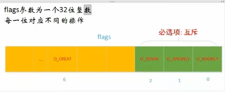

# 两种分区表和格式化

## 分区

 MBR分区表: 最大支持2.1TB硬盘,最多支持4个分区
        主分区:最多只能有4个
        扩展分区:
            最多只能1个
            主分区加扩展分区最多4个
            不能写入数据,只能包含逻辑分区
        逻辑分区
    GPT分区表（全局唯一标示分区表）:GPT支持9.4ZB
    硬盘(1ZB=1024PB，1PB=1024EB，1EB=1024TB)。
    理论上支持的分区数没有限制,但windows限制128个主分区

## 格式化(高级格式化)又称逻辑格式化

​    为了写入文件系统
​    它是指根据用户选定的文件系统(如FAT16,FAT32,NTFS,EXT2,EXT3,EXT4等),
​    在磁盘的特定区域写入特定数据,在区域中划出一片用于存放文件分配表,目录表等用于文件管理的磁盘空间

分区相当于一个柜子,格式化就是对分区进行分格子,会分一个小的和一个大的,然后在大的里面再一个一个分格子叫block(数据块,4kB)block不一定是连续的，系统会尽量连续,一个block是数据存储的最小单元

每个文件都有一个节点号(INode 128B),在分得的小的格子存放了文件的Inode(inode号,权限,时间...)

## 设备文件名

| 硬件  | 设备文件名 |
| ---- | ---- |
|IDE硬盘            | /dev/hd[a-d]     |
|SCSI/SATA/USB硬件  | /dev/sd[a-p]     |
|光驱               | /dev/cdrom或/dev/sr0 |
|软盘               | /dev/fd[0-1] |
|打印机(25针)       | /dev/lp[0-1]  |
|打印机(USB)        | /dev/usb/lp[0-15] |
|鼠标               |  /dev/mouse  |

## 分区设备名称

​    /dev/hda1(IDE硬盘接口)
​    /dev/sda1(SCSI硬盘接口、SATA硬盘接口)

挂载点(使用已经存在的空目录作为挂在点) 类似于windows的盘符
    理论上所有空目录,包括新建目录都可以作为挂载点,但是
    /bin,/lib,/etc要单独分出来

## 挂载

​    必须分区
​        /(根分区)
​        swap分区(交换分区) 注意前面没有/，就是swap是没有挂载点
​            如果真实内存小于4GB,swap为内存的两倍
​            如果真实内存大于4GB,swap为内存一致
​            实验环境,不大于2GB
​    推荐分区 （虽然是推荐分区,但是最好也分区）
​        /boot (启动分区,1GB)
​    常用分区
​        /home （用于文件服务器）
​        /www (用于web服务器)

挂载类型 自动、手动
    类型：自动 手动。
    自动：系统安装创建的挂载点，后期使用会自动与硬盘分区建立联系。
    手动：系统运行过程中，临时添加的U盘，移动硬盘不会被系统应用起来，
    需要手动创建一个文件目录并使其与该硬件进行联系，挂载。

与新硬件形成挂载
    把挂载点目录内部的旧的文件释放出去
    再进行挂载操作

## 目录说明

    bin 存放系统命令的目录,普通用户和超级用户都可以执行.是/usr/bin/目录的软连接
    sbin 存放系统命令的目录,只有超级用户才可以执行. 是/usr/sbin/目录的软连接
    usr 用于存放共享的系统资源
        /usr/bin/ 存放系统命令的目录,普通用户和超级用户
        /usr/sbin/ 存放系统命令的目录,只有超级用户才可以执行.
        /usr/lib/ 应用程序调用的函数库位置
        /usr/local/ 手工安装的软件位置 记住
        /usr/share/ 应用程序的资源文件保存位置,如帮助文档,说明文档,和字体目录
        /usr/src/ 源码包保存位置,我们手工下载的源码包和内核源码包都可以保存这里,习惯上放到/usr/local/src 记住
        /usr/src/kernels/ 内核源码保存位置
    boot 系统启动目录,保存于系统启动相关的文件,如内核文件和启动引导程序
    dev 用于存放设备文件
        例如 /dev/cdrom是光驱
        /dev/skin 是第一块scsi硬盘
    etc 存放系统配置文件(采用默认安装方式rmp安葬)的服务配置文件全部保存在此目录中
        /etc/passwd 用于存储用户信息的文件
        /etc/group   用于存储组别信息文件
    home 存放用户文件的根目录
        用户的"家目录"
        给系统每增加一个”普通用户“的同时，都会在该目录为该用户设置一个文件夹目录
        代表该用户的“家目录”，用户后期使用系统的时候会首选进入其家目录
        家目录名字默认与当前用户名字一致
        用户对家目录拥有绝对最高的权限
        波浪线代表用户处于自己的家目录
    lib 系统调用函数库保存位置。是/usr/lib/的软连接
    lib64 64位系统调用函数库保存位置。是/usr/lib64/的软连接
    lost+found 当系统意外崩溃或意外关机,而产生一些文件碎片存放在这里。当系统启动的过程中fask工具会检查这里,并修复已经损坏的文件系统
    media 挂载目录。系统建议是用来挂载媒体设备的,如软盘和关盘
    misc 挂载目录
    mnt 挂载目录 U盘 习惯上用这个
    opt 该目录类似win系统的c:/Program files目录
        该目录经常用于安装各种软件
        一般习惯安装到/usr/local/
    proc 内存映射目录，该目录可以查看系统的相关硬件信息
        比如 cat cpuinfo 能看到cpu的信号
    sys 虚拟文件系统 和proc目录相似,该目录的数据都保存在内存中,主要保存与内核相关的信息
    net 内存的挂载点 和proc，sys一样
    root 超级用户目录
    selinux 安装增强型的linux
        对系统形成保护
        会对给系统的安装软件时有干扰
        限制root的权限
    srv 服务数据目录
    tmp 用于存放各种临时文件
    var 动态数据保存位置 可变的、易变的
        该目录存储的文件经常会发生变动（增加、修改、删除)
        经常用于部署项目程序文件
        /var/www/html RPM包安装的Apache的网页主目录
        /var/lib/ 程序运行中需要调用或改变的数据保存位置 如：mysql的数据库保存在/var/lib/mysql目录中
        /var/log/ 系统日志保存位置
        /var/run/ 一些服务和程序运行后,它们的PID保存位置。如 /run/目录的软链接
        /var/spool/ 放置队列数据的目录。就是排队等待其他程序使用的数据,比如邮件队列和打印队列
        /var/spool/mail/ 新收到的邮件队列保存位置。系统新收到的邮件会保存在此目录中
        /var/spool/cron/ 系统的定时任务队列保存位置。系统的计划任务会保存在这里
    /run 是各种各样数据的家园
## ext4 

​    类似于win系统的FAT32和NTFS类型
​    给/boot目录单独创建一个分区结构，对其形成保护，避免其他的文件占据该目录空间
​    影响服务器的开关机。

# 网络配置
    对于redhat的系统,一开始没有vim 那么使用setup命令
    配置ip地址和子网掩码
    编辑配置文件 ：
    cd /etc/sysconfig/network-scripts
    cp ifcfg-eth0 ./ifcfg-eth0.bak  修改前先备份
    修改/etc/sysconfig/network-scripts/ifcfg-eth0 做网络的具体配置：
        DEVICE=eth0
        HWADDR=00:0C:29:EE:C7:1B
        TYPE=Ethernet
        UUID=0093d70b-1a03-4195-be15-d840614a776
        ONBOOT=no 
        MM_CONTROLLED=yes
        BOOTPROTO=dhcp
    对默认配置进行修改
        DEVICE=eth0
        HWADDR=00:0C:29:EE:C7:1B
        TYPE=Ethernet
        UUID=0093d70b-1a03-4195-be15-d840614a776
        ONBOOT=yes # 系统自动开启网络
        MM_CONTROLLED=yes 
        BOOTPROTO=static # 改为静态IP
        IPADDR=192.168.174.100 # IP和子网掩码具体配置
        NETMASK=255.255.255.0 # IP和子网掩码具体配置
        GATEWAY=192.168.174.2 # 网关，不设置网关是上不了网的 虚拟机虚拟网卡是192.168.174.1
        DNS1=8.8.8.8
    重启网卡
        service network  restart/stop/start
    本机和linux互相ping通
        问题：本机可以ping同linux，但是linux不能ping通本机。
        解决：关闭本机防火墙
    复制镜像可能需要重置UUID
        vi /etc/sysconfig/network-scripts/ifcfg-eth0
            删除MAC地址行
        rm -rf /etc/udev/rules.d/70-persistent-net.rules
            删除MAC地址和UUID绑定文件
        shutdown -r now
            重启服务器

如果是虚拟机安装的,还需要配置虚拟机的网络配置    

| 连接方式     | 连接网卡     | 是否能连接本机      | 是否能连接局域网     | 是否能连接公网     |
| ---- | ---- | ---- | ---- | ---- |
| 桥接     | 本地真实网卡     | 可以     | 可以     | 可以     |
| NAT     | VMnet8     | 可以     | 不能     | 可以     |
| 仅主机     | VMnet1     | 可以     | 不能     | 不能     |

NAT不会占用真实的ip

# 远程工具
    xshell 个人用户免费版
    secureCRT
    putty 比较古老
    winscp 上传文件

# 注意事项
    linux严格区分大小写
    linux一切皆文件
    linux不靠扩展名区分文件类型,建议写上
    linux中所有的存储设备都必须在挂载之后才能使用
    
    服务器不能关机只能重启,重启之前终止正在执行的服务
        sync 数据同步命令,可以让暂时保存在内存中的数据同步到硬盘上
        shutdown -r now 重启系统 使用这个，在重启之前最好多执行几次sync
    不要在服务器访问高峰运行高负载命令
    远程配置防火墙不要把自己踢出服务器
        防火墙: 基本功能是数据包过滤(IP地址,MAC地址,端口号,协议类型,数据包中数据)
        先写一个系统定时任务,让它每5分钟清空一下防火墙规则,就算写错了也还有反悔的机会,等测试没有问题了再删除这个系统定时任务

# 常用命令

## [root@localhost ~] #

​    []: 这是体是符的分隔符号,没有特殊含义
​    root: 显示的是当前的登陆用户
​    @: 分隔符号,没有特殊含义
​    localhost: 当前系统的简写主机名称
​    ～: 代表用户当前所在的目录 在家目录
​    #: 命令提示符。超级用户#，普通用户是$

## ls--查看目录下有什么文件/目录

​    ls      列出目录的文件信息
​    ls -l   以“详细信息“查看目录文件
​    ll      以“详细信息“查看目录文件
​    ls -a   查看目录全部（包含隐藏文件）文件
​    ls -al  查看目录全部（包含隐藏文件）文件,以“详细信息“展示
​    ls 目录  查看指定目录下有什么文件
​    ls -i   查看文件的i节点号   
​    ls -lh  人性化显示
​    ls -ld  显示目录本身

第一列: 权限
第二列: 引用计数. 文件的引用计数代表该文件的硬链接数个数,而目录的引用计数代表该目录有多少个一级子目录
第三列: 所有者,也就是文件所属哪个用户
第四列: 所属组,也就是文件所属哪个组织
第五列: 文件大小 字节单位
第六列: 文件的修改时间
第七列: 文件名

## cd--进行目录切换

​    cd dirname 进行目录切换
​    cd .. 向上级目录切换
​    cd ~ 或 cd  直接切换到当前的对应的家目录
​    cd - 进入上次所在目录

## mkdir--创建目录

​    mkdir 目录的名字
​    mkdir -p newdir/newdir/newdir 递归方式创建多个连续目录
​                                  新的多级目录数目如果大于等于2个，就要使用-p参数
​    mkdir dir/newdir              不用-p参数
​    mkdir -p dir/newdir/newdir    使用-p参数
​    mkdir dir/newdir/dir/newdir

## rm--删除文件或目录

​    rm 文件
​    rm -r  目录     -r[recursive递归]递归方式删除目录
​    rm -rf 文件/目录 -r force 递归强制方式删除文件 force强制，不需要额外的提示
​    rm -rf /
​    这个删除是不能反悔的,所以再删除之前可以安装extundelete数据恢复软件

## touch--创建文件

​    touch dir1/filename 如果没有此文件,就创建文件,如果有此文件只是修改访问时间,不会修改文件内容的
​    touch filename

## echo--给文件追加内容

​    echo 内容 > 文件名称   把”内容“以覆盖写方式追加给”文件“ 如果文件不存在会创建文件
​    echo 内容 >> 文件名称  把”内容“以追加形式写给”文件“ 如果文件不存在会创建文件

## 查看文件内容

### stat--显示文件系统的详细信息

​	stat filename 显示文件或文件系统的详细信息 linux是没有文件创建时间

### cat--打印文件内容到输出终端

​	cat filename 打印文件内容到输出终端
​	cat -n filename 查看文件并显示行号
​	cat -A filename[相当于-vET选项的整合]  查看文件并列出所有隐藏符号

### more-- 分屏显示文件

​	more filename 分屏显示文件 默认从第一行开始查看,不支持回看
​        b:向上翻页
​        空格:向下翻页
​        回车键:向下滚动一行
​        q:退出查看
​        /字符串:搜索

### less--分行显示文件

​    less filename 分行显示文件
​        通过“上下左右”键查看文件的各个部分内容
​        支持回看
​        q 退出查看

### head--查看文件的头n行内容

​    head -n filename 查看文件的头n行内容

### tail--查看文件的末尾n行内容

​    tail -n filename 查看文件的末尾n行内容
​    tail -f filename 监听文件的新增内容

### wc--查看文件的行数

​    wc filename 查看文件的行数

### od--打开二进制文件

​    od 打开二进制文件
​        -tc

### du--通进文件和子文件的大小

​	  du -h 目标 以K，M，G为单位显示目录或文件占据磁盘空间的大小(block块默认=4k)

### df--查看磁盘空间

​    df -lh 查看系统分区情况

## ln -d--硬链接

​    ln -d 源文件 硬链接文件
​    源文件和硬链接文件拥有相同的Inode和Block
​    修改任意一个文件,另一个都改变
​    删除任意一个文件,另一个都能使用
​    硬链接标记不清,很难确认硬链接文件位置,不建议使用
​    硬链接不能链接目录
​    硬链接不能跨分区

## ln -s--软链接

    ln -s 源文件 软链接文件 相当于快捷方式
​    软链接和源文件拥有不同的Inode和Block
​    两个文件修改任意一个,另一个都改变
​    删除软链接,源文件不受影响，删除源文件,软链接不能使用
​    软链接没有实际数据,只保存源文件的Inode,无论源文件多大,软链接大小不变
​    软链接的权限是最大权限lrwxrwxrwx，但是由于没有实际数据,最终访问时需要参考源文件权限
​    软链接可以链接目录
​    软链接可以跨分区
​    软链接特征明显,建议使用软链接
​    软链接一定要写绝对路径

## cp--文件的复制

​    cp     file1  dir/newfile2     			file1被复制一份到dir并改名字为newfile2
​    cp     file1  dir            			file1被复制一份到dir并改名字为原名字
​    cp     dir1/filea    dir2/newfile       file1被复制一份到dir2并改名字为newfile

## cp -r--目录的复制

需要设置-r[recursive递归]参数，目视目录层次

​    cp -r dir1 dir2            	     dir1被复制到dir2目录下，并改名字为原名
​    cp -r dir1/dir2 dir3/newdir        dir2被复制到dir3目录下，并改名字为newdir
​    cp -r dir1/dir2 dir3/dir4          dir2被复制到dir4目录下，并改名字为原名
​    cp -r dir1/dir2 dir3/dir4/newdir   dir2被复制到dir4目录下，并改名字newdir
​    cp -r dir1 ../../newdir         	 dir1被复制到上两级目录下，并改名字为newdir
​    cp -a 相当于-dpr选项的集合. 目标文件和源文件一模一样
​    cp -d 如果源文件为软链接(对硬链接无效),则复制出的目标文件也为软链接
​    cp -i 询问,如果目标文件已经存在,则会询问是否覆盖
​    cp -p 复制后目标文件保留源文件的属性(包括所有者，所属组、权限和时间)

## date--查看系统时间

​    date
​    date -s "2013-09-13 19:42:30" 给系统设置时间

## mv--移动目录

（文件和目录）剪切

​    mv dir1 dir2           把dir1移动到dir2目录下
​    mv dir1/dir2 dir3       把dir2移动到dir3目录下
​    mv dir1/dir2 dir3/dir4  把dir2移动到dir4目录下
​    mv dir1/dir2 ./         把dir2移动到当前目录下

## mv--改名字（文件和目录）

​    mv dir newdir                   修改dir1的名字为newdir
​    mv dir1 ./newdir                dir1移动到当前目录下，并改名字为newdir
​    mv dir1/dir2 dir3               dir1移动到dir3目录下，并改名字为“原名”  
​    mv dir1/dir2 dir3/newdir        dir1移动到dir3目录下，并改名字为“newdir ”
​    mv dir1/dir2 dir3/dir4          dir2移动到dir4目录下，并改名字为“原名	”
​    mv dir1/dir2 dir3/dir4/newdir   dir2移动到dir4目录下，并改名字为“newdir"   

## chmod--给文件设置权限

- --- --- ---
​    文件类型 主人权限 同组权限 其他组权限
​    linux文件类型
​        -:代表普通文件
​        b:块设备文件
​        c:字符设备文件
​        d:目录文件
​        l:软链接文件
​        p:管道符文件
​        s:套接字文件
​    权限 r(读) w(写) x(执行)
​    字母相对方式设置权限
​        +:增加权限 -:删除权限 =:设置权限
​        u:主人权限 g:同组权限 o:其他组权限
​        针对一个组别设置权限，其他组别没有变化,称为“相对方式”权限设置
​        chmod u+rwx filename 给filename文件的主人增加"读 、写、执行"权限
​        chmod g-rx  filename 给filename文件的同组用户 删除"读 、执行"权限
​        chmod u+/-rwx,g+/-rwx,o+/-rwx filename
​        说明：
​            每个单元“+” "-"  只能使用一个
​            可以同时给一个组或多个组设置权限，组别之间使用“,”分割
​            每个单元的权限可以是rwx中的一个或多个
​            chmod u+w,g-rx,o+rw filename 给filename文件主人增加权限，同组删除读 、执行权限，其他组增加读、写权限
​            chmod u+w,u-x filename 给filename文件主任增加写权限，同时删除执行权限
​            chmod u=rwx,g=r,o=w    不用关心文件的权限直接设置上权限
​            chmod +/-rwx filename  无视具体组别，统一给全部的组设置权限
​            chmod +rw filename     给filename全部用户增加读、写权限
​    数字绝对方式设置权限
​        r读:4 w写:2 x执行:1
​        0:没有权限
​        1:执行
​        2:写
​        3:写、执行
​        4:读
​        5:读、执行
​        6:读、写
​        7:读、写、执行
​        chmod ABC filename ABC分别代表主人、同组、其他组用户的数字权限
​        chmod 753 主人都、写 、执行 ，同组 都执行  其他组用户 写执行
​        常用的数字权限 644 文件基本权限 755目录的基本权限 777最大权限
​    问:字母相对 和数字绝对 方式权限设置取舍?
​    答:修改的权限相对比较少的时候使用“字母方式” 相反，权限变得非常多的时候就使用“数字”方式

## 用户操作

### 用户相关文件/etc/passwd

root:  x:    0:   0:  root:  /root:     /bin/bash
        games: x:    5:   60:  games:/usr/games:/usr/sbin/nologin
        用户名:密码:用户ID:组ID:用户说明:家目录:该用户执行的shell脚本
        用户ID:
            0 超级用户UID.如果用户UID为0,代表这个账号是管理员账号
                那Linux如何把普通用户升级成为管理员呢?就是把其他用户的UID修改为0就可以了,这点和Windows是不同的.
            1-499 系统用户(伪账号)UID.这些UID账号是系统保留给系统系统账户的UID
                也就是说UID是1-499范围内的用户是不能登陆系统的,而是用来运行系统或服务的.其中1-99是系统保留的账号,
                系统自动创建.100-499是预留给用户系统创建系统账号的
            500-65535 普通用户ID.建立的普通用户UID从500开始,最大到65535.
                这些用户足够使用了,但是如果不够也不用害怕,2.6.x内核以后的Linux系统用户UID已经可以支持2的32次方这么多了

### 影子文件/etc/shadow

​        root:*:17960:0:99999:7:::
​        用户名:加密密码:密码最近更改时间:两次密码的修改间隔时间:密码有效期:密码修改到期前的警告天数:密码过期后的宽限天数:
​            密码失效时间:保留
​        加密密码:我们也可以在密码前人为的加入!或*改变加密值让密码暂时生效,使用这个用户无法登陆,达到暂时禁止用户的目的
​            注意所有伪用户的密码都是!!或*,代表没有密码是不能登陆的.当然我新创建的用户如果不设定密码,它的密码也是!!,
​            代表这个用户没有密码,不能登陆
​        密码最近更改时间:
​            date -d "1970-01-01 15775 days"
​            2013年03月11日星期一 00:00:00 CST
​            echo $(($(date --date="2013/03/11" +%s)/86400 +1))    

### 用户组信息文件/etc/group

​        root:x:0:root
​        组名:组密码位:GID:此组中支持的其他用户.附加组是此组的用户
​        初始组:每个用户初始组只能有一个,初始组只能有一个,一般都是和用户名相同的组作为初始组
​        附加组:每个用户可以属于多个附加组.要把用户加入组,都是加入附加组

### 组密码文件/etc/gshadow

​        如果我给用户组设定了组管理员,并给该用户组设定了组密码,组密码就保存在这个文件当中.
​        组管理员就可以利用这个密码管理这个用户组了.

### 用户邮箱目录/var/spool/mail

​        /var/spool/mail

### 用户模板目录/etc/skel/

​        /etc/skel/

### 创建用户

#### 手动添加用户

​            /etc/passwd
​            /etc/shadow
​            /etc/group
​            /etc/gshadow
​            /home/user1
​            /var/spool/mail/user1

#### useradd 选项 用户名

​            -u 550 指定UID
​            -g 组名 指定初始组,不要手工指定
​            -G 组名 指定附加组,把用户加入组,使用附加组
​            -c 说明 添加说明
​            -d 目录 手工指定家目录,目录不需要事先建立
​            -s shell /bin/bash
​        useradd默认值
​            useradd添加用户时参考的默认值文件主要有两个,分别是/etc/default/useradd和/etc/login.defs

#### passwd--设定密码

​        passwd 用户名
​            -l:暂时锁定用户
​            -u:解锁用户
​            --stdin:可以将通过管道符输出的数据作为用户密码.主要在批量添加用户时使用
​        passwd直接回车代表修改当前用户的密码
​        echo "123" | passwd --stdin lamp可以使用字符串作为密码不需要人机交互
​        可以通过命令,把密码修改日期归零(shadow第三字段),这样用户一登陆就要修改密码
​        change -d 0 lamp

### usermod--修改用户

​        usermod
​            -u 用户编号: 修改用户的UID
​            -d 家目录: 修改用户的家目录.家目录必须写绝对路径
​            -c 用户说明: 修改用户的说明信息,就是/etc/passwd文件的第五个字段
​            -g 组名: 修改用户的初始组,就是/etc/passwd文件的第四个字段
​            -G 组名: 修改用户的附加组,其实就是把用户加入其他组用户,常用这个
​            -s shell: 修改用户的登陆shell.默认时/bin/bash
​            -e 日期: 修改用户的失效日期,格式为"YYYY-MM-DD",也就是/etc/shadow文件的第八个字段
​            -L: 临时锁定用户
​            -U: 解锁用户
​        改名usermod -l 新名 旧名,但是不建议,可以删除旧用户,再建立新用户

### userdel删除用户

​		同时删除其家目录

​        userdel username
​        userdel -r username 删除用户同时删除其家目录

### su--切换用户身份

​        su 用户名
​            -:选项只使用-代表连带用户的环境变量一起切换
​            -c 命令:仅执行一次命令,而不切换用户身份

## 组管理操作

配置文件: /etc/group

groupadd--创建组

​        groupadd music
​        groupadd movie
​        groupadd php

groupmod--修改组

​        groupmod -g gid -n 新名字 groupname

groupdel--删除组

​        groupdel groupname 组下边如果有用户存在，就禁止删除

把用户加进组或从组中删除

​        gpasswd 组名
​            -a 用户名:把用户加入组,其实就是把用户加入其他组用户
​            -d 用户名:把用户从组中删除
​       	 	比usermod好用

## chown--修改文件和目录的所有者和所属组

修改文件和目录的所有者和所属组
    chown 主人 filename
        chown user1 abc 把文件abc所有者改为user1
    chown 主人.组别 filename
    chown 主人:组别 filename
        chown root.root bcd
        chown root:root bcd
    chown .组别 filename
    chown :组别 filename 
    chown -R  主人.组别   dir 通过递归方式设置目录的属性组信息
    chown -R  765  dir 通过递归方式设置目录的权限
    chgrp 修改文件和目录的所属组,这个一般不用
        chgrp user1 bcd 给文件bcd修改为user1组
    注意事项
        普通用户可以修改所有者是自己的文件的权限
        普通用户不能修改文件的所有者(哪怕文件是属于普用用户的,也不能送给别人)
        只有超级用户才能修改文件的所有者和所属组

## umask默认权限

​    linux有6种基本权限 r,w,x,umask,...
​    新建了一个文件就有了一个默认权限 保证文件和目录都有权限
​    umask 可以查看到默认文件是系统设置好的
​    系统针对文件新建默认的最大权限666,没有执行(x)权限,执行权限是有危险的
​    系统针对目录新建默认的最大权限777,对于目录没有这个风险
​    umask 033 是临时修改了默认权限,要想永久修改默认权限，必须修改配置文件
​    umask 永久修改默认权限
​        vi /etc/profile 这是环境变量配置文件 里面修改umask值
​    umask默认权限计算方式:
​        二进制进行逻辑与和逻辑非联合运算才得到新建文件和新建目录的默认权限
​        但是这是计算机的计算方式,人类计算它太复杂了,我们可以按照字母来计算
​        文件的默认权限最大只能是666，而umask的值是022
​            -rw-rw-rw- 减去 -----w--w- 等于默认文件的权限 -rw-r--r--
​        目录的默认权限最大可以是777，而umask的值是022
​            drwxrwxrwx 减去 d----w--w- 等于默认目录的权限 drwx-r-xr-x
​            减完是负的就是没有权限,因为没有负的权限

## 帮助命令查看文档命令

###     man --指令查看帮助手册 manual pages

​        man ls
​            上箭头:向上移动一行
​            下箭头:向下移动一行
​            PgUp:向上翻一页
​            PgDn:向下翻一页
​            g:移动到第一页
​            G:移动到最后一页
​            q: 退出
​            /字符串:从当前页向下搜索字符串
​            ?字符串:从当前页向上搜索字符串
​            n:在搜索字符串时,可以使用n键找到下一个字符串
​            N:在搜索字符串时,可以使用N键反向找字符串
​        命令的帮助级别
​            1:普通用户执行的系统命令和可执行文件的帮助
​            2:内核可以调用的函数和工具的帮助
​            3:c语言函数的帮助
​            4:设备和特殊文件的帮助
​            5:配置文件的帮助
​            6:游戏的帮助(个人版的Linux中是有游戏的)
​            7:杂项的帮助
​            8:超级用户可以执行的系统命令的帮助
​            9:内核的帮助
​        man -f 命令 或者 whatis 查看命令拥有哪个级别的帮助
​        man -k 命令 或者 apropos 查看和命令相关所有帮助 没什么用

###     info --指令查看帮助信息是一套完整的资料

​        info ls
​            上箭头:向上移动一行
​            下箭头:向下移动一行
​            PgUp:向上翻一页
​            PgDn:向下翻一页
​            Tab:在有"*"符号的节点间进行切换
​            回车:进入有"*"符号的子页面,查看详细帮助信息
​            u:进入上一层信息(回车是进入下一层信息)
​            n:进入下一小节信息
​            p:进入上一小节信息
​            ?:查看帮助信息
​            q:退出info信息

###     help--只能获取shell内置命令的帮助信息 基本不用

​        什么是shell内置命令(shell自带的)
​            type cd 显示 cd 是 shell 内建
​        什么是外部命令(别人开发的)
​            type mkdir 显示 mkdir 是 /bin/mkdir
​    --help选项
​        ls --help

## 搜索

### whereis

​    whereis 搜索系统命令的命令,不能搜索普通文件，只能搜索系统命令
​        会显示源文件和帮助文档

### which

​    which 搜索系统命令的命令,不能搜索普通文件，只能搜索系统命令
​        如果这个命令存在别名,会显示这个命令的别名

### whoami

​    whoami 查看当前的用户是谁

### locate

​    locate 按照文件名搜索普通文件
​        优点: 按照数据库搜索,搜索速度快,消耗资源小。数据库位置/var/lib/mlocate/mlocate.db
​        缺点: 只能按照文件名来搜索文件,而不能执行更复杂的搜索,比如按照权限,大小,修改,时间等搜索文件
​    updatedb 更新数据库
​        vim /etc/updatedb.conf 禁止了搜索一些

### whatis

​    whatis 指令是干什么的
​    makewhatis 更新whatis数据库

### find

​    find 在目录中搜索文件
​        按照文件名搜索
​            -name 按照文件名搜索
​                find / -name passwd[完全名称] “递归遍历”系统全部目录，寻找名称等于“passwd”文件
​                find / -name "pas*"[模糊查找] 在系统全部目录，模糊查找一个文件是“pas”开始的文件
​                find / -name "*er*"  文件名字出现"er"字样即可，不要位置
​            -iname 按照文件名搜索，不区分文件名大小写
​            -inum  按照inode号搜索
​            可以使用通配符
​        限制查找的目录层级
​            -maxdepth  限制查找的最深目录
​            -mindepth  限制查找的最浅目录
​            find / -name passwd -maxdepth 4
​            find / -maxdepth 4 -mindepth 3 -name passwd 
​        按照文件大小为条件进行文件查找
​            -size   +/-数字
​            +号表示大小大于某个范围
​            -号表示大小小于某个范围
​            大小单位：
​            -size 5   默认单位是512字节  5*512字节
​            -size 10c 单位是“字节”   10字节
​            -size 3k  单位是“千字节” 3*1024字节
​            -size 6M  单位是 “1024*千字节 ” 6M兆字节
​            find ./  -size  14c 在当前目录查找大小等于14字节的文件
​            find  / -size +500M 在系统全部目录里边查找大小大于50M的文件
​        按照文件的修改时间来搜索
​            -atime [+|-]时间: 按照文件访问时间搜索
​            -mtime [+|-]时间: 按照文件数据修改时间搜索
​            -ctime [+|-]时间: 按照文件状态修改时间搜索
​            -5: 代表5天内修改的文件
​             5: 代表前5～6天那一天修改的文件
​            +5: 代表6天前修改的文件
​        按照权限搜索
​            -perm  权限模式: 查找文件权限刚好等于权限模式的文件
​            -perm -权限模式: 查找文件权限全部包含权限模式的文件
​            -perm +权限模式: 查找文件权限全部包含权限模式任意一个权限的文件
​        按照所有者和所属组搜索
​            -uid 用户ID:  按照用户ID查找所有者是指定ID的文件
​            -gid 组ID:   按照用户组ID查找所属组是指定ID的文件
​            -user 用户名: 按照用户名查找所有者是指定用户的文件
​            -group 组名:  按照组名查找所属组是指定用户组的文件
​            -nouser:     查找没有所有者的文件
​            按照所有者和所属组搜索时,"-nouser"选项比较常用,主要用于查找垃圾文件
​            只有一种情况例外，那就是外来文件。比如光盘和U盘中的文件如果是windows复制的,
​            在Linux中查看就是没有所有者的文件;再比如手工源码包安装的文件,也可能没有所有者
​        按照文件类型搜索
​            -type d: 查找目录
​            -type f: 查找普通文件
​            -type l: 查找软链接文件
​        逻辑运算
​            -a: and 与
​            -o: or 或
​            -not: not 非
​            find 目录 条件 逻辑运算符 条件
​            find . -size +1k -a -type f
​            find . -size +1k -o -type f
​            find . -not -name cangls
​        其他选项
​            -exec
​            -ok

​    grep 在文件中搜索符合条件的字符串
​        grep "搜索内容" 文件名
​        -i 忽略大小写
​        -n 输出行号
​        -v 取反
​        --color=auto 搜索出的关键字用颜色显示
​        搜索的内容可以使用正则表达式


## 管道符

命令1 | 命令2
命令1的正确输出作为命令2的操作符号
    ll -a /etc/ | more
    将ll -a /etc/的输出想象是一个临时文件,然后使用more来查看
    ll /etc | grep yum 只要是管道符那么命令1的输出是字符串,命令2要将命令1的内容当作字符串来处理
    统计正在链接的网络链接数量 netstat -an | grep ESTABLISHED | wc -l
其中的许多指令（grep head tail wc ls 等等）都可以当做管道符号使用。
ls -l | wc 计算当前目录一共有多少文件
grep sbin passwd | wc 计算passwd 文件中出现sbin内容的行数
is -l | head -20 | tail -5 查看当前目录中第16-20个文件信息

## grep--查看文件中的字符串

行提取命令

-A 数字: 列出符合条件的行,并列出后续的n行

-B 数字: 列出符合条件的行,并列出前面的n行

-c: 统计找到的符合条件的字符串的次数

-i: 忽略大小写

-n: 输出行号

-v: 反向查找

--color=auto 搜索出的关键字用颜色显示

## alias--别名

​    alias 显示设置命令的别名 照顾管理员的习惯 别名的优先级大于系统的命令
​    alias ser='service network restart'
​    alias 临时生效的,要向永久生效,需要写如环境变量配置文件~/.bashrc

## 快捷键

​    table 补全名称
​    ctrl + A 把光标移动到命令行的开头
​    ctrl + E 把光标移动到命令行的结尾
​    ctrl + C 强制终止当前命令
​    ctrl + L 清屏
​    ctrl + U 删除或剪切光标之前的命令。
​    ctrl + Y 粘贴ctrl + U剪切的内容
​    ctrl + B 向左

​	ctrl + F 向右
​    history 历史操作列表
​    history -c 清除历史命令
​    ctrl + P 向上切换历史操作命令
​    ctrl + N 向下切换历史操作命令
​    ctrl + H 删除光标前面的字符  backspace  
​    ctrl + D 删除光标后面的字符(光标盖住的字符)

cttl + 空格  输入错误不能删除使用这个可以删除


## 压缩

###     zip

​        压缩
​            zip 生成压缩包的名字 压缩的文件
​            zip 生成压缩包的名字 -r 压缩的目录(-r递归操作)
​            zip zna.zip anaconda-ks.cfg
​            zip zna.zip -r aa
​        解压缩
​            unzip 压缩包的名字 默认解压到当前目录
​            unzip 压缩包的名字 -d　指定解压目录
​            uzip ana.zip -d /tmp/

###     gz

​        压缩
​            gzip 源文件 会删除源文件
​            -c: 将压缩数据输出到标准输出中,可以用于保留源文件
​            -r: 压缩目录下的文件,但是不会对这个目录进行压缩,也就是不会打包
​            gzip -c abc >> abc.gz 这样是可以保留源文件的,默认是不保留源文件
​            gzip -r abc
​        解压缩
​            gzip -d
​            gunzip

###     bz2

​        压缩
​            bzip2 源文件 不能压缩目录
​            -k: 压缩时,保留源文件
​            -v: 显示压缩的详细文件
​        解压缩
​            bzip2 -d: 解压缩
​            bunzip2 压缩包的名字

### tar

​    tar 不使用z/j参数, 该命令只能对文件或目录打包
​        -j:	使用bzip2方式压缩文件
​        -z: 使用gzip方式压缩文件
​        -c: 创建,压缩,打包
​        -x:	释放,解压缩,解打包
​        -t: 只是查看包，不解压缩
​        -f: 指定压缩文件的名字
​        -v:	显示提示信息 压缩解压缩 可以省略
​        压缩
​            打包不压缩: tar -cvf test.tar 123 abc bcd
​            打包压缩bzip2: tar -jcvf 生成压缩包的名字(xxx.tar.bz2)　要压缩的文件或目录
​            打包压缩gzip: tar -zcvf 生成压缩包的名字(xxx.tar.gz)　 要压缩的文件或目录    　
​        解压缩
​            解压bzip2: tar -jxvf  xxx.tar.bz2要压缩的名字(默认解压到当前目录)
​            解压gzip:  tar -zxvf  xxx.tar.gz压缩包名字　-C 压缩的目录
​        注意包的后缀名

### rar

​    rar 必须手动安装该软件(sudo apt install rar)
​        -a: 压缩
​        x: 解压缩
​        压缩
​            rar a 生成的压缩文件的名字（temp）　压缩的文件或者目录
​        解压缩
​            rar x　压缩文件名　(解压缩目录)

## 关机和重启

###     sync 数据同步命令

​        刷新文件系统缓冲区
​        可以让暂时保存在内存中的数据同步到硬盘上

###     shutdown

​        -c: 取消已经执行的shutdown命令
​        -h: 关机
​        -r: 重启
​        后面可以跟一个时间
​        shutdown -r 05:30
​        shutdown -r now 重启系统 使用这个，在重启之前最好多执行几次sync

###     reboot 重启系统

​        现在reboot是安全的,但是还是使用shutdown

###     poweroff 关闭系统 

​        不会正确保存的正在使用的数据 不建议使用

###     halt 关闭系统 

​        不会正确保存的正在使用的数据 不建议使用
​    init 3
​    init 5
​    init 0
​    hostname 查看主机名称
​    ps -A 查看系统活跃进程
​    kill -9 pid 杀死系统进程号的进程
​    pwd 查看完整的操作位置


## 网络

​    配置IP地址 参考网络配置

###     ifconfig 查看IP信息

​        enp1s0: flags=4163<UP,BROADCAST,RUNNING,MULTICAST>  mtu 1500
​        #标志                                               最大传输单元
​        inet 10.0.11.147  netmask 255.255.254.0  broadcast 10.0.11.255
​        #IP地址            子网掩码                广播地址
​        inet6 fe80::1a86:574f:5df2:d134  prefixlen 64  scopeid 0x20<link>
​        #IPv6地址(目前没有生效)
​        ether 98:e7:f4:f3:e6:3c  txqueuelen 1000  (以太网)
​        #MAC地址
​        RX packets 85705  bytes 84865698 (84.8 MB)
​        RX errors 0  dropped 0  overruns 0  frame 0
​        #接收的数据包情况
​        TX packets 44099  bytes 6132250 (6.1 MB)
​        TX errors 0  dropped 0 overruns 0  carrier 0  collisions 0
​        #发送的数据包情况

###     ping 刺探网络

​        -b: 后面加入广播地址,用于对整个网段进行刺探
​        -c 次数: 用于指定ping的次数
​        -s 字节: 指定刺探包的大小
​        ping -b -c 4 10.0.11.255 用于探测局域网上有多少台电脑

###     netstat

​        -a: 列出所有网络状态,包括Socket程序
​        -c: 指出每隔几秒刷新一次网络状态
​        -n: 地使用IP址和端口号显示,不使用域名与服务名
​        -p: 显示PID和程序名
​        -t: 显示使用TCP协议端口的链接状态
​        -u: 显示使用UDP协议端口的链接状态
​        -l: 仅显示监听状态的链接
​        -r: 显示路由表
​        netstat -tuln 查询本机所有开启端口
​            Proto: 网络链接协议,一般就是TCP协议和UDP协议
​            Recv-Q: 表示接收到的数据,已经在本地的缓冲中,但是还没有被进程取走
​            Send-Q: 表示从本机发送,对方还没有收到的数据,依然在本地的缓冲中,一般是不具备ACK标志包的数据包
​            Local Address: 本机IP地址和端口号
​            Foreign Address: 远程主机的IP地址和端口号
​            State: 状态
​                LISTEN: 监听状态,只有TCP协议需要监听,而UDP协议不需要监听
​                ESTABLISHED: 已经建立链接状态。如果使用-l选项,则看不到已经建立链接的状态
​                SYN_SENT: SYN发起包,就是主动发起链接的数据包
​                SYN_RECV: 接收到主动链接的数据包
​                FIN_WAIT1: 正在中断的链接
​                FIN_WAIT2: 已经中断的链接,但是正在等待对方主机确认
​                TIME_WAIT: 链接已经中断,但是套接字依然在网络中等待结束
​        netstat -tulnp 查看到是哪个程序占用了端口,并且可以知道这个程序的PID
​        netstat -an 查看所有
​        netstat -rn 查网关

###     write 向指定的登陆的用户发送信息

​        write 用户名 终端号
​        write user1 pts/1
​        hello
​        I will be in 5 mintues to restart, please save your data
​        向在pts/1(远程终端1)登陆的user1用户发送信息,使用Ctrl+D快捷键保存发送的数据

###     wall 向所有的登陆的用户发送信息

​        wall "I will be in 5 mintues to restart, please save your data"
​        Ctrl+D发送的数据

###     mail 邮件

​        发邮件
​            mail user1
​                Subject:hello       <-邮件标题
​                Nice to meet you    <-邮件具体内容
​                .                   <-使用"."来结束邮件输入
​            mail -s "test mail" root < /root/anaconda-ks.cfg 发送文件内容 -s指定邮件的标题
​                把/root/anaconda-ks.cfg文件的内容发送给root用户
​        查看邮件
​            mail 查看邮件
​            N:选择其中一份没有看过的邮件
​            h:列出邮件标题
​            d:删除指定邮件
​            s:保存邮件
​            quit:退出,并把自己操作过的邮件进行保存
​            exit:退出,但是不保存任何操作
​            ?:帮助文档

## 系统痕迹

​    w 显示系统中正在登陆用户的信息
​        14:16:49 up  1:09,  1 user,  load average: 1.89, 1.82, 1.76
​        #系统时间   持续开机时间 登陆用户  系统在1分钟,5分钟,15分钟前的平均负载
​        USER     TTY      来自           LOGIN@   IDLE   JCPU   PCPU WHAT
​        zler     :0       :0               13:09   ?xdm?   2:29   0.01s /usr/lib/gdm3/gdm-x-session --run-script env GNOME_SHELL_SESSION_MODE=ubuntu gnome-session --session=ubuntu
​    who 显示系统中正在登陆用户的信息
​    last 查看系统所有登陆过的用户信息
​    lastlog 查看系统中所有用户最后一次的登陆时间
​    lastb 查看错误登陆的信息

## mount--挂载

​    linux所有的存储设备都必须挂载使用,包括硬盘
​        将空的目录与硬件设备进行链接
​        光盘设备文件名是 /dev/hdc, /dev/sro
​        无论哪个系统的操作系统都有软链接/dev/cdrom与可以作为光盘的设备文件名
​    挂载和卸载光盘
​        mount 查询系统已经挂载的设备
​        mkdir /mnt/cdrom 新建一个空的目录       
​        mount -t iso9660 /dev/cdrom /mnt/cdrom 把光驱挂载到cdrom目录
​        /mnt/cdrom 退出光盘
​        umount /dev/sr0 卸载光驱
​        umount /dev/cdrom (硬件)卸载光驱
​        umount /mnt/cdrom (挂载点)卸载光驱
​        eject 弹出光盘
​    挂载和卸载U盘
​        fdisk -l U盘会和硬盘共用设备文件名,所以U盘的设备文件名不是固定的,需要手工查询/dev/sdb4
​        mkdir /mnt/usb
​        mount -t vfat /dev/sdb4 /mnt/usb/  vfat=windows的FT32
​        mount -t vfat -o iocharset=utf8 /dev/sdb4 /mnt/usb/ 指定字符集显示中文
​        umount /mnt/usb/ 卸载
​    mount
​        -a:依据配置文件/etc/fstab的内容,自动挂载
​        -t 文件系统: 加入文件系统类型来指定挂载的类型,可以ext3,ext4,iso9660等文件系统
​        -l 卷标名: 挂载指定卷标的分区,而不是安装设备文件名挂载
​        -o 特殊选项: 可以指定挂载的额外选项,比如读写权限,同步异步等 如果不指定则默认值生效.
​    挂载NTFS分区
​        linux的驱动加载顺序
​            驱动直接放入系统内核之中.这种驱动主要是系统启动加载必须的驱动,数量较少
​            驱动以模块的形式放入硬盘.大多数驱动都已这种方式保存,保存位置在
​                /lib/modules/3.10.0-862.el7.x86_64/kernel中
​                /lib/modules/5.0.0-31-generic/kernel/中
​            驱动可以被linux识别,但是系统认为这种驱动一般不常用,默认不加载.如果需要加载这种驱动
​                需要重新编译内核,而NTFS文件系统的驱动就属于这种情况
​            硬件不能被linux内核识别,需要手工安装驱动.当然前提是厂商提供了该硬件针对linux的驱动
​                否则就需要自己手动开发驱动了
​        NTFS-3G安装NTFS文件系统模块
​            下载NTFS-3G插件,从官网:http://www.tuxera.com/community/ntfs-3g-download
​            安装NTFS-3G插件
​                要保证gcc安装了
​                tar -zxvf ntfs-3g_ntfsprogs-2013.1.13.tgz
​                cd ntfs-3g_ntfsprogs-2013.1.13
​                ./configure
​                make
​                make install
​            安装完成可以挂载使用windows的NTFS分区了.
​                不过要注意挂载分区时的文件系统不是ntfs，而是ntfs-3g
​                mount -t ntfs-3g /dev/sdb1 /mnt/win

# 通配符

| 通配赋 | 作用                                                         |
| ------ | ------------------------------------------------------------ |
| ?      | 匹配一个任意的字符                                           |
| *      | 匹配0个或者任意多个字符,也可以是匹配任何内容                 |
| []     | 匹配中括号中任意一个字符。例如:abc]代表一定匹配一个字符,或者是a,或者是b,或者是c |
| [-]    | 匹配中括号中任意一个字符, -代表一个范围。例如:[a-z]代表匹配一个小写字母 |
| [^]    | 逻辑非,表示匹配不是中括号内的一个字符。例如:[\^0-9]代表匹配一个不是数字的字符 |

# 正则表达式
    用于匹配字符串,包含匹配
    ?:匹配前一个字符重复0次,或1次
    *:匹配前一个字符重复0次,或任意多次
    []:匹配中括号任意一个字符
        [abc]代表一定匹配一个字符,或者是a,或者是b，或者c
    [-]:匹配中括号任意一个字符，-代表一个范围
        [a-z]代表匹配一个小写字母
    [^]:逻辑非,表示匹配不是中括号内的一个字符
        [^0-9]代表匹配一个不是数字的字符
    ^: 匹配行首  
    $: 匹配行尾

# vim
    vim是一个全屏幕纯文本编辑器,是vi的增强版
    alias vi='vim'，永久生效,请放入环境变量配置文件(~/.bashrc)
    进入编辑器模式
        a: 光标所在字符后插入
        A: 光标所在字符行尾插入
        i: 光标所在字符前插入 不发生任何变换
        I: 光标所在行行首插入
        o: 在光标下插入新行
        O: 在光标上插入新行
        s: 删除光标所在字符
    尾行模式的操作
        ZZ保存退出
        :q 退出编辑器
        :w 对修改后的内容进行保存
        :wq 保持修改并退出编辑器
        :q! （不保存）强制退出编辑器
        :w! 强制保存
        :wq! 强制保存并退出编辑
        :set nu   设置行号
        :set nonu 取消行号
        :数字 跳转到光标所在行
        查找
            :/查找内容 从光标所在行向下查找
            :?查找内容 从光标所在行向上搜索
                n 下一个
                N 上一个
        替换
            :s/cont1/cont2/  替换光标所在行的第一个cont1 字符串cout1被替换为cont2
            :1,10s/cont1/cont2/g  替换1到10行的所有字符串cout1被替换为cont2
            :s/cont1/cont2/g 替换光标所在行的全部cont1
            :%s/cont1/cont2/g 替换整个文档的cont1
            :1,10s/^/#/g 注释1到10行 ^代表行首
            :1,10s/^#//g 取消注释
            :1,10s/^/\/\//g 注释1到10行
            :1,10s/^\/\///g 取消注释
    命令模式操作
        移动光标
            字符级
                左 下 上 右  移动光标
                h  j  k l 
            单词级
                w：word移动到下个单词的首字母
                e:    end 移动到下个（本）单词的尾字母
                b:    before移动到上个（本）单词的首字母
            行级
                $:    行尾
                0:    行首
                ^:    行首
            段落级
                {：上个（本）段落首部
                }：下个（本）段落尾部
            屏幕级
                H：屏幕首部
                L: 屏幕尾部
            文档级
                gg:移动到文件头
                G:文档尾部
                1G：文档第一行
                nG:文档第n行
        内容删除
            dd:  删除光标当前行
            2dd：包括当前行在内，向后删除2行内容
            ndd：包括当前行在内，删除后边n行内容
            :10,20d 删除指定范围内的行
            x:   删除光标所在字符
            nx:  删除光标所在字符的n个字母
            dG:  从光标所在行删到文件尾
            cw:  从光标所在位置删除至单词结尾，并进入编辑模式        
        内容复制
            yy:  复制光标当前行
            2yy： 包括当前行在内，向后复制2行内容
            nyy： 包括当前行在内，复制后边n行内容
            p：   对（删除）复制好的内容进行粘贴到光标后
            P：   对（删除）复制好的内容进行粘贴到光标前
        相关快捷键
            u: 撤销
            ctrl+r: 反撤销
            J： 合并上下两行
            r： 单个字符替换
            R: 从光标所在处开始替换字符,按ESC结束
            .点：重复执行上次最近的指令
    vim的配置文件"~/.vimrc"，把你需要的参数写入配置文件   
        :syntax on  开启语法颜色
        :syntax off 关闭语法颜色
        :set hlsearch 高亮显示
        :set nohlsearch 不高亮显示
        :set ruler 右下角的状态栏
        :set noruler 不右下角的状态栏
        :set showmode 设置左下角的状态栏入INSERT
        :set noshowmode 取消左下角的状态栏入INSERT
        :set list 设置显示隐藏字符
        :set nolist 设置不显示隐藏字符
        :set tx=4 设置Tab为4个空格
    使用技巧
        导入文件内容
            :r 文件名 把文件的内容导入到光标处
            :r!命令 在vim中执行系统命令
            :r !命令 在vim中执行系统命令,并把结果导入到光标所在行
        设定快捷键
            :map 快捷键 快捷键的命令 自定义快捷键
            :map ^P I#<ESC> 按"ctrl + p"时,在行首加入注释
            :map ^B ^x      按"ctrl + b"时,删除行首第一个字母(删除注释)
            :map ^D yyp     复制当前行到下一行
            注意:^P快捷键不能手工输入,需要执行ctrl+v然后ctrl+p
        字符替换
            :ab 源字符 替换字符 
            :ab mymail shenchao@163.com 当碰到"mymail"时,转变为邮箱
        多文件打开
            vim -o abc bcd 上下分屏打开两个文件
            ctrl+w加左右箭头来切换屏幕
            vim -O abc bcd 左右分屏打开两个文件
            ctrl+ww:来切换屏幕
            :wqall保存所有文件   

# 软件包管理
    软件包分类
        源码包
            开源,如果有足够的能力,可以修改源代码
            可以自由选择需要的功能
            软件是编译安装,所以更加适合自己的系统,更加稳定也更加高效
            卸载方便
            安装过程步骤较多,尤其安装较大的软件集合时(如LAMP),容易出现拼写错误
            编译过程时间较长,安装比二进制安装时间长
            因为是编译安装,安装过程中一旦报错新手很难解决
        二进制包
            window的.exe
            linux的debian和ubuntu的.dpkg
            linux的redhat的.rpm
    软件包安装建议
        源码包:如果服务是给大量客户端访问的,建议使用源码包,源码包效率高(LAMP)
        二进制包:如果程序是给少量用户访问,或者本地使用的,建议RPM或者dpkg包,因为RPM或者dpkg包管理方便
    rpm和yum
        windwos控制面板 添加/卸载程序 进行程序的安装,更新,卸载,查看,Setup.exe
        包的依赖性
        包全名:如果操作的是未安装软件包,则使用全包名,而且需要注意绝对路径
        包名:如果操作的是已经安装的软件包,则使用包名即可,系统会生产RPM包的数据库(/var/lib/rpm),
            而且可以在任何路径使用
        rpm命令:相当于windows的添加/卸载程序,进行程序的安装、更新、卸载、查看Step.exe
        安装: rpm -ivh 包全名 安装包
            -i: install
            -v: 显示更详细的信息
            -h: 打印显示安装进度
            --nodeps:不检查依赖性
            --prefix:指定安装位置,不建议指定位置,rpm包安装会记录安装位置的数据库,卸载的时候会找到并卸载，
                源码包安装需要指定安装位置,不然默认位置乱放,不好卸载,源码包卸载很简单直接删除安装目录
            --force:强制安装,不管是否已经安装,都重新安装
                如果一个软件的文件被我们误删除,那么没法启动这个软件,可以使用强制安装,再重新安装一片
            --test:测试安装,不会实际安装,只是检测一下依赖性
            rpm包安装后软件的位置，不是绝对的只是大部分
                /etc/ 配置文件安装目录
                /usr/bin/ 可执行的命令安装
                /usr/lib/ 程序所使用的函数库保存位置
                /usr/share/doc/ 基本的软件使用手册保存位置
                /usr/share/man/ 帮助文档保存位置
            rpm安装的包如何启动
                service 服务名 start|stop|restart|status
                /etc/rc.d/init.d/httpd start|stop|restart
                service搜索的也是/etc/rc.d/init.d/目录
        升级: rpm -Uvh 包全名
            这个只是升级安装包
        升级安装: rpm -Fvh 包全名
            升级安装包并安装
        卸载: rpm -e 包名
            --nodeps:不检查依赖性
            -e: 卸载
            卸载的时候也会按照安装的依赖卸载
        查看:rpm -q 包名
                查询是本地是否已安装
            rpm -qa 包名
                查询所有
            rpm -qi 包名
                查询软件信息
            rpm -qip 包全名
                查还没有安装的软件包的信息
            rpm -ql 包名
                查询已经安装的软件包中的文件列表和安装的完整目录
            rpm -qlp 包全名
                查询还没有安装的软件包中的文件列表和打算安装的位置
            rpm -qf 系统文件名
                查询系统文件属于哪个包
            rpm -qR 包名
                查询所有系统中和已经安装的软件包的依赖关系的软件包
            rpm -Va
                校验本机已经安装的所有软件包
                校验是为了保证是否是正版的比如:md5加密的文件包
                验证的包的内容比如大小,配置文件,等等
            rpm -V 包名
                校验本机已经安装的软件包
            rpm -Vf 系统文件名
                校验某个系统文件是否被修改
            rpm -g 包全名
                查看软件是否有安装
            rpm2cpio 包全名 | cpio -idv . 文件绝对路径
                提取RPM包中文件，比如httpd的配置文件
        数字证书:
            校验方法只能对已经安装的RPM包中的文件进行校验,但如果RPM包本身就被动手脚,
            那么校验就不能解决问题。
            数字证书的特点:
                首先必须找到原厂的公钥文件,然后进行安装
                再安装RPM包,会去提取RPM包中的证书信息,然后和本机安装的原厂证书进行验证
                如果验证通过,则允许安装;如果验证不通过,则不允许安装并警告
            数字证书的位置:
                光盘里面RPM-GPG-KEY-CentOS-6
                本机/etc/pki/rpm-gpg/RPM-GPG-KEY-CentOS-6
            数字证书导入
                rpm --import RPM-GPG-KEY-CentOS-6
            查看系统安装过的数字证书
                rpm -qa | grep gpg-pubkey
        yum:相当于可以联网的rpm命令
            相当于先联网下载程序安装包、程序的更新包,自动执行rpm命令
            联网安装的话,不需要手动解决安装包的各种依赖包
            yum源配置文件保存在/etc/yum.repos.d/目录中,文件的扩展名一定是"*.repo"
            yum操作大部分是要访问源服务器
            yum list 
                查询所有可用软件包列表
            yum list 包名
                查询yum源服务器中是否包含某个软件包
            yum search 关键字
                搜索服务器上所有和关键字相关软件包
            yum info 包名
            yum -y install 包名
                -y:自动回答yes
            yum -y update 包名
            yum remove 包名
            yum grouplist 
                查看可以安装的软件组
            yum groupinfo 软件组名
                查看软件组的详细信息
            yum -y groupinstall 软件组名
                安装软件组
            yum groupremove 软件组名
                卸载软件组
    dpkg和apt-get
        dpkg -i package.deb 	    安装包
        dpkg -r package 	        删除包
        dpkg -P package 	        删除包（包括配置文件）
        dpkg -L package 	        列出与该包关联的文件
        dpkg -l package 	        显示该包的版本
        dpkg –unpack package.deb 	解开 deb 包的内容
        dpkg -S keyword 	        搜索所属的包内容
        dpkg -l 	                列出当前已安装的包
        dpkg -c package.deb 	    列出 deb 包的内容
        dpkg –configure package 	配置包
        apt-get命令:相当于可以联网的dpkg命令
            相当于先联网下载程序安装包、程序的更新包,自动执行dpkg命令
    源码包安装
        下载软件包
        解压缩
        进入解压缩文件
        ./configure: 编译前准备
            安装之前需要检测系统环境是否符合安装要求
            自定义需要的功能选型./configure支持的功能选项较多,可以执行./configure --help命令、
                查询支持的功能.一般都会通过./configure --prefix=安装路径,来指定安装路径
            把系统环境的检测结果和定义好的功能选项写入Makefile文件,后续的编译和安装需要依赖这个文件的内容
            Makefile只有执行了./configure后才会生成这个文件
        make: 编译
            make会调用gcc编译器,并读取Makefile文件中的信息进行系统软件编译.编译的目的就是把源码程序转变成
                为linux识别的可执行文件,这些可执行文件保存在当前目录下.编译过程较为耗时,需要有足够的耐性
        make clean: 清空编译内容(非必须步骤)
            如果在./configure或make编译中报错,那么我们在重新执行命令前一定要记得执行make clean命令,它
                会清空Makefile文件或编译产生的.o头文件
        make install: 编译安装
            这才是真正的安装过程,一般会写清楚程序的安装位置.如果忘记指定安装目录,则可以把这个命令的执行过程
                保存下来,以备将来删除使用
    打入补丁
        diff -Naur /root/test/old.txt /root/test/new.txt > txt.patch
            比较两个文件的不同,同时生成txt.patch补丁文件
        patch -pn < 补丁文件
            按照补丁文件进行更新
    脚本安装程序
        就是一个shell脚本,里面写了一些RPM包和源码包的安装命令
        Webmin软件
            这个是用web浏览器来管理linux服务器的一个软件
            http://sourceforge.net/projects/webadmin/files/webwin/
            https://sourceforge.net/projects/webadmin/files/webmin/1.930/webmin-1.930.tar.gz/download
        tar -zxvf webmin-1.930.tar.gz
        ./Setup.sh

# ACL权限管理
    用于解决用户对文件身份不足的问题的
    不再考虑文件的所属组和所属人,直接赋予用户可执行的权限
    开启ACL
        dumpe2fs -h /dev/sda3
        -h 仅显示超级块中信息,而不显示磁盘块组的详细信息
    手工开启ACL权限
        mount -o remount,acl /
            重新挂载根分区,并挂载加入acl权限,临时生效的
        也可以通过修改/etc/fstab文件,永久开启ACL权限:
            vi /etc/fstab
            UUID=44d25e35-ae89-4c93-b453-08ba076ce37a / ext4    defaults,acl 0    1
        mount -o remount
    基本命令
        getfacl 文件名 
            查询文件的ACL权限
        setfacl 选项 文件名 设定ACL权限
            -m 设定ACL权限
            -b 删除ACL权限
            -x:用户 删除单个用户的ACL权限
        setfacl -m u:用户名:权限 文件名
            setfacl -m u:aa:rwx /test
            setfacl -m u:aa:rx -R soft/ 只对已经存在的文件生效
            setfacl -m d:u:aa:rwx -R /test 只对以后新建的文件生效
        setfacl -m g:组名:权限 文件名
            setfacl -m g:组名:权限 文件名
        ACL权限,一旦递归之后,不可避免的出现权限益出
    最大有效的权限mask
        setfacl -m m:rx project/
            修改mask权限
        getfacl 查看文件权限时有 mask::rwx
    删除ACL权限
        setfacl -x u:st /project/
            删除指定用户和用户组的ACL权限
        setfacl -b /project/
            会删除文件的所有的ACL权限
    sudo授权 给普通用户赋予部分管理员权限
        授予的权限越详细,普通用户得到的权限越小
        授予的权限越简单,普通用户得到的权限越大
        visudo 赋予普通用户权限命令,命令执行之后和vi一样使用
            root ALL=(ALL) ALL
                用户名 被管理主机的地址=(可使用的身份) 授权命令(绝对路径)
            %wheel ALL=(ALL) ALL
                %组名 被管理主机的地址=(可使用的身份) 授权命令(绝对路径)
        例子授权用户user1,可以重启服务器
            visudo
            user1 ALL=/sbin/shutdown -r now
            sudo -l 查看可用的授权
            sudo /sbin/shutdown -r now
        例子授权user1可以添加用户并且可以修改密码,但不能修改root
            user1 ALL=/usr/sbin/useradd
            user1 ALL=/usr/bin/passwd [A-Za-z]*, !/usr/bin/passwd "", !/usr/bin/passwd root
    文件特殊权限SetUID,SetGID,Sticky BIT
        特殊权限
            SUID:只能针对执行程序
            SGID:既可以针对执行文件
                 也可以针对目录文件
            SBIT:只能针对目录
        SetUID
            只有可以执行的二进制程序才能设定SUID权限
            命令执行者要对该程序拥有x(执行)权限
            命令执行者在执行程序时获得该程序文件属主的身份(在执行程序的过程中灵魂附体为文件的属主)
            SetUID权限只在该程序执行过程中有效,也就是说身份改变只在程序执行过程中有效
            几点建议
                关键目录应严格控制写权限.
                用户的密码设置要严格遵循密码三原则
                对系统中默认应该具有SetUID权限的文件作一列表,定时检查有没有这之外的文件被设置了SetUID权限
        SetGID
            既可以针对文件生效,也可以针对目录生效,这和SUID明显不同
            如果针对文件
                只有可执行的二进制程序才能设置SGID权限
                命令执行者要对该程序拥有x(执行)权限
                命令执行在执行程序的时候,组身份升级为该程序文件的属组
                SetGID权限同样只在该程序执行过程中有效,也就是说组身份改变只在程序执行过程中有效
            如果针对目录
                普通用户必须对此目录拥有r和x权限,才能进入此目录
                普通目录在此目录中的有效组会变成此目录的属组
                若普通用户对此目录拥有w权限时,新建的文件的默认属组是这个目录的属组
        Sticky BIT
            黏着位目前只针对目录有效
            普通用户对该目录拥有w和x权限,即普通用户可以在此目录拥有写入权限
            如果没有黏着位,因为普通用户拥有w权限,所以可以删除此目录下所有文件,包括其他用户建立的文件.
                一旦赋予了黏着位,除了root可以删除所有文件,普通用户就算拥有w权限,也只能删除自己建立的、
                文件,但是不能删除其他用户建立的文件.
        设定文件特殊权限
            4代表SUID
                chmod 4755 ftest (也可以u+s)
            2代表SGID
                chmod 2755 ftest (也可以g+s)
            1代表SBIT
                chmod 1755 ftest (也可以o+t)
    文件系统属性chattr权限
        可以包括root在内用户的权限
        命令格式
            chattr [+=] 选项 文件或目录名
            +: 增加权限
            -: 删除权限
            =: 等于某权限
            i: 如果对文件设置i属性,那么不允许对文件进行删除,改名,也不能添加和修改
                数据;如果对目录设置i属性,那么只能修改目录文件的数据,但不允许建立删除
                文件
            a: 如果对文件设置a属性,那么只能在文件增加数据,但是不能删除也不能修改数据;
                如果对目录设置a属性,那么只允许在目录中建立和修改文件,但是不允许删除
            e: Linux中绝大多数的文件都默认拥有e属性.表示该文件是使用ext文件系统进行
                存储的,而且不能使用chattr -e命令取消e属性
        查看文件系统属性lsattr
            lsattr 选项 文件或目录名
            -a: 显示所有文件和目录
            -d: 若目标是目录,仅列出目录本身的属性,而不是子文件的

# 文件系统管理

## linux文件系统的特性

- super block(超级块):记录整个文件系统的信息,包括block与inode的总量,已经使用的inode和block的数量,未使用的inode和block的数量,block与inode的大小,文件系统的挂载时间,最近一次写入时间,最近一次的磁盘检查时间等. 

  dumpe2fs -h /dev/sda1

- data block(数据块,也称作block):用来实际保存数据的(柜子的隔断),block的大小(1KB、2KB或4KB)和数量在格式化后就已经决定,不能改变,除非重新格式化(制作柜子的时候,隔断大小就已经决定,不能改变,除非重新制作柜子).每个block只能保存一个文件的数据,要是文件数据小于一个block块,那么这个block的剩余空间不能被其他使用,要是文件数据大于一个block块,则占用多个block块.Windows中磁盘碎片整理工具原理就是把一个文件占用的多个block块尽量整理在一起,这样可以加快读写速度.

- inode(i节点,柜子门上的标签):用来记录文件的权限(r,w,x),文件的所有者和属组,文件的大小,文件的状态改变时间(ctime),文件的最近一次读取时间(atime),文件的最近一次修改时间(mtime),文件的数据真正保存的block编号.每个文件需要占用一个inode.

## linux常见文件系统

| 文件系统 | 描述                                                         |
| -------- | ------------------------------------------------------------ |
| ext      | linux中最早的文件系统,由于在性能和兼容性上具有很多缺陷,现在已经很少使用 |
| ext2     | 是ext文件系统的升级版本,Red Hat Linux7.2版本以前的系统默认都是ext2文件系统.于1993年发布,支持最大16TB的分区和最大2TB的文件(1TB=102GB=1024x1024KB) |
| ext3     | 是ext2文件系统的升级版本,最大的区别就是带日志功能,以便在系统突然停止时提高文件系统的可靠性.支持最大16TB的分区和最大2TB的文件 |
| ext4     | 是ext3文件系统的升级版本.ext4在性能、伸缩性和可靠性方面进行了大量的改进.ext4的变化可以说是翻天覆地的.比如向下兼容ext3、最大1EB文件系统和16TB文件、无限数量子目录、Extents连续数据块概念、多块分配、延迟分配、持久预分配、快速FSCK、日志校验、无日志模式、在线碎片整理、inode增强、默认启动barrier等.它是CentOS6.x的默认文件系统 |
| xfs      | XFS最早针对IRIX操作系统研发,是一个高性能的日志型文件系统,能够在断电以及操作系统崩溃的情况下保证文件系统数据的一致性.它是一个64位的文件系统,后来进行开源并且移植到了Linux操作系统中,目前CentOS 7.x将XFS+LVM作为默认的文件系统.据官方所称,XFS对于打文件的读写性能较好. |

## 常用的硬盘命令

1. df命令

   df -ahT

   -a 显示特殊文件系统,这些文件系统几乎都是保存在内存中的.如/proc,因为是挂载在内存中,所以占用量都是0

   -h 单位不再只用KB,而是换算成习惯单位

   -T 多出了文件系统类型一列

2. du命令

   du [选项] [目录或文件名]

   -a 显示每个子文件的磁盘占用量.默认只统计子目录的磁盘战用量

   -h 使用习惯单位显示磁盘占用量,如KB，MB或GB等

   -s 统计总占用量,而不列出子目录和子文件的占用量

   du和df的区别:

   ​	du是用于统计文件大小的,统计的文件大小是准确的

   ​	df是用于统计空间大小的,统计的剩余空是准确的

   lsof | grep deleted 查看被删除的文件,然后一个进程一个进程的手工kill也是可以的

3. fsck 文件系统修复命令

   fsck -y /dev/sdb1 自动修复

4. 显示磁盘状态dumpe2fs

   dumpe2fs -h /dev/sda1

5. 查询文件的详细时间

   stat test.sh

6. 判断文件类型

   file 文件名 判断文件类型

   type 命令名 判断命令类型

7. fdisk命令手工分区

   1. fdisk -l

      查看系统所有硬盘及分区

   2. fdisk /dev/sdb 进行磁盘分区(分区还没有分区号)

      | 命令 | 说明                                                       |
      | ---- | ---------------------------------------------------------- |
      | a    | 设置可引导标记                                             |
      | b    | 编辑bsd磁盘标签                                            |
      | c    | 设置DOS操作系统兼容标记                                    |
      | d    | 删除一个分区                                               |
      | l    | 显示已知的文件系统类型. 82为Linux swap分区,  83为Linux分区 |
      | m    | 显示帮助文档                                               |
      | n    | 新建分区                                                   |
      | o    | 建立空白DOS分区表                                          |
      | p    | 显示分区列表                                               |
      | q    | 不保存退出                                                 |
      | s    | 新建空白SUN磁盘标签                                        |
      | t    | 改变一个分区的系统ID                                       |
      | u    | 改变显示记录单位                                           |
      | v    | 验证分区表                                                 |
      | w    | 保存退出                                                   |
      | x    | 附加功能(仅专家)                                           |

   3. partprobe 

      强制重读所有分区文件,重新挂载分区文件内所有分区.这不是分区必须命令,如果没有提示重启,可以不执行,也可以重启系统

      如果这个命令不存在请安装parted-2.1-18.e16.i686这个软件包

   4. 格式化 建立文件系统 ext3是linux默认文件系统

      mkfs -t ext4 /dev/sdb1

      mkfs -t ext4 /dev/sdb5

      mkfs命令非常简单易用,不过是不能调整分区的默认参数的(比如块大小是4096)，这些默认参数除非特殊情况,否则不需要调整,如果想要调整就需要使用mke2fs命令进行格式化,命令格式如下

      mke2fs [选项] 分区设备文件名

      ​	-t 文件系统: 指定格式化成哪个文件系统, 如 ext2, ext3, ext4

      ​	-b 字节: 指定block块的大小

      ​	-i 字节: 指定"字节/inode"的比例,也就是多少个字节分配一个inode

      ​	-j : 建立带有ext3日志功能的文件系统

      ​	-L 卷标名 : 给文件系统设置卷标名,就不使用e2label命令

      mke2fs -t ext4 -b 2048 /dev/sdb6 格式化分区,并指定block的大小为2048

   5. 建立挂在点

      mkdir /disk1 ------ /dev/sdb1

      mkdir /disk5------ /dev/sdb5

   6. 挂载

      mount /dev/sdb1  /disk1

      mount /dev/sdb5  /disk5

   7. 查看

      mount 查看所有已经挂载的分区和光盘

      fdisk -l 查看系统分区

      df 查看分区占用百分比

   8. 自动挂载

      修改分区自动挂载文件

      vi /etc/fstab 注意:此文件直接参与系统启动,如果修改错误,系统启动报错

      /dev/sdb1  /disk1  ext3 default  1  2

      第一列: 设备文件名

      第二列: 挂载点

      第三列: 文件系统

      第四列: 挂载选项

      第五列: 1 是否可以备份 0 不备份 1 每天备份 2 不定期备份

      第六列: 2 是否检查磁盘fsck 0 不检测 1 启动时检测 2 启动后检测

      dumpe2fs /dev/sdb5

      ls -l /dev/disk/by-uuid/

   9. mount -a

      重新挂载所有内容,最好是重启机器

8. /etc/fstab/文件修复

   mount -o remount,rw /

9. parted命令分区

   我们linux系统中有两种常见的分区表MBR(主引导记录分区表)和GPT分区表(GUID分区表)其中:

   - MBR分区表: 支持的最大分区是2TB(1TB=1024GB);最多支持4个主分区,或3个主分区1个扩展分区

   - GPT分区表: 支持最大18EB的分区(1EB=1024PB=1024*1024TB);最多支持128个分区,其中1个系统保留分区,127个用户自定义分区

     不过parted命令也有点小问题,就是命令本身分区的时候只能格式化ext2文件系统,不支持ext3文件系统,那就更不用说ext4文件系统了(截止到CentOS 6.8还是这样,这里只是指不能用parted命令把分区格式化成ext4文件系统,但是parted命令还是可以识别ext4文件系统的).不过这没多大的影响,因为我们可以先分区再用mkfs进行格式化麻!

     

     parted交互模式

     重启之前,一定要把/etc/fstab之前分区的内容删除掉

     parted /dev/sdb

     help

     | parted交互命令                          | 说明                                  |
     | --------------------------------------- | ------------------------------------- |
     | check NUMBER                            | 做一次简单的文件系统测试              |
     | cp [FROM-DEVICE] FROM-NUMBER TO-NUMBER  | 复制文件系统到另外一个分区            |
     | help [COMMAND]                          | 显示所有的命令帮助                    |
     | mklabel,mktable LABEL-TYPE              | 创建新的磁盘卷标(分区表)              |
     | mkfs NUMBER FS-TYPE                     | 在分区上建立文件系统                  |
     | mkpart PART-TYPE [FS-TYPE] STAT END     | 创建一个分区                          |
     | mkpart PART-TYPE FS-TYPE STAT END       | 创建分区,并建立文件系统               |
     | move NUMBER START END                   | 移动分区                              |
     | name NUMBER NAME                        | 给分区命名                            |
     | print [devices\|free\|list,all\|NUMBER] | 显示分区表,活动设备,空闲空间,所有分区 |
     | quit                                    | 退出                                  |
     | rescue START END                        | 修复丢失的分区                        |
     | resize NUMBER START END                 | 修改分区大小                          |
     | rm NUMBER                               | 删除分区                              |
     | select DEVICE                           | 选择需要编辑的设备                    |
     | set NUMBER FLAG STATE                   | 改变分区标记                          |
     | toggle [NUMBER [FLAG]]                  | 切换分区表的状态                      |
     | unit UNIT                               | 设置默认的单位                        |
     | Version                                 | 显示版本                              |

     mklabel gpt?Ignore?yes 重启

     

     建立分区

     ​	mkpart?disk1?ext2?1MB?2MB

     建立文件系统

     ​	mkfs 格式化

     格式化 ext4

     ​	使用系统的mkfs -t ext4 /dev/sdb1

     挂载mount /dev/sdb1  /disk1/

     自动挂载vi /etc /fstab

     调整分区大小

     ​	unmount /dev/sdb1

     ​	parted /dev/sdb

     ​	resize

     ​		注意先的把文件类型该为ext2才可以

     删除分区

     ​	要把自动挂载的取消掉

     ​	rm

     到底使用fdisk进行分区?还是parted命令呢? 看个人习惯,看硬盘的大小

10. 分配swap分区

    1. 分区,并修改swap分区ID
    
       free -h 查看内存
    
       fdisk /dev/sdb
    
    2. 格式化
    
       mkswap /dev/sdb1
    
    3. 使用swap
    
       free -h
    
       swapon  /dev/sdb1 临时生效
    
       让swap分区开机之后自动挂载
    
       ​	  vi /etc/fstab
       ​        /dev/sdb1  swap swap     defaults  0   0

# 高级文件系统管理

## 磁盘配额

用户配额和组配额

磁盘容量限制和文件个数限制

软限制和硬限制

宽限时间	

## LVM 逻辑卷管理

P103

# shell

## 概念

cat /etc/shells

bash

csh

## shell 脚本执行方式

### echo 命令

echo [选项] [输出内容]

-e: 支持反斜线控制的字符转换

-n: 取消输出后行末的换行符号(就是内容输出后不换行)

在echob命令中如果使用了"-e"选项,则可以支持控制字符如下表:

| 控制字符 | 作用                                                        |
| -------- | ----------------------------------------------------------- |
| \\\\     | 输出\\本身                                                  |
| \a       | 输出警告音                                                  |
| \b       | 退格键,也就是向左删除键                                     |
| \c       | 取消输出行末的换行符.和"-n"选项一致                         |
| \e       | ESCAPE键                                                    |
| \f       | 换页符                                                      |
| \n       | 换行符                                                      |
| \r       | 回车键                                                      |
| \t       | 制表符,也就是Tab键                                          |
| \v       | 垂直制表符                                                  |
| \0nnn    | 按照八进制ASCII码表输出字符,其中0为数字零,nnn是三位八进制数 |
| \xhh     | 按照十六进制ASCII码表输出字符,其中hh是两位十六进制数        |

echo -e  "\a"

echo -e  "\x61"

echo -e  "\e[1;31m  abc \e[0m" 

​	给字符串加上颜色 

​	\e[1;  颜色的开始

​	31m 代表颜色

​			30m=黑色

​			31m=红色

​			32m=绿色

​			33m=黄色

​			34m=蓝色

​			35m=洋红

​			36m=青色

​			37m=白色

​			41开头是给字符串加上背景色

​	abc 内容

​	\e[0m 颜色的结束

### shell脚本执行方法

```shell
#!/bin/bash

echo "11111111! "

```

chmod 755 hello.sh

./hello.sh

## Bash基本功能

### history--历史命令

history [选项] [历史命令保存文件]

-c: 清空历史命令

-w: 把缓存中的历史命令写入历史命令保存文件.如果不手工指定历史命令保存文件,则放入默认历史命令保存文件~/.bash_history中

vi /etc/profile

​	HISTSIZE=1000 修改历史命令保存的数量

历史命令的调用

​	如果想要使用原先的历史命令有这样几种方法:

​		使用上、下箭头调用以前的历史命令

​		使用"!n"重复执行第n条历史命令

​		使用"!!"重复执行上一条历史命令

​		使用"!字符串"重复执行最后一条以字符串开头历史命令

​		使用"!$"重复上一条历史命令的最后一个参数

### alias--别名

命令的执行顺序

1. 用绝对路径或相对路径执行的命令
2. 别名
3. bash的内部命令
4. 按照$PATH环境变量定义的目录查找顺序找到第一个命令

### 输入输出重定向

1. bash的标准输入输出

   | 设备   | 设备文件名  | 文件描述符 | 类型         |
   | ------ | ----------- | ---------- | ------------ |
   | 键盘   | /dev/stdin  | 0          | 标准输入     |
   | 显示器 | /dev/stdout | 1          | 标准输出     |
   | 显示器 | /dev/stderr | 2          | 标准错误输出 |

   

2. 输出重定向

   | 类型                       | 符号                      | 作用                                                    |
   | -------------------------- | ------------------------- | ------------------------------------------------------- |
   | 标准输出重定向             | 命令 > 文件               | 以覆盖的方式,把命令的正确输出输出到指定的文件设备当中   |
   | 标准输出重定向             | 命令 >> 文件              | 以追加的方式,把命令的正确输出输出到指定的文件设备当中   |
   | 标准错误重定向             | 错误命令 2>文件           | 以覆盖的方式,把命令的错误输出输出到指定的文件设备当中   |
   | 标准错误重定向             | 错误命令 2>>文件          | 以追加的方式,把命令的错误输出输出到指定的文件设备当中   |
   | 正确输出和错误输出同时保存 | 命令 > 文件 2>&1          | 以覆盖的方式,把正确输出和错误输出都保存到同一个文件当中 |
   | 正确输出和错误输出同时保存 | 命令 >> 文件 2>&1         | 以追加的方式,把正确输出和错误输出都保存到同一个文件当中 |
   | 正确输出和错误输出同时保存 | 命令 &> 文件\|            | 以覆盖的方式,把正确输出和错误输出都保存到同一个文件当中 |
   | 正确输出和错误输出同时保存 | 命令 &>> 文件             | 以追加的方式,把正确输出和错误输出都保存到同一个文件当中 |
   | 正确输出和错误输出同时保存 | 命令 >> 文件 1  2 >>文件2 | 把正确输出追加到文件1中,把错误输出追加到文件2中         |

3. 输入重定向

   wc [选项] [文件名]

   -c: 统计字节数
   -w: 统计单词数

   -l: 统计行数

### 多命令执行顺序

| 多命令执行符号 | 格式             | 作用                                                         |
| -------------- | ---------------- | ------------------------------------------------------------ |
| ;              | 命令1 ; 命令2    | 多个命令顺序执行,命令之间没有任何逻辑联系                    |
| &&             | 命令1 && 命令2   | 当命令1正确执行($?=0),则命令2才会执行; 当命令1执行不正确($?&ne;0),则命令2不会执行 |
| \|\|           | 命令1 \|\| 命令2 | 当命令1执行不正确($?&ne;0),则命令2才会执行; 当命令1正确执行($?=0),则命令2不会执行 |

### grep和find区别

grep命令是在文件当中搜索条件的字符串,如果需要模糊查询,使用正则表达式进行匹配

find命令是在系统当中搜索符合条件的文件名,如果需要模糊查询,使用通配符

## Bash中其他特殊符号

| 符号 | 作用                                                         |
| ---- | ------------------------------------------------------------ |
| ''   | 单引号。在单引号中所有的特殊符号,入$和`都没有特殊含义        |
| ""   | 双引号。在双引号中特殊符号都没有特殊含义,但是$、`和\是例外,拥有"调用变量的值"、"引用命令"和"转义符"的特殊含义 |
| ``   | 反引号。反引号括起来的内容是系统命令,在Bash中会先执行它。和$()作用一样,不过推荐使用$(),因为反引号容易看错 例如a=\`date\` |
| $()  | 和反引号作用一样,用来引用系统命令。例如a=$(date) b=$(ls /root) |
| ()   | 用于一串命令执行时, ()中的命令会在子shell中运行              |
| {}   | 用于一串命令执行时, {}中的命令会在当前shell中执行。也可以用于变量变形和替换 |
| []   | 用于变量的测试。                                             |
| #    | 在shell脚本中,#开头的行代表注释                              |
| $    | 用于调用变量的值,入需要调用变量name的值时,需要用$name的方式得到变量的值 |
| \    | 转义符,跟在\之后的特殊符号将失去特殊含义,变为普通字符。      |

pstree 查看父子进程的树形图

()和{}都是把一串命令放在括号里面,并且命令之间用;号隔开

()最后一个命令可以不用分号

{}最后一个命令要用分号

{}的第一个命令和左括号之间必须要有一个空格

()里面的各个命令不必和括号有空格

()和{}中的括号里面的某个命令重定向只影响该命令,但括号外的重定向则影响到括号里面的所以命令

## Bash的变量和运算符

### 什么是变量

变量用等号连接值,等号左右两侧不能有空格

变量的值如果有空格,需要使用单引号或双引号

如果需要增加变量的值,那么可以进行变量值的叠加。不过变量需要双引号包含$变量名或用${变量名}包含变量名

### 变量的分类

用户自定义变量

环境变量:  主要保存和系统环境相关的数据,比如当前登陆用户,用户的家目录

位置参数变量:  主要是用来向脚本当中传递参数或数据的,变量名不能自定义,变量作用是固定的

预定义变量:  是Bash中已经定义好的变量,变量名不能自定义,变量作用也是固定的

### 用户自定义变量

#### set--查看变量

set能查看所有的变量

env只能查看系统变量

-u: 如果设定此选项,调用未声明变量时会报错(默认无任何提示)

-x: 如果设定此选项,在命令执行之前,会把命令先输出一次

#### unset--删除变量

```shell
name=sc
echo $name
set
echo $bac
set -u
echo $bac
unset bac
```

### 环境变量

用户自定义环境变量在当前的shell中有效,在子shell中无效,系统自带环境变量无论在哪里都是有效的

#### 用户自定义环境变量

- 设置

  使用export声明的变量既是环境变量

  export AGE = 18

- 查询

  env命令和set命令的区别,set命令可以查看所有变量,而env命令只能查看环境变量

- 删除

  unset

#### 系统自带环境变量

- PATH变量:系统查找命令的路径

  PATH="$PATH":/root/sh

- PS1变量:命令提示符设置

  PS1是一个很有意思的变量,是用来定义命令行的提示符,可以安装我们自己需求来定义自己喜欢的提示符。PS1可以支持以下这些选项:

  ```shell
  \d：显示日期,格式为"星期 月 日"
  \H:  显示完整的主机名 默认主机名"localhost.localdomain"
  \h:  显示简写主机名 默认主机名"localhost"
  \t:   显示24小时制时间,格式为"HH:MM:SS"
  \T:  显示12小时制时间,格式为"HH:MM:SS"
  \A:  显示24小时制时间,格式为"HH:MM"
  \@:  显示12小时制时间,格式为"HH:MM am/pm"
  \u:   显示当前用户名
  \v:   显示Bash的版本信息
  \w:   显示当前所在目录的完整名称
  \W:   显示当前所在目录的最后一个目录
  \#:  执行的第几个命令
  \$:  提示符。如果是root用户会显示提示符为#,如果是普通用户会提示为～
  
  PS1=' [\u@\H:\A \w]\$ '
  ```

- LANG

  LANG变量定义了Linux系统的主语系环境

  echo $LANG

  locale  -a 查看支持的语系

  locale已经安装的语系

  cat /etc/sysconfig/i18n 默认系统语系

### 位置参数变量

| 位置参数变量 | 作用                                                         |
| ------------ | ------------------------------------------------------------ |
| $n           | n为数字,$0代表命令本身,$1-$9代表第一到第九个参数,十以上的参数需要用大括号包含,如${10}. |
| $*           | 这个变量代表命令行中所有的参数,$*把所有的参数看成一个整体    |
| $@           | 这个变量也代表命令行所有的参数,不过$@把每个参数区分对待      |
| $#           | 这个变量代表命令行中所有参数的个数                           |

```shell
#!/bin/bash

a=$1
b=$2
sum=$(( $a + $b ))
echo $sum
echo $0

echo "\$* is $*"
echo "\$@ is $@"
echo "\$# is $#"

for i in "$*"
    do
        echo $i
    done

echo "================================="

for y in "$@"
    do
        echo $y
    done
```

### 预定义变量

| 预定义变量 | 作用                                                         |
| ---------- | ------------------------------------------------------------ |
| $?         | 最后一次执行的命令的返回状态。如果这个变量的值为0，证明上一个命令正确执行;如果这个变量的值为非0(具体是哪个数,由命令自己来决定),则证明上一个命令执行不正确 |
| $$         | 当前进程的进程号                                             |
| $!         | 后台运行的最后一个进程的进程号                               |

### read--接收键盘输入

-p "提示信息":  在等待read输入时,输出提示信息

-t 秒数:  read命令会一直等待用户输入,使用此选项可以指定等待时间

-n 字符数:  read命令只接受指定的字符数,就会执行

-s:  隐藏输入的数据,适用于机密信息的输入

```shell
#!/bin/bash

read -t 30 -p "please input a num1: " num1
read -t 30 -p "please input a num2: " num2

sum=$(( $num1+$num2 ))
echo $sum
```

### declare--声明变量类型

-:    给变量设定类型属性

+:    取消变量的类型属性

-a:   将变量声明为数组型

-i:   将变量声明为整数型

-r：将变量声明为只读变量.注意,一旦设置为只读变量,既不能修改变量的值,也不能删除变量,甚至不能通过+r取消只读属性

-x:    将变量声明为环境变量

-p:    显示指定变量的被声明的类型

### 使用expr或let数值运算工具

dd=$(expr $aa + $bb)

### 使用$((运算式))或$[运算式]方式运算

ff = $(( $aa+$bb ))

### shell常用运算符

| 优先级 | 运算符                             | 说明                              |
| ------ | ---------------------------------- | --------------------------------- |
| 13     | -，+                               | 单目负,单目正                     |
| 12     | !, ~                               | 逻辑非,按位取反或补码             |
| 11     | *, / , %                           | 乘、除、取模                      |
| 10     | + ， -                             | 加、减                            |
| 9      | << , >>                            | 按位左移、按位右移                |
| 8      | <=,>=,<,>                          | 小于或等于、大于或等于,小于，大于 |
| 7      | ==,!=                              | 等于,不等于                       |
| 6      | &                                  | 按位与                            |
| 5      | ^                                  | 按位异或                          |
| 4      | \|                                 | 按位或                            |
| 3      | &&                                 | 逻辑与                            |
| 2      | \|\|                               | 逻辑或                            |
| 1      | =,+=,-=,*=,/=,%=,&=,^=,\|=,<<=,>>= | 赋值、运算且赋值                  |

P124

# 登陆终端

    本地字符终端  tty1-6        alt+F1-6
    本地图形终端  tty7          ctrl+alt+F7(按住3秒,安装启动图形界面)
    远程终端     pts/0-255

# google-chrome 正向代理
    sudo apt update
    sudo apt install shadowsocks
    vim /etc/shadowsocks.json
    {
        "server": "hk.d.cloudss.win",
        "server_port": 30984,
        "local_address": "127.0.0.1",
        "local_port": 1080,
        "password": "MENXIN520",
        "timeout": 300,
        "method":"rc4-md5",
        "fast_open": false
    }
    sudo sslocal -c /etc/shadowsocks.json -d start
    到chrome下载安装包安装
    chrome://version/查看配置信息
    google-chrome --proxy-server="socks5://127.0.0.1:1080"

# gcc
    gcc工作流程
        预处理 -E
            宏替换
            头文件展开
            注释去掉
            xxx.c -> xxx.i
            c文件
            预处理器(cpp)
            gcc -E hello.c -o hello.i
        编译 -S
            xxx.i -> xxx.s
            汇编文件
            编译器(gcc)
            gcc -S hello.i -o hello.s
        汇编 -c
            xxx.s -> xxx.o
            二进制文件
            汇编(as)
            gcc -c hello.s -o hello.o
            file hello.o来查看文件是二进制文件还是字符文件
        链接
            将函数库中相应的代码组合到目标文件中
            xxx.o -> xxx(可执行)
            链接器(id)
            gcc hello.o -o hello
    gcc常用参数
        -v/--version
        -I:编译的时候指定头文件的路径
        -c:将汇编文件生成二进制文件,得到了一个.o文件
        -o:指定生成文件的名字
        -g:gdb调式的时候需要加
        -D:在编译的时候指定一个宏
            使用场景:测试程序的时候用
        -Wall:添加警告信息
        -On:优化代码,n是优化级别:1、2、3

# 静态库和动态库的制作和使用
    库是什么?
        二进制文件
        将源代码 -> 二进制格式的源代码
            .c .cpp
        加密
    库制作出来之后,如何给用户使用?
        头文件
        制作出的库
        动态库和静态库
            动态库在linux是.so在window是.dll
            静态库在linux是.a在window是.lib
    静态库的制作和使用
        命名规则:libxxx.a
            lib
            xxx库的名字
            .a
        制作步骤:
            原材料: 源代码.c .cpp
            将.c文件生成.o
                gcc a.c b.c -c
            将.o打包
                ar rcs 静态库的名字 原材料
                ar rcs libtest.a a.o b.o
                    ar - archiver
                nm nm libmycalc.a 来查看静态包是什么文件
        库的使用:
            gcc main.c -o app -I ./include/ -L ./lib/ -lmycalc
                -L:指定库的路径
                -l:指定库的名字去掉lib和.a
    动态库的制作和使用
        命名规则:
            libxxx.so
        制作步骤:
            将文件生成.o
                gcc a.c b.c -c -fpic(fPIC) 
            打包
                gcc -shared -o libxxx.so a.o b.o
        库的使用:
            头文件a.h
            动态库libtest.so
            参考函数声明编写测试程序main.c
                gcc main.c -o app -I ./include/ -L ./lib/ -ltest
        动态库无法加载
            app: ELF 64-bit LSB shared object, x86-64, version 1 (SYSV), 
                dynamically linked, interpreter /lib64/l, for GNU/Linux 3.2.0, BuildID[sha1]
                =68fd2bac4abb7ee5d0228fb223789bb3385bfd7a, not stripped
            ldd app 查看可执行程序在运行时需要链接哪些库
                linux-vdso.so.1 (0x00007fff2abb2000)
                libmycalc.so => not found
                libc.so.6 => /lib/x86_64-linux-gnu/libc.so.6 (0x00007fd868332000)
                /lib64/ld-linux-x86-64.so.2 (0x00007fd868925000)
            为什么体时找不到库?
                动态链接器/lib64/ld-linux-x86-64.so.2会需要知道动态库的路径
            对于ELF格式的可执行程序,是由ld-linux.so*来完成的,它先后搜索elf文件的DT_RPATH段
                环境变量LD_LIBRARY_PATH /etc/ld.so.cache /lib,/usr/lib目录找到库文件后将其
                载入内存
            如何让系统找到共享库
                拷贝自己制作的共享库到/lib或者/usr/lib
                临时设置LD_LIBRARY_PATH
                    export LD_LIBRARY_PATH=$LD_LIBRARY_PATH:库路径
            使用环境变量
                临时设置:
                    在终端: export LD_LIBRARY_PATH=动态库的路径
                永久设置:
                    用户级别
                        ～/.bashrc
                            export LD_LIBRARY_PATH=动态库的路径:$LD_LIBRARY_patch
                        配置完成
                            重启终端
                            source ~/.bashrc
                                source可以使用.来代替
                    系统级别
                        /etc/profile
                        source /etc/profile
                            source可以使用.来代替
            /etc/ld.so.cache文件列表
                找到一个配置文件
                    /etc/ld.so.conf
                    把动态库的绝对路径添加到文件中
                        /home/zler/10/c/Calc/lib
                执行一个命令:
                    sudo ldconfig -v
        知识点扩展
            dlopen,dlclose,dlsym
    静态库和动态库的优缺点
        静态库
            优点
                静态库被打包到应用程序中加载速度快
                发布程序无需要提供静态库,移植方便
            缺点
                销毁系统资源,浪费内存
                更新、部署、发布麻烦
        动态库
            gcc test.c -L./ -ltest -o app
            ./app
                app制作好了之后,动态库没有打包到app中
                ./app动态库不会被加载,当程序调用动态库中的函数的
                    时候,动态库才会被加载
                程序运行之前会先判断库是否存在
                    动态链接器ld.linus.so.*
            优点
                可实现进程间资源共享
                    动态库在内存中只存在一份拷贝,避免了静态库浪费空间的问题
                程序升级简单
                程序员可以控制何时加载动态库
                    dlopen,dlclose,dlsym手动的加载
            缺点
                加载速度比静态库慢
                发布程序需要提供依赖的动态库

# makefile
    make
        gcc-编译器
        make-linux自带的构建器
            构建的规则在makefile中
    makefile文件的命名
        makefile
        Makefile
    makefile中的规则
        gcc a.c b.c c.c -o app
        三部分:目标,依赖,命令
            目标:依赖
            (tab缩进) 命令
        app: a.c b.c c.c
            gcc a.c b.c c.c -o app
        makefile中由一条或多条规则
    makefile的编写
        第一个版本
            app: main.c add.c div.c mul.c sub.c
                gcc main.c add.c div.c mul.c sub.c -o app
            缺点: 效率低,修改一个文件,所有文件会被全部重新编译
        第二个版本
            工作原理
                检查依赖是否存在:
                    向下搜索下边的规则,如果有规则是用来生成查找的依赖的,执行规则中的命令
                依赖存在,判断是否需要更新:
                    原则:目标的时间>依赖的时间 反之,则更新                
            app:main.o add.o div.o mul.o sub.o
                gcc main.o add.o div.o mul.o sub.o -o app
            main.o:main.c
                gcc main.c -c
            add.o:add.c
                gcc add.c -c
            div.o:div.c
                gcc div.c -c
            mul.o:mul.c
                gcc mul.c -c
            sub.o:sub.c
                gcc sub.c -c
            缺点:冗余
        第三版本
            自定义变量
                obj=a.o b.o c.o
                obj=10
                变量的取值
                    aa=$(obj)
            makefile自带的变量:大写
                CPPFLAGS:预处理的时候需要加的参数,比如头文件
                CC:
            自动变量
                $@:规则中的目标
                $<:规则中的第一个依赖
                $^:规则中所有的依赖
                自动变量只能在规则中的命令中使用
            obj = main.o add.o div.o mul.o sub.o
            target = app
            $(target):$(obj)
                gcc $(obj) -o $(target)
            %.o:%.c
                gcc -c $< -o $@
            模式匹配:就相当于一个公式
                %.o:%.c
                第一次:main.o没有
                    main.o:main.c
                        gcc -c main.c -o main.o
                第一次:add.o没有
                    add.o:add.c
                        gcc -c add.c -o add.o
            缺点:可移植性比较差
        第四个版本
            makefile所有的函数都是有返回值
            函数1:wildcard查找指定目录下指定类型的文件
                src = $(wildcard ./*.c)
            函数2:匹配替换
                obj = $(patsubst %.c,%.o,$(src))
            src = $(wildcard ./*.c)
            obj = $(patsubst %.c, %.o, $(src))
            target = app
            $(target):$(obj)
                gcc $^ -o $@
            %.o:%.c
                gcc -c $< -o $@
            缺点:不能清理项目
        第五个版本
            让make生成不是终极目标的目标
                第一个规则是终极目标,其他都不是
                make 目标名
            编写一个清理项目的规则
                clean:
                    -rm *.o app -f 
                    前面加-代表忽略执行失败的命令,继续向下执行其余命令
                    命令后面加-f代表强制执行
            声明伪目标
                如果目录下有一个文件名和目标规则名一样,但是需要执行这条规则,需要声明伪目标
                .PHONY:clean
            src = $(wildcard ./*.c)
            obj = $(patsubst %.c, %.o, $(src))
            target = app
            $(target):$(obj)
                gcc $^ -o $@
            %.o:%.c
                gcc -c $< -o $@
            hello:
                echo "hello, makefile"
            .PHONY:clean
            clean:
                -mkdir /abc
                -rm $(obj) $(target) -f

## 作业

1. 编写makefile

   

   在plus目录下有两个目录include和src，请

   在plus目录下编写makefile，编译src目录下的源文件

   ```makefile
   target = app
   CPPFLAGS=./include
   src = $(wildcard ./src/*.c)
   obj = $(patsubst %.c, %.o, $(src))
   
   
   $(target):$(obj)
   	gcc $^ -o $@
   
   %.o:%.c
   	gcc -c $< -o $@ -I $(CPPFLAGS)
   
   clean:
   	-rm -rf $(target) -f
   	-rm -rf $(obj) -f
   ```

   

2. plus有两个不相干的文件: a.c和b.c

   - 编写makefile，make之后生成a和b

     ```makefile
     app:a.c b.c
     	gcc a.c -o a
     	gcc b.c -o b
     ```

     

# gdb

    gcc a.c b.c c.c -o app
    gcc a.c b.c c.c -o app -g
        -g:会保留函数名和变量名
    启动gdb
        gdb 可执行程序的名字
        gdb app
        给程序传参数:set args xxx xxx
    查看代码--list
    	什么都不干,直接回车,会执行上一次输入的命令
    	当前文件:
    		l
    		l 行号
    		l 函数名
    	非当前文件:
    		l 文件名:行号
    		l 文件名:函数名
    	设置显示的行数
    		set listsize n
    		show listsize n
    	示例:
                        l
                        l 5	
                        l main
                        l insert_sort.c:15
                        l insert_sort.c:insertionSort	
                        show listsize
                        set listsize 20
    断点操作-break/b
    	设置断点是为了程序在断点停下来
        设置断点
        	b 行号
        	b 函数名
        	b 文件名:行号
        	b 文件名:函数名
        查看断点
        	info b
        	i b
        删除断点
        	d num(断点的编号)
        	d num1-num6
        设置断点无效
        	dis num(断点的编号)
        	dis num1-num2
        断点生效
        	ena num(断点的编号)
        	ena num1-num6
        设置条件断点
        	b 行号 if 变量 ==var
        	b 17 if i==10
    调试相关命令
    	让gdb跑起来
    		run/r  停在第一个断点的位置
    		start 运行一行,停止
    	打印变量的值
    		p 变量名
    	变量的自动显示
    		display 变量名
    		查看编号
    			i display
    		取消自动显示
    			undisplay num(变量名编号)
    	打印变量的类型
    		ptype 变量名
    	向下单步调试
    		next/n
    			不会进入函数体
    		step/s
    			会进入到函数体的内部
    			跳出函数体: finish
    				如果出不去,看一下函数体中的循环中
    				是否有断点,如果有删掉,或者设置无效
    	继续运行gdb,停在下一个断点的位置
    		continue/c
    	退出gdb
    		quit/q
    	从循环体直接跳出
    		until
    			不能有断点
    	直接设置变量等于某一个值
    		set var 变量名=value
    		set var i=5

# linux基本编程

## 文件IO

1. open/close

   - 函数原型

     - int open(const char *pathname, int flags);
     - int open(const char *pathname, int flags, mode_t mode);

   - 参数

     - flags

       - [ ] 必选项 O_RDONLY, O_WRONLY,  O_RDWR

       - [ ] 可选项

         - 创建文件: O_CREAT

           - [ ] 创建文件时检测文件是否存在: O_EXCL
           - [ ] 如果文件存在,返回-1
           - [ ] 必须与O_CREAT一起使用

         - 追加文件: O_APPEND

         - 文件截断: O_TRUNC

           相当于清空文件了

         - 设置非阻塞: O_NONBLOCK

     - mode

        用来设置文件的权限

       - [ ] mode & ~umask

         0777 &~0002

         111111111

         111111101

         &

         111111101

2. read

   - 函数原型:ssize_t read(int fd, void *buf, size_t count);

     - 参数:

       - [ ] fd:  open的返回值
       - [ ] buf:  缓冲区,存储要读取的数据
       - [ ] count:  缓冲区能存储的最大字节数sizeof(buf)

     - 返回值:

       - [ ] -1：失败
       - [ ] 成功:
         - &gt;0:  读出的字节数
         - =0:  文件读完了

     - 发散

       系统函数的read和c库函数哪个效率高?

       ​	不一定,因为c库函数有缓冲区,而系统函数没有缓冲区

       size_t: unsigned short 

       ssize_t: short

3. write

   - 函数原型:ssize_t write(int fd, const void *buf, size_t count);
     - 参数:  
       - [ ] fd:  open的返回值
       - [ ] buf:  要写到文件的数据
       - [ ] count:  有效字节数strlen(buf)
     - 返回值: 
       - [ ] -1:  失败
       - [ ] &gt;0: 写入到文件的字节数

4. lseek

   - 函数原型:off_t lseek(int fd, off_t offset, int whence);

     - SEEK_SET头部
     - SEEK_CUR当前位置
     - SEEK_END尾部

   - 使用:
     
     1. 文件指针移动到头部:
     
        lseek(fd, 0, SEEK_SET);
     
     2. 获取文件指针当前的位置:
     
        int len = lseek(fd, 0,SEEK_CUR);
     
     3. 获取文件长度:
     
        int len = lseek(fd, 0, SEEK_END);
     
     4. 文件扩展
     
        - 文件原大小100k，扩展为1100k
     
          lseek(fd, 1000, SEEK_END);
     
        - 最后做一次写操作
     
          write(fd, "a", 1);

5. 阻塞和非阻塞

   - 阻塞就是代码走到这个位置,不会向下执行,条件满足之后代码才能往下走
   
   - 阻塞和非阻塞是文件的属性还是read函数的属性?
   
     - 文件的属性
   
     - 普通文件: hello.c
   
       - [ ] 默认不阻塞
   
     - 终端设备: /dev/tty
   
       - [ ] 默认阻塞
   
       - [ ] 管道
   
       - [ ] 套接字
   
         要想不阻塞需要open的时候设置O_NONBLOCK
   
   - 阻塞的读终端
   
     ```c
     #include <stdio.h>
     #include <unistd.h>
     #include <stdlib.h>
     #include <sys/types.h>
     #include <sys/stat.h>
     #include <fcntl.h>
     #include <string.h>
     
     //阻塞读终端
     int main(int argc, char const *argv[])
     {
         char buf[10];
         int n;
         n = read(STDIN_FILENO, buf, 10);
         if(n < 0){
             perror("read STDIN_FILENO");
             exit(1);
         }
         write(STDOUT_FILENO, buf, n);
         return 0;
     }
     ```
   
     
   
   - 非阻塞的读终端
   
     ```c
     #include <stdio.h>
     #include <unistd.h>
     #include <stdlib.h>
     #include <sys/types.h>
     #include <sys/stat.h>
     #include <fcntl.h>
     #include <string.h>
     #include <errno.h>
     
     #define MSG_TRY "try again\n"
     
     int main(int argc, char const *argv[])
     {
         char buf[10];
         int fd, n;
     
         // /dev/tty ---> 当前打开的终端设备
         fd = open("/dev/tty", O_RDONLY | O_NONBLOCK);
         if(fd < 0) {
             perror("open /dev/tty");
             exit(1);
         }
     
         tryagin:
         n = read(fd, buf, 10);
         if (n < 0) {
     
             // 如果write为非阻塞,但是没有数据可读,此全局变量errno被设置为EAGAIN
             if (errno == EAGAIN) {
                 sleep(3);
                 write(STDOUT_FILENO, MSG_TRY, strlen(MSG_TRY));
                 goto tryagin;
             }
     
             perror("read /dev/tty");
             exit(1);
         }
         write(STDOUT_FILENO, buf, n);
         close(fd);
         return 0;
     }
     ```
   
     
   
6. 全局变量:errno

   不同的值,对应不同的错误信息

   perror(errno): 打印对应的错误信息

### c库IO函数工作流程


###    c库函数与系统函数的关系


### 虚拟地址空间

Liunx每一个运行的程序(进程)操作系统都会为其分配一个0～4G的地址空间(虚拟地址空间)


int main(int argc, char * argv[], char ** env);

### pcb和文件描述符表

pcb(进程控制块)里面有一个文件描述符


stdin 0 对应一个文件描述符 都指向了/dev/tty

stdout 1 对应一个文件描述符 都指向了/dev/tty

stderr 2 对应一个文件描述符 都指向了/dev/tty

linux系统函数open返回的就是这个文件描述符中的fd值0,1,2..

pcb：结构体

一个进程有一个文件描述表:1024

- 前三个被占用
- 文件描述符的作用: 寻找磁盘文件

### open函数的flags参数




### 作业

1. 有一个很大的文件,open，读数据出来,read，读出的数据写到另一个文件中

   ```c
   #include <stdio.h>
   #include <sys/types.h>
   #include <sys/stat.h>
   #include <fcntl.h>
   #include <unistd.h>
   #include <string.h>
   #include <errno.h>
   
   int main(int argc, char const *argv[])
   {
       int fd = open("a.tx", O_RDONLY);
       printf("fd = %d\n", fd);
       if(fd == -1) {
           perror("open");
           exit();
       }
   
       int fd1 = open("b.txt", O_RDWR | O_CREAT | O_APPEND, 0664);
       printf("fd1 = %d\n", fd1);
       if(fd1 == -1) {
           perror("open");
           exit();
       }
   
       char buf[4096] = {0};
       ssize_t len = read(fd, buf, sizeof(buf));
   
       while ( len > 0 ) {
           //数据写入文件中
           ssize_t ret = write(fd1, buf, len); 
           printf("ret = %lu\n", ret);
           //read
           len = read(fd, buf, sizeof(buf));
       }
       
       close(fd);
       close(fd1);
   
       return 0;
   }
   ```


## stat/lstat函数

1. 获取文件属性

   \- struct stat {

   ​		dev_t     st_dev;		//文件的设备编号

   ​		ino_t     st_ino;		//节点

   ​        mode_t    st_mode;	//文件的类型和存储的权限

   ​		nlink_t   st_nlink; 		//遇到该文件的硬链接数目,则建立的文件值为1

   ​		uid_t     st_uid;			//用户ID

   ​		gid_t     st_gid;			//组ID

   ​		dev_t     st_rdev; 		//(设备类型)若此文件为设备文件,则为其设备编号

   ​		off_t     st_size;			//文件字节数(文件大小)

   ​		blksize_t st_blksize; 		//块大小(文件系统I/O缓冲区大小)

   ​		blkcnt_t  st_blocks; 		//块数

   ​		struct timespec st_atim; //最后一次访问时间

   ​		struct timespec st_mtim; //最后一次修改时间

   ​		struct timespec st_ctim; //最后一次改变时间(指属性)

   ​		#define st_atime st_atim.tv_sec

   ​		#define st_mtime st_mtim.tv_sec

   ​		#define st_ctime st_ctim.tv_sec

   ​	}

   

   \- st_mode -- 16位整数

   - 0-2 bit -- 其他人权限

     \-  S_IROTH  00004  读权限

     \-  S_IWOTH 00002  写权限

     \-  S_IXOTH   00001  执行权限

     \-  S_IRWXO  00007  掩码,过滤st_mode中除了其他人权限以外的信息

   - 3-5 bit -- 所属组权限

     \-  S_IRGRP  00040  读权限

     \-  S_IWGRP  00020  写权限

     \-  S_IXGRP  00010  执行权限

     \-  S_IRWXG  00070  掩码,过滤st_mode中除了所属组权限以外的信息

   - 6-8 bit -- 文件所有者权限

     \-  S_IRUSR  00400  读权限

     \-  S_IWUSR  00200  写权限

     \-  S_IXUSR  00100  执行权限

     \-  S_IRWXU  00700  掩码,过滤st_mode中除了文件所有者权限以外的信息

   - 12-15 bit -- 文件类型

     \-  __S_IFSOCK  0140000  套接字

     \-  __S_IFLNK     0120000  符号链接(软链接)

     \-  __S_IFREG     0100000  普通文件

     \-  __S_IFBLK     0060000  块设备

     \-  __S_IFDIR      0040000  目录

     \-  __S_IFCHR     0020000  字符设备

     \-  __S_IFIFO       0010000  管道

     \-  __S_IFMT     0170000  掩码,过滤st_mode中除了文件类型以外的信息

     （st_mode &  S_IFMT）==  S_IFREG

   - int stat(const char *pathname, struct stat *statbuf);

   - int lstat(const char *pathname, struct stat *statbuf);

     - lstat读取的是链接文件本身的属性

     - stat读取的是链接文件指向的文件的属性

       \-  追踪, 穿透

     - 所以要想知道7种文件类型使用lstat

   - int fstat(int fd, struct stat *statbuf);

     - 如果是open打开文件返回了文件描述符,直接可以使用fd就可以了

   ```c
   #include <stdio.h>
   #include <unistd.h>
   #include <stdlib.h>
   #include <sys/types.h>
   #include <sys/stat.h>
   #include <fcntl.h>
   #include <string.h>
   #include <errno.h>
   
   int main(int argc, char const *argv[])
   {
       struct stat st;
       
       int ret = stat("a.txt", &st);
       if(ret == -1){
           perror("stat error");
           exit(1);
       }
   
       printf("file size = %lu\n", st.st_size);
       //文件类型 判断是不是普通文件
       if ((st.st_mode & __S_IFMT) == __S_IFREG) {
           printf("这个文件是一个普通文件\n");
       }
   
       //所有者对文件的操作权限
       if (st.st_mode & S_IRUSR) {
           printf("    r");
       }
       if (st.st_mode & S_IWUSR) {
           printf("    w");
       }
       if (st.st_mode & S_IXUSR) {
           printf("    x");
       }
       return 0;
   }
   ```

   按位与是将某些位置0
   
   按位或是将某些位置1
   
   按位异或是用来对内容进行加密

## 文件属性函数

1. 测试当前用户指定文件是否具有某种属性

   - 当前用户,使用哪个用户调用这个函数,这个用户就是当前用户

   - int access(const char *pathname, int mode);

     - 参数:

       pathname: 文件名

       mode:

       ​		R_OK -- 读

       ​		W_OK -- 写
       ​		X_OK -- 执行

       ​		_OK -- 文件是否存在

     - 返回值:

       0 - 有某种权限,或者文件存在

       -1 - 没有,或文件不存在

2. 修改文件权限

   - int chmod(const char *pathname, mode_t mode);
   - 参数
     - pathname -- 文件路径
     - mode: 文件权限,八进制

3. 修改文件所有者和所属组

   - int chown(const char *pathname, uid_t owner, gid_t group);
   - 函数参数:
     - pathname--文件路径
     - owner -- 整形值,用户ID
       - [ ] /etc/passwd
     - group -- 组ID
       - [ ] /etc/group

4. 修改文件大小

   - int truncate(const char *path, off_t length);
   - 参数:
     - path -- 文件名
     - length -- 文件的最终大小
       1. 比原来小,删掉后边部分
       2. 比原来大,向后扩展

## 目录操作相关函数

1. 文件重命名

   - int rename(const char *oldpath, const char *newpath);

2. 修改当前进程(应用程序)的路径cd

   - int chdir(const char *path);
     - 参数: 切换的路径

3. 获取当前进程的工作目录pwd

   - char *getcwd(char *buf, size_t size);
     - 返回值:
       - [ ] 成功: 当前的工作目录
       - [ ] 失败: NULL
     - 参数
       - [ ] buf: 缓冲区,存储当前的工作目录
       - [ ] size: 缓冲区大小 sizeof(buf)

4. 创建目录mkdir

   - int mkdir(const char *pathname, mode_t mode);

     - 参数:

       - [ ] pathname: 创建的目录名

       - [ ] mode: 目录权限,八进制的数,实际权限:

         mode & ~umask

5. 删除一个空目录

   - int rmdir(const char *pathname);
     - 参数: 空目录的名字

## 目录遍历相关函数

1. 打开一个目录

   - DIR *opendir(const char *name);
     - 参数: 目录名
     - 返回值: 指向目录的指针

2. 读目录

   struct dirent {
                  ino_t          d_ino;       //此目录进入的inode
                  off_t          d_off;       //目录文件开头至此目录进入点的位移
                  unsigned short d_reclen;    //d_name的长度,不包含NULL字符
                  unsigned char  d_type;      //d_name所指的文件类型
                  char           d_name[256];   //文件名
              };

   d_type

   ​		DT_BLK  - 块设备

   ​		DT_CHR - 字符设备

   ​		DT_DIR  - 目录

   ​		DT_FIFO -  管道

   ​		DT_LNK - 软链接

   ​		DT_REG - 普通文件

   ​		DT_SOCK - 套接字

   ​		DT_UNKNOWN - 未知

   - struct dirent *readdir(DIR *dirp);

     - 参数: opendir的返回值

     - 返回值: 目录项结构体 

     - while(readdir) 遍历当前一级文件夹所有子目录和子文件

       读到的返回值为NULL,表示读完了

3. 关闭目录

   - int closedir(DIR *dirp);

4. 独立完成递归读取目录中指定类型文件个数的操作

   ```c
   #include <stdio.h>
   #include <unistd.h>
   #include <stdlib.h>
   #include <sys/types.h>
   #include <sys/stat.h>
   #include <fcntl.h>
   #include <string.h>
   #include <dirent.h>
   
   //定义函数,读指定目录中文件的个数
   int getFileNum(const char* root)
   {
       int total = 0;
       //读目录
       DIR* dir = opendir(root);
       if(dir == NULL){
           perror("opendir error");
           exit(1);
       }
       //循环读取目录文件
       struct dirent* ptr = NULL;
       while ((ptr = readdir(dir)) != NULL) {
           // 不处理.和..目录
           if(strcmp(".", ptr->d_name) == 0 || strcmp("..", ptr->d_name) == 0){
               continue;
           }
           // 判断是不是普通文件
           if(ptr->d_type == DT_REG){
               total++;       
           }
           //如果是目录
           if(ptr->d_type == DT_DIR){
               //求出子目录
               char path[1024] = {0};
               sprintf(path, "%s/%s", root, ptr->d_name);
               total += getFileNum(path);
           }
       }
       //关闭目录
       closedir(dir);
   
       return total;
   }
   
   int main(int argc, char const *argv[])
   {
       if(argc < 2){
           printf("./a.out pathname\n");
           exit(1);
       }
       int total = getFileNum(argv[1]);
       printf("%s 目录下普通文件共: %d个\n", argv[1], total);
       return 0;
   }
   ```

   

## dup-dup2-fcntl

1. 复制文件描述符

   - int dup(int oldfd);

     - oldfp - 要复制的文件描述符
     - 返回值: 新的文件描述符
     - dup调用成功:
       - [ ] 有两个文件描述符指向同一个文件
     - 返回值: 取最小的且没被占用的文件描述符

   - int dup2(int oldfd, int newfd);

     - oldfd->hello

     - newfd->world

       - [ ] 假设newfd已经指向了一个文件,首先断开close那个文件链接，newfd指向oldfd指向的文件

         - 文件描述符重定向

         - oldfd和newfd指向同一个文件，dup2不操作

       - [ ] newfd没有被占用,newfd指向oldfd指向的文件

2. 改变已经打开的文件的属性: fcntl

   - 变参函数

   - 复制一个已有的文件描述符

     int ret = fcntl(fd, F_DUPFD);

     - [ ] dup(old)

   - 获取/设置文件状态标志

     - open的flags参数

       1. 获取文件状态标识

          int flag = fcntl(fd, F_GETFL);

       2. 设置文件状态标识

          - [ ] flag = flag | O_APPEND;
          - [ ] fcntl(fd, F_SETFL, flag);

   - 可以更改的几个标识: O_APPEND, O_NONBLOCK(常用)

     - 错误操作
       - [ ] open("tremp", O_RDONLY);
         - 需要设置文件为O_RDWR

   - int fcntl(int fd, int cmd, ... /* arg */ );

3. 例子

   - [ ] dup

     ```c
     #include <stdio.h>
     #include <unistd.h>
     #include <stdlib.h>
     #include <sys/types.h>
     #include <sys/stat.h>
     #include <fcntl.h>
     #include <string.h>
     
     int main(int argc, char const *argv[])
     {
         int fd = open("temp", O_RDWR | O_CREAT, 0664);
         if(fd == -1){
             perror("open");
             exit(1);
         }
     
         //复制文件描述符
         // int fd2 = dup(fd);
         int fd2 = fcntl(fd, F_DUPFD);
         //写文件
         char* p = "让编成改变世界......";
         write(fd2, p, strlen(p));
         close(fd2);
     
         char buf[1024];
         lseek(fd, 0, SEEK_SET);
         read(fd, buf, sizeof(buf));
         printf(" buf = %s\n", buf);
         close(fd);
     
         return 0;
     }
     ```

   - [ ] dup2

     ```c
     #include <stdio.h>
     #include <unistd.h>
     #include <stdlib.h>
     #include <sys/types.h>
     #include <sys/stat.h>
     #include <fcntl.h>
     #include <string.h>
     
     int main(int argc, char const *argv[])
     {
         int fd = open("temp", O_RDWR | O_CREAT | O_APPEND, 0664);
         if (fd == -1) {
             perror("open");
             exit(1);
         }
     
         int fd2 = open("temp1", O_RDWR | O_CREAT | O_APPEND, 0664);
         if (fd2 == -1) {
             perror("open open");
             exit(1);
         }
     
         //复制文件描述符
         dup2(fd, fd2);
         //写文件
         char* p = "change the world by programing ......";
         write(fd2, p, strlen(p));
         close(fd2);
     
         char buf[1024];
         lseek(fd, 0, SEEK_SET);
         read(fd, buf, sizeof(buf));
         printf(" buf = %s\n", buf);
         close(fd);
         
         return 0;
     }
     ```

     

# Linux 系统编程

## 进程

### 进程相关概念

1. 程序和进程

   - 程序:	二进制文件, 占用的是磁盘空间
   - 进程:    启动的程序
     - 所有的数据都在内存中
     - 需要占用更多的系统资源
       - [ ] cpu, 物理内存 

2. 并行和并发

   

   并发是一个时间段的概念

   

3. pcb

   我们知道,每个进程在内核中都有一个进程控制块(PCB)来维护进程相关的信息,linux内核的进程控制块是task_struct结构体。/usr/src/linux-headers-3.16.0-30/include/sched.h文件中可以查看struct task_struct结构体定义。其内部成员有很多,我们重点掌握以下部分即可:

   - [ ] 进程id.系统中每个进程有唯一的id，在c语言中用pid_t类型表示,其实就是一个非负整数

   - [ ] 进程的状态,有就绪、运行、挂起、停止等状态。

   - [ ] 进程切换时需要保存和恢复的一些CPU寄存器。

   - [ ] 描述虚拟地址空间的信息。

   - [ ] 描述控制终端的信息

   - [ ] 当前工作目录

   - [ ] umask掩码

   - [ ] 文件描述符,包含很多指向file结构体的指针

   - [ ] 和信号相关的信息

   - [ ] 用户id和组id

   - [ ] 会话Session和进程组

   - [ ] 进程可以使用的资源上线

     例如:

     可以使用的文件描述符个数

     可以使用的管道的个数

     ```shell
     ulimit -a 查看进程使用的资源
     
     core file size          (blocks, -c) 0
     data seg size           (kbytes, -d) unlimited
     scheduling priority             (-e) 0
     file size               (blocks, -f) unlimited
     pending signals                 (-i) 15241
     max locked memory       (kbytes, -l) 16384
     max memory size         (kbytes, -m) unlimited
     open files                      (-n) 1024
     pipe size            (512 bytes, -p) 8
     POSIX message queues     (bytes, -q) 819200
     real-time priority              (-r) 0
     stack size              (kbytes, -s) 8192
     cpu time               (seconds, -t) unlimited
     max user processes              (-u) 15241
     virtual memory          (kbytes, -v) unlimited
     file locks                      (-x) unlimited
     ```

4. 进程的五种状态

   

### 进程控制

1. fork

   - pid_t fork(void);

   

   

   - 回答问题

     - fork函数的返回值

       - [ ] &gt;0 ,  父进程的返回值
       - [ ] =0,   子进程的返回值
       - [ ] =-1,  创建失败，不会有子进程

     - 子进程创建成功之后,代码的执行位置

       - [ ] 父进程执行到了哪儿,子进程就从哪儿开始执行

     - 父子进程的执行顺序?

       - [ ] 不一定,  谁抢到cpu谁执行

       - [ ] 终端现象解释

         shell进程不知道a.out创建子进程,shell检测到父进程执行完毕之后,shell切换到了前台,子进程最后执行完

     - 如何区分父子进程?

       - [ ] 通过fork函数的返回值

   - getpid/getppid

     - getpid 得到当前进程的PID
     - getppid 得到当前进程的父进程的PID
   
2. 练习:

   - 编写程序,创建一个子进程

     ```c
     #include <stdio.h>
     #include <unistd.h>
     #include <stdlib.h>
     #include <sys/types.h>
     #include <sys/stat.h>
     #include <fcntl.h>
     #include <string.h>
     
     int main(int argc, char const *argv[])
     {
         pid_t pid;
         for (int i = 0; i < 4; i++){
             printf("---------------- i = %d\n", i);
         }
     
         pid = fork();
         //父进程
         if(pid > 0){
             printf("parent process,pid = %d\n", getpid());
         }
         //子进程
         else if(pid == 0){
             printf("child process,pid = %d, ppid=%d\n", getpid(), getppid());
         }
     
         for (int i = 0; i < 4; i++){
             printf("i = %d\n", i);
         }
         
         return 0;
     }
     ```

     

   - 编写程序,循环创建多个子进程

     - 多个子进程是兄弟关系

       ```c
       #include <stdio.h>
       #include <unistd.h>
       #include <stdlib.h>
       #include <sys/types.h>
       #include <sys/stat.h>
       #include <fcntl.h>
       #include <string.h>
       
       int main(int argc, char const *argv[])
       {
           int i = 0;
           int number = 5;
           pid_t pid;
       
           for (i = 0; i < number; ++i){
               pid = fork();
               if(pid == 0){
                   break; //在此出创建完了,跳出来指向子进程的任务
               }
           }
           
           // 如果判断是第几个孩子
           // 通过循环因子i去半段
           if(i == 0){
               printf("first process，pid = %d\n", getpid());
           }
       
           if(i == 1){
               printf("second process，pid = %d\n", getpid());
           }
       
           if(i == 5){ //i==number时可以判断出父进程
               printf("first process，pid = %d\n", getpid());
           }
       
           return 0;
       }
       ```

3. 进程相关的命令

   - ps
     - ps aux | grep "xxx"
     - ps ajx | grep "xxx"
   - kill - 向指定的进程发送信号
     - 查看信号: kill -l 
     - 杀死某个进程: kill -9 (SIGKILL) PID

4. 进程共享

   

   - 测试父子进程是不共享全局变量

### exec函数族

1. exec函数簇

   - 让父子进程执行不相干的操作

   - 能够替换进程地址空间中的源代码.text段

     
     
   - 当前程序中调用另外一个应用程序

     - 首先想到exec之前需要fork

   - 返回值:

     - 如果函数执行成功,不返回
     - 如果执行失败,打印错误信息,退出当前进程

2. 执行指定目录下的程序

   - int execl(const char *path, const char *arg, .../* (char  *) NULL */);

     - path: 要执行的程序的绝对路径

     - 变参arg: 要执行的程序的需要的参数

     - 第一arg: 占位 写什么都无所谓

     - 后边的arg: 命令的参数

     - 参数写完之后: NULL

     - 一般执行自己写的程序

       ```c
       #include <stdio.h>
       #include <unistd.h>
       #include <stdlib.h>
       #include <sys/types.h>
       #include <sys/stat.h>
       #include <fcntl.h>
       #include <string.h>
       
       int main(int argc, char const *argv[]){
           //父进程数数
           for (int i = 0; i < 8; i++){
               printf(" parent i = %d\n", i);
           }
       
           //创建一个子进程
           pid_t pid = fork();
           //让子进程执行ls命令
           if(pid == 0){
               //ls使用的是子进程的地址空间
               //execl("/bin/ls", "ls", "-lah", NULL);
               execl("/home/zler/桌面/c/Process/hello", "hello", NULL);
               perror("execl");
               exit(1);
           }
       
           //子进程是不会执行这个for循环,因为.text段被替换了
           for (int i = 0; i < 3; i++){
               printf("+++++++++i = %d\n", i); 
           }
           
           return 0;
       }
       ```

       

   - int execvp(const char *path, char *const argv[]);

     - 参数:

3. 执行PATH环境变量能够搜索到的程序

   - int execlp(const char *file, const char *arg, ... /* (char  *) NULL */);

     - file:执行的命令的名字

     - 第一个arg:占位

     - 后边的arg:命令的参数

     - 参数写完之后: NULL

     - 执行系统自带的程序

       execlp执行自定义的程序:file参数绝对路径

   - int execvp(const char *file, char *const argv[]);

     - 参数

4. 执行指定路径,指定环境变量下的程序--(了解即可)

   - int execle(const char *path, const char *arg, .../*, (char *) NULL, char * const envp[] */);

### 进程回收

1. 孤儿进程

   - 爹生孩子
   - 爹先死,孩子还活着,孩子叫孤儿进程
   - 孤儿被init进程领养,init进程变为孤儿进程的父亲
   - 为了释放子进程占用的系统资源
     - 进程结束之后,能够释放用户区空间
     - 释放不了pcb，必须由父进程释放

2. 僵尸进程

   - 孩子死了,爹还活着,爹不去释放子进程的pcb，孩子就变成了僵尸进程

   - 是一个已经死掉的进程

   - ps aux 

     Z+

3. 进程回收

   - wait - 阻塞函数

     - pid_t wait(int *wstatus);

       - [ ] 返回值:
         - -1:  回收失败,已经没有子进程了
         - &gt;0: 回收是子进程对应的pid
       - [ ] 参数: wstatus
         - 判断子进程是如何死去的
           - [ ] 正常退出
           - [ ] 被某个信号杀死了
       - [ ] 调用一次只能回收一个子进程

       ```c
       #include <stdio.h>
       #include <unistd.h>
       #include <stdlib.h>
       #include <sys/types.h>
       #include <sys/stat.h>
       #include <fcntl.h>
       #include <string.h>
       #include <sys/wait.h>
       
       int main(int argc, char const *argv[]){
           pid_t pid = fork();
       
           //父进程
           if(pid > 0){
               printf("parent process, pid = %d,ppid = %d\n", getpid(),getppid());
               // 回收子进程
               //pid_t wpid = wait(NULL); //判断子进程是如何死去的,不想知道直接NULL
               int status;
               pid_t wpid = wait(&status);
               // 是否是正常结束
               if(WIFEXITED(status)){
                   printf("exit value: %d\n", WEXITSTATUS(status));
               }
               // 是否被信号杀死的
               if(WIFSIGNALED(status)){
                   printf("exit by signal: %d\n", WTERMSIG(status));
               }
               printf("died child pid = %d\n", wpid);
           }
           //子进程
           else if(pid == 0){
               while(1){
                   sleep(2);
                   printf("child process, pid = %d,ppid = %d\n", getpid(),getppid());
               }
           }
       
           for(int i = 0; i < 5; i++){
               printf("pid:%d i = %d\n", getpid(), i);
           }
           
           return 9;
       }
       ```

       

   - waitpid -- 

     - pid_t waitpid(pid_t pid, int *wstatus, int options);

### 进程相关函数

1. pid_t wait(int* status);

   - 函数作用:

     1. 阻塞并等待子进程退出
     2. 回收子进程残留资源
     3. 获取子进程结束的状态(退出原因)

   - 返回值:

     成功: 清理掉的子进程ID

     失败: -1(没有子进程)

   - 参数:子进程的退出状态--传出参数

     1. WIFEXITED(status): 为非0  -> 正常结束

        WEXITSTATUS(status):

        如上述宏为真,使用此宏 -> 获取进程退出状态(exit/return)的参数

     2. WIFSIGNALED(status): 为非0 -> 进程异常终止

        WTERMSIG(status):

        如上述宏为真,使用此宏 -> 取得使进程终止的那个信号的编号。

2. pid_t waitpid(pid_t pid, int *wstatus, int options);

   - 函数作用: 同wait函数

   - 参数:

     1. pid:

        pid  ==  -1   等待任一子进程.与wait等效

        pid  >  0      等待其进程ID与pid相等的子进程

        pid  ===  0  等待其组ID等于调用进程的组ID的任一子进程

        pid  < 0      等待其组ID等于pid的绝对值的任一子进程

     2. status:  子进程的退出状态,用法同wait函数

     3. options:  设置为WNOHANG,  函数非阻塞,  设置为0，函数阻塞

   - 返回值:

     &gt;0 : 返回清理掉的子进程ID；

     -1:  无子进程

     =0: 参3为WNOHANG,且子进程正在运行。

## 进程间通讯

### 进程间通信相关的概念

### 管道(匿名)

### fifo

### 内存映射区

## 线程

# Linux 网络编程