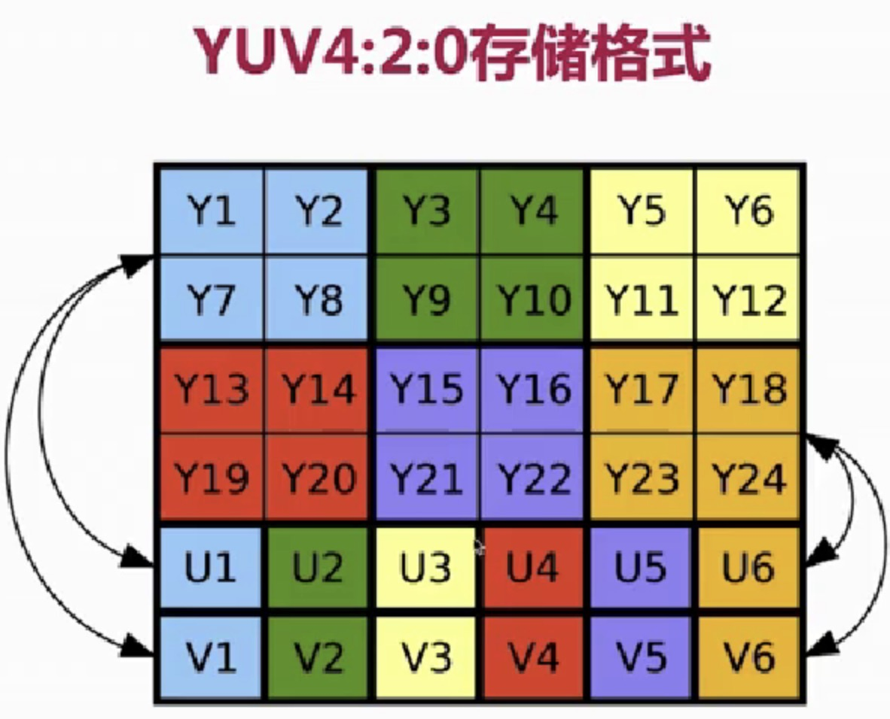
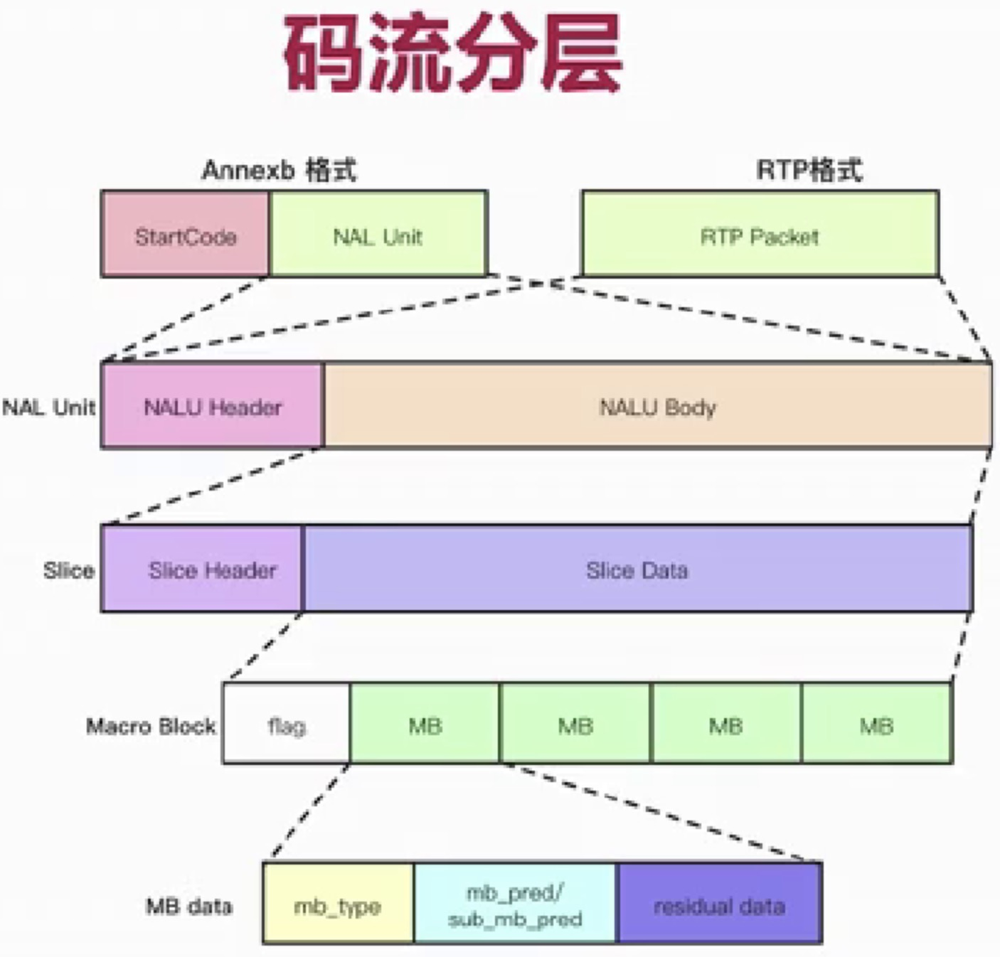

# 音视频小白入门

## 常用工具

​	ffmpeg ffplay vlc

## 架构模型

​	推流 -> 流媒体服务器 -> 拉流工具

## 问题

### 推流失败，为什么？

​		ffmpeg -re -i  aa.mp4 -f rtmp://localhost/live/test

​		-re 保持原来的速度来播放

### 清晰度不高？

​	ffmpeg会按照默认的编码进行编码的 视频的质量就降低了

​	ffmpeg -re -i  aa.mp4 -c copy -f rtmp://localhost/live/test 拷贝原来的编码进行推送就清晰了

## linux环境变量

PATH 来配置ffmpeg命令

PKG_CONFIG_PATH 是让pkg-config命令使用来查找头文件和库 

​		export PKG_CONFIG_PATH=$PKG_CONFIG_PATH:/usr/local/Cellar/ffmpeg/4.3_3/lib/pkgconfig/

​		pkg-config --libs  --cflags libavutil

​			--libs: 怎么引用库

​			--cflags : 怎么引用头文件 

PKG_CONFIG_PATH与LD_LIBRARY_PATH区别

​		LD_LIBRARY_PATH，用于放置.so库，如果自己安装的.so库不在下，则需要加到该环境变量中，系统才能调用到该库

​		PKG_CONFIG_PATH，用于放置.pc库，同上

## 人类的听觉范围

​	20Hz~20KHz      1s中振动20次 到 1s中振动2万次 

​	音调:  音频的快慢  振动的快 音频就高  振动的慢 音频就低           音频越高也就是振动越快 声音越好听

​	音量:  振动的幅度  振动的幅度越大 音量就大 振动的幅度越小 音量就小

​	音色：谐波  不同乐器就有不同的音色  为什么会这样呢？就是因为谐波不一样

# 音频原始数据格式

PCM

WAV 这个是在PCM的基础上加了一个头   这个头包含了播放参数


量化的基本概念

采样大小： 一个采样用多少bit存放 常用的是16bit

采样率：    采样频率 8k、16k、32k、44.1k、48k      就是在模电转数电的时候采样率  采样率越高数字信号和模拟信号越接近

声道数： 单声道 双声道 多声道 

​				双声道：左耳听一种声音 右耳听另外一种声音

​				多声道 ：电脑外接设备弄了多个喇叭 在你四周 前后上下左右都放  每个喇叭放的声音不一样

PCM音频流的码率 = 采样大小\*采样率\*声道数  1s种采样的数据多少

​		44.1K x 16 x 2 = 1411.2Kb/s


WAV Header

​	包括三个部分  

​			1.RFF规范  数据块大小是多少  格式是什么

​			2.扩展部分

​			3.PCM数据

不同的设备采样设备不一样 采样的api就不一样

​	安卓

​	iOS 

​	windows

​	但是这些平台采集api ffmpeg帮我集成了提供了一套api 只要把ffmpeg采集api学会了就ok了

​	ffmpeg可以通过命令采集 

​			 ffmpeg -f avfoundation -i :0 out.wav (mac下)

​			 ffmpeg -f hisla -hw :0 out.wav (mac下)

​	也可以通过api采集 

# mac引入ffmpeg库

将ffmpeg库文件及头文件拷贝到目录中

引入头文件和库文件

关闭沙箱

cd /Users/zler/Desktop/ffmpeg-project/myapp/myapp

mkdir include

mkdir libs

cp -r /usr/local/Cellar/ffmpeg/4.3_3/include/* ./include/

cp -r /usr/local/Cellar/ffmpeg/4.3_3/lib/* ./libs/


# 采集流程

​	打开输入设备-》数据包->输出文件

​	打开设备

​			注册设备

​			设置采集方式 avfoundation/dshow/alsa

​			打开音频设备

```c
#include "tests.h"

static int recordStatus = 0;

//录制音频
void recordAudio(){
    AVFormatContext * formatContext = NULL;
    AVDictionary * options = NULL;
    AVPacket packet;
    
    int ret;
    char errors[1024] = {0};
    //int audioIndex;
    
    //[[video device]:[audio device]]
    const char * deviceName = ":0"; //第一个音频设备
    
    //设置日志级别
    av_log_set_level(AV_LOG_DEBUG);
    
    recordStatus = 1;
     
    //注册所有设备
    avdevice_register_all();
    
    //使用什么打开设备 对于mac是avfoundation ios windows linux 有各自的设备
    AVInputFormat * inputFormat = av_find_input_format("avfoundation"); //avfoundation
    
    //打开音频设备 获取采集的formatContext
    ret = avformat_open_input(&formatContext, deviceName, inputFormat, &options);
    if(ret < 0){
        av_strerror(ret, errors, sizeof(errors));
        printf("打开设备失败：%d  %s", ret, errors);
        return;
    }
    
    //创建文件 w代表写 b代表二进制 + 如果不存在创建文件
    const char * fileName = "/Users/zler/Desktop/ffmpeg-project/myffmpeg/audio.pcm";
    FILE * file = fopen(fileName, "wb+");
    if(file == NULL){
        av_log(NULL, AV_LOG_ERROR, "不能打开文件:%s\n", av_err2str(ret));
        avformat_close_input(&formatContext);
        return;
    }
   
    
    //从打开的音频设备中读取采集到的数据包
    av_init_packet(&packet); //初始化packet 避免脏数据
    while ((ret = av_read_frame(formatContext, &packet)) > 0 && recordStatus) {   
        //写入文件
        fwrite(packet.data, packet.size, 1, file);
        fflush(file);
        
        //打印日志
        av_log(NULL, AV_LOG_INFO, "packet size=%d, data=%p\n",packet.size, packet.data);
        
        av_packet_unref(&packet);//用完之后释放packet内存
    }
 
    //关闭文件
    fclose(file);
 
    avformat_close_input(&formatContext);//关闭音频设备 释放内存

    av_log(NULL,AV_LOG_DEBUG, "录制音频结束", NULL);
    return ;
}
```


# 音频压缩

压缩小的话可以在网络上传输 直播传输需要

音频有损压缩技术 -》 频域遮蔽 时域遮蔽效应 

音频无损压缩技术 -〉 哈夫曼算法

常见的音频解码器 OPUS AAC

AAC编码器介绍

​	常用的AAC规格 AAC-LC, AAC HE(AAC LC+SBR),AAC HE V2(AAC LC+SBR+PS)

​	可以减少码流的大小

AAC的格式

​	ADIF 只能从头开始播放

​	ADTS 可以从任意时刻播放 对于直播大部分使用这个格式

​		由7/9个字节组成

​		Audio object type ->    1:AAC Main   2:  AAC LC   5:SBR    29:PS

​		ADTS头地址 https://www.p23.nl/projects/aac-header/ 当然ffmpeg做了封装

ffmpeg生成AAC文件

​		ffmpeg -i xxx.mp4

​					 -vn -c:a libfdk_aac 

​					-ar 44100 -channels 2 -profile:a aac_he_v2  xxx.aac

​		参数说明  

​					-i 就是输入的多媒体文件

​					-vn  v就是video n就是not 没有不要视频

​					-c:a c就是codec,codec就是编码器 a就是audio,audio就是音频 合起来 音频的编码器 libfdk_aac

​					-ar 就是音频的采样率

​					-channels 声道数

​					-profile  设置参数 a aduio 合起来对音频设置的参数 这里就是设置规格 每个规格不一样码流式不一样的

​		这些参数从哪里看呢 https://ffmpeg.org/ffmpeg-codecs.html#libfdk_005faac

# 音频的重采样

就是将音频三元组(采样率，采样大小和通道数)的值转为另外一组值

例如： 将44100/16/2 转成48000/16/2

为什么要重采样？

​	从设备采集的音频数据与编码器要求的数据是不一致

​	扬声器要求的音频数据与要播放的音频数据不一致

​	便于方便运算

如何知道是否需要进行重采样？

​	要了解音频设备参数

​	查看ffmpeg源码

重采样的步骤

​	创建重采样上下文

​	设置相关的参数

​	初始化

​	对每个数据也就是每个音频帧进行重采样

涉及到几个api

​	swr_alloc_set_opts

​	sir_init

​	sir_convert

​	sir_free

# 编码器的

创建编码器 avcodec_find_encoder

创建上下文 avcodec_alloc_context3

打开编码器 avcodec_open2

# 编码

avcodec_send_frame

avcodec_receive_packet

AVFrame 里面都是编码后的数据

AVPacket 里面都是原始数据

# 视频

由一组图像组成

为了传输/占用更小的空间而被压缩

最终在显示器设备上展示(未被压缩)


图像

​	是由像素组成的 是有很多个小格子组成的

​		每个像素用多少位来表示，也叫位深

​			RGB888(在内存中24位)

​			RGBA(在内存中32位)带透明度

​	像素的颜色通过rgb来组成 在屏幕上就是发光二极管来显示的

​	分辨率 横向有多少个像素 纵向有多少个像素


屏幕显示器

​	像素都有三个发光二极管 通过你给的数据进行亮度的现实 最终无数个这样发光的像素就显示了

​	图像是数据

​	屏幕是显示设备

​	图像数据经过驱动程序让屏幕显示图像

RGB的色彩问题

​	RGB与BGR

​	BMP格式的图片使用的是BGR格式，需要进行转换

屏幕的指标

​	PPI(pixels per inch) 一寸，在一纵行放了多少像素点 像素点越多 密度越大显示的效果越好

​		PPI > 300就属于视网膜级别

​	DPI(Dots pen inch)


码流的计算

​	分辨率

​			X轴的像素个数  乘以 Y轴的像素个数  （宽x高）

​			常见的宽高比 16:9 / 4:3

​			常见的分辨率 360P/720P/1K/2K

​			怎么算出来就宽和高一直除2 知道不能被2除尽

​	桢率

​			每秒钟采集或者播放图像的个数

​			动画的帧率是25帧/s

​			常见的频率： 15帧/s(一般直播)，30帧/s(一般录屏)， 60帧/s(一般电影)


​			直播收到带宽的影响,所以帧率小一点

​			要求的平滑率越高,帧率的要求就越高

​			要求清晰度越高,分辨率的要求就越高	

​	未编码视频的RGB码流如何计算

​			RGB码流 = 分辨率(宽x高) x 3(Byte)(rgb颜色) x 帧率(25帧/s)

​			比如:  1280x720x3x25 = 69120000 约69M  真实的还要乘以位深 69x8(位)

​			未编码与H264视频编码的码流压缩比是多少？


图像的显示

​	图像大小和显示区域大小不一定一样

​	图像大小等于显示区域大小

​	图像小于显示区域怎么解决？(拉伸/留白)

​	图像大于显示区域怎么解决？(缩小/截断)

​	在不同的平台上都有哪些库用来高效的渲染视频？SDL


# YUV

也称(YCbCr): Y表示明亮度，UV的作用是描述影响色彩以及饱和度。

主要的采样格式有YUV4:2:0、YUV4:2:2、YUV4:4:4


YUV图像

YUV图像中的Y分量  黑白色的量

YUV图像中的U分量  蓝色的量

YUV图像中的V分量  Cr的量

将他们三个重叠起来就是真正的图像色彩


RGB与YUV的关系

​	RGB用于屏幕图像的展示

​	YUV用于采集和编码

​	需要将YUV转成RGB才能展示

​	RGB转YUV

​		Y = 0.299R + 0.587G+0.114B

​		U = -0.147R + 0.289G+0.436B=0.492(B-Y)

​		V = -0.615R + 0.515G+0.100B=0.877(R-Y)

​	YUV转RGB

​		R = Y + 1.140*Y

​		G = Y - 0.394U - 0.581V

​		B = Y + 2.032U


为什么要用YUV？因为YUV的数据比RGB的少


YUV的常见格式

​	YUV4:4:4  x3

​			和RGB888 一样

​	YUV4:2:2 x2

​	YUV4:2:0 大部分都采用这个格式

YUV4:2:0数据量的计算 x1.5

​	YUV = 1.5Y

​	YUV = RGB / 2


YUV4:2:0存储格式 分层来存储的 Y层UV层



这样在黑白屏和彩色屏幕都能解析这个格式

平面存储planar

​	I420:    YYYYYYYY UU VV => YUV420P

​	YV12:   YYYYYYYY UU VV => YUV420P

打包存储packet

​	NV12:    YYYYYYYY UU VV => YUV420SP  ios是这样存的格式

​	NV21:   YYYYYYYY UU VV => YUV420SP	安卓是这样存的格式


未编码视频的YUV码流如何计算

​	我们已经知道了RGB的码流 

​	RGB码流 = 分辨率(宽x高) x 3 x 帧率

​	YUV码流 = 分辨率(宽x高) x 1.5 x 帧率

参考资料 https://en.wikipedia.org/wiki/YUV


都有哪些库对YUV进行操作？


从多媒体文件中生成YUV

​	ffmpeg -i input.mp4 -an -c:v rawvideo -pix_fmt yuv420p out.yuv 压缩了

​	ffplay -pix_fmt yuv420p -s 608x368 out.yuv

​	只播放一个Y分量就是一个黑白色 就像小时候的黑白电视机

​		ffplay -s 608x368 -vf  extractplanes='y' out.yuv

​	播放各分量

​		ffplay -s 608x368 -vf  extractplanes='u' out.yuv

​		ffplay -s 608x368 -vf  extractplanes='v' out.yuv

​	提取各分量

​		ffmpeg -i input.mp4 

​					-filter_complex

​					'extractplanes=y+u+v[y\]\[u][v]'

​					-map '[y]' y.yuv

​					-map '[u]' u.yuv

​					-map '[v]' v.yuv

YUV formats

​	https://www.fourcc.org/yuv.php


# H264压缩

H264压缩比

​	条件：1.YUV格式为YUV420 2.分辨率为640x480 3.帧率为15

​	建议码流：500kpbs

​	结果：约1/100

码流参考值  https://docs.agora.io/cn

GOP 就是对帧进行分组




H264 Profile

​	对视频压缩特性的描述, Profile越高,就说明采用了越高级的压缩特性

H264 Level

​	Level是对视频的描述,Level越高,视频的编码、分辨率、fps越高

P帧 B帧 I帧

CABAC无损压缩

